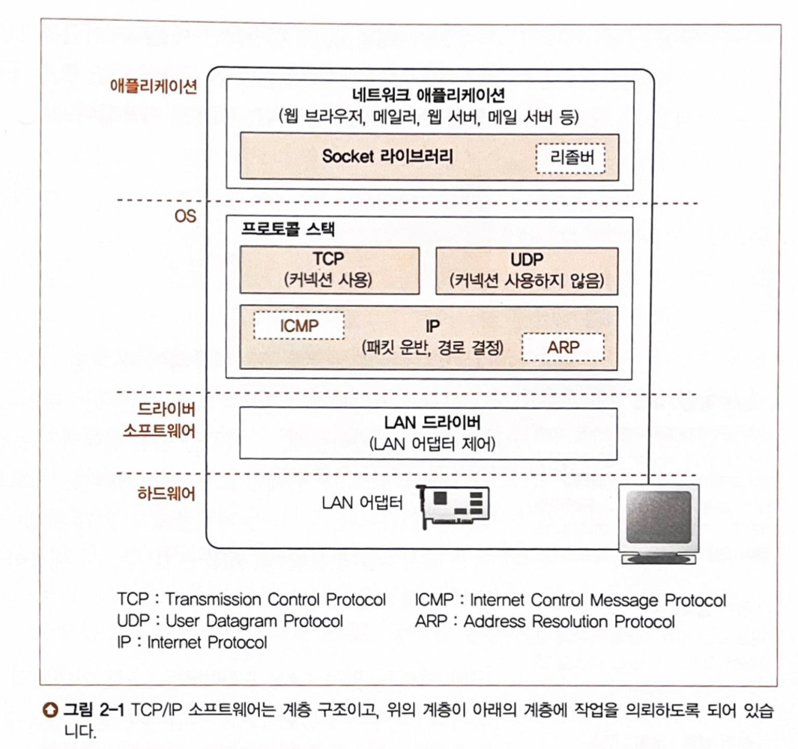

# 성공과 실패를 결정하는 1%의 네트워크 원리

## Chapter 01. 웹 브라우저가 메시지를 만든다

### Story 01. HTTP 리퀘스트 메시지를 작성한다

### Story 02. 웹 서버의 IP 주소를 DNS 서버에 조회한다

### Story 03. 전 세계의 DNS 서버가 연대한다

### Story 04. 프로토콜 스택에 메시지 송신을 의뢰한다

## Chapter 02. TCP/IP의 데이터를 전기 신호로 만들어 보낸다

### Story 01. 소켓을 작성한다

- 
- 네트워크 애플리케이션
  - 리졸버 : DNS 서버에서 IP주소 조회
- 프로토콜 스택
  - TCP, UDP : 일반적인 애플리케이션에선 TCP, 짧은 제어용 데이터를 송수신할 경우에는 UDP
  - IP : 패킷을 통신 상태까지 운반하는 것이 주 역할
    - ICMP : 패킷을 운반할때 발생하는 오류를 통지하거나 제어용 메시지를 통지할때 사용
    - ARP : 이더넷의 MAC주소를 조사할때 사용
- LAN 드라이버 : LAN 어댑터 제어
- LAN 어댑터 : 실제 송수신 동작 실행

### Story 02. 서버에 접속한다

### Story 03. 데이터를 송수신한다

### Story 04. 서버에서 연결을 끊어 소켓을 말소한다

### Story 05. IP와 이더넷의 패킷 송수신 동작

### Story 06. UDP 프로토콜을 이용한 송수신 동작