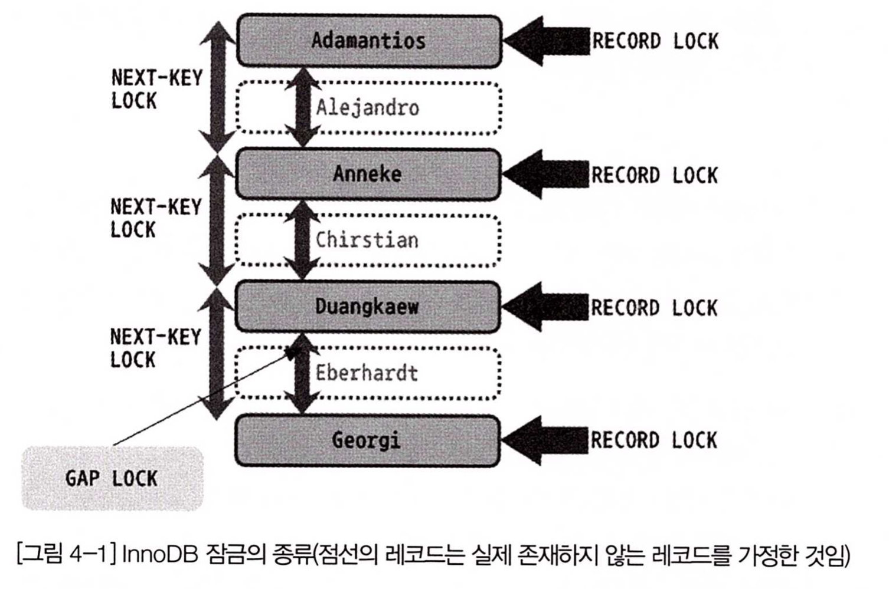

# 04. 아키텍쳐

## 4.1 MySQL 엔진 아키텍쳐

![[MySQL_아키텍쳐.jpeg]]
- MySQL 엔진
	- 두뇌 역할을 한다
	- 커넥션 핸들러 : 클라이언트로부터 접속/쿼리 요청을 처리
	- SQL 파싱, 전처리, 최적화 등을 수행
	- 1 MySQL 서버에 1개의 MySQL 엔진을 사용할 수 있다
- 스토리지 엔진
	- 데이터를 디스크에 저장하거나 디스크로부터 읽어오는 부분을 전담한다
	- 1 MySQL 서버에 N개의 스토리지 엔진을 사용할 수 있다
	- 테이블을 생성할때 스토리지 엔진을 지정할 수 있고, 지정하면 이후의 쿼리를 해당 엔진이 처리한다
	- 성능 향상을 위한 기능을 내장하고 있다 (InnoDB의 경우는 버퍼 풀)
- 핸들러 API
	- MySQL 엔진과 스토리지 엔진 사이의 API
	- `SHOW GLOBAL STATUS LIKE 'Handler%'` 으로 이 API를 통해 얼마나 많은 작업이 있었는지 알 수 있다
- MySQL의 스레딩 구조
	- MySQL은 스레드 기반으로 동작하고, 포그라운드 스레드와 백그라운드 스레드가 있다
	- `SELECT thread_id, name, type, processlist_user, processlist_host FROM performance_schema.threads ORDER BY type, thread_id;` 으로 실행중인 스레드정보를 볼 수 있다
	- 포그라운드 스레드 (클라이언트 스레드, 사용자 스레드)
		- 최소한 MySQL서버에 접속된 클라이언트 수만큼 존재한다
		- 클라이언트의 SQL를 처리한다
		- 포그라운드 스레는 데이터를 데이터 버퍼나 캐시에서 데이터를 가져오고, 없는 경우엔 디스크나 인덱스 파일로부터 가져온다
	- 백그라운드 스레드
		- InnoDB의 경우 로그 스레드(로그->디스크 기록 스레드)와 쓰기 스레드(버퍼 풀->디스크 기록 스레드) 등이 있다
		- 그 외에도 인서트 버퍼 병합 스레드, 락/데드락 모니터링 스레드 등등이 있다
- 메모리 구조
	- MySQL에서 사용되는 메모리 공간은 크게 글로벌 메모리 영역과 로컬 메모리 영역으로 구분한다
	- 글로벌 메모리 영역
		- 스레드들이 공유해서 사용한다
		- MySQL서버가 시작되면서 OS로부터 할당된다
		- 테이블 캐시, InnoDB 버퍼풀, InnoDB 어댑티브 해시 인덱스, InnoDB 리두 로그버퍼 등이 있다
	- 로컬 메모리 영역 (세션 메모리 영역, 커넥션 메모리 영역)
		- 각 클라이언트 스레드별로 독립적이고, 공유되지 않는다
		- 클라이언트 스레드가 쿼리를 처리하는데 사용하는 메모리 영역이다
		- 쿼리의 용도별로 필요할때만 할당되고, 필요하지 않은 경우 할당조자 되지 않을수도 있다
		- 커넥션이 열러 있는 동안 계속 할당된 상태로 남아있는 공간도 있고, 쿼리를 실행하는 순간에만 할당했다가 해제하는 공간도 있다
		- 정렬 버퍼, 조인 버퍼, 바이너리 로그 캐시, 네트워크 버퍼 등이 있다
- 플러그인 스토리지 엔진 모델
	- 쿼리가 실행되는 과정이 아래와 같다면, 
	  SQL 파싱 -> SQL 옵티마이징 -> SQL 실행 -> 데이터 읽기/쓰기
	- 데이터 읽기/쓰기 부분만 갈아낄 수 있다
- 컴포넌트
	- MySQL8.0 부터는 플러그인의 단점을 보완한 컴포넌트 아키텍쳐를 제공한다
- 쿼리 실행 구조![[MySQL_쿼리실행구조.jpeg]]
	- 쿼리 파서 : 쿼리를 토큰으로 분리해 트리구조로 만들어(파서 트리) 문법오류를 검증한다.
	- 전처리기 : 파서 트리 기반으로 구조적 문제점이 있는지 확인한다. 테이블/컬럼 이름이 존재하는지, 객체 접근 권한 등을 확인한다
	- 옵티마이저 : 쿼리를 어떻게 하면 저렴한 비용으로 가장 빠르게 처리할지를 결정한다
	- 쿼리 실행기(실행 엔진) : 만들어진 계획대로 각 스토리지 엔진으로 요청하고 연결하는 역할을 한다
		- 예: 옵티마이저가 GROUP BY를 처리하기 위해 임시 테이블을 사용하기로 결정한 상황
		1. 실행 엔진 -> 핸들러 : 임시 테이블 생성 요청
		2. 실행 엔진 -> 핸들러 : WHERE절에 일치하는 레코드 조회 요청
		3. 실행 엔진 -> 핸들러 : 조회한 레코드를 임시 테이블에 저장 요청
		4. 실행 엔진 -> 핸들러 : 임시 테이블에서 원하는 형식으로 조회
		5. 실행 엔진 : 결과를 사용자나 다른 모듈로 전달
## 4.2 InnoDB 스토리지 엔진 아키텍쳐

- MySQL의 스토리지 엔진들 중 거의 유일하게 레코드 기반 잠금 제공 -> 높은 동시성 처리
- InnoDB의 특징
	- PK 기준으로 클러스터링되어 저장됨 (PK 순서대로 디스크에 저장됨)
	- MVCC 기술을 사용해서 락 걸지 않고 읽는다 (SERIALIZABLE 제외)
	- 현업에서 잘 쓰진 않지만 FK 지원한다
	- 데드락을 감지하는 스레드가 있고, 데드락 감지 시 비용이 더 적은(언두 로그가 적은) 트랜잭션을 자동으로 종료시킨다
	- 손실이나 장애로부터 데이터를 보호하기 위한 여러 매커니즘이 있다 (`innodb_force_recovery`)
- MVCC (Multi Version Concurrency Control) 예시
	- 가정 : 격리 수준은 READ_COMMITTED, 엔진 : InnoDB
	- `UPDATE member SET area = '경기' WHERE id = 12;` 으로 area 값을 서울 -> 경기로 바꿨다면?
	- 커밋 여부와 관계 없이 버퍼 풀엔 `경기` 언두 로그엔 이전 값(`서울`), 디스크엔 모름(일반적으론 `경기`)
	- 커밋 전에 다른 트랜잭션에서 `SELECT * FROM member WHERE id = 12;` 를 하면 언두로그에 있는 이전 값을 읽는다.
	- 롤백되야 한다면 언두 영역의 데이터를 버퍼 풀로 복구하고 언두로그를 삭제한다
	- 트랜잭션이 길어지면? 언두로그가 매우 커질 수도 있다
- 잠금 없는 일관된 읽기
	- SERIALIZABLE 외의 격리수준에선 SELECT할때 다른 트랜잭션과 관계없이 잠금을 대기하지 않고 바로 읽는다

![[inno-db-architecture.jpeg]]
- InnoDB 버퍼 풀
	- 역할
		- 디스크의 데이터 파일이나 인덱스 정보를 메모리에 캐싱
		- 아직 디스크에 기록되지 않은 변경된 데이터들이 일괄 작업으로 처리할 수 있게 버퍼 역할도 한다
	- 크기는 어떻게 설정하야 하나?
		- 전체의 50%으로 설정하고, 조금씩 올려가며 최적점을 찾아라
		- 늘리는건 괜찮지만 줄이는건 서비스 영향도가 매우 크다
		- 128MB 청크 단위로 처리된다
		- 관련 변수 : `innodb_buffer_pool_size`, `innodb_buffer_pool_instances`
	- 구조?
		- 버퍼 풀이라는 거대한 메모리 공간을 `innodb_page_size` 크기의 조각으로 쪼갠다
		- 각 조각을 관리하기 위해 3개의 자료구조를 관리한다
			1. LRU 리스트
				- ... todo
			2. 플러시 리스트
			3. 프리 리스트
- 언두 로그
	- 변경(UPDATE, DELETE) 전의 데이터를 보관하는 곳
	- 용도1. 트랜잭션 롤백 대비용
	- 용도2. 트랜잭션의 격리수준을 유지하면서 높은 동시성을 제공
- 인서트 버퍼
	- INSERT, UPDATE 될때는 데이터 파일 뿐 아니라 인덱스 업데이트도 필요하다.
	- 인덱스가 많다면 많은 자원을 소모하므로 임시 공간(인서트 버퍼)에 저장해두고 사용자에게 바로 반환한다
- 리두 로그
	- 변경된 내용을 순차적으로 기록
	- 리두 로그 덕분에 변경된 내용을 한꺼번에 처리할 수 있다
- 로그 버퍼
	- 리두 로그 버퍼링에 사용되는 공간
# 05. 트랜잭션과 잠금
## 5.1 트랜잭션
- MyISAM, MEMORY 엔진은 트랜잭션을 지원하지 않는다
- 트랜잭션은 꼭 여러개의 변경 쿼리가 묶일때만 의미있는건 아니다. 하나의 쿼리더라도 100% 적용되어야 한다면 의미가 있다.
	- (InnoDB인 경우) 
	  id=3이 이미 있는 테이블에 `insert into table_name (id) values (1),(2),(3);` 을 트랜잭션 내에서 수행하면 쿼리 자체가 실패하고, id=1,2에 해당하는 row는 생기지 않는다.
- 트랜잭션 범위는 최소화하여 커넥션 점유 시간을 줄이는 것이 좋다
	- 커넥션 소유 시간이 길어질수록 가용한 커넥션 수가 줄어들고 여러 프로그램에서 기다리게 될수도 있다
	- 외부와 연동하는 부분(메일, FTP파일 전송 등)은 트랜잭션 내에서 제거하는게 좋다. 통신할 수 없는 상황엔 웹서버뿐만 아니라 DBMS까지 위험해질 수 있다.
## 5.2 MySQL 엔진의 잠금
- MySQL의 잠금은 스토리지 엔진 레벨과 MySQL 엔진 레벨로 나뉜다
	- MySQL 엔진 레벨 잠금
		- MySQL 엔진 = MySQL 서버에서 스토리지 엔진을 제외한 나머지 부분
		- 모든 스토리지 엔진에 영향을 미침
		- 테이블 락, 메타데이터 락, 네임드 락 등..
	- 스토리지 엔진 레벨 잠금
		- 엔진 간 영향 없음
		- InnoDB 스토리지 엔진의 잠금으로는 레코드락, 갭락, 넥스트 키락 등...
- 글로벌 락
	- MyISAM, MEMORY 엔진에서 백업할때 사용한다
	- `FLUSH TABLES WITH READ LOCK` 으로만 획득 가능하고, 락 중 범위가 가장 크다
	- 한 세션에서 글로벌 락을 획득하면 다른 세션에서 SELECT를 제외한 대부분의 DDL, DML가 대기한다
- 백업 락
	- MySQL8부터 트랜잭션이 지원되는 InnoDB가 기본 엔진으로 채택되면서 가벼운 글로벌 락이 필요해졌다
	- `LOCK INSTANCE FOR BACKUP; ...(백업 실행)... UNLOCK INSTANCE;`
	- 백업 락을 걸면 모든 데이터 변경까지는 아니고 테이블의 스키마나 사용자의 인증관련 정보 등을 변경할 수 없다
- 테이블 락
	- `LOCK TABLES table_name [READ|WRITE]` 으로 명시적으로 획득하거나 묵시적으로 획득 가능
	- `UNLOCK TABLES` 로 락 반납
	- InnoDB에선 레코드 기반의 락을 제공하기 때문에 묵시적인 테이블 락이 설정되지 않는다
- 네임드 락
	- 사용자가 지정한 문자열에 대해 획득하고 반납하는 락
	- 잠금의 대상이 테이블이나 레코드 등이 아니라 사용자의 문자열이다
	  ```
		  SELECT GET_LOCK('mylock', 2); -- 락 획득 (2초까지만 대기)
		  SELECT IS_FREE_LOCK('mylock'); -- 락 확인
		  SELECT RELEASE_LOCK('mylock'); -- 락 반납
		  SELECT RELEASE_ALL_LOCKS(); -- 모든 락 반납
		```
	- 여러 클라이언트가 상호 동기화를 처리해야 할때나 배치같이 한꺼번에 많이 변경하는 프로그램에서의 데드락 문제를 해결할때 사용할 수 있다
- 메타데이터 락
	- 데이터베이스 객체를 변경하는 경우에 획득하는 잠금
	- 테이블이나 뷰의 이름을 변경할때(`RENAME TABLE tab TO tab_backup, tab_new to tab`) 자동으로 획득하는 락
## 5.3 InnoDB 스토리지 엔진의 잠금
- 레코드 기반 잠금 방식을 탑재하고 있어 MyISAM보다는 훨씬 뛰어난 동시성 처리를 제공한다
- InnoDB는 비관적 락 방식 채택
	- 비관적 락 : 현재 트랜잭션에서 변경하고자 하는 레코드에 대해 잠금을 획득하고 변경하는 방식
	- 낙관적 락 : 우선 변경하고 충돌이 있다면 롤백처리하는 방식
- InnoDB의 락 종류
	- 레코드 락
		- 레코드 자체만 잠그는 락.
		- pk또는 unique 인덱스에 의한 변경작업은 레코드락만 건다
		- InnoDB는 레코드 자체가 아니라 인덱스의 레코드를 잠근다. (인덱스가 없는 테이블도 내부 자동 생성된 클러스터 인덱스를 잠근다)
	- 갭 락
		- 레코드와 레코드 사이에 새로운 레코드가 INSERT되는 것을 제어
		- 넥스트 키 락의 일부로써 사용된다
	- 넥스트 키 락
		- 레코드락 + 갭락
		- 바이너리 로그에 기록되는 쿼리가 슬레이브에서 실행될때 마스터에서 만들어낸 결과와 동일한 결과를 만들어내도록 보장하는 것이 주 목적
	- 자동 증가 락
		- 채번할때 사용.
		- 테이블에 단 하나만 존재하고, INSERT될때 아주 짧은 시간동안 락이 걸렸다가 즉시 해제된다
		- UPDATE, DELETE 쿼리엔 자동증가 락이 걸리지 않는다
- InnoDB의 락은 "레코드를 잠그는 것이 아니라 인덱스를 잠근다"
	- 예 : employees 테이블에 first_name, last_name, hire_date 컬럼이 있고, first_name에만 인덱스가 걸려있을때
	- `UPDATE employees SET hire_date = NOW() WHERE first_name = 'Georgi' AND last_name = 'Klassen';` 을 실행하면 대상 레코드가 1건이라도 first_name 인덱스에 걸리는 레코드 모두 잠긴다.
	- 왜? 넥스트 키 락 때문.
	- 인덱스가 만약 없으면? 테이블 풀스캔하면서 UPDATE 작업을 하는데, 이때 모든 레코드를 잠근다
	- 그래서 인덱스 설계가 중요하다
- 잠금 확인 및 해제 예 (MySQL 5.1 이상)
	- 커넥션1
		- `BIGIN; UPDATE employees SET column_1 = 'a' WHERE id = 1;`
	- 커넥션2
		- `UPDATE employees SET column_2 = 'b' WHERE id = 1;`
	- 커넥션3
		- `UPDATE employees SET column_1 = 'a' AND column_2 = 'b' WHERE id = 1;`
	- 아래 명령어로 기다리는 트랜잭션과 기다리게 하는 트랜잭션을 알 수 있다
```sql
SELECT
	-- 기다리는 tx
	r.trx_id waiting_trx_id,
	r.trx_mysql_thread_id waiting_thread,
	r.trx_query waiting_query,
	
	-- 기다리게 하는 tx
	b.trx_id blocking_trx_id,
	b.trx_mysql_thread_id blocking_thread,
	b.trx_query blocking_query
FROM information_schema.innodb_lock_awaits w
INNER JOIN information_schema.innodb_trx b ON b.trx_id = w.blocking_trx_id
INNER JOIN information_schema.innodb_trx r ON r.trx_id = w.requesting_trx_id;
```
	- 커넥션2는 커넥션1을 기다린다.
	- 커넥션3은 커넥션 1과 2 둘다 기다린다.
## 5.4 MySQL의 격리 수준

|                           | 더티 리드<br>(다른 트랜잭션이 완료 안되었어도 볼 수 있는 현상) | 논 리피터블 리드<br>(한 트랜잭션 내에서 똑같은 select 시 row내 데이터가 다를 수 있는 현상) | 팬텀 리드<br>(여러 행 조회 시row 개수가 매번 다를 수 있는 현상) |
| ------------------------- | -------------------------------------- | ----------------------------------------------------------- | ------------------------------------------ |
| READ UNCOMMITTED          | O                                      | O                                                           | O                                          |
| READ COMMITTED            | X                                      | O                                                           | O                                          |
| (default) REPEATABLE READ | X                                      | X                                                           | O (InnoDB는 X)                              |
| SERIALIZABLE              | X                                      | X                                                           | X                                          |
- READ UNCOMMITTED
	- 다른 트랜잭션의 commit, rollback 여부에 관계 없이 즉시 읽을 수 있다 (더티 리드)
	- 언두로그를 보지 않는다
- READ COMMITTED
	- 커밋된 데이터만 볼 수 있다
	- 같은 select 문 사이에서 다른 트랜잭션에서 commit한다면 결과가 다를 수 있다 (논 리피터블 리드)
	- 언두로그를 보되, 가장 마지막 값만 본다
- REPEATABLE READ
	- 커밋되었고, 트랜잭션 시작시점 이전 데이터만 볼 수 있다.
	- 언두로그를 보고, 현재 트랜잭션id와 언두로그의 id를 고려한다.
	- `SELECT .. FOR UPDATE`, `SELECT .. LOCK IN SHARE MODE` 를 여러번 할 때 결과가 다를 수 있다 (팬텀 리드)
		- 왜? 언두 레코드엔 락을 걸 수 없기 때문에 현재 레코드 값을 가져오기 때문
	- InnoDB에선 팬텀리드 발생하지 않는다
		- 넥스트 키 락 덕분
- SERIALIZABLE
	- 읽기 작업도 잠금을 건다
- READ COMMITTED 와 REPEATABLE READ 의 성능차이는 크지 않다

# 08. 인덱스
- 디스크 읽기 방식
	- HDD보다는 SSD가 DBMS용 스토리지에 적합하다.
		- 랜덤 IO가 훨씬 빠르다. (물리적으로 디스크를 회전시킬 필요가 없으므로)
		- DB 서버에선 순차IO보단 랜덤IO의 비중이 훨씬 크다
- 인덱스
	- 데이터 파일은 저장되는 순서대로 유지, 인덱스는 항상 정렬된 상태 유지
	- 장점 : 조회는 매우 빠르다
	- 단점 : 인덱스가 많을수록 저장하는 처리가 느려진다
	- 인덱스를 역할별로 구분하면 pk와 보조키로 구분할 수 있다
		- pk : 식별 기준값. non null, unique
		- 보조키(Secondary key) : pk를 제외한 나머지 모든 인덱스
	- 인덱스 알고리즘 종류
		- B-Tree 알고리즘
		- Hash 알고리즘
		- Fractal-Tree 알고리즘
- B-Tree(Balanced Tree) 인덱스
	- 인덱싱 알고리즘 가운데 가장 일반적으로 사용됨
	- M차 B-Tree는 자식 노드의 수가 최대 M개
	- 모든 leaf 노트의 depth가 일정하게 유지되고 탐색 시간복잡도는 평균/최대 O(logN)
	- 인덱스 키 추가
		- 리프 노드에 추가하고, 꽉차는 경우 분리되어야 한다. 상위 노드까지 처리 범위가 넓어지기 때문에 쓰기 비용이 많이 든다. 
		- InnoDB에서는 상황에 따라 적절하게 인덱스 키 추가 작업을 지연시킨다
		- `innodb_change_buffering` 설정값으로 추가/삭제 작업 중 어느것을 지연 처리할지 설정해야 한다 (MySQL 5.5이상)
	- 인덱스 키 삭제
		- 해당 키 값이 저장된 리프 노드를 찾아 삭제 마크만 한다
	- 인덱스 키 변경
		- 삭제 후 추가된다
	- 인덱스 키 검색
		- 100% 일치 또는 앞부분만 일치하는 경우에 사용할 수 있다
		- 함수나 연산을 수행한 결과로 정렬한다거나 검색하는 작업은 B-Tree의 장점을 이용할 수 없다 (변형된 값은 인덱스에 존재하는 값이 아니므로)
	- B-Tree 인덱스 사용에 영향을 미치는 요소
		- 인덱스 키 값의 크기
			- B-Tree의 차수(자식 노드의 최대 개수)는 인덱스 페이지의 크기와 키 값의 크기에 따라 결정된다
			- 하나의 인덱스 페이지는 16KB 고정이다. 인덱스 키 값이 커짐에 따라 하나의 인덱스 페이지에 저장할 수 있는 키 개수는 줄어든다 -> 최대 자식 노드가 줄어든다 -> depth가 늘어난다 -> 디스크로부터 읽어야 하는 횟수가 늘어난다 -> 성능저하
		- depth
			- 인덱스 키값의 크기가 커질수록 depth가 깊어져 성능이 저하된다
			- 4~5이상으로 깊어지는 경우는 거의 발생하지 않는다
		- 선택도(기수성)
			- 전체 인덱스 키값은 100개, 유니크한 값의 수는 10개라면 기수성(카디널리티)은 10
			- 인덱스는 카티널리티가 높을수록 검색대상이 줄어들기 때문에 빠르게 처리된다
		- 읽어야 하는 레코드 건수
			- 어림잡아서 읽어야 할 레코드 수가 전체 레코드의 20~25%를 넘어서면 인덱스를 사용하지 않고 직접 읽는것이 효율적이다
	- B-Tree 인덱스를 통한 데이터 읽기
		- 인덱스 레인지 스캔
			- 가장 일반적이고 빠른 방법
			- 검색해야 할 인덱스의 범위가 결정됐을때 사용하는 방식
			- 인덱스를 구성하는 컬럼의 정순 또는 역순으로 정렬된 상태로 레코드를 가져온다
		- 인덱스 풀스캔
			- 인덱스를 사용하지만 레인지 스캔과는 달리 인덱스의 처음부터 끝까지 모두 읽는 방식 (비효율적임)
			- 대표적으로 쿼리의 조건절에 사용된 컬럼이 인덱스의 첫번째 컬럼이 아닌 경우
		- 루스 인덱스 스캔
			- 말그대로 느슨하게, 듬성듬성하게 인덱스를 읽는 것. 위의 두 경우는 타이트 인덱스 스캔으로 분류된다
			- 인덱스 레인지 스캔과 비슷하지만 필요치 않은 키값은 무시하고 다음으로 넘어간다.
			- 주로 GROUP BY 또는 MIN(), MAX() 함수에 대해 최적화를 하는 경우 사용된다
	- B-Tree 인덱스의 정렬 및 스캔 방향
		- 인덱스를 생성할때 쿼리로 ASC, DESC를 명시할 순 있지만 MySQL은 ASC로만 저장한다. (MySQL 8.0부터는 DESC 인덱스 지원)
		- A, B 컬럼으로 인덱스가 있는 테이블에서 A ASC, B DESC로 조회하고 싶으면?
			- 조회는 할 수 있지만 MySQL에서 레코드를 직접 정렬하기 때문에 비효율적이다. 효율적으로 하고 싶다면 B의 음수값을 저장하는 것이 현재로서는 유일한 방법이다.
		- 스캔을 정순으로 할지, 역순으로 할지 쿼리에 따라 옵티마이저가 판단한다.
	- B-Tree 인덱스의 가용성과 효율성
		- `SELECT * FROM dept_emp WHERE dept_no = 'd002' AND emp_no >= 10114;` 을 실행할때...
			- 인덱스1 : dept_no + emp_no
				- dept_no = 'd002' AND emp_no >= 10114 인 레코드를 찾고 쭉 읽기만 하면 돼서 효율적이다.
			- 인덱스2 : emp_no + dept_no
				- emp_no >= 10114 AND dept_no = 'd002' 인 레코드를 찾고, 그 이후의 모든 레코드에 대해 dept_no = 'd002' 비교를 해야 하므로 비효율적이다.
		- B-Tree는 왼쪽 기준 정렬 기반의 인덱스이기 때문에 뒷부분의 값만으로는 인덱스의 효과를 얻을 수 없다
			- first_name으로 인덱스가 있을때 `SELECT * FROM employees WHERE first_name LIKE '%mer';` -> 비효율적
			- dept_no + emp_no 로 인덱스가 있을때 `SELECT * FROM dept_emp WHERE emp_no > 10144;` -> 비효율적
- 해시 인덱스
	- 동등 비교 검색에는 최적화돼 있지만 범위검색이나 정렬된 결과를 가져오는 목적으로는 사용할 수 없다
	- 실제 키 값과는 관계없이 인덱스 크기가 작고 검색이 빠르다
	- 다중 컬럼으로 생성된 해시 인덱스의 경우, 해당하는 모든 컬럼으로 동등배교를 해야 해시 인덱스를 사용한다
- R-Tree 인덱스
	- 공간 인덱스 : R-Tree 인덱스 알고리즘을 이용해 2차원 데이터를 인덱싱하고 검색하는 목적의 인덱스
- Fractal-Tree 인덱스 (스트리밍 B-Tree)
	- 디스크의 랜덤IO를 순차IO로 변환해서 처리하기 때문에 B-Tree에 비해 row수가 많아도 급격한 성능 저하가 없다
- 전문 검색 인덱스
	- 문서 전체에 대한 분석과 검색을 위한 인덱싱 알고리즘
- 비트맵 인덱스와 함수 기반 인덱스
- 클러스터링 인덱스
	- pk값이 비슷한 레코드끼리 묶어서 저장하는 것
	- pk값에 의해 레코드의 저장위치가 결정된다
	- 모든 보조 인덱스가 pk값을 가지고 있다
	- 장점 : pk로 검색할때 매우 빠르다. 커버링 인덱스만으로 처리될 수 있는 경우가 많다
	- 단점 : 클러스터 키값의 크기가 클 경우 전체적으로 인덱스의 크기가 커진다. pk에 의해 저장위치가 결정되기 때문에 INSERT, DELETE 작업이 느리다
- 유니크 인덱스
	- 인덱스라기 보다는 제약조건에 가깝다.
	- 일반 인덱스에 비해서 읽기 성능은 거의 비슷하고 쓰기 성능은 중복을 검사해야 하기 때문에 느리다.
	- 유니크 인덱스를 생성했다면 같은 컬럼으로 구성된 별도의 인덱스가 필요없다
- 외래키
- 기타 주의사항
# 13. 파티션
## 13.1 개요
- 파티션?
	- 하나의 테이블을 물리적으로 여러 개의 테이블로 분리해서 관리할 수 있게 해준다
	- 파티셔닝은 만병 통치약이 아니다. 어떤 쿼리를 사용하느냐에 따라 오히려 성능이 나빠질수도 있다
- 그럼 언제 써야 하는가?
	- 쿼리 성능을 높이고 싶을때
		- 파티셔닝을 하면 메모리에 올릴 인덱스 크기를 줄일 수 있어 성능을 높일 수 있다
	- 데이터 파일이나 인덱스 파일이 너무 커져서 백업/관리 작업이 어려워질때
	- 주기적으로 삭제되는 로그 데이터를 쌓을때
- 파티션 작동 방식
```sql
CREATE TABLE article  
(  
    id         INT      NOT NULL,  
    user_id    INT      NOT NULL,
    content    LONGTEXT NOT NULL,  
    created_at DATETIME NOT NULL,  
    PRIMARY KEY (id, created_at)  
) PARTITION BY RANGE (YEAR(created_at))(  -- 파티션 표현식
    PARTITION p2009 VALUES LESS THAN (2010),  
    PARTITION p2010 VALUES LESS THAN (2011),  
    PARTITION p2011 VALUES LESS THAN (2012),  
    PARTITION p9999 VALUES LESS THAN MAXVALUE  
    );
CREATE INDEX idx_user on article (user_id);
```
- ↑ 설명을 위해 테이블의 DDL
	- INSERT
		- `created_at`컬럼의 값으로 파티션 표현식을 평가하고, 결정된 파티션에 insert된다
	- UPDATE
		- where 조건에 `created_at`이 있는가?
			- O : 해당 파티션에서 빠르게 조회한다. 
			- X : 전체 파티션을 검색한다
		- 대상 레코드의 `created_at`을 변경하는가?
			- O : 해당 파티션에서 삭제하고, 새 파티션에 저장한다
			- X : 컬럼 값만 변경한다
	- SELECT
		- 성능에 영향을 미치는 조건
			- where 절의 조건으로 파티션을 선택할 수 있는가?
				- O : 파티션 프루닝(prune: 가지치다). 원하는 파티션에만 접근한다
				- X : 모든 파티션을 검색한다. 파티션 수가 많다면 느리게 처리된다
			- where 절의 조건이 인덱스를 효율적으로 사용할 수 있는가?
				- O : 각 파티션에서 인덱스 레인지 스캔을 한다
				- X : 풀 테이블 스캔을 한다. 파티션의 레코드 건수가 많다면 상당히 느리게 처리된다
		- 예 : `select * from article where user_id between 10 and 100 and created_at between '2009-01-01' and '2010-12-31' order by user_id;`
			- 위 두 조건 모두 O이고, 마지막에 user_id로 정렬한다
			- 실행계획을 조회하면 Extra 컬럼에 Using filesort가 있어야 할 것 같지만, user_id로 이미 정렬되어 있기 때문에 별도의 정렬작업을 하지 않는다.

## 13.2 주의사항
- 파티션의 제약사항
	- 파티션 표현식(`PARTITION BY ... (요부분)`) 에 MySQL 내장함수를 지원하지만, 일부 함수들은 파티션 프루닝 기능을 지원하지 않을수도 있다
	- pk, 모든 uk는 파티션 키 컬럼을 포함해야 한다
	- 모든 파티션은 같은 구조의 인덱스만 가질수 있다. 파티션 개별로 인덱스를 변경하거나 추가할 수 없다
	- 파티션의 최대 개수는 8192개이다
	- 파티션 생성 이후 sql_mode 변수 변경은 파티션의 일관성을 깨뜨릴 수 있다
	- fk, 전문 검색 인덱스, 전문 검색 쿼리, 임시테이블을 사용할 수 없다
	- 공간 데이터를 저장하는 컬럼 타입(POINT, GEOMETRY...)은 파티션 테이블에서 사용할 수 없다
- 파티션 사용 시 주의사항
	- 파티션 키는 모든 uk/pk에 포함되어야 한다
		- why? 파티션의 존재 이유는 조회성능 최적화다. uk/pk에 포함되어 있지 않다면 다른 모든 파티션을 전부 열어봐야 한다
		- 만약 PARTITION BY HASH (col3) 이라면, 모든 uk, pk는 col3을 포함해야 한다
	- 파티셔닝을 사용하면 MySQL 서버에서 동시에 오픈하는 파일의 수가 상당이 많아질 수 있으므로 open_files_limit 변수값을 높여야 할 수도 있다
## 13.3 MySQL 파티션의 종류
- 파티션 종류
	- 레인지 파티션
		- 가장 일반적으로 사용되는 연속된 범위로 파티션을 정의하는 방법
		- 용도
			- 날짜를 기반으로 데이터가 누적되고 주기적으로 분석/삭제해야 할때
			- 범위 기반으로 균등하게 나눌 수 있을때
		- 레인지 파티션 추가 (ADD PARTITION)
			- 가장 마지막 파티션만 추가할 수 있다
		- 레인지 파티션 분리/병합 (REORGANIZE PARTITION)
			- 대상 파티션의 레코드가 많다면 오래걸릴 수 있다
			- 온라인 DDL로 실행과 읽기락이 필요하다
			- 재구성되는 동안 쓰기는 불가능하다
		- 레인지 파티션 삭제 (DROP PARTITION)
			- 가장 오래된 파티션만 삭제할 수 있다
	- 리스트 파티션
		- 파티션 키 값이 고정적이고, 연속적이지 않을때 사용
	- 해시 파티션
		- 파티션 키는 항상 정수 타입이거나 정수를 반환하는 표현식이어야 한다
		- 용도
			- 레인지 파티션이나 리스트 파티션만으로는 균등하게 나누는 것이 어려울때
			- 테이블의 데이터가 특정 컬럼에 영향을 받지 않고 전체적으로 비슷할 사용빈도일때 (예: 사용자 테이블)
		- 파티션 개수를 변경하면 전체 파티션이 영향받는다. (해시함수가 MOD 연산이기 때문)
	- 키 파티션
		- 파티션 키로 정수 타입 뿐 아니라 대부분의 데이터 타입이 가능하다
		- MD5()로 해시값을 계산하고, MOD 연산으로 파티션을 결정한다
	- 리니어 해시 파티션 / 리니어 키 파티션
		- 해시/키 파티션에서 파티션 개수 변동이 있을때마다 전체 파티션에 재분배 작업이 일어나는데, 이 단점을 최소화하기 위한 파티션
		- 재분배 작업이 최소화되지만 파티션 간 레코드 건수가 덜 균등해질 수 있다
- 파티셔닝이 오히려 성능을 떨어뜨리는 예
	- name 컬럼 인덱스가 있는 user 테이블
	- `select * from user where name = 'toto';` 쿼리를 실행한다고 할때...
	- id 기준으로 1024개의 파티션을 갖는다면? 1024개의 파티션을 모두 읽어야 한다
	- 파티션이 없다면? B-Tree를 한번만 룩업해서 읽으면 되니까 효율적이다
	- 데이터가 많다고 무조건 파티셔닝 하지 말고 "조회되는 방식"을 보고 도입하자.
