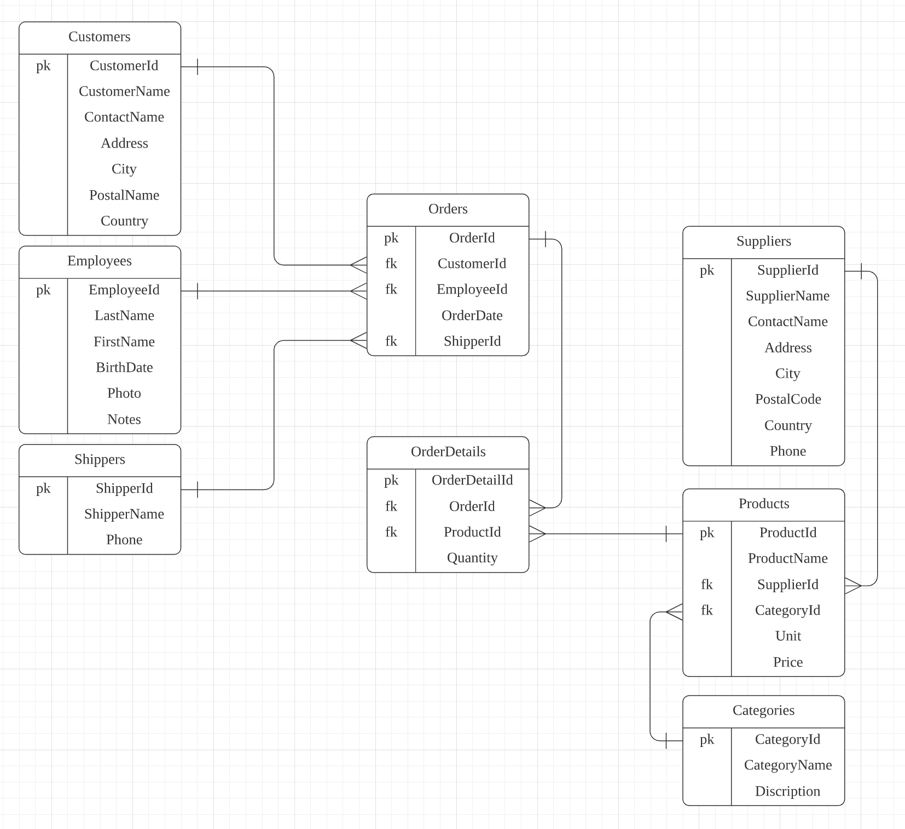

https://www.w3schools.com/sql/trysql.asp?filename=trysql_select_all 에서 연습하기!




## 구조

```sql
SELECT [DISTINCT] 컬럼, 그룹 함수(컬럼)
FROM 테이블명
[WHERE 조건]
[GROUP BY 그룹대상]
[HAVING 그룹 함수 포함 조건]
[ORDER BY 정렬대상 [ASC/DESC]]
```


## 집계함수

중복을 고려하지 않는다

중복을 제거하려면 distinct 붙이기 => 예 : `select count(distinct city) from customers`


## Join

join의 조건은 on으로

```sql
select *
from customers c join orders o on c.customerid = o.customerid
```

- 모든 매장의 정보와 매출액 구하기

  ```sql
  -- 매장id와 매출액(소수점 2째자리까지)
  select supplierId, round(sum(quantity * price), 2) as totalSales
  from orderDetails od join products p
  	on od.productId = p.productId
  group by supplierId
  
  -- 모든 매장의 정보와 매출액
  select *
  from suppliers s join (
    select SupplierID, round(sum(quantity * price), 2) as totalSales
    from orderDetails od join products p
        on od.productId = p.productId
    group by supplierID
  ) ts
  on s.supplierID = ts.SupplierID
  ```

  