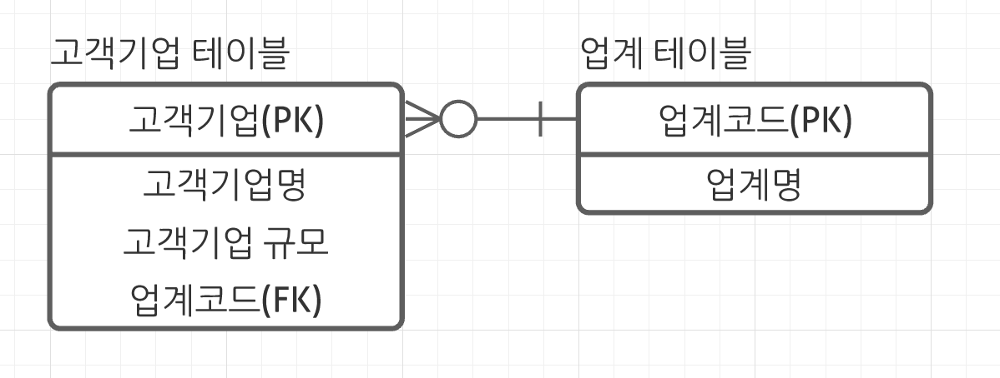

# 데이터베이스 첫걸음

## 1장. 데이터베이스란 - 용도와 역할

### 우리와 데이터베이스의 관계

- 데이터베이스는 어디에나 있다
- 모든 것은 데이터베이스로 모인다
- 데이터베이스는 주소록에서 시작되었다

### 데이터베이스의 기본 기능

1. 데이터의 검색과 갱신
   - 검색 : 원하는 데이터를 빠르게 찾을 수 있어야 한다
   - 갱신 : 데이터를 등록, 수정, 제거를 할 수 있어야 한다
   - 고유성 : 데이터를 어떤 포멧(형식)으로 관리하는가
   - 데이터가 방대할 때 처리 성능에 유의해야 한다
2. 동시성 제어
   - 동시의 복수의 사용자로부터 검색이나 갱신 처리를 받을때 무결성을 어느 정도로 보장하는가?가 문제가 됨
   - 트레이드오프
3. 장애 대응
   - 좀처럼 부서지기 어렵고, 부서졌다 하더라도 복원할 수 있어야 한다
   - 데이터가 소실되면 매우 큰 사회문제가 될 수도 있고 큰 손실을 일으킬 수 있다
   - 데이터 소실 문제의 대책
     1. 데이터 다중화 : 데이터를 복수의 장소에 분산해서 유지. 예방책
     2. 백업 : 복사본을 저장. 사후대책
   - 데이터 소실 사건이 끊이지 않는 이유? 서비스 레벨과 비용이란 트레이드오프의 딜레마로 고민하기 때문.
4. 보안
   - 데이터베이스를 사용자에게 보이지 않게 설계하는 이유
     1. 사용자는 서버를 의식할 필요가 없다
        - 사용자에게 가까운 기술이란 대다수가 클라이언트 기술 중심이라 서버의 기술은 그다지 의식되지 않기 때문
        - 서버는 사용자에게서 물리적으로 떨어진 장소에 설치되어 있음
        - 사용자가 데이터베이스를 직접 조작하는 일이 생긴다면 보안 구멍이라는 시스템의 결함이다
     2. 데이터베이스는 기밀성이 높다
        - 데이터베이스에는 일반인에게 공개할 수 없는 내용이 상당수 포함되어 있음
          - 계좌변호, 주소, 신용카드 번호 등등
        - 보안의 강도와 사용자 편의성은 트레이드오프 관계

### 데이터베이스의 종류

- 계층형 데이터베이스
  - 데이터를 계층 구조로 관리하는 데이터베이스 (조직도, 구조도와 비슷)
  - 현대적인 데이터베이스 역사상 최초로 등록
- 관계형 데이터베이스
  - 2차원 표 형식으로 데이터를 관리하는 데이터베이스
  - 가장 주류
- 객체지향 데이터베이스, XML 데이터베이스
  - 각각 객체와 XML이라는 형식으로 데이터를 관리하는 데이터베이스
  - 접할 기회 적음
- NoSQL 데이터베이스
  - NoSQL은 Not Only SQL(SQL뿐만 아니라 다른게 있다)이라는 뜻
  - 관계형 데이터베이스에 있는 기능 일부를 버려서 성능(처리속도)를 높임
  - 다량의 데이터를 고속으로 처리해야 하는 웹 서비스와 잘 맞아서 최근 자주 이용됨

</br>

## 2장. 관계형 데이터베이스란 - 가장 대표적인 데이터베이스

### 관계형 데이터베이스란

- 관계(Relational)?
  - 인간관계나 국제관계에서의 관계와는 의미가 다름
  - 2차원 표를 표기할때 사용하는 단어임
- 관계형 데이터베이스가 그렇게 혁신적인가?
  1. 지금이야 당연해 보이지만 관계형 데이터베이스는 2차원 표를 소프트웨어를 사용해 능숙히 표현한 최초의 소프트웨어였다
  2. 기능적으로 획기적이다.
     - 프로그래밍 언어를 사용하지 않아도 데이터 조작을 할 수 있다

### SQL 기초 지식

- SQL?
  - Structured Query Language
  - 관계형 데이터베이스가 데이터를 조작하기 위해 준비한 언어
  - 영어 문장과 매우 닮았음
  - 4가지 기본 조작 : SELECT, INSERT, UPDATE, DELETE
- 테이블
  - 관계형 데이터베이스에서 2차원 표
  - "어떤 테이블에 어떤 데이터를 포함하는가?"는 시스템의 기능을 좌우하는 중요한 질문이다.
    - 1개의 테이블에 많은 정보를 채우면 정보의 정합성을 유지 관리하기 어려워짐
    - 데이터를 너무 엄격하게 분산시키면 성능이 나빠짐
    - 테이블을 어떻게 설계하느냐는 기본적인 이론이 있지만 기계적으로 판단할 수 있는 건 아니다

### 관계형 데이터베이스를 다루기 위한 사전 지식

- 관계형 데이터베이스의 소프트웨어

  - Oracle, MySQL, SQL Server등등이 있음
  - MySQL, PostgreSQL등은 일정 요건 안에서는 무료로 사용 가능한 오픈소스임. 인기있음

- DBMS vs 데이터베이스

  - DBMS : 데이터베이스의 기능을 제공하는 소프트웨어
  - 데이터베이스는 추상적인 개념, DBMS는 구체적인 소프트웨어
    - MySQL은 DBMS의 한가지다. (바른 표현)
    - MySQL은 데이터베이스의 한가지다. (어색한 표현)

- 소프트웨어와 데이터베이스의 관계

  - 시스템은 소프트웨어의 조합인데, 소프트웨어는 크게 운영체제, 미들웨어, 애플리케이션으로 구분할 수 있다

  - 이 3가지는 계층성이 있으며, 운영체제는 하위 레이어, 미들웨어는 중간 레이어, 애플리케이션은 상위 레이어.

  - 한 레이어가 동작하지 않으면 상위 레이어도 동작하지 않는다

  - DBMS은 미들웨어에 속함.

  - 각 레이어에 대한 설명

    - 운영체제
      - Operating System, OS
      - 시스템을 동작하게 하기 위한 일종의 토대가 되는 기능을 제공하는 소프트웨어
        - 예 : Windows, Linux, UNIX, OS X, iOS, Android...
      - Linux, UNIX는 카테고리 이름 
        - Linux의 구현물은 Red Hat, Debian, Ubuntu...
        - UNIX의 구현물은 IBM의 AIX, HP의 HP-UX, Oracle의 Solaris...

    - 미들웨어

      - 중간 소프트웨어
      - OS에 설치하여 동작 (OS에서 동작)
      - OS + 데이터베이스 조합, 어떤게 좋을까?
        - 예산, 제품 기능, 개발자와 운영자의 기술 조합 등을 고려하여 선택한다
        - 조합은 어느정도 자유도가 높음. OS나 DBMS가 기능에 대한 표준 규격을 따르기 때문에 
        - 그래서 조합을 바꾸는 마이그레이션이 드물지 않음.
          1. OS만 변경 : DBMS의 수정은 적다
          2. DBMS만 변경 : DBMS의 수정이 많다
          3. OS, DBMS 둘다 변경 : 수정도 많고 가장 위험하다

    - 애플리케이션

      - 업무용 기능을 가진 프로그램된 소프트웨어

      - 사용자가 가장 빈번하게 조작하는 소프트웨어

      - 애플리케이션을 실현하는 수단은 크게 2가지가 있음 : 스크래치, 패키지

        1. 스크래치
           - 직접 프로그램을 처음부터 작성하는 방법
           - 직접 만들기 때문에 업무의 세세한 부분까지 시스템에서 대응할 수 있어 꼼꼼한 서비스를 할 수 있다
           - 개발 비용이 커진다

        2. 패키지
           - 기존에 있던 애플리케이션 소프트웨어를 사는 방법
           - 개발 비용을 줄일 수 있다
           - 패키지의 기능이 부족하여 커스터마이징에 의한 추가 개발때문에 오히려 개발 비용이 높아질수도 있다
           - 간단하게 기능을 추가할 수 없을수도 있다

      - 애플리케이션이 사용자와 데이터베이스 사이를 비집고 들어가 있다

        - 사용자가 데이터를 직접 조작하는게 아니라 애플리케이션을 매개로 데이터베이스에 접근한다
          - why? 보안을 높이기 위해, 업무 로직을 애플리케이션에 집중시켜 개발이나 수정에 걸리는 비용을 낮추기 위해

</br>

## 3장. 데이터베이스에 얽힌 돈 이야기 - 초기비용과 운영비용

### 왜 우리는 시스템에 돈을 내는가

- 왜 우리는 시스템에 돈을 내는가? 
  -> 데이터베이스는 무엇을 위해 도입하는가? 
  -> 시스템이란 무엇을 위해 도입하는가? 
  -> 편리한 기능을 세상에 제공하고, 대가로 이익을 얻기 때문 (돈벌이)

### 데이터베이스의 초기비용

- 초기비용 : 최초에 지급되는 돈

- 운영비용 : 서비스를 이용하는 기간에 계속해서 지급하는 돈

- 데이터베이스의 초기비용 (라이선스 요금)

- 가격과 소프트웨어 라이센스료의 차이

  1. 판매단위가 특수하다

     - 라이센스료의 판매단위

       1. 프로세서 라이선스 : 하드웨어의 CPU 성능에 따라 가격이 결정
       2. 사용자 라이선스 : 사용자 수에 따라 가격이 결정

       - 규모가 커질수록 라이선스료도 올라간다

       - 어느정도 규모를 가진 상용 시스템에선 사용자수를 파악하기 어려워 프로세서 라이선스를 사용하는 경우가 대부분이다
       - ex ) SQL Server 2014, DB2 v10.5

  2. 운영비용을 지급하지 않으면 현실적으로 사용할 수 없다

### 초기비용을 늘리는 범인

- 에디션과 옵션의 선택을 잘 이해해야 필요하지 않는 기능까지 구매하게 되는 일을 막을 수 있다
- 에디션은 대부분 다음 2가지에서 파생되었다
  1. 스탠다드 에디션
     - 중소규모 시스템용
  2. 엔터프라이즈 에디션
     - 대규모 시스템용
     - 스탠다드 에디션엔 없는 신뢰성, 성능, 보안관련 기능을 제공함

### 데이터베이스의 운영비용

- 기술지원 비용

  - 기술지원 없는 소프트웨어는 위험하다.

  - 사고가 일어났을 때 자신의 조직이 책임져야 한다. 일종의 보험

  - 기술지원이 종료되는 타이밍(EOSL)을 고려해야 한다

    | 구분 | 신버전                                                       | 구버전                                                       |
    | ---- | ------------------------------------------------------------ | ------------------------------------------------------------ |
    | 장점 | - 기술 지원이 길다<br />- 구버전과 비교해서 상위 기능이 많다 | - 동작이 안정되어 있다<br />- 정보가 많고 엔지니어도 사용법에 익숙하다 |
    | 단점 | - 버그가 많아서 동작이 불안정하다                            | - 기술지원 기간이 짧다<br />- 신버전과 비교하면 기능이 적다  |

  - 트레이드오프는 항상 고민거리
  - 같은 제품의 버전이나 아키텍쳐의 선행사례가 있는지 살펴보는 것이 도움이 된다

### 초기비용과 운영비용의 조합

- 초기비용 X + 운영비용 X
  - 상용 시스템에 사용하는 수준의 품질을 요구하는 데이터베이스에서는 현실적으로 존재하지 않음
- 초기비용 O + 운영비용 O
  - 상용 시스템용에서 가장 일반적
- 초기비용 O + 운영비용 X
  - 기술지원 없음. 현실적인 선택지 아님
- 초기비용 X + 운영비용 O
  1. 오픈소스를 이용
     - 서브스크립션(임대) 형식
       - 라이선스료는 무료고 기술지원료만 유상
       - ex) Red Hat, MySQL
       - 장점
         1. 처음에 일정 금액을 가지고 있지 않아도 이용할 수 있음
         2. 시작도 간단하고 그만두는것도 간단
         3. 타 데이터베이스로 마이그레이션이 쉬움
       - 단점
         1. 이용기간이 길면 전체비용이 구매 비용보다 높아질 가능성이 있음
         2. 임대를 제공하는 서비스가 정지되면 이용할 수 없게 될 위험이 있음
         3. 장기적으로 요금 인상 등의 비용 변경 요소가 있음

### 초기비용의 트릭

- 전체 비용이 같더라도 초기 비용이 낮으면 더 매력적으로 느낀다고 함
- 전체 비용을 확실하게 계산하자

</br>

## 4장. 데이터베이스와 아키텍쳐 구성 - 견고하고 고속의 시스템을 구축하기 위해

다중화(고가용성)이란?

- 예) DB 서버가 2대 있을때 1대가 고장난다 하더라도 나머지 1대가 동작하여 서비스의 정지를 막는 것

### 아키텍쳐란

- 아키텍쳐? 
  - 시스템을 만들기 위한 물리 레벨의 조합
  - 어떤 기능을 가진 서버를 준비하고 어떠한 저장소나 네트워크 기기와 조합해서 시스템 전체를 만들 것인가?
  - 하드웨어와 미들웨어의 구성
  - 이 구성을 시스템이 완수해야 할 목적과 비교하면서 결정해 가는 것이 아키텍쳐 설계다.
  - 아키텍쳐는 시스템의 목적과 기능을 나타낸다

### 데이터베이스의 아키텍쳐 1. 역사와 개요

아키텍쳐의 역사는 다음 3단계로 나눌 수 있다

1. Stand-alone(~1980년대)
   - 데이터베이스만으로 시스템이 성립하는 가장 간단한 방법
   - 데이터베이스가 동작하는 머신(DB서버)이 LAN이나 인터넷 등의 네트워크에 접속하지 않고 독립되어 동작하는 구성
   - 단점
     1. 물리적으로 떨어진 장소에서 접근할 수 없다
        - 네트워크에 연결되어 있지 않기 때문
     2. 복수 사용자가 동시에 작업을 수 없다
        - 네트워크에 연결되어 있지 않기 때문
     3. 가용성이 낮다
        - 서버가 1개뿐이니 1대에 장애가 발생하면 서비스가 정지한다
        - 고성능의 부품으로 교체하기 위해선 시스템을 정지해야 한다
     4. 확장성이 부족하다
        - 성능이 나쁠 때 개선수단이 매우 부족하다
   - 장점
     1. 구축이 매우 간단해서 소규모 작업이나 테스트를 빨리할 수 있다
     2. 보안이 매우 높다
        - 네트워크를 매개로 침입할 위험이 없음
2. 클라이언트/서버(1990년대~2000년)
   - 클라이언트와 서버로 계층을 분리하여 상호 간에 네트워크로 접속
   - 데이터베이스 서버 1대에 복수의 사용자의 단말이 접속하는 구성
   - 단점
     1. 보안 위험
        - 인터넷에서 직접 데이터베이스에 접속할 수도 있음
     2. 관리비용이 많이 듦
        - 개인이 이용하는 PC에 네이티브 앱을 설치해 동작하게 했기 때문에 각종 환경에 대응해야 했다
        - 그래서 비즈니스 로직을 실행하는 애플리케이션을 서버에서 관리해 비용을 절감하자는 요구가 나옴 (이게 Web 3계층)
3. Web 3계층(2000년~현재)
   - 시스템을 웹 서버 계층, 애플리케이션 계층, 데이터베이스 계층의 조합으로 생각하는 모델
   - 웹 서버 계층
     - 클라이언트로부터 접속 요청을 직접 받아서 그 처리를 뒷단의 애플리케이션 계층에 넘기고 그 결과를 클라이언트에 반환
     - 애플리케이션 서버와 클라이언트 웹 브라우저와의 가교 역할
     - 직접적인 접속 요청을 받는 역할을 웹 서버 계층에 한정하여 보안을 높일 수 있음
     - ex) 아파치, IIS
   - 애플리케이션 계층
     - 비즈니스 로직을 구현한 애플리케이션이 동작하는 층
     - 웹 서버로부터 인계된 요청을 처리하고 필요하면 데이터베이스 계층에 접속하여 데이터를 추출하고 이를 가공한 결과를 웹 서버로 반환
     - 비즈니스 로직을 집중하여 애플리케이션 관리 비용을 낮출 수 있음
     - ex) 톰캣, 웹로직, 웹스피어

### 데이터베이스의 아키텍쳐 2. 가용성과 확장성의 확보

- Web 3계층은 Stand-alone 구성의 단점 중 2가지 문제만 해결했다
  1. ~~물리적으로 떨어진 장소에서 접근할 수 없다 (해결)~~
  2. ~~복수 사용자가 동시에 작업을 수 없다 (해결)~~
  3. 가용성이 낮다
  4. 확장성이 부족하다
- 가용성을 높이는 전략
  1. 심장전략
     - 고품질-소수전략
     - 시스템을 구성하는 각 컴포넌트의 신뢰성을 높여 장애 발생률을 낮게 억제해서 가용성을 높인다
     - 소수정예 노선
  2. 신장전략
     - 사물은 언젠간 망가진다란 체념을 전제로 여분을 준비해둔다 (컴포넌트를 병렬화)
     - 물량작전
     - 현재는 심장전략이 더 우세
- 클러스터
  - 클러스터링 : 신장전략처럼 컴포넌트를 병렬화하는것
  - 클러스터 구성으로 시스템의 가동률을 높이는 것 = '여유도를 확보한다', '다중화'
  - 서버 대수가 늘어날수록 시스템 가동률은 높아진다. 단 100%는 불가능
- 단일 장애점
  - SPOF : Single Point Of Failure
  - 다중화 되어 있지 않아서 시스템 전체 서비스의 계속성에 영향을 주는 컴포넌트
  - 단일 장애점의 신뢰성이 시스템 전체의 가용성을 결정한다

### DB 서버의 다중화 - 클러스터링

- DB서버는 영속 계층이기 때문에 클러스터링이 어렵고 고민해야 할 부분이 많다
- 데이터는 항상 갱신되기 때문에 다중화를 유지하는 중에 데이터 정합성도 중요하게 의식해야 함
- 가장 기본적인 다중화
  - DB 서버만 다중화하고 저장소는 하나
  - 저장소가 1개라서 정합성을 신경쓸 필요가 없음
  - DB서버 2대가 동시에 동작하는 것을 허락할지에 따라 Active-Active, Active-Standby로 나뉨
    - Active-Active
      - 클러스터를 구성하는 컴포넌트를 동시에 가동
      - Oracle, DB2만 가능
      - 장점
        1. 시스템 다운 시간이 짧음 : 한 대가 동작불능이 되어도 남은 서버가 처리함
        2. 성능이 좋음 : 가동하는 CPU나 메모리도 증가하기 때문. 단 저장소가 병목될 수 있음
    - Active-Standby
      - 실제 가동하는 것은 Active, 남은 것은 Standby
      - Standby상태의 DB서버는 사용되지 않다가 Active DB서버에서 장애가 일어날 때만 사용됨
      - 전환될 때의 시차에 다운 상태가 됨
      - Cold-Standby와 Hot-Standby가 있음
        - Cold-Standby
          - 평소에는 Standby DB가 작동하지 않다가 Active DB가 다운된 시점에 작동
        - Hot-Standby
          - 평소에도 Standby DB가 작동
          - 전환시간은 짧지만 라이선스료가 높음
    - 비싼 순, 사용성/성능 좋은 순
      1. Active-Active
      2. Active-Standby(Hot-Standby)
      3. Active-Standby(Cold-Standby)

### DB 서버와 데이터의 다중화 - 리플리케이션

- 리플리케이션
  - DB서버와 저장소 세트를 복수로 준비하는 것
  - DB서버 뿐만 아니라 데이터도 다중화한다
  - 데이터베이스 서버와 저장소가 동시에 불능일때(지진, 태풍 등) 다른 세트가 멀리 있다면 계속 서비스 가능 -> 가용성이 매우 높다
  - 주의할 점
    - Active측 저장소의 데이터를 Standby측 데이터에 갱신을 최신화(동기화) 하지 않으면 데이터 정합성을 유지할 수 없다
      - ex) 동기화를 1일 1회 한다면, 저장소가 망가진 경우 최대 1일치의 데이터 갱신이 소실된다
    - Standby측의 갱신 주기를 얼마로 할 것인가? 동기화가 성공하는 것을 확인할 것인가?도 트레이드 오프
      - 데이터 보호 vs 성능
    - 손자나 증손자 세트를 만듦으로써 피라미드형 구성을 할 수도 있음
      - 부모에 걸리는 부하를 분산할 수 있음
      - 손자나 증손자의 데이터는 오래된 데이터(오래된 데이터라도 상관없다면 ok)
      - 비용, 시스템 구성 노력 증가됨

### 성능을 추구하기 위한 다중화 - Shared Nothing

- Shared Disk
  - 복수의 서버가 1대의 디스크를 사용하는 구성
  - DB서버를 늘려도 처리율이 무한으로 향상되지 않는다.
    - 저장소가 공유 자원이라서 쉽게 늘리기 어렵기 때문
    - DB서버 대수가 증가할수록 DB서버간의 정보공유를 위한 오버헤드가 크기 때문
  - 이 단점을 극복하기 위해 고안된 아키텍쳐 : Shared Nothing
- Shared Nothing
  - 네트워크 이외의 자원을 모두 분리하는(아무것도 공유하지 않는) 방식
  - 구글이 개발한 Shared Nothing 구조를 샤딩(Sharding)라고 함
  - 장점
    - 서버와 저장소의 세트를 늘리면 병렬처리 때문에 선형적으로 성능이 향상된다
  - 단점
    - 각각의 DB서버가 동일한 1개의 데이터에 액세스 할 수 없다
      - 이 단점에 대처하려면 커버링 구성을 고려해야 함
      - 커버링? DB서버 하나가 다운되었을 때 다른 DB서버가 이를 이어받아 계속 처리할 수 있게 함

### 적합한 아키텍쳐를 설계하기 위해

- 아키텍쳐는 요건에 따라 결정되기 때문에 요건을 결정하지 않으면 아키텍쳐도 결정할 수 없다
- 아키텍쳐는 한 번 구축하면 이후에 변경하는것이 어렵다

</br>

## 5장. DBMS를 조작할 때 필요한 기본지식 - 조작하기 전에 알아두어야 할 것

### 데이터베이스에 전화 걸기

- 커넥션
  - 전화와 유사하다
  - 커넥션이 유지되는 동안에는 사용자와 데이터베이스는 정보를 주고 받을 수 있다
  - MySQL은 동시에 여러개의 커넥션을 유지하는 것이 가능하기 때문에 id로 관리한다
    - 로그인 하면 `Your MySQL connection id is 11` 같은 메시지를 볼 수 있다.
  - `show status like 'Threads_connected';` : 커넥션의 상태나 수를 조사하기 위한 명령어
  - `quit` : 로그오프 (커넥션 끊기) 명령어
- 세션?
  - 커넥션의 시작과 종료 사이의 교환의 시작과 종료까지의 단위
  - 커넥션이 확립된 후에 세션이 만들어짐
  - 기본적으로 커넥션과 세션은 1:1로 대응됨. 
    - 커넥션이 성립되면 동시에 암묵적으로 세션도 시작되고 세션을 끊으면 커넥션도 끊어지는 경우가 많음

### SQL과 관리 명령의 차이

- 관리명령
  - (필자가 지어낸 용어)
  - SQL 외에 데이터베이스의 상태를 보기 위한 명령
  - DBMS가 정상적으로 동작하는지 감시하거나 이상한 동작을 할 때 문제해결을 위해 정보수집을 하는 용도
  - 예:
    - `show status like 'Uptime';` : MySQL이 가동된 시점부터의 경과시간(초)
    - `show status like 'Queries';` : MySQL이 실행한 SQL문의 수

### 관계형 데이터베이스의 계층

- 계층 구조 (4계층)

  ```
  인스턴스 ┬ 데이터베이스1 ┬ 스키마1 ┬ 테이블1
         │           │        ├ 테이블2
         │           │        └ 테이블3
         │           └ 스키마2 ┬ 테이블4
         │                   └ 테이블5
         └ 테이터베이스2 ─ 스키마3 ─ 테이블6                    
  ```

  - 스키마
    - schema는 '틀'이라는 의미
    - 데이터베이스에서 폴더에 해당
    - 권한 관리를 수행할 수 있음
  - 데이터베이스
    - 스키마 상위의 계층
  - 인스턴스
    - 데이터베이스 상위의 계층
    - 물리적 개념으로, DBMS가 동작할때의 단위 (OS입장에선 프로세스라고 불림)
    - DBMS에 따라서는 인스턴스를 '서버 프로세스'또는 '서버'로 부르는 경우도 있음

- DB마다 계층구조가 다름

  - 3계층 : MySQL, Oracle
  - 4계층 : SQL Server, DB2, PostgreSQL

  - MySQL의 계층구조

    ```
    인스턴스 ┬ 스키마1 ┬ 테이블1
           │       ├ 테이블2
           │       └ 테이블3
           ├ 스키마2 ┬ 테이블4
           │       └ 테이블5
           └ 스키마3 ─ 테이블6      
    ```

    - 데이터베이스와 스키마를 동일한 것으로 간주함

  - Oracle의 계층구조

    ```
    인스턴스 ─ 데이터베이스1 ┬ 스키마1 ┬ 테이블1
                        │       ├ 테이블2
                        │       └ 테이블3
                        ├ 스키마2 ┬ 테이블4
                        │       └ 테이블5
                        └ 스키마3 ─ 테이블6 
    ```

    - 인스턴스 아래에 데이터베이스를 한 개만 만들 수 있음

- 4계층이 ANSI가 정한 표준 SQL로 결정되어 있음

</br>

## 6장. SQL 문의 기본 - SELECT 문의 이해

### 테이블 내용 조회

- 데이터베이스 조작
  - `show databases;` : MySQL 서버에 있는 데이터베이스 조회
  - `use 데이터베이스명;` : 입력한 데이터베이스 사용
  - `show tables;` : 현재 사용하고 있는 데이터베이스의 테이블 조회
  - `show create table 테이블명\G` : 테이블 DDL 조회
- SELECT문 기본 : `SELECT 열명 FROM 테이블명 WHERE 조건`
  - 조건에는 `AND`, `OR`, 비교 연산자(`=`, `<>` ...) 등이 쓰임
- MySQL 연산자 사이엔 우선순위가 있으므로 예상치 못한 동작을 막기 위해선 괄호를 사용해야 한다
- SQL의 기초적인 기술 규칙
  - 마지막에 세미콜론을 붙인다
  - 키워드의 대문자와 소문자는 구별하지 않는다 (SELECT = select = Select)
  - 정수는 그대로, 문자열이나 날짜는 작은따옴표로 감싼다
- 중복 제거를 하고 싶으면 `DISTINCT`

### SELECT문 응용

- `ORDER BY` : 검색결과 정렬

  - `SELECT ~ FROM ~ ORDER BY 열1[, 열2, ...]`
  - 정렬 기준으로 하고자 하는 열 이름 뒤에 `DESC`(내림차순), `ASC`(오름차순) 붙일 수 있음
  - 정렬 기준으로 둔 열에 해당하는 행이 중복되는 경우, 해당 행의 순서는 일정하지 않음

- 테이블 요약 함수

  - 집계함수
    - `COUNT`, `SUM`, `AVG`, `MAX`, `MIN` ...
    - 대부분 `null`을 제외하고 집계함, `COUNT`는 `null` 포함하여 집계함
  - 단일 행의 값을 조작/계산하는 함수

- `GROUP_CONCAT` : 문자열 집약 함수

  - 예상 외로 긴 결과를 돌려주는 경우가 있으므로 주의 필요함
  - 1024바이트가 넘어가면 잘림

- `DISTINCT` : 중복 제거

- `GROUP BY`

  - `SELECT ~ FROM 테이블명 GROUP BY 열1[, 열2, ...]`
  - `GROUP BY`가 있으면 지정한 그룹 열마다 집약해서 보여준다

- `HAVING` : 집약한 결과에 조건 지정

  - `SELECT ~ FROM ~ GROUP BY ~ HAVING 조건`

  - ex) 도시 수가 6개인 한국의 지역

    ```sql
    SELECT district, count(*) 
    FROM city 
    WHERE countrycode = 'KOR' 
    GROUP BY distinct 
    HAVING count(*) = 6;
    ```

  - ex) 도시 수가 6보다 큰 한국의 지역을 도시 수 기준으로 정렬

    ```sql
    SELECT district, count(*) 
    FROM city 
    WHERE countrycode = 'KOR' 
    GROUP BY distinct 
    HAVING count(*) > 6
    ORDER BY count(*) DESC;
    ```

- 작성 순서 : `SELECT` -> `FROM` -> `WHERE` -> `GROUP BY` -> `HAVING` -> `ORDER BY`

### 갱신, 삽입, 제거

- `UPDATE` : 데이터 갱신
  - `UPDATE 테이블명 SET 열1=값1[, 열2=값2...] (WHERE 조건)`
-  `INSERT` : 데이터 입력
  - `INSERT INTO 테이블명(열1[, 열2, ...]) VALUES (값1[, 값2, ...]);`
  - 모든 열에 삽입하는 거라면 열 이름 생략 가능
  - default 값이 지정되어 있는 경우라면 입력할때 생략 가능
- 데이터 입력할 때 자주 사용하는 구문
  - 테이블 구조 복사 : `CREATE TABLE citycopy LIKE city;`
  - 테이블 데이터 복사 : `INSERT INTO citycopy SELECT * FROM city;`
  - 복수 행 입력 : `INSERT INTO city(열1,열2,열3) VALUES (값1, 값2, 값3), (값4, 값5, 값6), (값7, 값8, 값9);`
- DELETE : 테이터 제거
  - `DELETE FROM 테이블명 WHERE 조건;`

### 뷰를 작성하고 복수 테이블에서 선택

- 뷰
  - SQL 시점에서 보면 테이블과 동일하지만 데이터는 가지고 있지 않음. 테이블에 대한 SELECT를 가지고 있음
  - 장점
    1. 복잡한 SELECT문을 일일이 매번 기술할 필요 없다
    2. 필요한 열과 행만 사용자에게 보여줄 수 있고, 갱신 시에도 뷰 정의에 따른 갱신으로 한정할 수 있다
    3. 데이터 저장 없이 실현할 수 있다. 뷰를 제거해도 참조하는 테이블은 영향 없다
  - `CREATE VIEW 뷰명 (열명1[, 열명2, ...]) AS SELECT문`
  
- 뷰로의 입력/갱신의 제한

  - 어떤 행이 대응하는지 모르거나 어떤 값을 넣으면 좋을지 모르는 경우엔 갱신할 수 없음
  - ex) `GROUP BY`로 집약한 수치나 `distinct`로 얻은 값을 갱신하는 경우, join해서 작성한 뷰를 갱신하려고 할때

- 서브쿼리

  - `SELECT`문의 결과를 조건문에 이용할 수 있음. 이럴때의 `SELECT`문을 서브쿼리라 함

- `JOIN`

  - `INNER JOIN`

    - `ON` : 결합하기 위한 조건

    - `ON`으로 지정한 결합조건에 일치하는 행만들 2개의 테이블로부터 가져옴

    - 결합한 결과에 대해서는 `WHERE`, `ORDER BY`, `LIMIT`, `GROUP BY`, `HAVING` 사용 가능

    - ```sql
      SELECT countrylanguage.*, country.name
      FROM countrylanguage INNER JOIN country 
      ON countrylanguage.countrycode = country.code
      WHERE language = 'Korean';
      ```

  - `OUTER JOIN`

    - `INNER JOIN`이 결합조건에 일치하는 것만 얻는다면 `OUTER JOIN`은 한쪽 테이블을 기준으로 전체행을 표시하고 다른 테이블의 값이 있으면 표시한다 (없으면 null로 표시)

    - `OUTER JOIN`도 `ON`을 결합조건으로 사용

    - 왼쪽 테이블을 기준으로 하려면 `LEFT OUTER JOIN`, 오른쪽을 기준으로 하려면 `RIGHT OUTER JOIN` (주로 `LEFT`를 씀)

    - ```sql
      SELECT 선택하고 싶은 열 리스트
      FROM 테이블1 LEFT OUTER JOIN 테이블2
      ON 결합조건
      ```

</br>

## 7장. 트랜잭션과 동시성 제어 - 복수의 쿼리 통합

### 트랜잭션

- 복수 쿼리를 한 단위로 묶은 것

- MySQL에서는 MyISAM형(트랜잭션 사용불가)과 InnoDB형(트랜잭션 사용가능) 2종류의 테이블을 이용할 수 있음

- 트랜잭션의 4가지 특성 (ACID)

  1. **A**tomicity 원자성

     - 데이터의 변경을 수반하는 일련의 데이터 조작이 전부 성공할지 전부 실패할지를 보증하는 구조
     - 모두 성공시 커밋, 중간에 실패시 롤백

  2. **C**onsistency 일관성

     - 일련의 데이터 조작 전후에 데이터 정합성을 유지하도록
     - 예 : 유니크 제약조건

  3. **I**solation 고립성/격리성

     - 일련의 데이터 조작을 복수 사용자가 동시에 실행해도 각각의 처리가 모순 없이 실행되는 것

     - 락을 걸어서 블록함으로써 모순을 막는다

       - 락 단위에는 테이블 전체, 블록, 행 등이 있는데 MySQL에서는 주로 행 단위 잠금 기능을 이용함
       - 예 : `SELECT ~ FOR UPDATE`을 실행하면 `SELECT`한 행에 잠금이 걸려서 다른 사용자는 대기한다

     - 어떤 상태를 '모순없다' 라고 하는가?

       - 모순 없다 = 복수의 트랜잭션이 순서대로 실행되는 경우와 같은 결과를 얻을 수 있는 상태
       - DBMS에서는 이것을 격리 수준으로 구현하고 있음.

     - 격리 수준 (아래일수록 엄격, 성능 감소)

       1. 커밋되지 않은 읽기 (Read Uncommitted)

          - 한 트랜잭션의 변경 내용이 커밋이나 롤백과 상관없이 다른 트랜잭션에서 보여진다
          - 현재는 거의 안쓰임

       2. 커밋된 읽기 (Read Committed)

          - 어떤 트랜잭션의 변경 내용이 커밋 되어야만 다른 트랜잭션에서 조회할 수 있다
          - 쿼리를 실행한 시점에서 커밋된 데이터를 읽어들임

       3. 반복 읽기 (Repeatable Read)

          - 트랜잭션이 시작되기 전에 커밋된 내용에 대해서만 조회할 수 있다
          - 커밋된 읽기와 차이점 : 이건 여러번 select해도 결과 같음. 커밋된 읽기는 다를 수 있음

          - MySQL의 기본값

       4. 직렬화 가능 (Serializable)

     - 격리수준이 완화됨에 따라 나타날 수 있는 문제들

       | 격리 수준          | 더티 읽기 | 애매한 읽기 | 팬텀 읽기 |
       | ------------------ | --------- | ----------- | --------- |
       | 커밋되지 않은 읽기 | O         | O           | O         |
       | 커밋된 읽기        | X         | O           | O         |
       | 반복 읽기          | X         | X           | O         |
       | 직렬화 가능        | X         | X           | X         |

       - 더티 읽기 (Dirty Read)
         - 어떤 트랜잭션이 커밋되기 전에 다른 트랜잭션에서 데이터를 읽는 현상
         - 확정 전의 더렵혀진 데이터를 읽는 것에서 붙여진 이름
       - 애매한 읽기 (Fuzzy/NonRepeatable Read)
         - 어떤 트랜잭션이 같은 데이터를 여러번 읽을때 정보가 일치하지 않는 현상
         - 정보가 일치하지 않으니까 애매하게 되어서 붙여진 이름
       - 팬텀 읽기 (Phantom Read)
         - 한 트랜잭션 내에서 같은 쿼리를 실행했음에도 불구하고 데이터가 나타나거나 사라지는 현상
         - 유령처럼 나타나거나 사라진다해서 붙여진 이름

  4. **D**urability 지속성

     - 일련의 데이터 조작을 완료(커밋)하고 완료 통지를 사용자가 받는 시점에서 그 조작이 영구적이 되어 그 결과를 잃지 않는 것
     - 시스템 장애(데이터베이스나 OS의 이상 종료 등)도 견딜 수 있다는 뜻
     - 많은 데이터베이스의 구현에서는 로그를 통해 지속성을 실현하고 있음

### 다른 커넥션에선 어떻게 보일까

- 기본적으로 DDL에 따른 테이블 작성과 DML에 따른 데이터 저장은 커밋되기 전까지는 다른 커넥션에서는 보이지 않는다
- 그런데 다른 커넥션에서 보인다. 그 이유는?
  1. MySQL이나 Oracle에서는 DDL 실행 시 암묵적인 커밋이 발행되어 다른 커넥션에서도 참조할 수 있다
  2. MySQL, PostgreSQL, SQL Server은 디폴트가 오토커밋 모드다.
     - 오토커밋 모드는 하나의 SQL문이 하나의 트랜잭션으로 구분된다

### MVCC

- MySQL(InnoDB형 테이블)은 MVCC라는 기술을 사용중
- MVCC의 특징
  1. 읽을땐 갱신중이라도 블록되지 않는다
     - 읽기와 읽기도 서로 블록되지 않는다
  2. 읽기 내용은 격리수준에 따라 내용이 바뀌는 경우가 있다
  3. 갱신시 배타적 잠금(exclusive lock = write lock)을 얻는다
     - 갱신하고자 하는 트랜잭션이 끝날때까지 다른 트랜잭션은 읽지도, 쓰지도 못한다
  4. 갱신과 갱신은 나중에 온 트랜잭션이 잠금을 획득하려고 할때 블록된다
     - 나중에 온 트랜잭션은 일정 시간을 기다리고, 일정 시간을 넘으면 '잠금 타임아웃'이 된다
  5. 갱신하는 경우 갱신 전의 데이터를 UNDO 로그로 '롤백 세그먼트'라는 영역에 유지한다
     - UNDO 로그의 용도
       1. 롤백 시 갱신 전으로 돌아갈때 쓰임
       2. 복수의 트랜잭션으로부터 격리 수준에 따라 대응하는 갱신 데이터를 참조하는 데 쓰임

### 잠금 타임아웃

- 갱신과 갱신이 부딪치는 경우 나중에 온 갱신이 잠금 대기상태가 됨
- 잠금 대기상태에서 지정한 초만큼 기다리다가 시간이 넘으면 잠금 타임아웃이 발생한다
- MySQL의 경우 `innodb_lock_wait_timeout`이라는 시스템변수로 설정함
- 잠금 타임아웃이 발생하면 롤백되는 단위는 '트랜잭션 전체'와 '쿼리만'이 있음
  - MySQL에선 기본적으로 쿼리만 롤백됨
  - 트랜잭션 전체를 롤백하고 싶으면 타임아웃 오류 후 명시적으로 롤백 실행하고 `innodb_lock_wait_timeout`를 설정하면 됨

### 교착 상태

- 여러 트랜잭션이 각자 다른 테이블에 잠금을 유지한 채 다른 테이블에 갱신을 시도할 경우, 그 테이블도 잠금이 걸려있어서 아무리 기다려도 상황이 바뀌지 않는 상태
- 일반적인 DBMS에서는 교착 상태를 독자적으로 검출해 교착상태를 보고한다
  - MySQL : 교착상태가 발생하면 영향이 작은 쪽의 트랜잭션을 트랜잭션 개시 시점까지 롤백함
- 교착 상태를 모두 없앨수는 없고, 교착상태로 인해 롤백되는 경우 트랜잭션을 재실행할수 있는 구조로 만들어야 한다
- 교착 상태를 줄이기 위한 DBMS의 전반적인 대책
  - 트랜잭션을 자주 커밋한다 (트랜잭션을 작게 만들어서 교착상태의 가능성을 낮춤)
  - 정해진 순서로 테이블(, 행)에 액세스하게 한다
  - 필요없는 경우, 읽기 잠금 획득(SELECT ~ FOR UPDATE)의 사용을 피한다
  - 쿼리에 의한 잠금 범위를 더 좁히거나 잠금 정도를 더 작은것으로 한다
  - 테이블 단위의 잠금을 획득해 갱신을 직렬화하면 동시성은 떨어지지만 교착상태는 피할 수 있다
- 교착 상태를 줄이기 위한 MySQL(InnoDB)의 대책
  - 테이블에 적절한 인덱스를 추가해 쿼리가 이를 이용하게 한다
- 항상 타임아웃, 교착상태, 커넥션/네트워크 오류등이 발생할 수 있다고 자각하고 트러블을 해결하는데 힘써야 함

### 해서는 안 되는 트랜잭션 처리

1. 오토커밋을 사용하지 않아야 한다
   - MySQL은 쿼리 단위로 커밋하는 오토커밋이 기본값이다
   - 애플리케이션의 잠금을 실행하는데는 커밋의 부하가 너무 높다
   - 격리수준을 적절하게 선택하여 오토커밋을 사용하지 말자
2. 트랜잭션이 너무 길면 안된다
   - 트랜잭션이 너무 길면 다른 트랜잭션을 블록시켜 타임아웃을 일으킬 가능성이 높음
   - 예:
     - 대량의 갱신 처리를 한 트랜잭션에서 실행하면 UNDO로그가 쓸데없이 커짐
     - 한 번 SELECT하고 아무것도 하지 않으면 반복 읽기를 유지하기 위해 UNDO로그가 계속 유지됨
     - 언제 끝날지 알 수 없는(예: 사용자와의 대화) 처리를 트랜잭션 안에 넣으면 시스템 효율을 떨어뜨림. 어쩔 수 없이 넣는다 하더라도 상한을 정해야 함
     - 부하 실험을 통해(MySQL에선 `max_connections`) 적절한 트랜잭션 수로 설정하여 처리 능력을 넘지 않도록 해야함

</br>

## 8장. 테이블 설계의 기초 - 테이블의 개념과 정규형

### 테이블 설계의 기초

- 관계형 데이터베이스에서는 데이터를 저장하는 곳은 테이블 뿐이므로 테이블을 잘 다루어야 한다
- 관계형 데이터베이스가 주류가 된 이유는 데이터의 정합성을 높이기 위한 설계 노하우가 매우 발달했기 때문이다

### 테이블 설계 규칙

- 테이블은 공통점을 가진 사물의 집합을 나타내야 한다.
  - 채소 테이블에 옥수수, 토마토 행을 넣을 수 있게 설계 -> O
  - 옥수수 테이블, 토마토 테이블을 따로 만듦 -> X
- 가장 상위 개념집합으로 정리한다
  - 회원을 나이, 성별, 등급으로 나누어 관리하고자 할때, 나이별 테이블, 성별별 테이블, 등급별 테이블을 따로 두는 것보단 회원 테이블을 하나 두고 나이, 성별, 등급을 열로 관리하는 게 낫다
- 반드시 기본키를 설정해야 한다
  - 기본키가 없다면 모든 정보가 중복되는 열들에 대해 각각을 식별할 수 없어 장애로 이어진다
  - 기본키는 중복 x, 변경 x, NULL x, 

### 정규형

- 정규형?
  - 테이블을 정의하는 이론의 기본
  - 데이터의 갱신이 발생해도 부정합이 발생하기 어려운 테이블의 형태
  - 제1정규형에서 제5정규형까지 있지만 제3정규형까지만 파악하면 실무에서는 충분함
- 제1정규형(1NF)
  - '한 셀에 여러 값을 포함하지 않는다'가 정의인데, 이에 반하는 테이블을 작성하는 것이 기술적으로 불가능하다
  - 한 셀에 여러 값을 넣지 말아야 하는 이유 : 기본키가 있는 행의 값을 고유하게 특정할 수 없기 때문
- 제2정규형(2NF)
  - 제1정규형이지만 제2정규형은 아닌 예 : 여러 열을 조합해야만 고유한 경우
  - 이런 경우 테이블을 나누면 제2정규형도 만족할 수 있다
  - 나누지 않고 제2정규형이 아닌 상태라면 데이터를 넣을때 필요 이상으로 많은 정보가 필요하다
- 제3정규형(3NF)
  - 제2정규형을 만족하면서 추이함수 종속(2단계 함수종속)을 제거한 정규형

### ER 다이어그램

- ER 다이어그램?
  - 복잡한 테이블간의 관련성을 한눈에 알 수 있게 고안된 기술
- IE 표기법
  - ER 다이어그램의 표기법의 여러 종류 중 하나
  - 
  - 업계와 고객기업은 기본적으로 1대다 관계, 속한 고객기업이 없는 업계도 있을 수 있으므로 동그라미(0) 포함
- 핵심!!
  - 테이블 == 집합
  - 테이블 == 함수

</br>

## 9장. 백업과 복구 - 장애에 대비하는 구조

### 지속성과 성능이 양립하도록 DBMS에서 일반적으로 사용하는 구조

1. 로그 선행 쓰기 (WAL, Write Ahead Log)

   - 로그 선행 쓰기의 기본 개념은 데이터베이스의 데이터 파일 변경을 직접 수행하지 않고, 우선 로그로 변경 내용을 기술한 로그 레코드를 써서 동기화는 구조
   - MySQL에서는 이 로그를 'InnoDB 로그'로 부름
   - 장점
     1. 디스크에 연속해서 쓰기 때문에 무작위로 쓰는 것보다 성능이 좋다
     2. 디스크에 쓰는 용량과 횟수를 줄일 수 있다
     3. 데이터베이스 버퍼를 이용해 데이터베이스의 데이터 파일로의 변경을 효율성 높게 수행한다

2. 데이터베이스 버퍼

   - 효율적으로 데이터의 일관성을 유지하기 위해 아래의 갱신의 흐름을 가짐

   1. 갱신 대상의 데이터를 포함한 페이지가 버퍼 풀에 있는지를 확인하고 없다면 데이터 파일로 읽어 들인다
   2. 버퍼 풀의 해당 페이지에서 갱신을 수행한다
   3. 2의 갱신 내용이 커밋과 함께 로그에 기록된다. 버퍼 풀에 갱신되었지만, 아직 데이터 파일에 써지지 않은 페이지는 버퍼 풀 내에서 더티 페이지로 다룬다
   4. 데이터 페이지는 나중에 적당한 타이밍에 정리되어 데이터 파일로 써진다(체크포인트)
   5. 4의 체크포인트 이전 로그 파일은 불필요해진다. 또한, 갱신과 더불어 1부터 순서가 반복된다

3. 크래시 복구

   - 크래시가 발생하면?
     - WAL은 마지막으로 커밋된 트랜잭션의 갱신 정보를 가짐
     - 데이터베이스 버퍼는 크래시로 내용이 전부 소실됨
     - 데이터베이스 파일은 최후 체크포인트까지의 갱신 정보를 가짐
   - 크래시 이후 MySQL서버를 재시작하면 롤 포워드를 함
     - 롤 포워드 : 데이터베이스 파일과 WAL의 체크포인트 이후 갱신 정보를 사용해 데이터베이스 파일을 크래시때까지 커밋된 최신 상태로 수정하는 것
     - (그림)
   - 이와 같은 구조도 논리적인 파괴(DDL로 인한 테이블 파기 등)나 물리적인 파손(디스크 고장 등)에는 대응 불가
   - 이같은 파괴, 파손에도 대응하려면 주기적으로 백업하는게 좋음

### 백업과 복구

- PITR (Point-in-time Recovery)
  - 백업 이후의 임의의 시점으로 복원하는 것
  - 데이터베이스에 실행된 갱신을 로그로 보존하고, 이 로그의 이름과 특정은 DBMS마다 다르다

</br>

## 10장. 부록_성능을 생각하자 - 성능 향상을 위해

### 성능이란

### 데이터베이스와 병목의 관계

### 성능을 결정하는 요인

### 실행계획

</br>