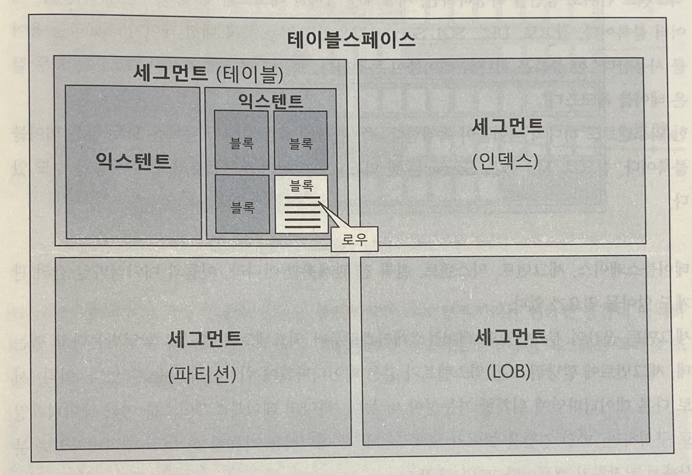
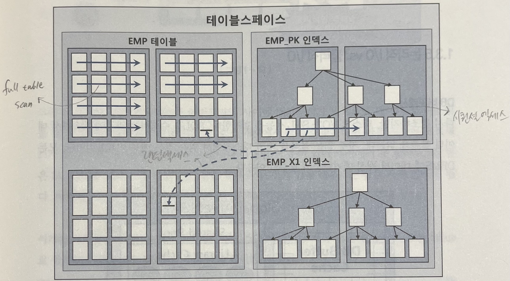
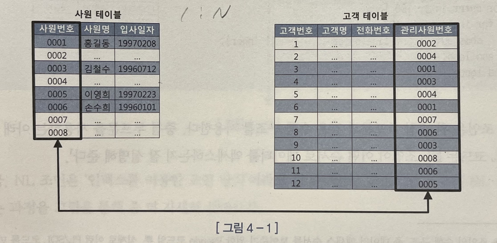

# 친절한 SQL 튜닝

## 1장. SQL 처리 과정과 I/O

### 1.1 SQL 파싱과 최적화

- SQL (Structured Query Language)
  - 구조적, 집합적, 선언적 질의 언어
- 전체적인 과정
  - 사용자 --SQL--> 옵티마이저 --실행계획--> 프로시저
- SQL 최적화
  - DBMS 내부에서 프로시저를 작성하고 컴파일해서 실행 가능한 상태로 만드는 전 과정
- SQL이 실행되는 과정
  1. SQL 파싱
     - 파싱 트리 생성 (SQL 개별 구성요소를 분석해서 파싱 트리 생성)
     - Syntax 체크 (문법 오류 확인)
     - Semantic 체크 (의미상 오류 확인. 없는 테이블인지, 없는 컬럼인지, 권한은 있는지 등)
  2. SQL 최적화
     - 옵티마이저가 다양한 실행 경로 중 하나를 선택한다
  3. 로우 소스 생성
     - 옵티마이저가 선택한 실행 경로를 실제 실행 가능한 코드 또는 프로시저로 포맷팅
     - 로우 소스 생성기가 수행함
- SQL 옵티마이저
  - 최적의 데이터 액세스 경로를 선택해주는 DBMS의 핵심 엔진
  - 단계 : 후보 실행계획을 찾음 -> 각 실행계획의 예상비용 산정(데이터 딕셔너리에 미리 수집해둔 통계 및 시스템 통계 정보 이용) -> 최저비용 선택
- 옵티마이저 힌트
  - 옵티마이저가 항상 최적의 실행계획을 찾는 건 아니다. SQL이 복잡할수록 실수할 가능성이 크다
  - 직접 사용할 인덱스를 결정해줄 수 있다
  - 일부만 지정해주고 나머지는 옵티마이저가 알아서 선택하도록 해줄수도 있다

### 1.2 SQL 공유 및 재사용

- 소프트 파싱 vs 하드 파싱

  - DBMS가 SQL을 파싱한 후 해당 SQL이 라이브러리 캐시에 존재하는지 확인하여 
    - 있으면? 곧바로 실행 (소프트 파싱)
    - 없으면? 최적화 -> 로우소스 생성 -> 실행 (하드 파싱)

- SQL 최적화를 할때 옵티마이저가 사용하는 정보

  - 테이블, 컬럼, 인덱스 구조
  - 오브젝트 통계 (테이블 통계, 인덱스 통계, 컬럼 통계)
  - 시스템 통계 (CPU속도, Single Block I/O 속도, Multiblock I/O 속도)
  - 옵티마이저 관련 파라미터 등등

- 이렇게 많은 정보를 사용하여 무거운 연산을 통해 도출한 내부 프로시저를 한 번만 사용한다면 비효율적이다. 그래서 라이브러리 캐시가 필요하다

- 바인드변수를 잘 활용해야 한다

  - 예를 들어 다음과 같이 라이브러리 캐시가 남으면 안되고,

    ```sql
    SELECT * FROM CUSTOMER WHERE LOGIN_ID = 'hwang'
    SELECT * FROM CUSTOMER WHERE LOGIN_ID = 'kim'
    SELECT * FROM CUSTOMER WHERE LOGIN_ID = 'lee'
    SELECT * FROM CUSTOMER WHERE LOGIN_ID = 'park'
    ...
    ```

  - 다음과 같이 남아야 한다

    ```sql
    SELECT * FROM CUSTOMER WHERE LOGIN_ID = :1
    ```

### 1.3 데이터 저장 구조 및 I/O 메커니즘

- SQL이 느린 이유는 거의 I/O 때문

- 데이터베이스 저장 구조

  - 
  - 데이터 파일 : 디스크 상의 물리적인 OS 파일
  - 테이블 스페이스 : 세그먼트를 담는 컨테이너
  - 세그먼트 : 데이터 저장공간이 필요한 오브젝트
  - 익스텐트 : 공간을 확장하는 단위
  - 블록 : 데이터를 읽고 쓰는 단위

- 테이블 또는 인덱스 블록을 읽는 방식

  - 

  1. 시퀀셜 엑세스 : 차례로 블록을 읽는 방식
  2. 랜덤 액세스 : 레코드 하나를 읽기 위해 한 블록씩 접근하는 방식

- 논리적 I/O vs 물리적 I/O

  - 논리적 I/O
    - SQL문을 처리하는 과정에 메모리 버퍼캐시에서 발생한 총 블록 I/O
  - 물리적 I/O
    - 디스크에서 발생한 총 블록 I/O를 말한다

- 버퍼캐시 히트율(BCHR) = ( 1- ( 물리적I/O / 논리적I/O ) ) * 100

  - 물리적I/O는 통제불가, 논리적I/O는 통제가능
  - 논리적I/O를 줄임으로써 물리적I/O를 줄이는 것이 SQL 튜닝이다
  - BCHR이 높다고 해서 효율적인 SQL라는 뜻은 아니다 (같은 블록을 비효율적으로 반복하면 BCHR은 높아진다)

- Single Block I/O vs Multiblock I/O

  - I/O call할때
    - 한번에 한 블록씩 요청해서 메모리에 적재하면 Single Block I/O
    - 한번에 여러 블록씩 요청해서 메모리에 적재하면 Multiblock I/O
  - 인덱스를 사용할때는 기본적으로 Single Block I/O를 사용한다 (소량을 읽을때 주로 사용하므로)
  - 많은 데이터 블록을 읽을땐 Multiblock I/O가 효율적이다 (같은 익스텐트에 속한 블록을 모두 가져온다)

- Table Full Scan vs Index Range Scan

  - Table Full Scan : 테이블 전체를 스캔해서 읽는 방식
    - 시퀀셜 엑세스와 Multiblock I/O 방식으로 디스크 블록을 읽는다
    - 한 블록에 속한 모든 레코드를 한번에 읽어들이고 캐시에서 못찾으면 한번의 수면을 통해 많은 블록을 한꺼번에 I/O하는 매커니즘
  - Index Range Scan : 인덱스를 이용하여 읽는 방식
    - 랜덤 액세스와 Single Block I/O 방식으로 디스크 블록을 읽는다
    - 캐시에서 블록을 못찾으면 레코드 하나를 읽기 위해 매번 잠을 자는 I/O매커니즘
    - 많은 데이터를 읽을때는 오히려 성능이 떨어질 수 있다

- 캐시 탐색 매커니즘

  - 다음의 경우 버퍼캐시 탐색 과정을 거친다
    - 인덱스 루트 블록을 읽을때
    - 인덱스 루트 블록에서 얻은 주소 정보로 브랜치 블록을 읽을때
    - 인덱스 브랜치 블록에서 얻은 주소 정보로 리프 블록을 읽을때
    - 인덱스 리프 블록에서 얻은 주소 정보로 테이블 블록을 읽을때
    - 테이블 블록을 Full Scan할때
  - 버퍼 캐시에서는 블록 번호를 해시함수로 관리한다
  - 래치
    - 버퍼 블록을 여러 프로세스가 동시에 접근하면 안된다. 그래서 직렬화(줄세우기)가 필요하다. 직렬화가 가능하도록 지원하는 매커니즘을 래치라고 한다
    - 버퍼캐시에는 캐시버퍼 체인래치, 캐시버퍼 LRU 체인래치 등이 작동한다
    - 버퍼블록 자체에서 직렬화 매커니즘이 존재한다 (버퍼 락)

<br/>

## 2장. 인덱스 기본

### 2.1 인덱스 구조 및 탐색

- 인덱스 탐색 과정은 수직적 탐색과 수평적 탐색, 단 두 단계로 이루어진다

  - 수직적 탐색 : 인덱스 스캔 시작지점을 찾는 과정
    - 주의! 수직적 탐색은 '조건을 만족하는 레코드를 찾는 과정'이 아니라 '조건을 만족하는 첫번째 레코드를 찾는 과정'이다.
  - 수평적 탐색 : 데이터를 찾는 과정
    - 수평적 탐색을 하는 이유는 조건절을 만족하는 데이터를 빠뜨리지 않고 모두 찾기 위해, ROWID를 얻기 위해

- 인덱스 튜닝의 두 가지 핵심요소

  1. 인덱스 스캔 과정에서 발생하는 비효율을 줄이는 것 : 인덱스 스캔 효율화 튜닝
  2. 테이블 액세스 수를 줄이는 것 : 랜덤 액세스 최소화 튜닝

  둘 다 중요하지만 랜덤 액세스 최소화 튜닝이 성능에 미치는 영향이 더 크기 때문에 더 중요하다 -> SQL튜닝은 랜덤I/O와의 전쟁이다!

- 인덱스를 이루는 컬럼을 어떤 순서로 놓든 읽는 인덱스 블록 개수는 똑같다. 왜냐하면 B-Tree이기 때문에 루트와 리프간의 거리는 같기 때문에.

### 2.2 인덱스 기본 사용법

- '인덱스를 사용한다' = '리프 블록에서 스캔 지점을 찾아 거기서부터 스캔하다가 중간에 멈추는 것'
- 인덱스 컬럼을 가공하면 인덱스를 정상적으로 사용할 수 없다
  - 인덱스 스캔 시작지점을 찾을 수 없기 때문
  - Range scan하지 못하는 예
    - 생년월일(yyyymmdd)이 인덱스 컬럼일때 5월생 조회
    - 주문수량이 인덱스 컬럼일때 주문수량이 null이면 0으로 치환한 값을 기준으로 100보다 작은 레코드 조회
    - 업체명이 인덱스 컬럼일때 '대한'을 포함하는 업체 조회
    - 전화번호와 고객명이 인덱스 컬럼일때 전화번호가 01012345678 또는 고객명이 '홍길동'인 고객 조회
      - (옵티마이저가 OR Expansion을 통해 인덱스가 작동하도록 하는 경우도 있음)
    - 전화번호가 인덱스 컬럼일때 IN절로 조회
      - (옵티마이저가 IN-List Iterator 방식으로 인덱스가 작동하도록 하는 경우도 있음)
- 인덱스를 Range Scan 하기 위한 첫번째 조건은 인덱스 선두 컬럼이 (가공하지 않은 상태로) 조건절에 있어야 한다.
- 인덱스를 사용하면 이미 정렬되어 있기 때문에 order by 연산을 생략할 수 있다 (리프 블록은 양방향 연결리스트니까 desc도 마찬가지)

### 2.3 인덱스 확장기능 사용법

#### Index Range Scan


- B-Tree 인덱스의 가장 일반적이고 정상적인 형태의 액세스 방식
- 인덱스 루트에서 리프 블록까지 수직적으로 탐색한 후 필요한 범위만 스캔한다
- 인덱스를 Range Scan 하려면 선두 컬럼을 가공하지 않은 상태로 조건절에서 사용해야 한다
  - 반대로 말하면 선두 컬럼을 가공만 하지 않으면 Range Scan은 무조건 가능하므로 인덱스를 탄다고 성능도 무조건 좋다고 생각하면 안된다
  - 성능은 인덱스 스캔 범위, 테이블 엑세스 횟수를 얼마나 줄일 수 있느냐로 결정된다

#### Index Full Scan


- 수직적 탐색 없이 인덱스 리프 블록을 처음부터 끝까지 수평적으로 탐색하는 방식
- 대개 데이터 검색을 위한 최적의 인덱스가 없을때 차선으로 선택됨
- 조건절로 인해 결과값이 극히 일부라면 Table Full Scan보다 Index Full Scan이 효과적이다
  - 하지만, 이는 차선책이므로 Index Range Scan이 수행되도록 인덱스를 생성해주는 게 좋다


#### Index Unique Scan


- 수직적 탐색으로만 데이터를 찾는 스캔 방식
- unique 인덱스를 '=' 조건으로 탐색하는 경우 Index Unique Scan
- 단, unique 인덱스라 하더라도 범위검색 조건(between, 부등호, like)으로 검색할때는 Index Range Scan으로 처리된다
- 또, unique 결합 인덱스에 대해 일부 컬럼만으로 검색할 때도 Index Range Scan으로 처리된다
  - 예 : 주문상품 PK 인덱스를 "주문일자 + 고객id + 상품id"로 구성했는데 "주문일자 + 고객id"로만 검색하는 경우

#### Index Skip Scan


- 루트 또는 브랜치 블록에서 읽은 컬럼 값 정보를 이용해 조건절에 부합하는 레코드를 포함할 가능성이 있는 리프 블록만 골라서 엑세스하는 스캔 방식
- 인덱스 선두 컬럼의 카디널리티가 낮고, 후행 컬럼의 카디널리티가 높을때 유용하다

#### Index Fast Full Scan

- Index Full Scan보다 빠른 스캔 방법
  - 논리적인 인덱스 트리 구조를 무시하고 인덱스 세그먼트 전체를 Multiblock I/O방식으로 스캔하기 때문
- 특징
  - Multiblock I/O방식을 사용하므로 디스크로부터 대량의 인덱스 블록을 읽어야 할 때 큰 효과를 발휘한다
  - 결과 집합이 인덱스 키 순서대로 정렬되지 않는다
  - 쿼리에 사용한 컬럼이 모두 인덱스에 포함돼 있을때만 사용 가능하다
  - 인덱스카 파티션 돼 있지 않더라도 병렬 쿼리가 가능하다

#### Index Range Scan Descending


- Index Range Scan과 기본적으로 동일하지만 인덱스를 뒤에서부터 스캔하기 때문에 내림차순으로 정렬된 결과집합을 얻는다

#### 참고. MySQL의 실행계획

- id : 각 SELECT문에 부여됨
- select_type
  - SIMPLE : 단순 SELECT문
- table : 접근하는 테이블 이름
- partitions 
- type
  - ALL : 테이블 풀 스캔
  - index : 인덱스 풀 스캔
  - range : 인덱스 레인지 스캔
  - const : PK 혹은 UK로 조회하는 경우. 많아야 한 건
- possible_keys : 사용 가능한 인덱스들
- key : possible_keys중 실제로 사용할 인덱스
- key_len : 인덱스에 얼마나 많은 바이트를 사용하고 있는지
- ref
- rows : 원하는 행을 찾기 위해 얼마나 많은 행을 읽어야 할 지에 대한 예측값
- filtered : 행 데이터를 가져와 거기에서 WHERE 구의 검색 조건이 적용되면 몇행이 남는지 예측값
- Extra
  - Using where : where 조건으로 데이터를 추출. type이 ALL 혹은 INDEX 타입과 함께 표현되면 성능이 좋지 않다는 의미
  - Using filesort : 데이터 정렬이 필요한 경우로 메모리 혹은 디스크상에서의 정렬을 모두 포함. 결과 데이터가 많은 경우 성능에 직접적인 영향을 줌
  - Using index condition
  - Using temporary
  - Select tables optimized away

<br/>

## 3장. 인덱스 튜닝

### 3.1 테이블 액세스 최소화

- 인덱스 ROWID

  - 인덱스 ROWID는 논리적 주소다
  - 물리적 주소인 포인터와는 다르다
  - ROWID에 의한 테이블 액세스는 생각보다 고비용 연산이다

- 특정 컬럼 기준으로 같은 값을 갖는 데이터가 모여있을수록 (클러스터링 팩터가 좋은 컬럼에 인덱스를 생성하면) 데이터를 찾는 속도가 빠르다

- 읽어야 할 데이터가 일정량을 넘는 순간(인덱스 손익분기점이 넘는 순간) Table Full Scan보다 Index Range Scan이 오히려 느려진다

  - Table Full Scan은 시퀀셜 엑세스인데, 인덱스 ROWID를 이용한 테이블 액세스는 랜덤 액세스 방식이기 때문에
  - Table Full Scan은 Multiblock I/O인데, 인덱스 ROWID를 이용한 테이블 액세스는 Single Block I/O이기 때문에

- 인덱스 클러스터링 팩터(CF)에 따라 인덱스 손익분기점이 달라진다

  - 인덱스 CF가 좋을수록 인덱스 손익분기점이 높다
  -  = 물리적으로 근접해있는 컬럼을 기준으로 인덱스를 생성하면 많은 데이터를 Index Range Scan으로 가져와도 Table Full Scan보다 느려질 가능성이 적어진다

- 기존에 있는 인덱스에 컬럼을 추가함으로써 테이블 액세스를 줄일수 있다

  - 예를 들어 a,b 컬럼으로 이루어진 인덱스가 있는 테이블에서 아래 쿼리를 시도한다고 가정할때

  - ```sql
    select *
    from table_name
    where a = 30 and c >= 2000;
    ```

  - 기존의 인덱스에 c 컬럼을 추가하면 인덱스 스캔양은 그대로지만 테이블 액세스양을 줄일 수 있다.

- 이전의 경우엔 where로 걸러지는 양이 많을때일 경우의 튜닝 방법이다. 그럼 걸러지는 레코드가 거의 없다면?

  - 예를 들어 아래의 경우 걸러지는 레코드가 없다 (부서번호로 인덱스가 생성되어 있음)

  - ```sql
    select 부서번호, sum(수량)
    from 판매집계
    where 부서번호 like '12%'
    group by 부서번호;
    ```

  - 이럴 경우엔 쿼리에 사용된 컬럼(수량)을 모두 인덱스에 추가해서 테이블 액세스가 아예 발생하지 않도록 튜닝할 수 있다

  - 모든 컬럼이 인덱스에 포함되어 있어서 인덱스만 읽어서 처리하는 쿼리를 Covered 쿼리라고 하고, 그 인덱스를 Covered 인덱스라고 함

  - 이 방법은 효과는 좋지만 추가해야 할 컬럼이 많아지면 추가하기 곤란한 경우도 많다

### 3.2 부분범위 처리 활용

- 부분범위 처리를 활용하면 인덱스로 액세스할 대상 레코드가 아무리 많아도 아주 빠른 응답속도를 낼 수 있다
- 처음부터 모두 가져오지 않고 일정량(array size)만 요청한다(fetch call)
- 멈출 수 있어야 의미있는 부분 범위 처리다.
  - 전체를 읽어서 정렬한다던가 하는 작업이 있다면 앞쪽 일부만 출력할 수 없다.
  - 앞쪽 일부만 읽고 반환해도 되도록 인덱스를 구성해야 한다

### 3.3 인덱스 스캔 효율화

- 인덱스 선두 컬럼이 = 조건일때 효율적이다

  - 인덱스 선행 컬럼이 범위 검색일 경우 비효율적이다
  - 범위 검색을 하는 컬럼을 인덱스 선행 컬럼이 아니도록 수정하는 게 어렵다면 between을 in으로 바꾸면 효과를 얻는 경우도 있다
    - 하지만 in-list 개수가 많다면 더 비효율적으로 될수도 있다
    - 바꾸기 전에 데이터 분포와 수직적 탐색 비용을 고려해야 한다

- between보단 like를 쓰는게 더 효율적이다

- between, like 패턴을 사용하고자 할 땐 아래의 경우에 속하는지 고려해야 한다

  1. 인덱스 선두 컬럼에 대한 옵션 조건을 between, like 연산자로 처리하면 안된다
  2. null 허용 컬럼에 대한 옵션 조건을 between, like 연산자로 처리하면 안된다
  3. 숫자형 컬럼에 대한 옵션 조건을 like연산자로 처리하면 안된다
  4. like를 옵션조건에 사용할 때는 컬럼 값 길이가 고정적이어야 한다

- 옵션 조건을 처리하는 가장 효율적인 방법은 union all을 이용하는 것이다

  ```sql
  -- 인덱스 : a + b
  -- a는 옵션 조건
  select *
  from table_name
  where :a_input is null and b between :b_input1 and :b_input2
  union all
  select *
  from table_name
  where :a_input is not null and a = :a_input and b between :b_input1 and :b_input2
  ```

### 3.4 인덱스 설계

- 인덱스 설계가 어려운 이유? SQL 각각에 최적화된 인덱스를 마음껏 생성할 수 없기 때문에

  - 인덱스가 늘어나면 늘어날수록 DML 성능저하, 데이터베이스 사이즈 증가, 관리비용 상승 등의 문제가 커진다

- 결합 인덱스를 구성할때의 가장 중요한 두가지 (판단 기준이 인덱스 스캔 효율성일때)

  1. 조건절에 항상 사용하거나, 자주 사용하는 컬럼을 선정해야 한다
  2. 그렇게 선정한 컬럼 중 = 조건으로 자주 조회하는 컬럼을 앞쪽에 두어야 한다

- 인덱스 스캔 효율성 외에도 다른 판단 기준들도 많다

  - 수행 빈도 (효율성 다음으로 가장 중요)
    - NL방식으로 조인하는 두 테이블이 있을 때, outer쪽 인덱스보다 inner쪽 인덱스가 더 중요하다
  - 업무상 중요도
  - 클러스터링 팩터
  - 데이터량
    - 데이터량이 적으면 인덱스가 많던 적던 크게 이슈가 되지 않는다
    - 대용량이라면, 인덱스가 중요하다
  - DML부하
  - 저장 공간
  - 인덱스 관리 비용 등

- 인덱스는 order by, group by를 위한 소트 연산을 생략할 수 있게 해준다

  - I/O를 최소화하면서도 소트 연산을 생략하려면..
    1. = 연산자로 사용한 조건절 컬럼 선정
    2. order by 절에 기술한 컬럼 추가
    3. = 연산자가 아닌 조건절 컬럼은 데이터 분포를 고려해 추가 여부 결정

- 항상 사용하는 컬럼을 앞쪽에 두고 그 중 = 조건을 앞쪽에 위치시켜야 효율적이다

  - 예: 조건절로 인덱스 설계하기

    ```sql
    -- 조건절1
    where a = :v1
    and b = :v2
    and c >= :v3
    -- 조건절2
    where a = :v1
    and b = :v2
    and c >= :v3
    and d = :v4
    -- 조건절3
    where a = :v1
    and b = :v2
    and c >= :v3
    and e = :v5
    -- 조건절4
    where a = :v1
    and b = :v2
    and c >= :v3
    and d = :v4
    and e = :v5
    ```

    - a,b,c는 항상 들어가고, d,e은 선택이므로 a,b,c먼저, d,e는 뒤로 배치한다

    - a,b는 = 조건이고, c는 between조건으므로 a,b가 c보다 앞에 배치된다

    - a,b사이와 d,e사이는 어떤게 앞에 오더라도 상관없다

      -> 효율적인 인덱스 순서 : abcde, abced, bacde, baced

- 인덱스 중복 제거

  - 실습1

    - 상황

      X01: a + b

      X02: a + b + c

      X03: a + b + c + d

    - 해결

      X03만 남기고 X01, X02는 제거해도 된다

  - 실습2

    - 상황

      X01: a + b

      X02: a + c

      X03: a + d

      X04: a + e

      (+) a의 평균 카디널리티가 매우 낮다

    - 해결

      카디널리티가 매우 낮다면 사실상 중복이다. 카디널리티가 5라면 a 를 =조건으로 조회하면 평균 5건이 남으니까 인덱스를 4개씩 만들 필요가 없다. 모두 제거하고 다음 인덱스 하나만 남겨도 된다

      X01: a + b + c + d + e

  - 실습3

    - 상황

      PK: <u>a</u> + b + c

      N1: d + <u>a</u>

      N2: <u>f</u> + b

      N3: <u>a</u> + e

      N4: <u>a</u> + d

      밑줄(a, f) : 항상 범위조건으로만 조회

      컬럼에 입력된 값 종류 개수 : <u>a</u>(2356), b(127), c(1850), d(5956), e(1715), <u>f</u>(2356)

    - 해결1

      a가 항상 범위조건이면 N3와 N4는 둘다 a가 인덱스 액세스 조건이다.

      그래서 N4를 지우고 N3 맨뒤에 d를 추가한다

    - 해결2

      d와 a로 조회하거나 d단독으로 조회할때는 N1을 사용하고, a만으로 조회할때는 N3을 쓰면 되니까 N4만 제거해도 된다

    - 해결3

      PK: b + a + c

      N1: d + a

      N2: f + b

      N3: a + e

      ~~N4: a + d~~

  - 실습4

    - 상황

      PK: a + b + c + d

      N1: e + d

      N2: d

      N3: a + d

      컬럼에 입력된 값 종류 개수 : a(736000), b(175), c(3000), d(250000), e(3)

    - 해결

      e의 NDV가 매우 낮기 때문에 e로만 조회할 땐 N1인덱스가 사용되지 않는다

      N2를 제거하고 N1의 e와 d의 순서를 바꾼다

<br/>

## 4장. 조인 튜닝

### 4.1 NL 조인

- NL 조인(Nested Loop Join) = 인덱스를 이용한 조인
- NL 조인의 기본 매커니즘
  - 
  - 


### 4.2 소트 머지 조인

### 4.3 해시 조인

### 4.4 서브쿼리 조인

<br/>

## 5장. 소트 튜닝

### 5.1 소트 연산에 대한 이해

### 5.2 소트가 발생하지 않도록 SQL 작성

### 5.3 인덱스를 이용한 소트 연산 생략

### 5.4 Sort Area를 적게 사용하도록 SQL 작성

<br/>

## 6장. DML 튜닝

### 6.1 기본 DML 튜닝

### 6.2 Direct Path I/O 활용

### 6.3 파티션을 활용한 DML 튜닝

### 6.4 Lock과 트랜잭션 동시성 제어

<br/>

## 7장. SQL 옵티마이저

<br/>
