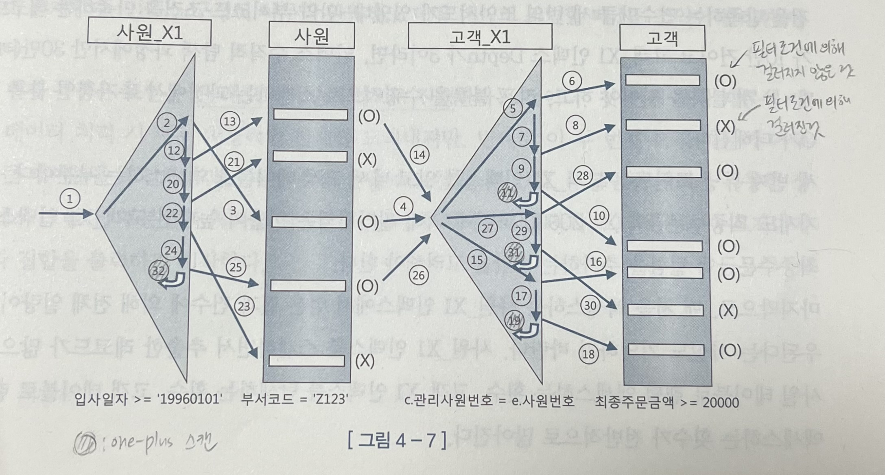
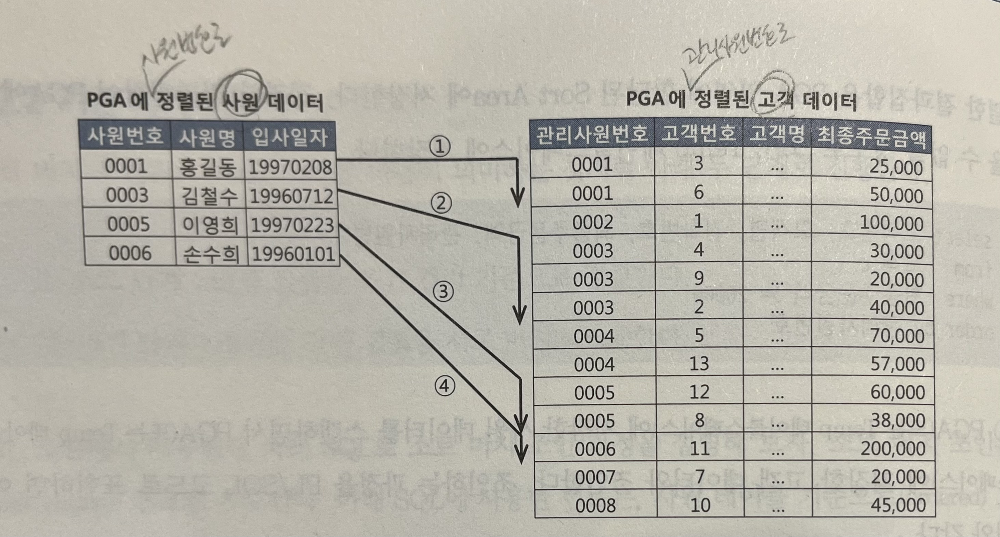
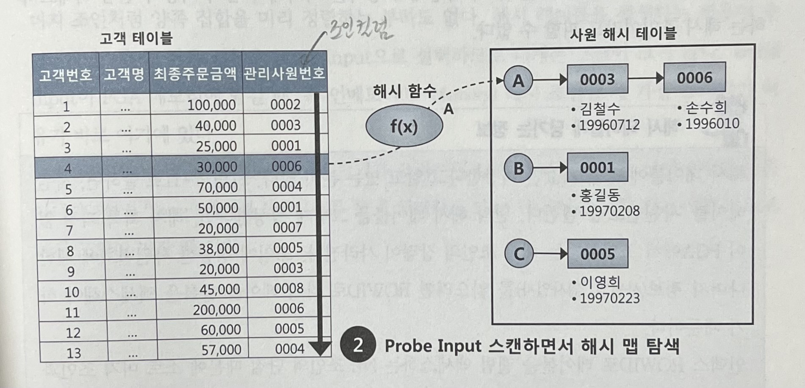

# 친절한 SQL 튜닝

## 1장. SQL 처리 과정과 I/O

### 1.1 SQL 파싱과 최적화

- SQL (Structured Query Language)
  - 구조적, 집합적, 선언적 질의 언어
- 전체적인 과정
  - 사용자 --SQL--> 옵티마이저 --실행계획--> 프로시저
- SQL 최적화
  - DBMS 내부에서 프로시저를 작성하고 컴파일해서 실행 가능한 상태로 만드는 전 과정
- SQL이 실행되는 과정
  1. SQL 파싱
     - 파싱 트리 생성 (SQL 개별 구성요소를 분석해서 파싱 트리 생성)
     - Syntax 체크 (문법 오류 확인)
     - Semantic 체크 (의미상 오류 확인. 없는 테이블인지, 없는 컬럼인지, 권한은 있는지 등)
  2. SQL 최적화
     - 옵티마이저가 다양한 실행 경로 중 하나를 선택한다
  3. 로우 소스 생성
     - 옵티마이저가 선택한 실행 경로를 실제 실행 가능한 코드 또는 프로시저로 포맷팅
     - 로우 소스 생성기가 수행함
- SQL 옵티마이저
  - 최적의 데이터 액세스 경로를 선택해주는 DBMS의 핵심 엔진
  - 단계 : 후보 실행계획을 찾음 -> 각 실행계획의 예상비용 산정(데이터 딕셔너리에 미리 수집해둔 통계 및 시스템 통계 정보 이용) -> 최저비용 선택
- 옵티마이저 힌트
  - 옵티마이저가 항상 최적의 실행계획을 찾는 건 아니다. SQL이 복잡할수록 실수할 가능성이 크다
  - 직접 사용할 인덱스를 결정해줄 수 있다
  - 일부만 지정해주고 나머지는 옵티마이저가 알아서 선택하도록 해줄수도 있다

### 1.2 SQL 공유 및 재사용

- 소프트 파싱 vs 하드 파싱

  - DBMS가 SQL을 파싱한 후 해당 SQL이 라이브러리 캐시에 존재하는지 확인하여 
    - 있으면? 곧바로 실행 (소프트 파싱)
    - 없으면? 최적화 -> 로우소스 생성 -> 실행 (하드 파싱)

- SQL 최적화를 할때 옵티마이저가 사용하는 정보

  - 테이블, 컬럼, 인덱스 구조
  - 오브젝트 통계 (테이블 통계, 인덱스 통계, 컬럼 통계)
  - 시스템 통계 (CPU속도, Single Block I/O 속도, Multiblock I/O 속도)
  - 옵티마이저 관련 파라미터 등등

- 이렇게 많은 정보를 사용하여 무거운 연산을 통해 도출한 내부 프로시저를 한 번만 사용한다면 비효율적이다. 그래서 라이브러리 캐시가 필요하다

- 바인드변수를 잘 활용해야 한다

  - 예를 들어 다음과 같이 라이브러리 캐시가 남으면 안되고,

    ```sql
    SELECT * FROM CUSTOMER WHERE LOGIN_ID = 'hwang'
    SELECT * FROM CUSTOMER WHERE LOGIN_ID = 'kim'
    SELECT * FROM CUSTOMER WHERE LOGIN_ID = 'lee'
    SELECT * FROM CUSTOMER WHERE LOGIN_ID = 'park'
    ...
    ```

  - 다음과 같이 남아야 한다

    ```sql
    SELECT * FROM CUSTOMER WHERE LOGIN_ID = :1
    ```

### 1.3 데이터 저장 구조 및 I/O 메커니즘

- SQL이 느린 이유는 거의 I/O 때문

- 데이터베이스 저장 구조

  - 
  - 데이터 파일 : 디스크 상의 물리적인 OS 파일
  - 테이블 스페이스 : 세그먼트를 담는 컨테이너
  - 세그먼트 : 데이터 저장공간이 필요한 오브젝트
  - 익스텐트 : 공간을 확장하는 단위
  - 블록 : 데이터를 읽고 쓰는 단위

- 테이블 또는 인덱스 블록을 읽는 방식

  - 

  1. 시퀀셜 엑세스 : 차례로 블록을 읽는 방식
  2. 랜덤 액세스 : 레코드 하나를 읽기 위해 한 블록씩 접근하는 방식

- 논리적 I/O vs 물리적 I/O

  - 논리적 I/O
    - SQL문을 처리하는 과정에 메모리 버퍼캐시에서 발생한 총 블록 I/O
  - 물리적 I/O
    - 디스크에서 발생한 총 블록 I/O를 말한다

- 버퍼캐시 히트율(BCHR) = ( 1- ( 물리적I/O / 논리적I/O ) ) * 100

  - 물리적I/O는 통제불가, 논리적I/O는 통제가능
  - 논리적I/O를 줄임으로써 물리적I/O를 줄이는 것이 SQL 튜닝이다
  - BCHR이 높다고 해서 효율적인 SQL라는 뜻은 아니다 (같은 블록을 비효율적으로 반복하면 BCHR은 높아진다)

- Single Block I/O vs Multiblock I/O

  - I/O call할때
    - 한번에 한 블록씩 요청해서 메모리에 적재하면 Single Block I/O
    - 한번에 여러 블록씩 요청해서 메모리에 적재하면 Multiblock I/O
  - 인덱스를 사용할때는 기본적으로 Single Block I/O를 사용한다 (소량을 읽을때 주로 사용하므로)
  - 많은 데이터 블록을 읽을땐 Multiblock I/O가 효율적이다 (같은 익스텐트에 속한 블록을 모두 가져온다)

- Table Full Scan vs Index Range Scan

  - Table Full Scan : 테이블 전체를 스캔해서 읽는 방식
    - 시퀀셜 엑세스와 Multiblock I/O 방식으로 디스크 블록을 읽는다
    - 한 블록에 속한 모든 레코드를 한번에 읽어들이고 캐시에서 못찾으면 한번의 수면을 통해 많은 블록을 한꺼번에 I/O하는 매커니즘
  - Index Range Scan : 인덱스를 이용하여 읽는 방식
    - 랜덤 액세스와 Single Block I/O 방식으로 디스크 블록을 읽는다
    - 캐시에서 블록을 못찾으면 레코드 하나를 읽기 위해 매번 잠을 자는 I/O매커니즘
    - 많은 데이터를 읽을때는 오히려 성능이 떨어질 수 있다

- 캐시 탐색 매커니즘

  - 다음의 경우 버퍼캐시 탐색 과정을 거친다
    - 인덱스 루트 블록을 읽을때
    - 인덱스 루트 블록에서 얻은 주소 정보로 브랜치 블록을 읽을때
    - 인덱스 브랜치 블록에서 얻은 주소 정보로 리프 블록을 읽을때
    - 인덱스 리프 블록에서 얻은 주소 정보로 테이블 블록을 읽을때
    - 테이블 블록을 Full Scan할때
  - 버퍼 캐시에서는 블록 번호를 해시함수로 관리한다
  - 래치
    - 버퍼 블록을 여러 프로세스가 동시에 접근하면 안된다. 그래서 직렬화(줄세우기)가 필요하다. 직렬화가 가능하도록 지원하는 매커니즘을 래치라고 한다
    - 버퍼캐시에는 캐시버퍼 체인래치, 캐시버퍼 LRU 체인래치 등이 작동한다
    - 버퍼블록 자체에서 직렬화 매커니즘이 존재한다 (버퍼 락)

<br/>

## 2장. 인덱스 기본

### 2.1 인덱스 구조 및 탐색

- 인덱스 탐색 과정은 수직적 탐색과 수평적 탐색, 단 두 단계로 이루어진다

  - 수직적 탐색 : 인덱스 스캔 시작지점을 찾는 과정
    - 주의! 수직적 탐색은 '조건을 만족하는 레코드를 찾는 과정'이 아니라 '조건을 만족하는 첫번째 레코드를 찾는 과정'이다.
  - 수평적 탐색 : 데이터를 찾는 과정
    - 수평적 탐색을 하는 이유는 조건절을 만족하는 데이터를 빠뜨리지 않고 모두 찾기 위해, ROWID를 얻기 위해

- 인덱스 튜닝의 두 가지 핵심요소

  1. 인덱스 스캔 과정에서 발생하는 비효율을 줄이는 것 : 인덱스 스캔 효율화 튜닝
  2. 테이블 액세스 수를 줄이는 것 : 랜덤 액세스 최소화 튜닝

  둘 다 중요하지만 랜덤 액세스 최소화 튜닝이 성능에 미치는 영향이 더 크기 때문에 더 중요하다 -> SQL튜닝은 랜덤I/O와의 전쟁이다!

- 인덱스를 이루는 컬럼을 어떤 순서로 놓든 읽는 인덱스 블록 개수는 똑같다. 왜냐하면 B-Tree이기 때문에 루트와 리프간의 거리는 같기 때문에.

### 2.2 인덱스 기본 사용법

- '인덱스를 사용한다' = '리프 블록에서 스캔 지점을 찾아 거기서부터 스캔하다가 중간에 멈추는 것'
- 인덱스 컬럼을 가공하면 인덱스를 정상적으로 사용할 수 없다
  - 인덱스 스캔 시작지점을 찾을 수 없기 때문
  - Range scan하지 못하는 예
    - 생년월일(yyyymmdd)이 인덱스 컬럼일때 5월생 조회
    - 주문수량이 인덱스 컬럼일때 주문수량이 null이면 0으로 치환한 값을 기준으로 100보다 작은 레코드 조회
    - 업체명이 인덱스 컬럼일때 '대한'을 포함하는 업체 조회
    - 전화번호와 고객명이 인덱스 컬럼일때 전화번호가 01012345678 또는 고객명이 '홍길동'인 고객 조회
      - (옵티마이저가 OR Expansion을 통해 인덱스가 작동하도록 하는 경우도 있음)
    - 전화번호가 인덱스 컬럼일때 IN절로 조회
      - (옵티마이저가 IN-List Iterator 방식으로 인덱스가 작동하도록 하는 경우도 있음)
- 인덱스를 Range Scan 하기 위한 첫번째 조건은 인덱스 선두 컬럼이 (가공하지 않은 상태로) 조건절에 있어야 한다.
- 인덱스를 사용하면 이미 정렬되어 있기 때문에 order by 연산을 생략할 수 있다 (리프 블록은 양방향 연결리스트니까 desc도 마찬가지)

### 2.3 인덱스 확장기능 사용법

#### Index Range Scan


- B-Tree 인덱스의 가장 일반적이고 정상적인 형태의 액세스 방식
- 인덱스 루트에서 리프 블록까지 수직적으로 탐색한 후 필요한 범위만 스캔한다
- 인덱스를 Range Scan 하려면 선두 컬럼을 가공하지 않은 상태로 조건절에서 사용해야 한다
  - 반대로 말하면 선두 컬럼을 가공만 하지 않으면 Range Scan은 무조건 가능하므로 인덱스를 탄다고 성능도 무조건 좋다고 생각하면 안된다
  - 성능은 인덱스 스캔 범위, 테이블 엑세스 횟수를 얼마나 줄일 수 있느냐로 결정된다

#### Index Full Scan


- 수직적 탐색 없이 인덱스 리프 블록을 처음부터 끝까지 수평적으로 탐색하는 방식
- 대개 데이터 검색을 위한 최적의 인덱스가 없을때 차선으로 선택됨
- 조건절로 인해 결과값이 극히 일부라면 Table Full Scan보다 Index Full Scan이 효과적이다
  - 하지만, 이는 차선책이므로 Index Range Scan이 수행되도록 인덱스를 생성해주는 게 좋다


#### Index Unique Scan


- 수직적 탐색으로만 데이터를 찾는 스캔 방식
- unique 인덱스를 '=' 조건으로 탐색하는 경우 Index Unique Scan
- 단, unique 인덱스라 하더라도 범위검색 조건(between, 부등호, like)으로 검색할때는 Index Range Scan으로 처리된다
- 또, unique 결합 인덱스에 대해 일부 컬럼만으로 검색할 때도 Index Range Scan으로 처리된다
  - 예 : 주문상품 PK 인덱스를 "주문일자 + 고객id + 상품id"로 구성했는데 "주문일자 + 고객id"로만 검색하는 경우

#### Index Skip Scan


- 루트 또는 브랜치 블록에서 읽은 컬럼 값 정보를 이용해 조건절에 부합하는 레코드를 포함할 가능성이 있는 리프 블록만 골라서 엑세스하는 스캔 방식
- 인덱스 선두 컬럼의 카디널리티가 낮고, 후행 컬럼의 카디널리티가 높을때 유용하다

#### Index Fast Full Scan

- Index Full Scan보다 빠른 스캔 방법
  - 논리적인 인덱스 트리 구조를 무시하고 인덱스 세그먼트 전체를 Multiblock I/O방식으로 스캔하기 때문
- 특징
  - Multiblock I/O방식을 사용하므로 디스크로부터 대량의 인덱스 블록을 읽어야 할 때 큰 효과를 발휘한다
  - 결과 집합이 인덱스 키 순서대로 정렬되지 않는다
  - 쿼리에 사용한 컬럼이 모두 인덱스에 포함돼 있을때만 사용 가능하다
  - 인덱스카 파티션 돼 있지 않더라도 병렬 쿼리가 가능하다

#### Index Range Scan Descending


- Index Range Scan과 기본적으로 동일하지만 인덱스를 뒤에서부터 스캔하기 때문에 내림차순으로 정렬된 결과집합을 얻는다

#### 참고. MySQL의 실행계획

- id : 각 SELECT문에 부여됨
- select_type
  - SIMPLE : 단순 SELECT문
- table : 접근하는 테이블 이름
- partitions 
- type
  - ALL : 테이블 풀 스캔
  - index : 인덱스 풀 스캔
  - range : 인덱스 레인지 스캔
  - const : PK 혹은 UK로 조회하는 경우. 많아야 한 건
- possible_keys : 사용 가능한 인덱스들
- key : possible_keys중 실제로 사용할 인덱스
- key_len : 인덱스에 얼마나 많은 바이트를 사용하고 있는지
- ref
- rows : 원하는 행을 찾기 위해 얼마나 많은 행을 읽어야 할 지에 대한 예측값
- filtered : 행 데이터를 가져와 거기에서 WHERE 구의 검색 조건이 적용되면 몇행이 남는지 예측값
- Extra
  - Using where : where 조건으로 데이터를 추출. type이 ALL 혹은 INDEX 타입과 함께 표현되면 성능이 좋지 않다는 의미
  - Using filesort : 데이터 정렬이 필요한 경우로 메모리 혹은 디스크상에서의 정렬을 모두 포함. 결과 데이터가 많은 경우 성능에 직접적인 영향을 줌
  - Using index condition
  - Using temporary
  - Select tables optimized away

<br/>

## 3장. 인덱스 튜닝

### 3.1 테이블 액세스 최소화

- 인덱스 ROWID

  - 인덱스 ROWID는 논리적 주소다
  - 물리적 주소인 포인터와는 다르다
  - ROWID에 의한 테이블 액세스는 생각보다 고비용 연산이다

- 특정 컬럼 기준으로 같은 값을 갖는 데이터가 모여있을수록 (클러스터링 팩터가 좋은 컬럼에 인덱스를 생성하면) 데이터를 찾는 속도가 빠르다

- 읽어야 할 데이터가 일정량을 넘는 순간(인덱스 손익분기점이 넘는 순간) Table Full Scan보다 Index Range Scan이 오히려 느려진다

  - Table Full Scan은 시퀀셜 엑세스인데, 인덱스 ROWID를 이용한 테이블 액세스는 랜덤 액세스 방식이기 때문에
  - Table Full Scan은 Multiblock I/O인데, 인덱스 ROWID를 이용한 테이블 액세스는 Single Block I/O이기 때문에

- 인덱스 클러스터링 팩터(CF)에 따라 인덱스 손익분기점이 달라진다

  - 인덱스 CF가 좋을수록 인덱스 손익분기점이 높다
  -  = 물리적으로 근접해있는 컬럼을 기준으로 인덱스를 생성하면 많은 데이터를 Index Range Scan으로 가져와도 Table Full Scan보다 느려질 가능성이 적어진다

- 기존에 있는 인덱스에 컬럼을 추가함으로써 테이블 액세스를 줄일수 있다

  - 예를 들어 a,b 컬럼으로 이루어진 인덱스가 있는 테이블에서 아래 쿼리를 시도한다고 가정할때

  - ```sql
    select *
    from table_name
    where a = 30 and c >= 2000;
    ```

  - 기존의 인덱스에 c 컬럼을 추가하면 인덱스 스캔양은 그대로지만 테이블 액세스양을 줄일 수 있다.

- 이전의 경우엔 where로 걸러지는 양이 많을때일 경우의 튜닝 방법이다. 그럼 걸러지는 레코드가 거의 없다면?

  - 예를 들어 아래의 경우 걸러지는 레코드가 없다 (부서번호로 인덱스가 생성되어 있음)

  - ```sql
    select 부서번호, sum(수량)
    from 판매집계
    where 부서번호 like '12%'
    group by 부서번호;
    ```

  - 이럴 경우엔 쿼리에 사용된 컬럼(수량)을 모두 인덱스에 추가해서 테이블 액세스가 아예 발생하지 않도록 튜닝할 수 있다

  - 모든 컬럼이 인덱스에 포함되어 있어서 인덱스만 읽어서 처리하는 쿼리를 Covered 쿼리라고 하고, 그 인덱스를 Covered 인덱스라고 함

  - 이 방법은 효과는 좋지만 추가해야 할 컬럼이 많아지면 추가하기 곤란한 경우도 많다

### 3.2 부분범위 처리 활용

- 부분범위 처리를 활용하면 인덱스로 액세스할 대상 레코드가 아무리 많아도 아주 빠른 응답속도를 낼 수 있다
- 처음부터 모두 가져오지 않고 일정량(array size)만 요청한다(fetch call)
- 멈출 수 있어야 의미있는 부분 범위 처리다.
  - 전체를 읽어서 정렬한다던가 하는 작업이 있다면 앞쪽 일부만 출력할 수 없다.
  - 앞쪽 일부만 읽고 반환해도 되도록 인덱스를 구성해야 한다

### 3.3 인덱스 스캔 효율화

- 인덱스 선두 컬럼이 = 조건일때 효율적이다

  - 인덱스 선행 컬럼이 범위 검색일 경우 비효율적이다
  - 범위 검색을 하는 컬럼을 인덱스 선행 컬럼이 아니도록 수정하는 게 어렵다면 between을 in으로 바꾸면 효과를 얻는 경우도 있다
    - 하지만 in-list 개수가 많다면 더 비효율적으로 될수도 있다
    - 바꾸기 전에 데이터 분포와 수직적 탐색 비용을 고려해야 한다

- between보단 like를 쓰는게 더 효율적이다

- between, like 패턴을 사용하고자 할 땐 아래의 경우에 속하는지 고려해야 한다

  1. 인덱스 선두 컬럼에 대한 옵션 조건을 between, like 연산자로 처리하면 안된다
  2. null 허용 컬럼에 대한 옵션 조건을 between, like 연산자로 처리하면 안된다
  3. 숫자형 컬럼에 대한 옵션 조건을 like연산자로 처리하면 안된다
  4. like를 옵션조건에 사용할 때는 컬럼 값 길이가 고정적이어야 한다

- 옵션 조건을 처리하는 가장 효율적인 방법은 union all을 이용하는 것이다

  ```sql
  -- 인덱스 : a + b
  -- a는 옵션 조건
  select *
  from table_name
  where :a_input is null and b between :b_input1 and :b_input2
  union all
  select *
  from table_name
  where :a_input is not null and a = :a_input and b between :b_input1 and :b_input2
  ```

### 3.4 인덱스 설계

- 인덱스 설계가 어려운 이유? SQL 각각에 최적화된 인덱스를 마음껏 생성할 수 없기 때문에

  - 인덱스가 늘어나면 늘어날수록 DML 성능저하, 데이터베이스 사이즈 증가, 관리비용 상승 등의 문제가 커진다

- 결합 인덱스를 구성할때의 가장 중요한 두가지 (판단 기준이 인덱스 스캔 효율성일때)

  1. 조건절에 항상 사용하거나, 자주 사용하는 컬럼을 선정해야 한다
  2. 그렇게 선정한 컬럼 중 = 조건으로 자주 조회하는 컬럼을 앞쪽에 두어야 한다

- 인덱스 스캔 효율성 외에도 다른 판단 기준들도 많다

  - 수행 빈도 (효율성 다음으로 가장 중요)
    - NL방식으로 조인하는 두 테이블이 있을 때, outer쪽 인덱스보다 inner쪽 인덱스가 더 중요하다
  - 업무상 중요도
  - 클러스터링 팩터
  - 데이터량
    - 데이터량이 적으면 인덱스가 많던 적던 크게 이슈가 되지 않는다
    - 대용량이라면, 인덱스가 중요하다
  - DML부하
  - 저장 공간
  - 인덱스 관리 비용 등

- 인덱스는 order by, group by를 위한 소트 연산을 생략할 수 있게 해준다

  - I/O를 최소화하면서도 소트 연산을 생략하려면..
    1. = 연산자로 사용한 조건절 컬럼 선정
    2. order by 절에 기술한 컬럼 추가
    3. = 연산자가 아닌 조건절 컬럼은 데이터 분포를 고려해 추가 여부 결정

- 항상 사용하는 컬럼을 앞쪽에 두고 그 중 = 조건을 앞쪽에 위치시켜야 효율적이다

  - 예: 조건절로 인덱스 설계하기

    ```sql
    -- 조건절1
    where a = :v1
    and b = :v2
    and c >= :v3
    -- 조건절2
    where a = :v1
    and b = :v2
    and c >= :v3
    and d = :v4
    -- 조건절3
    where a = :v1
    and b = :v2
    and c >= :v3
    and e = :v5
    -- 조건절4
    where a = :v1
    and b = :v2
    and c >= :v3
    and d = :v4
    and e = :v5
    ```

    - a,b,c는 항상 들어가고, d,e은 선택이므로 a,b,c먼저, d,e는 뒤로 배치한다

    - a,b는 = 조건이고, c는 between조건으므로 a,b가 c보다 앞에 배치된다

    - a,b사이와 d,e사이는 어떤게 앞에 오더라도 상관없다

      -> 효율적인 인덱스 순서 : abcde, abced, bacde, baced

- 인덱스 중복 제거

  - 실습1

    - 상황

      X01: a + b

      X02: a + b + c

      X03: a + b + c + d

    - 해결

      X03만 남기고 X01, X02는 제거해도 된다

  - 실습2

    - 상황

      X01: a + b

      X02: a + c

      X03: a + d

      X04: a + e

      (+) a의 평균 카디널리티가 매우 낮다

    - 해결

      카디널리티가 매우 낮다면 사실상 중복이다. 카디널리티가 5라면 a 를 =조건으로 조회하면 평균 5건이 남으니까 인덱스를 4개씩 만들 필요가 없다. 모두 제거하고 다음 인덱스 하나만 남겨도 된다

      X01: a + b + c + d + e

  - 실습3

    - 상황

      PK: <u>a</u> + b + c

      N1: d + <u>a</u>

      N2: <u>f</u> + b

      N3: <u>a</u> + e

      N4: <u>a</u> + d

      밑줄(a, f) : 항상 범위조건으로만 조회

      컬럼에 입력된 값 종류 개수 : <u>a</u>(2356), b(127), c(1850), d(5956), e(1715), <u>f</u>(2356)

    - 해결1

      a가 항상 범위조건이면 N3와 N4는 둘다 a가 인덱스 액세스 조건이다.

      그래서 N4를 지우고 N3 맨뒤에 d를 추가한다

    - 해결2

      d와 a로 조회하거나 d단독으로 조회할때는 N1을 사용하고, a만으로 조회할때는 N3을 쓰면 되니까 N4만 제거해도 된다

    - 해결3

      PK: b + a + c

      N1: d + a

      N2: f + b

      N3: a + e

      ~~N4: a + d~~

  - 실습4

    - 상황

      PK: a + b + c + d

      N1: e + d

      N2: d

      N3: a + d

      컬럼에 입력된 값 종류 개수 : a(736000), b(175), c(3000), d(250000), e(3)

    - 해결

      e의 NDV가 매우 낮기 때문에 e로만 조회할 땐 N1인덱스가 사용되지 않는다

      N2를 제거하고 N1의 e와 d의 순서를 바꾼다

<br/>

## 4장. 조인 튜닝

### 4.1 NL 조인

- NL 조인(Nested Loop Join) = 인덱스를 이용한 조인

- NL 조인의 기본 매커니즘

  - 

  - 1996년 1월 1일 이후 입사한 사원이 관리하는 고객 데이터를 추출하려면?

    ```sql
    select *
    from 사원 e join 고객 c
    	on e.사원번호 = c.관리사원번호
    where e.입사일자 >= '19960101';
    ```

  - NL 조인의 기본 매커니즘은 입사일자가 19960101보다 큰 사원을 찾아(outer loop) '건건이' 고객 테이블에서 사원번호가 일치하는 레코드를 읽는 것(inner loop)이다.

    - outer쪽 테이블(사원)은 사이즈가 크지 않으면 인덱스를 이용하지 않을수도 있지만 inner쪽 테이블(고객)은 인덱스를 사용해야 한다.
    - (인덱스가 없는 경우) outer쪽은 Table Full Scan을 하더라도 한번만 하지만, inner쪽은 outer에서 읽은 건수만큼 Table Full Scan을 하기 때문이다

  - NL 조인 과정(사원 테이블은 입사일자, 고객 테이블은 관리사원번호로 인덱스가 생성되어 있다고 가정)

    1. 사원의 인덱스에서 입사일자 >= '19960101'인 첫 레코드를 찾는다
    2. 인덱스에서 읽은 ROWID로 사원 테이블 레코드를 찾아간다
    3. 사원 테이블에서 읽은 사원번호로 고객 테이블의 인덱스를 탐색한다
    4. 고객 테이블의 인덱스에서 읽은 ROWID로 고객 테이블 레코드를 찾아간다
    5. 사원 테이블에서 읽은 사원번호가 더이상 나오지 않을때까지 3~5를 반복한다
    6. 입사일자 < '19960101'을 만족하는 레코드가 나오기 전까지 2~6을 반복한다

- NL조인 매커니즘(심화)

  - ```sql
    select *
    from 사원 e join 고객 c
    	on e.사원번호 = c.관리사원번호   -- 1
    where e.입사일자 >= '19960101'  -- 2
    and e.부서코드 = 'Z123'         -- 3
    and c.최종주문금액 >= 2000       -- 4
    ```

  - 인덱스 구성

    - 사원_PK : 사원번호
    - 사원_X1 : 입사일자
    - 고객_PK : 고객번호
    - 고객_X1 : 관리사원번호
    - 고객_X2 : 최종주문금액

  - 

  - 각 단계를 모두 완료하고 다음 단계로 넘어가는 게 아니라 한 레코드씩 순차적으로 진행한다

  - 위 SQL에서 조건절 비교 순으로 나열하면 2 -> 3 -> 1 -> 4 순이다

### 4.2 소트 머지 조인

- NL조인을 사용할 수 없을때 옵티마이저는 차선책으로 소트머지조인이나 해시조인을 선택한다

  - 조인 컬럼에 인덱스가 없을때, 대량 데이터 조인이어서 인덱스가 효과적이지 않을때 등등

- PGA?

  - Process/Program/Private Global Area
  - 각 오라클 서버 프로세스에 할당된 메모리 영역
  - 프로세스에 종속적인 고유 데이터를 저장하는 용도로 사용됨
  - 다른 프로세스와 공유하지 않는 독립적인 메모리 공간이기 때문에 래치 매커니즘이 불필요하다 -> SGA 버퍼캐시에서 읽을때보다 훨씬 빠르다

- 소트 머지 조인의 기본 매커니즘

  - 아래 두 단계로 진행된다

    1. 소트 단계 : 양쪽 집합을 조인 컬럼 기준으로 정렬한다
    2. 머지 단계 : 정렬한 양쪽 집합을 서로 머지한다

  - 예시

    ```sql
    select *
    from 사원 e join 고객 c
    	on e.사원번호 = c.관리사원번호
    where e.입사일자 >= '19960101'
    and e.부서코드 = 'Z123'
    and c.최종주문금액 >= 2000
    ```

    (사원 테이블 기준으로 고객 테이블과 조인할때 소트 머지 조인 방식을 사용한다고 가정.)

    1. 아래 조건에 해당하는 사원 데이터를 읽어 사원번호 순으로 정렬해서 PGA영역에 할당된 Sort Area에 저장한다 (넘치면 Temp 테이블스페이스에 저장)

       ```sql
       select *
       from 사원
       where 입사일자 >= '19960101'
       and 부서코드 = 'Z123'
       order by 사원번호
       ```

    2. 아래 조건에 해당하는 고객 데이터를 읽어 관리사원번호 순으로 정렬해서 PGA영역에 할당된 Sort Area에 저장한다 (넘치면 Temp 테이블스페이스에 저장)

       ```sql
       select *
       from 고객
       where 최종주문금액 >= 2000
       order by 관리사원번호
       ```

    3. PGA에 저장된 사원 데이터를 스캔하면서 PGA에 저장된 고객 테이터와 조인한다 (이 단계는 NL조인 방식과 다르지 않다)

    - 그림으로 나타내면

      

- 소트 머지 조인이 빠른 이유

  - NL조인은 대량 데이터 조인을 할때 매우 느리기 때문에 소트 머지 조인과 해시 조인이 개발되었다
  - PGA는 프로세스를 위한 독립적인 메모리 공간이므로 데이터를 읽을때 래치 획득 과정이 없다 -> NL조인보다 빠르다

- 소트 머지 조인의 주용도

  - 대부분 다음에 설명할 해시 조인이 더 빠르지만 해시 조인은 조건식이 = 일때만 쓸 수 있기 때문에 다음의 상황에서 주로 사용된다

  1. 조인 조건식이 = 조건이 아닌 대량 데이터 조인
  2. 조인 조건식이 아예 없는 조인(Cross Join, 카테시안 곱)

- 조인 컬럼에 인덱스가 없는 상황에서 두 테이블을 각각 읽어 조인 대상 집합을 줄일 수 있을때 아주 유리하다

### 4.3 해시 조인

- 해시 조인의 기본 매커니즘

  - 다음 두단계로 진행된다
    1. Build 단계 : 작은 쪽 테이블을 읽어 해시 테이블을 생성한다
    2. Probe 단계 : 큰 쪽 테이블을 읽어 해시 테이블을 탐색하면서 조인한다

  - 예시

  ```sql
  select *
  from 사원 e join 고객 c
  	on e.사원번호 = c.관리사원번호
  where e.입사일자 >= '19960101'
  and e.부서코드 = 'Z123'
  and c.최종주문금액 >= 2000
  ```

  (사원 테이블 기준으로 고객 테이블과 조인할때 해시 조인 방식을 사용한다고 가정.)

  1. Build 단계 : 아래 조건에 해당하는 사원 데이터를 읽어 해시 테이블을 생성한다. 이때 조인컬럼인 사원번호를 해시 테이블 키 값으로 사용한다

  ```sql
  select *
  from 사원
  where 입사일자 >= '19960101'
  and 부서코드 = 'Z123'
  ```

  2. Probe 단계 : 아래 조건에 해당하는 고객 데이터를 하나씩 읽어 해시 테이블을 탐색한다

  ```sql
  select *
  from 고객
  where 최종주문금액 >= 2000
  ```

  - 그림으로 나타내면

    

    

- 해시 조인이 빠른 이유

  - 소트 머지 조인이 NL조인보다 빠른 이유와 같다 (해시 테이블을 PGA영역에 할당하기 때문)
  - PGA영역에 할당하면 빠른 이유는 래치 획득 및 캐시버퍼 체인 스캔 과정을 반복할 필요가 없기 때문
  - 해시 조인이 소트 머지 조인보다 빠른 이유는 소트 머지 조인은 양쪽 집합을 모두 정렬해서 PGA에 담는 반면, 해시 조인은 둘 중 작은 집합 하나로 해시 맵을 만들기 때문에 해시 조인이 사전 준비작업이 더 가볍다.

- 만약 두 테이블이 대용량이라 한 테이블을 기준으로 해시 테이블을 만들 수 없다면? 조인 컬럼의 해시값으로 파티셔닝하여 분할 정복한다

- 조인 메서드 선택 기준 (NL조인 VS 소트 머지 조인 VS 해시 조인)

  - 우선 NL조인을 가장 먼저 고려해야 한다
    - NL조인에 사용하는 인덱스는 재사용하지만 해시 테이블은 조인이 끝나면 소멸한다
    - 그래서 수행빈도가 높다면 CPU와 메모리에 부하를 준다
  - 정리
    - NL조인
      - 소량 데이터 조인일때

    - 해시 조인
      - 대량 데이터 조인이고 조인 조건식이 =일때
      - 수행 빈도가 낮을때
      - 쿼리 수행시간이 오래 걸릴때

    - 소트 머지 조인
      - 대량 데이터 조인이고 조인 조건식이 =이 아닐때

  - 여기서 소량, 대량의 기준? NL조인으로 최적화 했는데도 성능이 안나온다면 대량이다

### 4.4 서브쿼리 조인

- 서브쿼리 변환이 필요한 이유
  - 최근 옵티마이저는 실행계획을 생성함에 앞서 쿼리변환을 진행한다 (사용자로부터 전달받은 SQL을 최적화에 유리한 형태로 변환한다.)
  - 사용자가 제공한 SQL의 서브쿼리대로 그대로 최적화를 진행하면 큰 그림을 보지 않고 최적화되는 것이다

<br/>

## 5장. 소트 튜닝

### 5.1 소트 연산에 대한 이해

- 소트는 기본적으로 Sort Area에서 이루어지지만 Sort Area가 다 차면 디스크 공간까지 사용할 수도 있다

  - Sort Area에서 작업을 완료할수 있는지에 따라 소트를 두가지 유형으로 나눈다

  1. 메모리 소트 (=Internal Sort) : 전체 소트를 메모리 내에서 완료
  2. 디스크 소트 (=External Sort) : 소트를 하는데에 디스크 공간까지 사용

- 디스크 소트가 발생하는 순간 쿼리 성능은 나빠지므로 소트가 발생하지 않도록 SQL을 작성해야 하고, 소트가 불가피하다면 메모리 내에서 완료될 수 있도록 해야 한다

- 소트를 발생시키는 오퍼레이션

  1. Sort Aggregate
     - 전체 로우를 대상으로 집계를 수행할때 (sum, max, min, avg ...)
     - 실제로 데이터를 정렬하진 않고, Sort Area를 사용한다
  2. Sort Oeder By
     - 데이터를 정렬할때 (order by ...)
  3. Sort Group By
     - 소팅 알고리즘을 사용해 그룹별 집계를 수행할때 (group by ...)
     - 집계할 대상 레코드가 아무리 많아도 Temp 테이블스페이스를 쓰지 않는다
  4. Sort Unique
     - 서브쿼리 Unnesting : 옵티마이저가 서브쿼리를 풀어 일반 조인문으로 변환하는 것
     - Unnesting된 서브쿼리가 M쪽 집합일때 메인쿼리와 조인하기 전에 중복 레코드부터 제거할때
  5. Sort Join
     - 소트 머지 조인을 수행할때
  6. Window Sort
     - 윈도우 함수(분석 함수)를 수행할때 (`avg(sal) over (partition by deptno)` ...)

### 5.2 소트가 발생하지 않도록 SQL 작성

- 불필요한 소트가 발생하지 않도록 주의해야 한다

  - `Union`, `Minus`, `Distinct` 연산자는 중복 레코드를 제거하기 위한 소트 연산을 발생시키므로 필요할때만 사용해야 한다

- `Union` VS `Union All`

  - 될 수 있으면 소트 작업을 수행하지 않는 `Union All`을 사용해야 한다

  - `Union`을 사용하는 쿼리를 `Union All`으로 변경하려면 `Union All`하는 두 집합이 상호 배타적이어야 (교집합이 없을때) 한다. 그래야 데이터 중복이 없다

  - `Union` -> `Union All` 변경 예시

    ```sql
    -- union 사용
    select *
    from 결제
    where 결제일자 = '20180316'
    UNION
    select *
    from 결제
    where 주문일자 = '20180316'
    
    -- union all 사용
    select *
    from 결제
    where 결제일자 = '20180316'
    UNION ALL
    select *
    from 결제
    where 주문일자 = '20180316'
    and 결제일자 <> '20180316'
    ```

- Exists 활용

- 조인 방식 변경

### 5.3 인덱스를 이용한 소트 연산 생략

- 인덱스 선두 컬럼을 where절에 나오는 컬럼으로 구성하면 sort 연산을 생략할 수 있다

- 부분범위 처리가 가능하도록 SQL를 작성하려면 아래를 만족해야 한다

  - 인덱스 사용 가능하도록 조건절을 구성한다
  - 조인은 NL조인 위주로 처리한다
  - Order by 절이 있어도 소트 연산을 생략할 수 있도록 인덱스를 구성해준다

- 인덱스를 잘 구성하면 min, max를 구할때 전체 데이터를 읽지 않을 수 있다

  - 조건절 컬럼과 min, max함수 인자 컬럼이 모두 인덱스에 포함돼 있어야 한다

  - 예

    ```sql
    create index IDX_X1 on TABLE_NAME(a, b, c);
    
    select max(c) 
    from TABLE_NAME 
    where a = 30 
    and b = 70;
    -- a, b 두 조건을 만족하는 레코드 중 가장 오른쪽 레코드를 읽는다
    ```

    ```sql
    create index IDX_X1 on TABLE_NAME(a, b, c);
    
    select max(b) 
    from TABLE_NAME 
    where a = 30 
    and c = 70;
    -- a 조건을 만족하는 레코드 중 오른쪽부터 스캔하면서 c조건에 맞는 레코드를 찾으면 멈춘다
    ```

    ```sql
    create index IDX_X1 on TABLE_NAME(a, b, c);
    
    select max(a) 
    from TABLE_NAME 
    where b = 30 
    and c = 70;
    -- 전체 레코드 중 오른쪽부터 스캔하면서 b, c조건에 맞는 레코드를 찾으면 멈춘다
    ```

- 인덱스 선두 컬럼을 group by절에 사용한다면 sort group by 연산을 생략할 수 있다

### 5.4 Sort Area를 적게 사용하도록 SQL 작성

<br/>

## 6장. DML 튜닝

### 6.1 기본 DML 튜닝

- DML 성능에 영향을 미치는 요소
  - 인덱스 개수
  - 무결성 제약
  - 조건절
  - 서브쿼리
  - Redo 로깅
  - Undo 로깅
  - Lock
  - 커밋
- 인덱스 개수는 DML 성능에 영향을 크게 미친다
- 오라클은 데이터파일과 컨트롤 파일에 가해지는 모든 변경사항을 Redo 로그에 기록한다. 그래서 Redo로깅은 성능에 영향을 미친다.
  - Redo 로그? 트랜잭션 데이터가 유실됐을때 트랜잭션을 재현함으로써 유실 이전 상태로 복구하는데 사용됨
  - Redo 로그의 용도
    1. 물리적으로 디스크가 깨지는 등의 Media Fail 발생 시 대비하기 위해
    2. 캐시에 저장된 변경사항이 디스크에 아직 기록되지 않았을때 인스턴스가 비정상적으로 종료됐을때를 대비하기 위해
    3. 트랜잭션에 의한 변경사항을 우선 Redo 로그에 기록하고, 빠르게 커밋을 완료하기 위해
- DML을 수행할때 Redo로그 뿐만 아니라 Undo 로그도 남긴다
  - Redo 로그는 과거를 현재상태로 되돌리는데 사용, Undo 로그는 현재를 과거 상태로 되돌리는데 사용
  - Undo 로그의 용도
    1. 변경사항을 커밋하지 않고 롤백하고자 할때
    2. 시스템이 셧다운된 시점에 커밋되지 않았던 트랜잭션을 모두 롤백할때
    3. 읽기 일관성을 위해 사용
- DML 성능과 Lock은 트레이드오프 관계다.
  - Lock을 필요 이상으로 자주, 길게 또는 레벨을 높일수록 DML 성능은 느려진다
  - Lock을 너무 적게, 짧게 또는 레벨을 낮추면 데이터 품질은 나빠진다
- 커밋은 생각보다 무거운 작업이므로 너무 자주 커밋하면 성능에 안좋다 (왜 무거운 작업인지는 책 참조)
- Call을 최소화가는게 좋다
  - Call이 어디서 발생하느냐에 따라 User Call(네트워크를 경유하여 외부로부터 인입되는 call), Recursive Call(DBMS 내부에서 발생하는 call)로 나뉘는데, User Call은 성능에 영향을 많이 미친다
  - 그래서 One SQL은 성능이 좋다

- 후략

### 6.2 Direct Path I/O 활용

- Direct Path I/O
  - 오라클은 시스템의 전반적인 성능을 높이기 위해 버퍼캐시를 제공하지만, 대량 데이터를 읽고 쓸땐 오히려 성능에 안좋다
  - 그래서 버퍼캐시를 경유하지 않고 곧바로 데이터 블록을 읽고 쓸 수 있는 Direct Path I/O를 제공한다
  - Direct Path I/O가 작동하는 경우
    1. 병렬 쿼리로 Full Scan을 수행할때
    2. 병렬 DML을 수행할때
    3. Direct Path Insert를 수행할때
    4. Temp 세그먼트 블록들을 읽고 쓸때
    5. direct 옵션을 지정하고 export를 수행할때
    6. nocache 옵션을 지정한 LOB 컬럼을 읽을때
- Direct Path Insert
  - 일반적인 insert에 비해 생략하는 과정이 많기 때문에 빠르다
  - 그래서 주의점이 있다
    1. Exclusive 모드 TM Lock이 걸리기 때문에 커밋하기 전까진 다른 트랜잭션은 해당 테이블에 DML을 수행하지 못한다
    2. Freelist를 조회하지 않기 때문에 테이블에 여유공간이 있어도 재활용하지 않는다

### 6.3 파티션을 활용한 DML 튜닝

- 파티셔닝 : 테이블 또는 인덱스 데이터를 특정 컬럼값에 따라 별도 세그먼트에 나눠서 저장하는 것
- 파티션이 필요한 이유
  - 관리적 측면 : 파티션 단위 백업, 추가, 삭제, 변경 -> 가용성 향상
  - 성능적 측면 : 파티션 단위 조회 및 DML, 경합 또는 부하 분산
- 파티션의 종류
  1. Range 파티션
     - 가장 기초적인 방식, 주로 날짜 컬럼을 기준으로 파티셔닝
  2. 해시 파티션
     - 파티션 키 값을 해시 함수에 입력해서 반환받은 값이 같은 데이터를 같은 세그먼트에 저장하는 방식
     - id같이 변별력이 좋고 데이터 분포가 고른 컬럼을 파티션 기준으로 선정해야 효과적이다
  3. 리스트 파티션
     - 사용자가 정의한 그룹핑 기준에 따라 데이터를 분할 저장하는 방식
     - 순서와 상관없이 불연속적인 값의 목록에 의해 결정된다
- 인덱스 파티션
  - 로컬 파티션 인덱스
    - 각 테이블 파티션과 인덱스 파티션이 1:1 관계가 되도록 오라클이 자동으로 관리하는 파티션 인덱스
    - 테이블 파티션 속성을 그대로 상속받는다
    - 테이블 파티션 구성을 변경하더라도 인덱스를 재생성할 필요 없다
  - 글로벌 파티션 인덱스
    - 파티션을 테이블과 다르게 구성한 인덱스
    - 테이블 파티션 구성을 변경하는 순간 곧바로 인덱스를 재생성해줘야 한다
  - 비파티션 인덱스
    - 파티셔닝하지 않은 인덱스
- 파티션을 활용하여 대량 UPDATE 튜닝하기
  - 테이블이 파티셔닝 되어 있고, 인덱스도 로컬 파티션이라면, 수정된 값을 갖는 임시 세그먼트를 만들어 원본 파티션과 바꿔치기 한다
  
- 파티션을 활용하여 대량 DELETE 튜닝하기
  - 테이블이 삭제 조건절 컬럼 기준으로 파티셔닝 되어 있고, 인덱스도 로컬 파티션이라면 drop partition으로 삭제할 수 있다
  - 다른 삭제조건이 끼어있는 경우는 책참조
  
- 파티션을 활용하여 대량 INSERT 튜닝하기
  - 비파티션 테이블이라면 인덱스를 unusable 시켰다가 재생성하는 방식이 빠를수도 있다
  - 파티션 테이블일때는 웬만하면 인덱스를 unusable 전환하지 않고 insert 하지만, 테이블이 파티셔닝 돼있고 로컬 파티션이라면 파티션단위로 인덱스를 unusable하고 재생성한다
  

### 6.4 Lock과 트랜잭션 동시성 제어

- 자신이 사용하는 데이터베이스의 Lock 매커니즘과 트랜잭션 동시성 제어에 대한 학습은 필수다!

- 오라클 Lock 종류

  1. DML Lock
     - 어플리케이션 개발 측면에서 가장 중요하게 다뤄야 할 Lock
     - 다중 트랜잭션이 동시에 액세스하는 사용자 데이터의 무결성을 보호해준다
     - DML Lock엔 테이블 Lock과 로우 Lock이 있다
  2. DDL Lock
  3. 래치
     - SGA에 공유된 각종 자료구조를 보호하기 위해 사용
  4. 버퍼 Lock
     - 버퍼 블록에 대한 엑세스를 직렬화하기 위해 사용
  5. 라이브러리 캐시 Lock/Pin
     - 라이브러리 캐시에 공유된 SQL 커서와 PL/SQL 프로그램을 보호하기 위해 사용

- DML 로우 Lock

  - 두 개의 동시 트랜잭션이 같은 로우를 변경하는 것을 방지함
  - 같은 로우를 UPDATE/DELETE/INSERT를 시도할때
    - UPDATE, DELETE : 진행중인(아직 커밋하지 않은) 로우를 다른 트랜잭션이 수정할 수 없다
    - INSERT : unique인덱스가 있고 같은 값을 입력하려고 할때 블로킹이 발생한다.
      1. 선행 트랜잭션이 커밋할 동안 후행 트랜잭션은 기다린다
      2. 선행 트랜잭션이 커밋하면 후행 트랜잭션은 실패하고, 선행 트랜잭션이 롤백하면 후행 트랜잭션은 성공한다
  - DML 로우 Lock에 의한 성능 저하를 방지하려면 Lock을 너무 오래 유지하도록 커밋 시점을 조절해야 한다

- DML 테이블 Lock (= TM Lock)

  - 현재 트랜잭션이 갱신 중인 테이블 구조를 다른 트랜잭션이 변경하지 못하게 하기 위해 로우 Lock 이전에 테이블 Lock을 설정한다

  - 로우 Lock은 1가지 Lock 모드(배타적 Lock)만 있는 반면 테이블 Lock에는 여러 Lock 모드(RS, RX, S, SRX, X)가 있다

  - 테이블 Lock을 테이블 전체에 걸리는 Lock이라고 오해하기 쉬운데, 그게 아니라 테이블 Lock을 설정한 트랜잭션이 해당 테이블에서 어떤 작업을 수행중인지 알리는 일종의 푯말이라고 이해하면 좋다 (후행 트랜잭션은 그 푯말을 보고 기다릴지, 포기할지 결정된다)

    - Lock이 해제될때까지 기다린다 or 일정 시간만 기다리다 포기한다 or 기다리지 않고 포기한다

  - 예) DDL을 이용하여 테이블 구조를 변경하려 할때

    - 테이블 구조를 변경하려는 트랜잭션은 해당 테이블에 TM Lock이 설정돼있는지 확인한다

    - RX모드로 설정한 트랜잭션이 하나라도 있다면 작업을 멈춘다
    - DDL이 먼저 수행중이라면 DML을 수행하려는 트랜잭션이 기다린다

- 블로킹 vs 교착상태

  - 블로킹 : 선행 트랜잭션이 설정한 Lock 때문에 후행 트랜잭션이 기다리는 상태
  - 교착상태 : 두 트랜잭션이 각각 특정 리소스에 Lock을 설정한 상태에서 두 트랜잭션 모두 맞은편 트랜잭션의 리소스에 Lock을 설정하려고 하는 상황
    - 오라클에서는 교착상태가 발생하면 이를 먼저 인지한 트랜잭션이 문장 수준 롤백을 진행한 후 에러 메시지를 던진다

- 트랜잭션 동시성 제어는 비관적 동시성 제어와 낙관적 동시성 제어로 나뉜다

  1. 비관적 동시성 제어
     - 사용자들이 같은 데이터를 동시에 수정할 것으로 가정하고, 한 사용자가 데이터를 읽는 시점에 Lock을 걸고 조회/갱신이 완료될때까지 이를 유지한다
     - `select ... for update`로 비관적 락을 걸 수 있다
     - 동시성을 심각하게 떨어뜨릴 우려가 있지만, `for update wait ...`, `for update nowait` 옵션으로 동시성을 증가시킬 수 있다
  2. 낙관적 동시성 제어
     - 사용자들이 같은 데이터를 동시에 수정하지 않을 것으로 가정하고, 데이터를 읽을때 Lock을 설정하지 않는다. 읽는 시점에 변경된 데이터인지 반드시 검사해야 한다
     - 모든 컬럼에 대해 변경이 됐는지 확인하거나, 수정시간에 대한 컬럼을 따로 만들어서 수정시간이 변경됐는지 확인한다

- 데이터 품질과 동시성 향상을 위해선

  - for update 사용을 두려워하지 말아야 한다
  - for update가 필요한 상황이면 정확히 사용하고, 번거롭더라도 wait 또는 nowait 옵션을 활용하여 예외처리에 주의를 기울어야 한다
  - 불필요하게 Lock을 오래 유지하지 않고, 트랜잭션의 원자성을 보장하는 범위 내에서 가급적 빨리 커밋해야 한다

- 채번 방식

  - 채번 : 신규 데이터를 입력할때 PK 중복을 방지하기 위한 과정

  - 채번 방식 종류

    1. 채번 테이블

       - 채번하기 위한 별도의 테이블을 관리하는 방식
       - 채번 레코드를 읽어서 1을 더한 값으로 변경하고, 그 값을 새로운 레코드를 입력하는데 사용한다
       - 두 트랜잭션이 중복 값을 채번할 가능성을 원천적으로 방지해준다
       - 장점
         - 범용성이 좋다
         - 중복 레코드 발생에 대비하지 않아도 된다
         - INSERT 과정에 결번을 방지할 수 있다
         - PK가 복합컬럼일때도 사용할 수 있다
       - 단점
         - 채번 레코드를 변경하기 위한 로우 Lock 경합 때문에 성능이 안좋다 (그래서 동시 INSERT가 아주 많으면 사용하기 힘들다)

    2. 시퀀스 오브젝트

       - 시퀀스 오브젝트? 오라클 내부에서 관리하는 채번 테이블

       - 장점
         - 성능이 빠르다
         - 중복 레코드 발생에 대비하지 않아도 된다

       - 단점
         - 테이블 별로 시퀀스 오브젝트를 생성하고 관리하는 부담이 있다
         - 시퀀스 채번 과정에서 Lock에 의한 성능 이슈가 있다 (단, 캐시 사이즈를 적절히 설정하면 빠른 성능을 제공한다)

    3. MAX + 1 조회

<br/>

## 7장. SQL 옵티마이저

### 7.1 통계정보와 비용 계산 원리

### 7.2 옵티마이저에 대한 이해

<br/>
