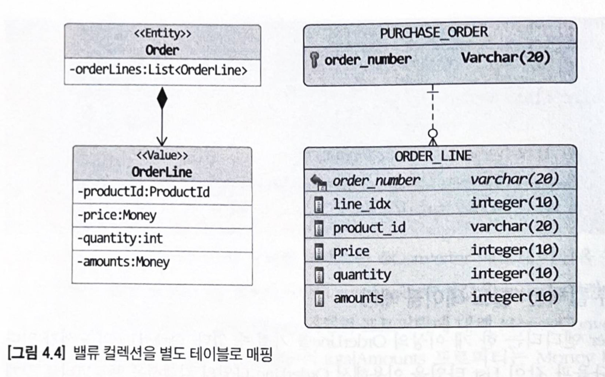

# DDD start!

## chapter1. 도메인 모델 시작

- 도메인

  - 소프트웨어로 해결하고자 하는 문제영역 (예 : 온라인 서점)

  - 한 도메인은 하위 도메인으로 나눌 수 있다 (예 : 주문, 회원, 결제 등..)


- 도메인 모델

  - 특정 도메인을 개념적으로 표현한 것(객체 기반, 상태 다이어그램 등..)

  - 도메인 모델은 도메인 자체를 이해할 수 있다면 표현방식은 중요하지 않다

  - 도메인 모델을 사용하면 여러 관계자들이 도메인이 제공하는 기능과 도메인의 주요 데이터 구성을 파악하는데 도움이 된다


- 일반적인 애플리케이션 아키텍쳐

  - 사용자 인터페이스(UI) 또는 표현(Presentation)
    - 요청을 처리하고 정보를 보여줌

  - 응용(Application)
    - 요청한 기능을 실행. 업무로직을 직접 구현하지 않고 도메인 계층을 조합해서 기능을 실행

  - 도메인
    - 시스템이 제공할 도메인의 핵심 규칙을 구현
    - 이 계층을 객체지향 기법으로 구현하는 패턴이 도메인 모델 패턴이다.
    - 예 : 주문 취소는 배송 전에만 할 수 있다, 출고 전에 배송지를 변경할 수 있다 등..

  - 인프라스트럭쳐(Infrastructure)
    - 외부 시스템(데이터베이스, 메시징 시스템 등)과의 연동


- 엔티티와 밸류

  - 엔티티의 가장 큰 특징은 식별자를 갖는다는 것

  - 밸류 타입은 개념적으로 완전한 하나를 표현할 때 사용


## chapter2. 아키텍처 개요

- DB 테이블의 엔티티 VS 도메인 모델의 엔티티

  - DB 테이블의 엔티티 = 데이터, 도메인 모델의 엔티티 = 데이터 + 도메인 기능

  - 도메인 모델의 엔티티는 여러 데이터가 개념적으로 하나인 경우 밸류타입으로 표현할 수 있다 (ex: 주문자이름, 주문자이메일을 주문자 밸류타입으로)

- 애그리거트

  - 관련 객체를 하나로 묶은 군집

  - 큰 틀에서 도메인 모델을 관리할 수 있다

  - 애그리거트는 군집에 속한 객체들을 관리하는 루트 엔티티를 갖는다.

  - 루트 엔티티 : 애그리거트에 속해있는 엔티티와 밸류 객체를 이용해서 애그리거트가 구현해야 할 기능을 제공한다


- 리포지터리

  - 물리적인 저장소에 도메인 객체를 보관하기 위한 도메인 모델

  - 리포지터리는 애그리거트 단위로 도메인 객체를 저장하고 조회하는 기능을 정의한다.


## chapter3. 애그리거트

- 애그리거트에 속한 객체는 유사하거나 동일한 라이프사이클을 갖는다
  - ex: Order을 생성하려면 OrderLine, Orderer과 같은 객체를 같이 만들어야 한다 (도메인 규칙에 따라 일부는 만들필요 없을수도 있다)

- 한 애그리거트에 속한 객체는 다른 애그리거트에 속하지 않는다
- "A가 B를 갖는다"라는 요구사항이 있을때 A와 B를 같은 애그리거트로 묶어서 생각할 수 있지만 항상 그런건 아니다.(예: 상품과 리뷰) 함께 생성되고 함께 변경되는지, 변경 주체는 누군지 생각하자.
- 저자 경험상, 한 애그리거트는 보통 한개의 엔티티 객체만 갖는 경우가 많고, 두개 이상은 드물다고 한다

- 애그리거트 루트

  - 핵심 역할은 애그리거트의 일관성이 깨지지 않도록 하는 것이다
  - 애그리거트가 제공해야 할 도메인 기능을 구현한다

  - 루트를 통해서만 도메인 로직을 구현하게 만들려면 다음 두가지를 습관적으로 적용해야 한다.
    1. public setter 메서드를 만들지 않는다
    2. 밸류 타입은 불변으로 구현한다


- 트랜잭션 범위

  - 트랜잭션 범위는 성능상 작을수록 좋다.

  - 한 트랜잭션에선 한 개의 애그리거트만 수정해야 한다. 각 애그리거트는 독립적이어야 한다 (권장)
    - 단, 다음의 경우엔 한 트랜잭션에서 두 개 이상의 애그리거트를 변경하는걸 고려할 수 있다
  
    - 팀 표준에 따라 반드시 하나의 트랜잭션으로 해야 하는 경우, 기술적으로 이벤트 방식을 도입할 수 없는 경우, 백오피스에서의 편리함을 위해 여러 상태에 대해 한번에 변경하고 싶을때 등등
  
  - 두개 이상의 애그리거트를 수정하려면 응용 서비스에서 수정하도록 구현해야 한다


- id를 이용한 애그리거트 참조

  - 필드를 이용해 다른 애그리거트를 참조하면 편할 수 있지만 다음의 문제가 있다
    1. 다른 애그리거트의 상태를 쉽게 변경할 수 있다.
    2. 성능에 대한 고민을 해야 한다 (예: 지연로딩할지? 즉시로딩할지?)
    3. 확장 어려움 (다른 애그리거트 루트를 참조하기 위해 JPA같은 단일 기술을 사용할 수 없을수도 있다)

  - 그래서 다른 애그리거트를 참조할 땐 id 참조를 사용한다.

  - 장점
    - 애그리거트 간의 의존을 제거하므로 응집도를 높혀주고 모델의 복잡도를 낮춰준다
    - 애그리거트 별로 다른 구현기술을 사용할 수 있다
  
- 애그리거트를 팩토리로 사용하기

  
  - 애그리거트가 갖고 있는 데이터를 이용해서 다른 애그리거트를 생성해야 한다면 팩토리 메서드를 구현하는 걸 고려해보자
  
  - ex) Store와 Product 애그리거트가 있고 Product을 생성하는데 Store의 식별자를 필요로 할때 Store에서 팩토리 메서드 구현

    ```java
    public class Store {
      
      @EmbeddedId
      private StoreId id;
      private String name;
      ...
        
      public Product createProduct(ProductId productId, ... ) {
        if (isBlocked()) { // 서비스 레이어에 도메인 로직 처리를 노출시키지 않을 수 있다
          throw new StoreBlockedException();
        }
        return new Product(productId, getId(), ...);
      }
    }
    ```
  

## chapter4. 리포지터리와 모델구현 (JPA 중심)

- JPA를 이용한 리포지터리 구현

  - 모듈 위치
    - `domain` -> 엔티티, 리포지터리 인터페이스
    - `infra` -> 리포지터리 구현 클래스
    - ex
      -  `domain` -> `Model`, `ModelRepository`,
      -  `infra` -> `JpaModelRepository`

- 매핑 구현

  - 밸류 타입은 @Embeddable, @Embedded로 매핑

    ```java
    @Entity
    @Table(name = "purchase_order")
    public class Order {
      ...
      @Embedded
      private Orderer orderer;
    }
    
    @Embeddable
    public class Orderer {
      @AttributeOverrides(
      	@AttributeOverride(name = "id", column = @Column(name = "orderer_id")) 
      )
      private MemberId memberId;
    	...
    }
    
    @Embeddable
    public class MemberId implements Serializable {
      @Column(name="member_id")
      private String id;
      ...
    }
    ```

    - 밸류 타입을 식별자로 매핑하려면 `@EmbeddedId`를 사용 (단, JPA에서 식별자는 Serializable 타입이어야 하기 때문에 Serializable을 구현해야 함.)

  - 컬럼 <-> 필드 변환은 `AttributeConverter` 이용 (autoApply=true면 전역으로 변환)

    - 예 : email array json을 필드로 저장하고 싶을때

    - `Set<Email>` 을 갖고 있는 클래스를 만들어서 `EmailSetConverter`구현

  - 밸류 컬렉션을 별도 테이블로 매핑할때는 `@ElementCollection`, `@CollectionTable` 사용

    

    ```java
    @Entity
    @Table(name = "purchase_order")
    public class Order {
      ...
      @ElementCollection
      @CollectionTable(name = "order_line", joinColumns = @JoinColumn(name = "order_number"))
      @OrderColumn(name = "line_idx")
      private List<OrderLine> orderLines;
    }
    
    @Embeddable
    public class OrderLine {
      ...
    }
    ```

  - 밸류를 저장하기 위해 별도 테이블을 만들때

    - 별도 테이블이 있다 해서 엔티티인 건 아니다

      - 1:1 관계인 Article(제목 포함)과 ArticleContent(내용 포함)가 있을때, Article은 엔티티, ArticleContent는 밸류

    - 자신만의 독자적인 라이프사이클을 갖는다면 다른 애그리거트일 가능성이 높다

      - 예 : 상품과 리뷰. 둘은 같은 화면에서 보여줄 진 몰라도 생성주체와 변경 주체가 다르다. 둘은 다른 애그리거트

    - 예

      ```java
      @Entity
      @SecondaryTable(
      	name = "article_content", // 밸류를 저장할 테이블 이름
        pkJoinColumns = @PrimaryKeyJoinColumn(name = "id") // 밸류 테이블에서 엔티티 테이블로 조인할때 사용할 컬럼
      )
      public class Article {
        
        @Id
        private Long id;
        private String title;
        ...
          
        @AttributeOverrides({ // 밸류를 위한 테이블 정의
          @AttributeOverride(name = "content", column = @Column(table = "article_content")),
          @AttributeOverride(name = "contentType", column = @Column(table = "article_content")),
        })
        private ArticleContent content;
        ...
      }
      
      @Embeddable
      public class ArticleContent {
        
      }
      ```

  - 밸류 컬렉션을 @Entity로 매핑하기

    - 예 : 계층 구조를 갖는 밸류 타입 (Product 엔티티와 Image 밸류)
    - 

- 애그리거트 로딩 전략

- 애그리거트의 영속성 전파

- 식별자 생성 기능
