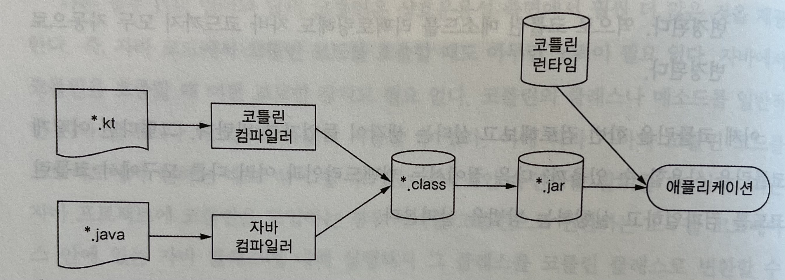

# Kotlin in action

## 1장. 코틀린이란 무엇이며, 왜 필요한가?

- 코틀린 맛보기

  ```kotlin
  data class Person(val name: String, val age: Int? = null)
  
  fun main(args: Array<String>) {
      val people = listOf(Person("영희"), Person("철수", age = 20))
      val oldest = people.maxByOrNull { it.age ?: 0 }
      println("나이가 가장 많은 사람: $oldest") // 결과 -> 나이가 가장 많은 사람: Person(name=철수, age=20)
  }
  ```

  - `name`, `age`를 갖고 있는 데이터 클래스 `Person` 정의
  - `age`의 디폴트 값은 null (`?`으로 디폴트값 지정 가능)
  - null인 경우 지정된 값 반환하는 엘비스 연산자(`?:`)

- 코틀린의 주요 특성

  - 자바가 실행되는 모든 곳이 대상 플랫폼이다
    - 서버상의 코드(백엔드), 안드로이드 모바일 애플리케이션
    - 다른 환경에서도 잘 동작한다
      - 인텔의 멀티OS엔진을 사용하면 iOS디바이스 에서 실행 가능
      - 토네이도FX, 자바FX등과 함께 사용하여 데스크탑 애플리케이션 작성 가능
      - 자바스크립트로 코틀린 커파일 가능 -> 브라우저나 노드에서 실행 가능
  - 정적 타입 지정 언어다
    - 정적 타입 지정 언어란? 모든 프로그램 구성 요소의 타입을 컴파일 시점에 알 수 있고 프로그램 안에서 객체의 필드나 메소드를 사용할 때마다 컴파일러가 타입을 검증해주는 언어
    - 코틀린 컴파일러는 문맥으로부터 변수 타입을 자동으로 유추할 수 있다(= 타입 추론)
      - `var x = 1` 으로 작성하면 `x` 가 `Int`임을 자동으로 알아낸다
      - 직접 타입을 지정하지 않아도 된다
    - 정적 타입 언어의 장점은?
      1. 메소드 호출이 빠르다 (실행 시점에 어떤 메소드를 호출할 지 알아내는 과정이 필요 없으므로)
      2. 신뢰할 수 있다 (컴파일 시점에 정확성을 검증하기 때문에 실행 시점에 오류로 중단될 가능성이 적어진다)
      3. 유지 보수성이 좋다 (코드 상에서 어떤 타입인지 알 수 있기 때문에)
      4. 도구의 지원을 받기 좋다 (타입이 명확하기 때문에 더 정확한 자동 완성 등의 지원을 받기 좋다)
    - 코틀린의 타입 시스템
      - 클래스, 인터페이스, 제네릭스는 모두 자바와 비슷하게 작동한다
      - 널이 될 수 있는 타입(nullable type)을 지원함에 따라 컴파일 시점에 널 포인터 예외가 발생할 수 있는지 검사할 수 있다
      - 함수 타입을 지원한다
  - 함수형 프로그래밍과 객체지향 프로그래밍을 지원한다
    - 함수형 프로그래밍의 핵심 개념
      - 일급 시민인 함수 : 함수를 일반 값처럼 다룰 수 있어서 변수에 저장할수도, 인자로 전달할수도, 함수를 반환할수도 있다
      - 불변성 : 내부가 절대 바뀌지 않는 불변객체로 프로그래밍할 수 있다
      - 부수효과 없음 : 입력이 같으면 항상 같은 출력, 다른 객체의 상태를 변경하지 않음, 바깥 환경과 상호작용하지 않는다
    - 함수형 프로그래밍의 장점
      - 코드가 간결하다 (함수를 값처럼 활용하면 강력한 추상화를 통해 코드 중복을 막을 수 있다)
      - 다중 스레드를 사용해도 안전하다 (불변 데이터 구조를 사용하고 순수함수를 그 데이터 구조에 적용하면 안전하다)
      - 테스트하기 쉽다 (부수효과가 없기 때문에 준비코드 없이 독립적으로 테스트할 수 있다)
    - 코틀린이 지원하는 함수형 프로그래밍
      - 어떤 함수가 다른 함수를 파라미터로 받거나 함수가 새로운 함수를 반환할 수 있다
      - 람다식을 지원한다
      - 데이터 클래스로 불변인 값 객체를 간편하게 만들 수 있는 구문을 제공한다
      - 객체와 컬렉션을 함수형 스타일로 다룰 수 있는 API를 제공한다
      - 함수형 스타일로 코드를 짤 수 있게 지원하지만 강제하지는 않는다
  - 무료 오픈소스
    - 코틀린 관련 모든 도구는 모두 오픈소스

- 코틀린 응용

  - 코틀린 서버 프로그래밍
    - 자바로 작성되는 새로운 기술이나 프레임워크가 쏟아지는 환경에서 자바 코드와 매끄럽게 상호운용할 수 있으므로 코틀린은 서버 프로그래밍에 적합하다
    - 영속성 프레임워크인 익스포즈드를 사용하면 코틀린 코드만으로 쿼리를 실행할 수 있다

  - 코틀린 안드로이드 프로그래밍
    - 흔한 작업을 훨씬 적은 코드로 달성할 수 있고, 때로는 컴파일러가 자동으로 해줘서 전혀 코드를 작성하지 않는 경우도 있다
    - `NullPointerException`을 방지해줘서 "프로세스가 중단됨" 대화상자를 볼 가능성을 줄여준다

- 코틀린의 철학

  1. 실용성

     - 실제 문제를 해결하기 위해 만들어진 언어다
     - 개발자들의 피드백이 최신 코틀린에 적용되어 있다
     - 연구를 위한 언어가 아닌 이미 성공적으로 검증된 해법과 기능에 의존하므로 쉽게 배울 수 있다
     - 특정 프로그래밍 스타일이나 패러다임을 강요하지 않는다
     - intelliJ의 지원이 강력하다

  2. 간결성

     - 문법이 간결하여 읽기 쉽고 쓰기 쉽다
     - 부수적인 요소들(게터, 세터, 생성자 파라미터를 필드에 대입하기 위한 로직 등)을 묵시적으로 제공한다

  3. 안전성

     - JVM에서 실행되기 때문에 메모리 안정성을 보장하고, 버퍼 오버플로를 방지하고, 동적으로 할당된 메모리를 잘못 사용함으로써 발생하는 문제들을 방지할 수 있다

     - 정적 타입 지정 언어이므로 타입 안정성을 보장한다

     - 컴파일 시점 검사를 통해 오류를 방지해준다

     - null이 될 수 없는 값을 추적하여, `NullPointerException`을 방지한다

       ```kotlin
       val s1: String? = null	//null이 될 수 있음
       val s2: String = ""			//null이 될 수 없음
       ```

     - 타입 검사와 캐스트가 한 연산자에 의해 이루어지므로 `ClassCastException`을 방지해준다

       ```java
       // java
       if (value instanceof String) {
         System.out.println(((String) value).toUpperCase());
       }
       ```
       
       ```kotlin
       // kotlin
       if (value is String)
         println(value.toUpperCase())
       ```

  4. 상호운용성

     - 기존 자바 API를 그대로 사용할 수 있다
     - 자바 메서드를 호출하거나 자바 클래스를 상속, 확장하거나 인터페이스를 구현하거나, 자바 어노테이션을 사용할수도 있다
     - IDE로 다음의 동작이 가능하다
       - 자바와 코틀린 코드를 자유롭게 내비게이션 할 수 있다
       - 다른 언어로 작성된 코드에 관계없이 한 단계씩 디버깅 가능하다
       - 자바 메서드를 리팩토링해도 그 메서드와 관련있는 코틀린 코드도 변경된다. 반대도 가능하다

- 코틀린 도구 사용

  - 메이븐, 그레이들, 앤트 등의 빌드 시스템과 호환된다

    - 코틀린 빌드 과정

      

    - 코틀린 컴파일러로 컴파일한 코드는 코틀린 런타임 라이브러리와 의존하기 때문에 배포할때는 런타임 라이브러리도 함께 배포되어야 한다. 

  - intelliJ IDEA와 안드로이드 스튜디오에 코틀린 플러그인이 기본적으로 포함되어 있다

  - 자바-코틀린 변환기로 잘 작동하는 코틀린 코드를 빠르게 만들 수 있다


<br/>

## 2장. 코틀린 기초

### 기본 요소: 함수와 변수

- Hello, World!

  ```kotlin
  fun main(args: Array<String>) {
    println("Hello, world!")
  }
  ```

  - 함수를 선언할땐 `fun` 키워드
  - 파라미터 이름(`args`) 뒤에 파라미터 타입(`Array<String>`)을 쓴다
  - 함수를 꼭 클래스 안에 넣어야 할 필요가 없다
  - 코틀린 표준 라이브러리는 자바 표준 라이브러리를 간결하게 사용할 수 있도록 감싼 래퍼를 제공한다 (`println`도 그런 함수중 하나)
  - 세미콜론을 붙이지 않아도 된다

- 함수

  - 코틀린 함수의 기본 구조

    

  - 코틀린의 if는 값을 만들어내지 못하는 문(statement)이 아니고 결과를 만드는 식(expression)이다

  - 위처럼 중괄호로 둘러싸인 함수를 **블록이 본문인 함수**라고 하고, 등호와 식으로 이뤄진 함수를 **식이 본문인 함수**라고 한다

    - 예 : `fun max(a: Int, b: Int): Int = if (a > b) a else b`
    - 식이 본문인 함수는 반환 타입을 생략할 수 있다 (타입 추론 덕분) -> `fun max(a: Int, b: Int) = if (a > b) a else b`

- 변수

  - ```kotlin
    // 타입 생략 가능
    val question = "삶, 우주, 그리고 모든 것에 대한 궁극적인 질문" // 타입은 String이 됨
    val answer = 42 // 타입은 Int가 됨
    val yearsToCompute = 7.5e6 // 타입은 Double이 됨
    
    // 타입 명시해도 됨
    val answer: Int = 42
    
    // 초기화 하지 않고 변수를 선언하려면 타입을 반드시 지정해야 함 (타입추론을 해야 하기 때문)
    val answer: Int
    answer = 42
    ```

  - `val` VS `var`

    - `val`

      - 변경 불가능한 참조를 저장하는 변수

      - value에서 따옴

      - 자바의 `final`에 해당함

      - 블록을 실행할 때 정확히 한번만 초기화되어야 하지만 초기화 문장이 한번만 실행됨을 컴파일러가 확인할 수 있다면 여러 값으로 초기화할 수 있다

        ```kotlin
        val message: String
        if (isSuccess()) {
          message = "Success"
        }
        else {
          message = "Failed"
        }
        ```

      - 참조 자체는 불변이지만 그 참조가 가리키는 객체의 내부 값을 변경될 수 있다

        ```kotlin
        val languages = arrayListOf("Java") // 불변 참조 선언
        languages.add("Kotlin") // 불변 참조가 가리키는 객체 내부 변경 가능
        ```

    - `var`

      - 변경 가능한 참조를 저장하는 변수

      - variable에서 따옴

      - 자바의 일반 변수에 해당함

      - 값은 변경 가능하지만 타입은 고정된다

        ```kotlin
        var answer = 42
        answer = "no answer" // "Error: type mismatch" 컴파일 오류 발생
        ```

    - 기본적으로 모든 변수를 `val`로 선언하고, 나중에 꼭 필요한 경우에만 `var`로 선언해야 함수형 코드에 가까워진다

  - 문자열 템플릿

    - ```kotlin
      fun main(args: Array<String>) {
        val name = if (args.size > 0) args[0] else "Kotlin"
        println("Hello, $name!")
      }
      ```

    - 변수를 문자열 안에 사용할 수 있다 (변수 앞에 `$`를 넣어야 함)

    - 컴파일 시점에 각 식을 검사하기 때문에 존재하지 않는 변수를 사용하면 컴파일 오류가 발생한다

    - `$`문자를 문자열에 넣고 싶다면 이스케이프 문자(`\`)를 사용해야 한다

      ```kotlin
      val price = 1000
      println("총 가격은 $price\$") //총 가격은 1000$
      ```

    - 변수 이름만 넣을 수 있는 게 아니라 중괄호로 둘러싸서 식을 넣을 수도 있다

      ```kotlin
      fun main(args: Array<String>) {
        if (args.size > 0) {
          println("Hello, ${args[0]}!")
        }
      }
      ```

    - 중괄호로 둘러싼 식 안에서 큰따옴표를 사용할 수 있다

      ```kotlin
      fun main(args: Array<String>) {
        println("Hello, ${if (args.size > 0) args[0] else "someone"}!") // 입력 없을땐 -> Hello, someone!
      }
      ```

    - 주의점 : 변수명 바로 뒤에 한글을 붙여 사용하면 오류가 발생한다

      ```kotlin
      val name = "준호"
      println("$name님 반가워요") // Unresolved reference: name님
      println("${name}님 반가워요") // 중괄호로 감싸는 게 검색할때나 일괄 변경할때, 그리고 가독성 측면에도 좋다
      ```

### 클래스와 프로퍼티

- 자바-코틀린 변환기로 VO 변환하기

  - ```kotlin
    // java
    public class Person {
      private final String name;
      
      public Person(String name) {
        this.name = name;
      }
      
      public String getName() {
        return name;
      }
    }
    
    //kotlin
    class Person(val name: String)
    ```

  - 코틀린은 기본이 public 이므로 생략 가능하다

- 프로퍼티

  - 자바에서는 필드와 접근자를 묶어 프로퍼티라고 부른다

  - 코틀린 프로퍼티는 자바의 필드와 접근자를 완전히 대신한다

  - ```kotlin
    class Person (
      val name: String, // 읽기전용 프로퍼티는 val로 선언한다. 비공개필드, 게터를 만들어낸다
      var isMarried: Boolean // 쓰기가능 프로퍼티는 var로 선언한다. 비공개필드, 게터, 세터를 만들어낸다
    )
    ```

  - 위 코틀린 코드를 자바, 코틀린에서 사용하기

    ```java
    // java
    Person person = new Person("Bob", true);
    System.out.println(person.getName()); // 자동으로 게터를 만들어줌
    System.out.println(person.isMarried()); // is로 시작하는 프로퍼티의 게터는 이름 그래도 사용한다
    person.setMarried(false); // is로 시작하는 프로퍼티의 세터는 is를 set으로 바꾼 이름을 사용한다
    ```

    ```kotlin
    // kotlin
    val person = Person("Bob", true); // new 키워드가 필요없다
    println(person.name); // 프로퍼티 이름을 직접 사용해도 자동으로 게터를 호출한다
    println(person.isMarried);
    person.isMarried = false // 자동으로 세터를 호출한다
    ```

- 프로퍼티의 접근자를 직접 작성하면 별도의 필드를 만들 필요 없다

  ```kotlin
  class Rectangle(val height: Int, val width: Int) {
    val isSquare: Boolean
      get() {
        return height == width
      }
  }
  
  // or
  
  class Rectangle(val height: Int, val width: Int) {
    val isSquare: Boolean
      get() = height == width
  }
  ```

  ```kotlin
  val rectangle = Rectangle(41, 43)
  println(rectangle.isSquare) // false
  ```

- 디렉터리와 패키지

  - `package`
    - 그 파일안에 있는 모든 선언이 해당 패키지에 들어간다
    - 같은 패키지라면 다른 파일에서 정의한 선언도 사용할 수 있다
  - `import`
    - 다른 패키지에서 정의한 선언을 사용하려면 사용한다
    - 패키지 이름 뒤에 `.*` 를 추가하면 패키지 안의 모든 선언을 임포트할 수 있다 (단, 최상위 함수나 프로퍼티까지 모두 불러온다)
  - 자바에선 패키지 구조와 디렉터리 구조를 일치시켜야 하지만 코틀린에선 일치시키지 않아도 된다.
    - 하지만 자바처럼 구조를 일치시키는 게 좋다

### 선택 표현과 처리: enum과 when

- enum과 when 예제

  ```kotlin
  enum class Color( // enum은 소프트키워드(변수 이름으로 사용가능), class는 키워드(변수 이름으로 사용불가)
    val r: Int, val g: Int, val b: Int
  ) {
    RED(255, 0, 0),
    ORANGE(255, 165, 0),
    YELLOW(255, 255, 0), 
    GREEN(0, 255, 0), 
    BLUE(0, 0, 255),
    INDIGO(75, 0, 130), 
    VIOLET(238, 130, 238); // 상수 목록과 메소드 사이엔 세미콜론 필수
  
    fun rgb() = (r * 256 + g) * 256 + b
  }
  ```

  ```kotlin
  // when으로 자바의 switch를 대체
  fun getWarmth(color: Color) = when(color) {
    RED, ORANGE, YELLOW -> "warm"
    GREEN -> "neutral"
    BLUE, INDIGO, VIOLET -> "cold"
  }
  ```

- when에 임의의 객체를 사용할 수 있다

  ```kotlin
  fun mix(c1: Color, c2: Color) =
    when (setOf(c1, c2)) { // when의 인자로 동등성(equility) 검사를 한다
      setOf(RED, YELLOW) -> ORANGE
      setOf(YELLOW, BLUE) -> GREEN
      setOf(BLUE, VIOLET) -> INDIGO
      else -> throw Exception("Dirty color")
    }
  
  // 아래는 위의 코드에서 when의 인자를 없애서 최적화한 코드. 단 가독성은 떨어짐
  
  fun mix(c1: Color, c2: Color) =
    when {
      (c1 == RED && c2 == YELLOW) || (c1 == YELLOW && c2 == RED) -> ORANGE
      (c1 == YELLOW && c2 == BLUE) || (c1 == BLUE && c2 == YELLOW) -> GREEN
      (c1 == BLUE && c2 == VIOLET) || (c1 == VIOLET && c2 == BLUE) -> INDIGO
      else -> throw Exception("Dirty color")
    }
  ```

- 스마트 캐스트 : `is`를 사용해서 변수타입 검사 + 캐스팅을 한꺼번에 하는 것

  - ```kotlin
    if (e is Sum) {
      return eval(e.right) + eval(e.left)
    }
    ```
  
  - 단, `Sum` 클래스의 `right`, `left` 프로퍼티는 반드시 `val`이어야 하고, 커스텀 접근자여서도 안된다 (항상 같은 값을 내놓는다고 확신할 수 없기 때문)
  
- if 대신 when으로 변경

  - ```kotlin
    // if 사용
    fun eval(e: Expr): Int =
      if (e is Num) e.value 
      else if (e is Sum) eval(e.right) + eval(e.left)
      else throw IllegalAccessException("Unknown expression")
    
    // when 사용
    fun eval(e: Expr): Int =
      when (e) {
        is Num -> e.value
        is Sum -> eval(e.right) + eval(e.left)
        else -> throw IllegalAccessException("Unknown expression")
      }
    
    // 블록 사용 가능
    fun eval(e: Expr): Int =
      when (e) {
        is Num -> {
          println("num: ${e.value}")
          e.value // 마지막 문장인 이 문장이 블록의 결과
        }
        is Sum -> {
          val left = eval(e.left)
          val right = eval(e.right)
          println("sum: $left + $right")
          left + right // 마지막 문장인 이 문장이 블록의 결과
        }
        else -> throw IllegalAccessException("Unknown expression")
      }
    ```
  
    - if, when 모두 분기에 블록을 사용한다면, 마지막 문장이 블록의 결과가 된다
    - 블록의 마지막 식이 블록의 결과라는 규칙은 블록이 값을 만들어내야 하는 경우 항상 성립한다 (단, 블록이 본문인 함수는 return문이 항상 있어야 한다)
  

### 대상을 이터레이션: while과 for 루프

- while문

  - ```kotlin
    // java와 동일
    while (조건) {
      ...
    }
    
    do {
      ...
    } while (조건)
    ```

- for문: 수에 대한 이터레이션

  - ```kotlin
    for (i in 1..100) { // 1, 2, 3, ..., 99, 100
      ...
    }
    
    for (i in 100 downTo 1 step 2) { // 100, 98, 96, ..., 4, 2
      ...
    }
    
    for (i in 0 until 100) { // 0, 1, 2, ..., 98, 99
      ...
    }
    ```

- for문: 맵에 대한 이터레이션

  - ```kotlin
    val binaryReps = TreeMap<Char, String>()
    for (c in 'A'..'F') { // 숫자뿐만 아니라 문자에도 ..연산자를 사용할 수 있다
      val binary = Integer.toBinaryString(c.toInt())
      binaryReps[c] = binary
    }
    for ((letter, binary) in binaryReps) { // (letter, binary)은 키/값 쌍
      println("$letter = $binary")
    }
    // A = 1000001
    // B = 1000010
    // C = 1000011
    // D = 1000100
    // E = 1000101
    // F = 1000110
    ```

- in으로 원소 검사

  - ```kotlin
    // in, !in
    fun isLetter(c: Char) = c in 'a'..'z' || c in 'A'..'Z'
    fun isNotDigit(c: Char) = c !in '0'..'9'
    
    // Comparable을 구현하고 있으면 범위를 만들 수 있다.
    println("Kotlin" in "Java".."Scala") // ("Kotlin" >= "Java" && "Kotlin" <= "Scala") 와 같음
    
    // 컬렉션에서도 in 사용 가능
    println("Kotlin" in setOf("Java", "Scala"))
    ```

### 코틀린의 예외 처리

- ```kotlin
  fun readNumber(reader: BufferedReader): Int? {
    try {
      val line = reader.readLine()
      return Integer.parseInt(line)
    } catch (e: NumberFormatException) {
      return null
    } finally {
      reader.close()
    }
  }
  ```

  - 자바에서는 체크예외를 throws로 명시적으로 처리해야 한다
  - 하지만 코틀린은 체크예외와 언체크예외를 구별하지 않아서 발생한 예외를 잡아내지 않아도 된다

- try를 식으로 사용하기

  - ```kotlin
    fun readNumber(reader: BufferedReader): Int? {
      return try {
        val line = reader.readLine()
        Integer.parseInt(line)
      } catch (e: NumberFormatException) {
        null
      }
    }
    ```

<br/>

## 3장. 함수 정의와 호출

### 코틀린에서 컬렉션 만들기

- 간단하게 컬렉션을 만들 수 있다

  ```kotlin
  val set = hashSetOf(1, 7, 53)
  val list = arrayListOf(1, 7, 53)
  val map = hashMapOf(1 to "one", 7 to "seven", 53 to "fifty-three") // to는 키워드가 아니라 일반 함수다
  ```

- 자바에서 제공하지 않는 메서드를 사용할 수 있다

  ```kotlin
  val strings = listOf("first", "second", "fourteenth")
  println(strings.last()) // "fourteenth"
  
  val numbers = setOf(1, 14, 2)
  println(numbers.max()) // 14
  ```

### 함수를 호출하기 쉽게 만들기

- 컬렉션의 `toString` 커스텀하기

  ```kotlin
  fun <T> joinToString(
      collection: Collection<T>,
      separator: String,
      prefix: String,
      postfix: String
  ): String {
      // 생략
  }
  
  val list = listOf(1, 2, 3)
  println(joinToString(list, "; ", "(", ")")) // (1; 2; 3)
  println(joinToString(list, separator = "; ", prefix = "(", postfix = ")")) // 인자의 이름을 명시해서 가독성을 높일 수 있다. 단, 자바 메서드라면 이름 붙인 인자를 사용할 수 없다
  ```

- 디폴트 마라미터 값을 지정할 수 있다

  ```kotlin
  fun <T> joinToString(
      collection: Collection<T>,
      separator: String = ", ",
      prefix: String = "",
      postfix: String = ""
  ): String {
      // 생략
  }
  
  println(joinToString(list, ", ", "", ""))	// 1, 2, 3
  println(joinToString(list)) // 1, 2, 3
  println(joinToString(list, "; ")) // 1; 2; 3
  println(joinToString(list, postfix = ";", prefix = "# ")) // # 1, 2, 3; (파라미터 순서를 지킬 필요 없다)
  ```

  - 단, 자바에서 디폴트 파라미터가 적용된 코틀린 함수를 호출할때에는 모든 인자를 제공해야 한다
  - 그러기 싫다면 `@JvmOverloads`를 적용하면 된다
  
- 최상위 함수

  - ```kotlin
    // join.kt
    package strings
    fun joinToString( ... ): String { ... } // 함수를 최상위 함수로 선언
    
    // join.kt를 변환한 java 코드
    package strings;
    
    public class JoinKt {
      public static String joinToString( ... ) { ... }
    }
    ```
  
  - 클래스 이름을 `JoinKt`가 아닌 `StringFunctions`로 바꾸고 싶다면 `@file:JvmName("StringFunctions")`을 사용한다
  
- 최상위 프로퍼티

  - 함수와 마찬가지로 프로퍼티도 최상위 수준에 놓을 수 있다
  
  - ```kotlin
    var opCount = 0 // 연산을 수행한 횟수
    
    fun performOperation() {
      opCount++
    }
    ```
  
  - `val`로 선언하면 게터, `var`로 선언하면 게터, 세터가 생긴다
  
  - `public static final` 필드로 컴파일하게 하려면 const 변경자를 추가하면 된다
  
    - `const val UNIX_SEPARATOR = "\n"`
  

### 메서드를 다른 클래스에 추가: 확장 함수와 확장 프로퍼티

- 확장 함수

  - 어떤 클래스의 외부에 선언됐지만 멤버 메소드인것처럼 호출할 수 있다

  - ```kotlin
    package strings
    
    // String은 수신 객체 타입, this는 수신 객체
    fun String.lastChar() : Char = this.get(this.length - 1) // this는 생략 가능
    ```

    ```kotlin
    import strings.lastChar // 개별 함수 임포트 가능
    import strings.* // *을 사용해서 임포트 가능
    import strings.lastChar as last // 함수 이름 변경 가능
    
    val c = "Kotlin".lastChar()
    ...
    ```

  - `joinToString()`을 확장함수로 정의하기

    - ```kotlin
      // AS-IS
      fun <T> joinToString(
          collection: Collection<T>,
          separator: String = ", ",
          prefix: String = "",
          postfix: String = ""
      ): String {
          val result = StringBuilder(prefix)
          for ((index, element) in collection.withIndex()) {
              if (index > 0) {
                  result.append(separator)
              }
              result.append(element)
          }
          result.append(postfix)
          return result.toString()
      }
      
      val list = listOf(1, 2, 3)
      joinToString(list, separator = "; ", prefix = "(", postfix = ")") // (1; 2; 3)
      ```

      ```kotlin
      // TO-BE
      fun <T> Collection<T>.joinToString(
          separator: String = ", ",
          prefix: String = "",
          postfix: String = ""
      ): String {
          val result = StringBuilder(prefix)
          for ((index, element) in this.withIndex()) {
              if (index > 0) {
                  result.append(separator)
              }
              result.append(element)
          }
          result.append(postfix)
          return result.toString()
      }
      
      val list = listOf(1, 2, 3)
      list.joinToString(separator = "; ", prefix = "(", postfix = ")") // (1; 2; 3)
      ```

- 단, 확장함수는 오버라이드 할 수 없다

  - 확장함수는 클래스의 일부가 아니기 때문

    ```kotlin
    open class View {
        open fun click() = println("View clicked")
    }
    
    class Button: View() {
        override fun click() = println("Button clicked")
    }
    
    fun View.showOff() = println("I'm a view!") // 확장함수
    fun Button.showOff() = println("I'm a button!") // 확장함수
    
    val view1: View = Button()
    view1.click() // Button clicked
    view1.showOff() // I'm a view!
    val view2 = View()
    view2.click() // View clicked
    view2.showOff() // I'm a view!
    ```
  
- 확장 프로퍼티

  - ```kotlin
    var StringBuilder.lastChar: Char // StringBuilder에 lastChar 확장 프로퍼티 선언
        get() = get(length - 1)
        set(value: Char) {
            this.setCharAt(length - 1, value)
        }
    
    val sb = StringBuilder("Kotlin?")
    println(sb.lastChar) // "?"
    sb.lastChar = '!'
    println(sb) // Kotlin!
    ```
  

### 컬렉션 처리: 가변 길이 인자, 중위 함수 호출, 라이브러리 지원

- 가변 인자 함수

  - 가변 인자를 받는 함수를 정의하려면 `vararg` 변경자를 추가하면 된다

  - ```kotlin
    fun listOf<T>(vararg values: T): List<T> { ... }
    
    val list = listOf(1, 2, 3, 4)
    ```

  - 배열에 들어있는 원소를 가변 길이 인자로 넘길때 스프레드 연산자(`*`)를 이용한다

  - ```kotlin
    val array = arrayOf(4, 5, 6, 7)
    val listOf = listOf(1, 2, 3, *array)
    println(listOf) // [1, 2, 3, 4, 5, 6, 7]
    ```

- 중위 호출

  - ```kotlin
    val map = mapOf(1 to "one", 7 to "seven", 53 to "fifty-three")
    ```

  - 위 코드에서 `to`는 코틀린 키워드가 아니고, 중위 호출이라는 특별한 방식으로 `to` 메서드를 호출한 것이다

  - ```kotlin
    // to 함수의 정의를 간략하게 나타낸 코드
    infix fun Any.to(other: Any) = Pair(this, other)
    ```

    - `1.to("one")` 와 `1 to "one"`은 같다
    - 중위 호출을 허용하게 하려면 `infix` 변경자를 추가해야 한다

  

### 문자열과 정규식 다루기

- 코틀린에서는 자바와 달리 split 메서드에서 String 타입이 아닌 Regex 타입을 받기 때문에 혼동이 적다

  ```kotlin
  // java
  "12.345-6.A".split("."); // split이 정규식을 받기 때문에 결과는 [12, 345-6, A]이 아니고 빈 배열이다
  
  // kotlin
  "12.345-6.A".split("\\.|-".toRegex()) // [12, 345, 6, A]
  ```

- 삼중 따옴표로 편하게 정규식을 다룰 수 있다

  ```kotlin
  val path = "/Users/yole/kotlin-book/chapter.adoc"
  val regex = """(.+)/(.+)\.(.+)""".toRegex() // 역슬래시를 포함한 어떤 문자도 이스케이프 할 필요 없음
  val matchResult = regex.matchEntire(path) // [/Users/yole/kotlin-book, chapter, adoc]
  ```

### 로컬 함수와 확장으로 중복 코드 제거하기

- ```kotlin
  // User에 대한 필드 검증 후 저장하는 로직
  
  class User(val id: Int, val name: String, val address: String)
  
  fun saveUser(user: User) {
      if (user.name.isEmpty()) {
          throw IllegalArgumentException("Can't save user ${user.id}: empty Name")
      }
      if (user.address.isEmpty()) {
          throw IllegalArgumentException("Can't save user ${user.id}: empty Address")
      }
      // 데이터베이스에 저장
  }
  ```

- ```kotlin
  // 로컬 함수로 중복 코드 제거
  
  class User(val id: Int, val name: String, val address: String)
  
  fun saveUser(user: User) {
      fun validate(user: User, value: String, fieldName: String) {
          if (value.isEmpty()) {
              throw IllegalArgumentException("Can't save user ${user.id}: empty $fieldName")
          }
      }
      validate(user, user.name, "Name")
      validate(user, user.address, "Address")
      // 데이터베이스에 저장
  }
  ```

  ```kotlin
  // 로컬 함수에선 바깥 함수의 파라미터에 접근할 수 있다. 불필요한 파라미터 제거
  
  class User(val id: Int, val name: String, val address: String)
  
  fun saveUser(user: User) {
      fun validate(value: String, fieldName: String) {
          if (value.isEmpty()) {
              throw IllegalArgumentException("Can't save user ${user.id}: empty $fieldName")
          }
      }
      validate(user.name, "Name")
      validate(user.address, "Address")
      // 데이터베이스에 저장
  }
  ```

  ```kotlin
  // 검증로직을 확장함수로
  
  class User(val id: Int, val name: String, val address: String)
  
  fun User.validateBeforeSave() {
      fun validate(value: String, fieldName: String) {
          if (value.isEmpty()) {
              throw IllegalArgumentException("Can't save user $id: empty $fieldName")
          }
      }
      validate(name, "Name")
      validate(address, "Address")
  }
  
  fun saveUser(user: User) {
      user.validateBeforeSave()
      // 데이터베이스에 저장
  }
  ```

<br/>

## 4장. 클래스, 객체, 인터페이스

### 클래스 계층 정의

- 인터페이스 선언하고 구현하기

  - 인터페이스 안에 추상 메소드와 구현이 있는 메소드도 정의할 수 있다 (자바8의 디폴트메소드와 비슷)

  - 필드는 들어갈 수 없다

  - ```kotlin
    // 인터페이스 선언
    interface Clickable {
      fun click() // 일반 메소드 선언
      fun showoff() = println("나는 clickable!") // 디폴트 구현이 있는 메소드. default 키워드를 붙이지 않아도 된다
    }
    
    // 인터페이스 구현
    class Button : Clickable {
      override fun click() = println("눌렸다!")
    }
    ```

  - 자바에선 상속은 `extends`, 구현은 `implements` 키워드를 사용하지만 코틀린에선 `:`을 붙인다

  - 자바와 마찬가지로 클래스는 여러 인터페이스를 구현할 수 있지만 하나의 클래스로부터 상속받을 수 있다

  - 자바에선 `@Override는` 필수는 아니지만 코틀린에선 `override` 변경자가 필수다

  - 여러 인터페이스를 구현하는데, 디폴트 메서드가 겹치면 해당 디폴트 메서드는 오버라이드 해야 한다

  - 상위타입의 구현을 호출할때는 super를 사용한다

    - `super<Clickable>.showoff()`

- 메소드 오버라이드하기

  - 코틀린의 클래스와 메소드는 기본적으로 상속을 허용하지 않는 `final`이다. 

    - 상위 클래스의 변경으로 인해 하위 클래스가 깨지기 쉽기 때문이다

    - 상속을 허용하려면 `open` 변경자를 붙여야 한다
    - 오버라이드를 허용하고 싶은 메소드나 프로퍼티 앞에도 `open`을 붙여야 한다
    
    ```kotlin
    open class RichButton : Clickable { // 이 클래스는 다른 클래스에서 상속할 수 있다
      fun disable() {} // 하위 클래스에서 오버라이드 불가능
      open fun animate() {} // 하위 클래스에서 오버라이드 가능
      override fun click() {} // 상위 클래스를 오버라이드함. 하위 클래스에서 오버라이드 가능
      final override fun click2() {} // 상위 클래스를 오버라이드함. 하위 클래스에서 오버라이드 불가능
    }
    ```
  
- 상속 제어 변경자 (access modifier)

  | 변경자   | 이 변경자가 붙은 메서드는...                             | 설명                                                         |
  | -------- | -------------------------------------------------------- | ------------------------------------------------------------ |
  | final    | 오버라이드 할 수 없음                                    | 클래스 멤버 메서드의 기본 변경자                             |
  | open     | 오버라이드 할 수 있음                                    | 반드시 open을 명시해야 오버라이드할 수 있다                  |
  | abstract | 반드시 오버라이드 해야 함                                | 추상 클래스의 멤버메서드에만 이 변경자를 붙일 수 있다. 추상 멤버메서드에는 구현이 있으면 안된다 |
  | override | 상위 클래스나 상위 인스턴스의 메서드를 오버라이드 하는중 | 오버라이드하는 멤버메서드는 기본적으로 열려있다. 하위 클래스의 오버라이드를 금지하려면 final을 명시헤야 한다 |
  
- 가시성 변경자 (visibility modifier)

  | 변경자    | 클래스 멤버                     | 최상위 선언                   |
  | --------- | ------------------------------- | ----------------------------- |
  | public    | 모든 곳에서 볼 수 있다          | 모든 곳에서 볼 수 있다        |
  | internal  | 같은 모듈 안에서만 볼 수 있다   | 같은 모듈 안에서만 볼 수 있다 |
  | protected | 하위 클래스 안에서만 볼 수 있다 | 적용 불가                     |
  | private   | 같은 클래스 안에서만 볼 수 있다 | 같은 파일 안에서만 볼 수 있다 |

  - 자바의 `protected` vs 코틀린의 `protected`

    - 자바는 같은 패키지 안에서 `protected` 멤버에 접근 가능, 코틀린을 불가능

- 내부 클래스와 중첩 클래스

  - 외부 클래스에 대한 접근권한이 있으면 내부 클래스, 없으면 중첩 클래스이고, 코틀린에선 기본적으로 중첩 클래스다.

  - ```java
    // java
    class Outer {
      // 내부 클래스
      public class Inner {
        // Outer 클래스에 대한 참조를 저장함
        public Outer getOuterReference() {
          return Outer.this;
        }
      }
    }
    
    class Outer {
      // 중첩 클래스
      public static class Inner {
        // Outer 클래스에 대한 참조를 저장하지 않음
      }
    }
    ```

    ```kotlin
    // kotlin
    class Outer {
      // 내부 클래스
      inner class Inner {
        // Outer 클래스에 대한 참조를 저장함
        fun getOuterReference(): Outer = this@Outer
      }
    }
    
    class Outer {
      // 중첩 클래스
      class Inner {
        // Outer 클래스에 대한 참조를 저장하지 않음
      }
    }
    ```

  - | 클래스 B 내부에 클래스 A | 자바           | 코틀린        |
    | ------------------------ | -------------- | ------------- |
    | 중첩 클래스              | static class A | class A       |
    | 내부 클래스              | class A        | inner class A |

- 봉인된 클래스

  - 하위 클래스를 제한하고 싶을 때 `sealed` 키워드를 사용한다.

  - ```kotlin
    sealed class Expr {
      // Expr의 하위 클래스로 등록하고 싶은 클래스들을 중첩클래스로 나열한다
      class Num(val value: Int) : Expr()
      class Sum(val left: Expr, val right: Expr) : Expr()
    }
    
    fun eval(e: Expr): Int = 
      when (e) {
        is Expr.Num -> e.value
        is Expr.Sum -> eval(e.right) + eval(e.left)
        // else문이 따로 필요없다. 만약 새로운 하위클래스가 생긴다면 컴파일 오류로 인해 해당 식에 추가해야 하는 사실을 바로 알 수 있다
      }
    ```

  - sealed 클래스는 자동으로 open이다
  
  - ...

### 뻔하지 않은 생성자와 프로퍼티를 갖는 클래스 선언

- 코틀린에서는 주생성자와 부생성자를 구분하고, 초기화 블록을 통해 초기화 로직을 추가할 수 있다.

- 생성자와 초기화 로직을 선언하는 여러 방법

  ```kotlin
  class User(val nickname: String) // 괄호 안 부분이 주생성자
  ```

  ```kotlin
  class User(_nickname: String) {
    val nickname = _nickname
  }
  ```

  ```kotlin
  // constructor은 주/부생성자 정의 시작할때 사용하는 키워드. 인스턴스화를 막으려면 constructor 앞에 private를 붙이면 됨
  class User constructor(_nickname: String) {
    
    val nickname: String
    
    init { // 초기화 블록
      nickname = _nickname
    }
  }
  ```

- 인스턴스 생성하기

  ```kotlin
  class User(val nickname: String, val isSubscribed: Boolean = true) // isSubscribed에 디폴트값 적용
  
  val junho1 = User("준호");
  val junho2 = User("준호", false);
  val junho3 = User("준호", isSubscribed = false);
  ```

- 기반 클래스가 있을땐

  ```kotlin
  open class User(val nickname: String)
  // 기반클래스 이름 뒤에 괄호를 치고 생성자 인자를 넘긴다. 기반클래스 이름 뒤에 괄호는 필수 (인터페이스는 괄호없음)
  class TwitterUser(nickname: String) : User(nickname) { ... }
  ```

- 주생성자 없이 부생성자만 있다면 최종적으로는 상위 클래스에 위임해야 한다

  ```kotlin
  open class View { // 주생성자 없음
    constructor(ctx: Context) { // 부생성자
      ...
    }
    
    constructor(ctx: Context, attrL AttributeSet) { // 부생성자
      ...
    }
  }
  
  class MyButton : View {
    constructor(ctx: Context) : super(ctx, MY_STYLE) { ... } // 두번째 부생성자에 위임
    constructor(ctx: Context, attr: AttributeSet) : super(ctx, attr) { ... } // 상위 클래스에 위임
  }
  ```

- 인터페이스의 프로퍼티 구현하기

  ```kotlin
  interface User {
    val nickname: String // 추상 프로퍼티. 구현클래스가 nickname을 얻을 수 있는 방법을 제공해야 한다
  }
  
  // 주생성자 안에 프로퍼티를 직접 선언. override 표시 필수
  class PrivateUser(override val nickname: String) : User
  
  // nickname을 매번 계산한다
  class SubscribingUser(val email: String) : User {
    override val nickname: String
    	get() = email.substringBefore('@')
  }
  
  // nickname을 처음 초기화시 구해서 뒷받침하는 필드에 저장한다
  class FacebookUser(val accountId: Int) : User {
    override val nickname = getFacebookName(accountId)
  }
  ```

- 게터와 세터에서 뒷받침하는 필드에 접근 (`field` 사용)

  ```kotlin
  class User(val name: String) {
    var address: String = "unspecified"
    	set(value: String) {
        println("""$name 의 주소 변경! "$field" -> "$value".""") // 뒷받침하는 필드 읽기. field라는 키워드 사용
        field = value // 뒷받침하는 필드 쓰기
      }
  }
  ```

- 접근자의 가시성 변경

  ```kotlin
  class LengthCounter {
    var counter: Int = 0
    	private set // 외부에서 세터 사용 불가.
    
    fun addWord(word: String) { // 이 메서드만을 사용하여 counter를 변경할 수 있다
      counter += word.length
    }
  }
  ```

### 컴파일러가 생성한 메서드: 데이터 클래스와 클래스 위임

- 코틀린에선 `equals`, `hashCode`, `toString` 을 보이지 않는 곳에서 생성해주기 때문에 직접 작성하지 않아도 된다

- 오버라이드는 가능하다

  - `toString` : 기본 문자열 표현(ex : `Client@5e9f23b4`)보다 더 많은 정보를 제공하여 디버깅, 로깅 등에 사용

    ```kotlin
    class Client(val name: String, val postalCode: Int) {
      override fun toString() = "Client(name=$name, postalCode=$postalCode)"
    }
    ```

  - `equals` : 동등성 정의

    ```kotlin
    class Client(val name: String, val postalCode: Int) {
      override fun equals(other: Any?): Boolean { // Any는 자바에서의 Object
        if (other == null || other !is Client)
        	return false
        return name == other.name && postalCode == other.postalCode
      }
    }
    ```

    - 자바의 `equals`는 코틀린의 `==`
    - 자바의 `==`는 코틀린의 `===`
    - 코틀린에선 기본적으로 `==`를 사용한다

  - `hashCode` : 해시 컨테이너

    ```kotlin
    class Client(val name: String, val postalCode: Int) {
      override fun hashCode(): Int = name.hashCode() * 31 + postalCode
    }
    ```

    - JVM 언어에서는 hashCode가 지켜야 하는 "equals()가 true를 반환하는 두 객체는 반드시 같은 hashCode()를 반환해야 한다"하는 제약이 있다.
    - HashSet은 원소를 비교할때 비용을 줄이기 위해 객체의 hashCode를 비교하고 같은 경우에만 실제 값을 비교한다.

- 하지만 데이터클래스로 선언하면 위 3개를 자동으로 만들어준다 (단, 데이터를 저장하는 역할만 수행할때)

  ```kotlin
  data class Client(val name: String, val postalCode: Int) {
    // copy : 데이터 클래스를 불변으로 유지하면서 일부 프로퍼티를 바꿀 수 있도록 해주는 편의 메소드
    fun copy(name: String = this.name, postalCode: Int = this.postalCode) = Client(name, postalCode)
  }
  ```

- `by` 키워드

  - 하위 클래스가 상위 클래스의 메서드를 오버라이드하면 의존이 생기므로 문제가 생기는 경우가 있다. 그래서 코틀린에서는 기본적으로 상속을 막고있고, `open` 키워드를 통해 확장할 수 있다.

  - 상속을 허용하지 않는 클래스에 새로운 동작을 추가해야 할 땐 데코레이터 패턴을 주로 사용한다

  - 하지만 데코레이터 패턴은 준비 코드가 상당히 많이 필요하다. 코틀린의 `by`는 이를 해결해준다

    ```kotlin
    // MutableCollection를 확장. 원소를 추가하려고 시도한 횟수를 기록하는 컬렉션을 데코레이터 패턴을 사용하려 구현한 코드.
    
    class CountingSet<T>(
      val innerSet: MutableCollection<T> = HashSet<T>()
    ) : MutableCollection<T> by innerSet { // 구현을 innerSet에게 위임
    
      var objectAdded = 0
      
      override fun add(element: T): Boolean { // 이 두 메서드 외에 Collection의 메서드들을 오버라이드 할 필요없다.
        objectAdded++
        return innerSet.add(element)
      }
      
      override fun addAll(c: Collection<T>): Boolean {
        objectAdded += c.size
        return innerSet.addAll(c)
      }
    }
    ```


### object 키워드: 클래스 선언과 인스턴스 생성

- `object` 키워드를 사용하는 경우 (클래스를 정의하면서 동시에 인스턴스 생성)

  - 객체 선언
  - 동반 객체
  - 객체 식

- 객체 선언 : 싱글턴을 정의하는 방법 중 하나

  - 자바에선 싱글턴을 정의할때 생성자를 private으로 정의하고 정적 필드에 객체를 저장하는 방식으로 구현하지만, 코틀린에선 객체 선언이라는 기능을 통해 싱글턴을 지원한다

    ```kotlin
    object Payroll { // 클래스 정의 + 인스턴스 만들어서 변수에 저장하는 작업 한번에 수행
      
      val allEmployees = arrayListOf<Person>()
      
      fun calculateSalary() {
        for (person in allEmployees){
          ...
        }
      }
    }
    
    // 사용할땐..
    Payroll.allEmployees.add(Person(...))
    Payroll.calculateSalary()
    
    // 자바에서 사용할땐..
    Payroll.INSTANCE.calculateSalary()
    ```

- 동반 객체 : 팩토리 메서드와 정적 멤버가 들어갈 장소

  - 코틀린은 자바의 static을 지원하지 않는다. 대신 코틀린의 최상위 함수나, 객체 선언을 사용하면 된다
  - 

<br/>

## 5장. 람다로 프로그래밍

### 람다 식과 멤버 참조

- 람다?

  - 값처럼 여기저기 전달할 수 있는 동작의 모음

  - 

  - 람다 식을 변수에 저장할 수 있음

    ```kotlin
    sum = { x: Int, y: Int -> x + y }
    println(sum(1, 2)) // 3
    ```

  - 람다 활용 예제

    ```kotlin
    val people = listOf(Person("Alice", 29), Person ("Bob", 31))
    // 코드를 줄여쓸 수 있는 기능을 안쓴 예. 타입은 유추 가능하므로 생략 가능하고 인자가 하나일땐 인자에 이름을 붙이지 않아도 된다
    people.maxBy({ p: Person -> p.age })
    // 함수 맨 뒤의 인자가 람다라면 괄호 밖으로 뺄 수 있다
    people.maxBy() { p: Person -> p.age }
    // 인자가 람다뿐이고 괄호뒤에 람다를 썼다면 괄호 생략 가능하다
    people.maxBy { p: Person -> p.age }
    // 람다 인자도 타입 추론 가능하다
    people.maxBy { p -> p.age }
    // 람다 인자가 하나뿐이고 타입을 추론할 수 있으면 it 바로 사용 가능
    people.maxBy { it.age }
    ```

- 람다가 포획한 변수

  - 람다 안에서 사용하는 외부 변수를 람다가 포획한 변수라고 한다
  - 코틀린에서는 자바와는 달리 람다 내에서 람다 밖의 final이 아닌 변수에 접근할 수 있고, 변경할 수 있다

- 멤버 참조

  - `::`을 사용하는 식. 프로퍼티나 메소드를 단 하나만 호출하는 함수 값을 만들어준다

    ```kotlin
    // 람다 방식
    people.maxBy { it.age }
    // 멤버 참조 방식
    people.maxBy(Person::age)
    ```

  - 최상위 함수나 최상위 프로퍼티 참조 가능

    ```kotlin
    fun sayHello() = println("Hello!")
    run(::sayHello) // "Hello!"
    ```

### 컬렉션 함수형 API

- `filter`, `map`

  ```kotlin
  val people = listOf(Person("Alice", 29), Person ("Bob", 31))
  
  // 30살 이상인 사람만
  people.filter { it.age >= 30 }
  // 이름의 리스트
  people.map { it.name }
  people.map(Person::name)
  // 30 이상인 사람의 이름 리스트
  people.filter { it.age >= 30 }.map(Person::name)
  // 나이가 가장 많은 사람들의 리스트
  val maxAge = people.maxBy(Person::age)!!.age
  people.filter { it.age == maxAge }
  ```

- `all`, `any`, `count`, `find`

  ```kotlin
  val people = listOf(Person("Alice", 29), Person ("Bob", 31))
  val over30 = { p: Person -> p.age > 30 }
  
  // 모두 30살 초과인지?
  people.all(over30)
  // 30살 초과가 한명이라도 있는지?
  people.any(over30)
  // 30살 초과 몇명?
  people.count(over30)
  // 30살 초과인 사람 한명만 찾기, 없으면 null
  people.find(over30)
  ```

- `groupBy`

  ```kotlin
  // List<Person> -> Map<Int, List<Person>>
  people.groupBy { it.age }
  ```

- `flatMap`, `flatten`

  ```kotlin
  val strings = listOf("abc", "def")
  strings.flatMap { it.toList() } // [a, b, c, d, e, f]
  
  val numbers = listOf(listOf(1, 2), listOf(3, 4))
  numbers.flatten() // [1, 2, 3, 4]
  ```

### 지연 계산(lazy) 컬렉션 연산

- 시퀀스를 사용하면 중간 임시 컬렉션을 만들지 않아 효율적이다

  ```kotlin
  // map의 결과를 담는 임시 컬렉션, filter의 결과를 담는 임시 컬렉션 두개가 생긴다
  people.map(Person::name).filter { it.startsWith("A") }
  
  // 시퀀스를 이용하면 임시컬렉션을 만들지 않아 효율적이다
  people.asSequence()
  	.map(Person::name)
  	.filter { it.startsWith("A") }
  	.toList()
  ```

### 자바 함수형 인터페이스 활용

### 수신 객체 지정 람다: with과 apply

<br/>

## 6장. 코틀린 타입 시스템

### 널 가능성

- 코틀린과 자바의 가장 중요한 차이점은 코틀린 타입 시스템이 널이 될 수 있는 타입을 명시적으로 지원한다는 점이다.

- ```kotlin
  // java
  int strLen(String s) { // s가 null이면 NPE 발생
    return s.length();
  }
  
  // kotlin
  fun strLen(s: String) = s.length // s에 null이거나 null이 될 수 있는 인자를 넘기면 컴파일 오류
  fun strLen(s: String?) = s.length // s에 null 가능
  ```

- 안전한 호출 연산자 `?.` : null 검사와 메소드 호출을 한 번의 연산으로 수행

  ```kotlin
  // s가 null이 아니라면 메소드 호출, null이라면 null반환
  // String.toUpperCase가 String을 반환하지만 s?.toUpperCase()은 String?을 반환함
  s?.toUpperCase()
  ```

  ```kotlin
  class Person(val name: String, val company: Company?)
  
  fun Person.countryName(): String {
  	val country = this.company?.address?.country // 널 체크 간단함
  	return if (country != null) country else "Unknown" // 엘비스 연산자를 이용하면 더 간단하게 나타낼 수 있다
  }
  ```

- 엘비스 연산자 `?:` : null 대신 사용할 디폴트값 지정

  ```kotlin
  fun foo(s: String?) {
  	val t: String = s ?: "" // s가 null이면 ""로 대체
  }
  ```

- 안전한 캐스트 `as?` : 캐스트 할 수 없으면 null 반환

  ```kotlin
  // equals를 구현할때 주로 사용됨
  override fun equals(o: Any?): Boolean {
    val otherPerson = o as? Person ?: return false // Person으로 캐스트 할 수 없으면 false 반환
    return otherPerson.firstName == firstName && otherPerson.lastName == lastName
  }
  ```

- 널 아님 단언 `!!` : 널이 될 수 없는 타입으로 강제로 바꿀 수 있음. 

  ```kotlin
  fun ignoreNull(s: String?) {
    val sNotNull: String = s!! // s가 null이면 여기서 NPE
    println(sNotNull.length)
  }
  ```

  - `s!!` 라고 쓰는 건 "컴파일러야, 나는 s가 null이 아님을 잘 알고 있어. 내가 착각했다면 예외가 발생돼도 감수할게" 라는 뜻

- `let` 함수 : null인지 판단 후 결과를 변수에 넣어줌

  ```kotlin
  val email: String? = ...
  fun sendEmailTo(email: String) { ... }
  
  sendEmailTo(email) // Type mismatch 에러 발생. null이 될 수 있는 타입을 넘길 수 없다
  if (email != null) sendEmailTo(email) // 이렇게 null체크를 하고 넘겨야 한다.
  email?.let { email -> sendEmailTo(email) } // null이 아니면 null이 될 수 없는 타입으로 변환 후 전달, null이면 아무일도 안일어남
  email?.let { sendEmailTo(it) } // it을 사용해서 간단하게
  ```

- `lateinit` : 나중에 초기화

  ```kotlin
  // lateinit 안쓴다면
  class MyService {
    fun performAction(): String = "foo"
  }
  
  class MyTest {
    private var myService: MyService? = null
    
    @Before
    fun setUp() {
      myService = MyService();
    }
    
    @Test
    fun testAction() {
      Assert.assertEquals("foo", myService!!.performAction())
    }
  }
  ```
  
  ```kotlin
  // lateinit 쓴다면
  class MyService {
    fun performAction(): String = "foo"
  }
  
  class MyTest {
    private lateinit var myService: MyService // null로 초기화할 필요 x. var이어야 함
    
    @Before
    fun setUp() {
      myService = MyService();
    }
    
    @Test
    fun testAction() {
      Assert.assertEquals("foo", myService.performAction()) // null검사 하지 않아도 됨
    }
  }
  ```
  
- 널이 될 수 있는 타입(ex: `String?`)에 대한 확장함수

  ```kotlin
  if (s != null) {
    s.isBlank()
  } // 이렇게 할 필요 없이
  
  fun String?.isNullOrBlank(): Boolean = 
    this == null || this.isBlank()
  s.isNullOrBlank() // 이렇게 쓰면 편함
  ```

- 타입 파라미터의 널 가능성

  ```kotlin
  fun <T> printHashCode(t: T) {
    println(t?.hashCode()) // T는 Any?로 추론되므로 ?를 붙여야 함
  }
  >>> printHashCode(null) // null
  
  fun <T: Any> printHashCode(t: T) { // Any로 상한 지정 -> null 불가
    println(t.hashCode()) // T는 null이 될 수 없으므로 ?를 안붙여도 됨
  }
  >>> printHashCode(null) // 에러
  ```
  
- 자바와 함께 사용할때

  - 자바의 `@Nullable String` == 코틀린의 `String?`
  
  - 자바의 `@NotNull String` == 코틀린의 `String`
  
  - 자바 클래스에 애노테이션이 없다면? 조심히 호출해야 한다
  
    ```kotlin
    fun yellAt(person: Person) { // Person은 애노테니션이 없는 자바 클래스
      println(person.name.toUpperCase() + "!!!")
    }
    yellAt(Person(null)) // 에러
    
    fun yellAtSafe(person: Person) { // Person은 애노테니션이 없는 자바 클래스
      println((person.name ?: "Anyone").toUpperCase() + "!!!")
    }
    yellAtSafe(Person(null)) // "ANYONE!!!"
    ```
  
  - 자바 인터페이스를 코틀린에서 구현할때
  
    ```java
    // java
    interface StringProcessor {
      void process(String value);
    }
    ```
  
    ```kotlin
    // kotlin
    // 아래 두 구현 모두 가능
    class StringPrinter : StringProcessor {
      override fun process(value: String) {
        println(value)
      }
    }
    
    class NullableStringPrinter : StringProcessor {
      override fun process(value: String?) {
        if (value != null) {
          println(value)
        }
      }
    }
    ```
  

### 코틀린의 원시 타입

- 코틀린은 원시 타입과 래퍼 타입을 구분하지 않는다.
  - 매번 객채로 컴파일되는 건 아니다. 대부분의 경우엔 자바의 원시타입으로 컴파일되고, 그게 안되는 경우(컬렉션에서 쓰거나 제네릭 클래스를 사용하는 경우) 객체로 컴파일된다
- 널이 될 수 있는 원시타입은 자바 원시 타입으로 표현할 수 없기 때문에 자바의 래퍼 타입으로 컴파일된다
- 코틀린에서는 한 타입의 숫자를 다른 타입의 숫자로 자동 변환하지 않는다. 대신 변환 메소드를 제공한다
- 특별한 타입 `Any`, `Unit`, `Nothing`
  - `Any` : 모든 원시타입을 포함하는 null이 될 수 없는 조상타입. 자바의 Object
  - `Unit` : 자바의 void
  - `Nothing` : 결코 정상 종료되지 않음을 컴파일러에게 알릴때 사용


### 컬렉션과 배열

- 널 가능성과 컬렉션

  - `List<Int?>` : 원소가 null이 될 수 있음
  - `List<Int>?` : 원소는 null 불가, 전체 리스트가 null이 될 수 있음
  - `List<Int?>?` : 원소, 전체리스트 모두 null이 될 수 있음
  - 표준 라이브러리의 `filterNotNull()` 로 `List<Int?>` -> `List<Int>` 변환가능

- 읽기 전용 컬렉션

  - 코틀린은 변경 가능한 컬렉션(`MutabelCollection`)과 읽기전용 컬렉션(`Collection`)의 인터페이스를 나눴다

  - 읽기 전용 컬렉션은 항상 스레드안전한 건 아니다 (같은 객체를 읽기전용 컬렉션 타입과 변경가능 컬렉션 타입의 참조가 같이 있는 경우)

  - 자바는 읽기 전용과 변경 가능 컬렉션을 구분하지 않으므로 코틀린의 읽기 전용 컬렉션을 자바에서 변경할 수 있다. 그래서 컬렉션을 자바로 넘길 때는 주의해야 한다

  - 자바의 인터페이스를 코틀린에서 적절하게 구현하기

    ```java
    // java
    
    interface FileContentProcessor {
      // 파일에 들어있는 텍스트 처리
      void processContents(File path, byte[] binaryContents, List<String> textContents);
    }
    
    interface DataParser<T> {
      void parseData(String input, List<T> output, List<String> errors);
    }
    ```

    ```kotlin
    // kotlin
    
    class FileIndexer : FileContentProcessor {
      // 파일의 내용을 텍스트로 표현 못하는 경우가 있으므로 리스트 널 가능, 파일의 각 줄은 널 불가능, 파일의 내용을 바꿀 필요 없으므로 읽기전용 
      // 그러므로 List<String>?
      override fun processContents(path: File, binaryContents: ByteArray?, textContents: List<String>?) {
        ...
      }
    }
    
    class PersonParser : DataParser<Person> {
      // 항상 오류 메시지를 받아야 하므로 리스트 널 불가능, 원소는 널 가능, 구현코드에서 원소 추가해야 하므로 쓰기가능
      // 그러므로 Mutable<String?>
      override fun parseData(input: String, output: MutableList<Person>, errors: MutableList<String?>) {
        ...
      }
    }
    ```

<br/>

## 7장. 연산자 오버로딩과 기타 관례

<br/>

## 8장. 고차 함수: 파라미터와 반환 값으로 람다 사용

<br/>

## 9장. 제네릭스

<br/>

## 10장. 애노테이션과 리플렉션

<br/>

## 11장. DSL 만들기

