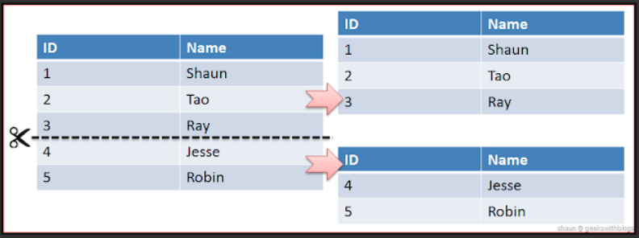
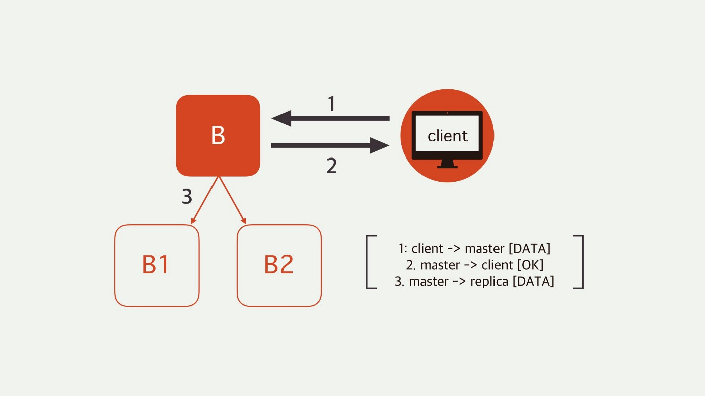

레디스 클러스터는 파티셔닝 기능을 제공하면서, 어느정도 가용성을 제공한다.

- 파티셔닝
  - DB 테이블을 파티션(partition)이라는 작은 단위로 나누어 관리하는 것
  - 데이터셋을 여러 노드로 자동 분할하는 기능
- 가용성
  - 일부 노드가 죽거나 통신할 수 없을때 작업할 수 있는 기능
  - 하지만 큰 장애상황에서는 클러스터의 작동이 중지된다

모든 레디스 클러스터 노드는 두개의 TCP 연결이 열려 있어야 함

1. 커맨드를 입력받는 서비스 포트 : 클라이언트에 서비스를 제공하는데 사용되는 일반적인 레디스 TCP 포트(기본적으로 6379)
   - 클라이언트와 통신하기 때문에 해당 클러스터에 접근해야 하는 모든 클라이언트와, 다른 모든 노드에 열려 있어야 한다.
2. 클러스터 버스 포트 :  클러스터 버스에 사용됨(기본적으로 16379)
   - 클러스터 버스
   - 클러스터 노드와 통신이 가능해야 한다.

레디스 클러스터는 모든 키가 개념적으로 해시 슬롯이라고 하는 다른 형태의 샤딩을 사용한다.

- 샤딩
  - 
  - Horizontal Partitioning이라고 볼 수 있음

## 특징

레디스 클러스터 마스터-슬레이브 모델

- B가 실패해도 클러스터가 B1을 새로운 마스터로 승격시켜 정상적으로 동작하게 한다
- B와 B1 동시에 실패하면 해당 클러스터를 사용할 수 없다

강력한 일관성을 보장하지는 않는다

- 비동기 복제를 사용하기 때문.

  

  1. 클라이언트가 마스터 B에 데이터 입력
  2. 마스터B가 클라이언트에게 OK라는 ACK를 보냄
  3. 마스터B는 리플리카 B1,B2에게 해당 내용을 복제함