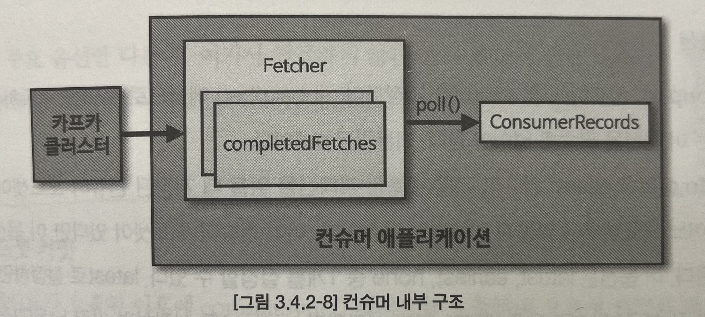

## Chapter1. 들어가며

- 서비스에서 발생하는 데이터를 데이터레이크로 모으려면 어떻게 해야할까?
	- 웹, 앱, 백엔드 서버, DB에서 발생하는 데이터를 직접 엔드 투 엔드로 넣을 수 있지만, 트래픽이 커지면 ETL(추출,변경,적재)을 묶은 데이터 파이프라인을 구축해야 한다
	- 데이터 파이프라인을 안정적이고 확정성 높게 운영하기 위한 좋은 방법 -> 아파치 카프카를 사용하는 것
- 아파치 카프카가 왜 데이터 파이프라인으로서 적합한가?
	- 높은 처리량 : 묶음 단위로 처리하는 배치로 빠르게 처리할 수 있음. 파티션 단위로 병렬로 처리할 수 있음
	- 확장성 : 데이터가 갑자기 피크치는 가변적인 환경에서도 안정적으로 확장 가능하도록 설계됨(클러스터의 브로커 수를 조정한다). 카프카 클러스터의 브로커를 스케일아웃/스케일인 하는 데에도 무중단 운영을 지원한다
	- 영속성 : 데이터를 메모리가 아닌 파일 시스템에 저장해서 종료되더라도 데이터가 남아있다. 페이지 캐시 메모리 영역을 사용해서 처리량이 높다
	- 고가용성 : 데이터를 여러 브로커중 하나에만 저장하는게 아니라 복제해서 하나의 브로커에 장애가 발생해도 지속적으로 데이터를 처리할 수 있다
	    - 브로커 3대 이상 추천. (min.insync.replicas=2, 최소 2개 브로커에 데이터가 복제됨을 보장)

## Chapter2. 카프카 빠르게 시작해보기

- 토픽 생성
```
$ bin/kafka-topics.sh \
	--create \
	--bootstrap-server my-kafka:9092 \ -> 브로커들의 ip, port
	--partition 3 \ -> 파티션 3개
	--replication-factor 1 \ -> 복제 개수. 1이면 복제x. 2면 1개의 복제본 사용. 최대 브로커 개수만큼 설정할 수 있음
	--config retention.ms=172800000 \ -> 데이터 유지 기간. 여기선 2일이 지나면 삭제됨
	--topic hello.kafka -> 토픽 이름
```
- 토픽 리스트 조회
```
$ bin/kafka-topics.sh --bootstrap-server my-kafka:9092 --list
```
- 토픽 상세 조회
```
$ bin/kafka-topics.sh --bootstrap-server my-kafka:9092 --describe --topic hello.kafka
```
  - 파티션 개수, 각 파티션별 정보 (위치한 브로커 번호 등) 조회 가능
- 파티션 개수 변경
```
$ bin/kafka-topics.sh --bootstrap-server my-kafka:9092 \
	--topic hello.kafka \
	--alter \
	--partition 4 -> 파티션 개수 4개로 변경. 파티션은 늘릴수만 있다.
```
- 데이터 유지 기간 변경
```
$ bin/kafka-configs.sh --bootstrap-server my-kafka:9092 \
	--entity-type topics \
	--entity-name hello.kafka \
	--alter --add-config retention.ms=86400000 -> 리텐션 기간 upsert
```
- 프로듀싱 해보기
```
$ bin/kafka-console-producer.sh --bootstrap-server my-kafka:9092 \
	--topic hello.kafka \
	--property "parse.key=true" \ -> 키와 함께 레코드 전송할 수 있게 됨
	--property "key.separator=:" -> 기본은 \t

// (기본 파티셔너인 경우) 키가 있으면 키의 해시값으로 파티션 할당. 없으면 레코드 배치 단위로 RR
>key1:no1
>key2:no2
>key3:no3
```
- 가장 처음부터 컨슘 해보기
```
$ bin/kafka-console-consumer.sh --bootstrap-server my-kafka:9092 \
	--topic hello.kafka \
	--from-beginning
```
- key와 함께 컨슘 해보기
```
$ bin/kafka-console-consumer.sh --bootstrap-server my-kafka:9092 \
	--topic hello.kafka \
	--property print.key=true \
	--property key.separator="-" \
	--group hello-group \ -> 컨슈머 그룹 지정
	--from-beginning

key1-no1
null-4
null-5
null-0
...
```
- 컨슈머 그룹 리스트 조회
```
$ bin/kafka-consumer-groups.sh --bootstrap-server my-kafka:9092 --list
```
- 컨슈머 그룹 상세 조회
```
$ bin/kafka-consumer-groups.sh --bootstrap-server my-kafka:9092 \
	--group hello-group \
	--describe

Consumer group 'hello-group' has no active members.

GROUP: 컨슈머 그룹 이름
TOPIC: 'hello-group' 컨슈머 그룹이 마지막으로 커밋한 토픽
PARTITION: 'hello-group' 컨슈머 그룹이 마지막으로 커밋한 파티션 번호
CURRENT-OFFSET: 가장 최신 오프셋
LOG-END-OFFSET: 어느 오프셋까지 커밋했는지. CURRENT-OFFSET<=LOG-END-OFFSET
LAG: 커밋한 오프셋과 가장 최신 오프셋 차이
CONSUMER-ID
HOST
CLIENT-ID
```
## Chapter3. 카프카 기본 개념 설명

- 카프카 브로커 / 클러스터 / 주키퍼
	- 카프카 브로커 : 카프카 클라이언트와 데이터를 주고받기 위해 사용하는 주체. 데이터를 분산저장하는 역할. 한 서버에는 한개의 브로커 프로세스가 실행된다
	- 카프카 클러스터 : 카프카 브로커의 묶음.
	- 카프카는 전달된 데이터를 파일시스템에 저장하지만 느리지 않다. 한번 읽은 파일의 내용은 페이지 캐시(OS에서 파일 입출력의 성능 향상을 위해 만들어놓은 메모리 영역)에 저장하기 때문.
	- 카프카의 고가용성
		- ![[토픽 파티션 복제.jpeg]]
		- 위 사진은 replication-factor=3, partition=1으로 토픽 생성한 경우
		    - 데이터 복제는 파티션 단위로 이루어짐. 
		    - 복제된 파티션중 1개는 리더(프로듀서, 컨슈머와 직접통신), 나머지 2개는 팔로워
		    - 브로커0에 장애가 발생한 경우 나머지 파티션 중 하나가 리더로 승격된다.
		    - 복제 개수만큼 저장 용량이 증가한다는 단점이 있지만 안전하다.
	- 다수 브로커 중 하나가 컨트롤러의 역할을 한다
		- 다른 브로커들의 상태 체크
		- 브로커가 클러스터에서 빠지는 경우 해당 브로커에 존재하는 리더 파티션을 재분배
	- 다수 브로커 중 하나가 코디네이터의 역할을 한다
		- 컨슈머 그룹의 상태를 체크, 파티션을 컨슈머와 매칭되도록 분배(리밸런스)하는 역할
	- 카프카는 다른 MQ와는 다르게 컨슘되더라도 데이터가 삭제되지 않는다
		- 브로커만이 삭제할 수 있고, 파일 단위(로그 세그먼트)로 이루어진다
		- 세그먼트 파일의 크기를 지정할 수 있다. 너무 작으면 부하가 발생할 수 있다
- 토픽과 파티션
	- 토픽
		- 데이터를 구분하기 위한 단위
		- 유지보수를 위해 이름을 의미있게 짓는것이 중요하다
	- 파티션
		- 병렬처리의 핵심. 컨슈머들의 병렬로 처리할 수 있도록 매칭된다
		- 큐와 비슷한 FIFO구조이지만, 컨슘돼도 삭제되지 않는다
- 레코드
	- 프로듀서가 보내는 데이터.
	- 타임스탬프, 메시지 키, 메시지 값, 오프셋, 헤더로 구성되어 있다
		- 타임스탬프
			- 프로듀서가 레코드 생성 시점의 유닉스타임을 설정한다
			- 프로듀서가 임의의 타임스탬프 값을 설정할수도 있다
		- 메시지 키
			- 메시지 값을 순서대로 처리하기 위해 사용한다
			- 동일 메시지 키면 동일 파티션으로 들어간다. 어느 파티션에 지정되는지는 알 수 없다
			- 파티션 개수가 변경되면 파티션 매칭이 달라져서 순서보장이 되지 않을 수 있다
		- 메시지 값
			- 실질적으로 처리할 데이터
			- 직렬화되어 브로커로 전송되기 때문에 컨슈머에서 역직렬화 해야한다
			- 직렬화, 역직렬화는 반드시 동일한 형태로 해야한다. (프로듀서가 StringSerializer, 컨슈머가 IntegerDeserializer 사용했다면 안됨)
		- 오프셋
			- 0이상의 숫자. 직접 지정할 순 없고 브로커에 저장될 때 이전 레코드 +1로 생성된다
			- 컨슈머가 데이터를 가져가서 어디까지 가져갔는지 명확히 지정할때 사용한다
		- 헤더
			- 추가 정보 메타데이터. 키/값 형태.
- 프로듀서 애플리케이션 내부구조
	- 
	- ProducerRecord의 optional 파라미터인 파티션, 타임스탬프, 메시지 키는 직접 지정이 가능하다
	- send()메서드가 호출되면 즉각 발송이 되는게 아니라 Accumulator에 버퍼로 쌓이고, 배치로 묶어서 전송된다 (처리량 향상)
	- partitioner에서 어느 토픽의 파티션으로 전송될 지 정해진다
	- partitioner의 기본값은 DefaultPartitioner이고, UniformStickyPartitioner, RoundRobinPartitioner 등이 있다
	- 파티션이 지정된 데이터는 어큐뮬레이터에 버퍼로 쌓인다
	- 센더 스레드는 어큐뮬레이터에 쌓인 배치 데이터를 가져가 브로커로 전송한다
	- 브로커로 전송 시 압축할 수 있다.
		- 장점: 네트워크 처리량 절약
		- 단점: 프로듀서에서 압축할때와 컨슈머에서 압축해제 시 CPU와 메모리 리소스를 사용한다
- 프로듀서 주요 옵션
	- 필수 옵션
		- bootstrap.servers : 프로듀서가 전송할 대상 카프카 클러스터에 속한 브로커의 호스트이름:포트를 1개 이상 작성.
		- key.serializer
		- value.serializer
	- 선택 옵션
		- acks
			- 전송 성공 여부 확인하는데 사용
			- 1 (기본값) : 리더 파티션에 데이터가 저장되면 전송 성공으로 판단
			- 0 : 전송한 즉시 성공으로 판단
			- -1 (또는 all) : 토픽의 min.insync.replicas 개수에 해당하는 리더 파티션과 팔로워 파티션에 데이터가 저장되면 성공으로 판단
		- buffer.memory
			- 배치로 모으기 위해 설정할 버퍼 메모리양.
			- 기본값은 33554432 (32MB)
		- retries
			- 브로커부터 에러를 받고 난 뒤 재전송 시도 횟수
			- 기본값은 2147483647
		- batch.size
			- 배치로 전송할 레코드 최대용량
			- 너무 작으면 네트워크 부담이 있고, 너무 크면 메모리 부담이 있다
			- 기본값은 16384
		- linger.ms
			- 배치를 전송하기 전까지 기다리는 최소 시간
			- 기본값 0
			- linger = 질질끌게 하다
		- partitioner.class
			- 파티셔너 클래스 지정
			- 기본값 DefaultPartitioner
		- enable.idempotence
			- 멱등성 프로듀서로 지정할건지 여부
			- 기본값 false
		- transactional.id
			- 프로듀서가 레코드를 전송할 때 레코드를 트랜잭션 단위로 묶을지 여부. 이 값을 설정하면 트랜잭션 프로듀서로 동작한다.
			- 프로듀서의 고유한 트랜잭션 아이디를 설정할 수 있다
			- 기본값 null
- 커스텀 파티셔너
```java
public class CustomPartitioner implements Partitioner {

	@Override
	public int partition(String topic, Object key, byte[] keyBytes, Object value, byte[] valueBytes, Cluster cluster) {
		// key = 메시지 키
		// value = 메시지 값
		// return 값은 파티션 번호
	}

	...
}
```

```java
Properties configs = new Properties();
...
configs.put(ProducerConfig.PARTITIONER_CLASS_CONFIG, CustomPartitioner.class);
KafkaProducer<String, String> producer = new KafkaProducer<>(configs);
```
- 브로커 정상 전송 여부를 확인하는 프로듀서
```java
ProducerRecord<String, String> record 
	= new ProducerRecord<>(TOPIC_NAME, messageValue);

RecordMetadata metadata 
	= producer.send(record) // send()는 Future<RecordMetadata>을 반환한다
		.get(); // 동기적으로 가져옴.
logger.info(metadata.toString()); // "test-2@1": test 토픽의 2번파티션, offset=1

** 비동기로 로깅하고 싶다면 Callback 인터페이스를 구현해서 send() 메서드에 함께 넘겨주면 된다. 하지만 데이터의 순서가 중요하다면 동기로 전송 결과를 받아야 한다. (비동기로 결과를 기다리는 동안, 앞에 보낸 데이터가 실패할 경우 재전송하는데, 이때 역전될 수 있기 때문)
```
- 간단한 컨슈머 어플리케이션
```java
public class SimpleConsumer {
	public static void main(String[] args) {
		Properties configs = new Properties();
		configs.put(BOOTSTRAP_SERVERS_CONFIG, "my-kafka:9092");
		// 컨슈머그룹 이름 선언. 동일한 역할을 하는 컨슈머를 묶어 관리한다.
		configs.put(GROUP_ID_CONFIG, "test_group");
		// 프로듀서와 동일한 직렬화/역직렬화 클래스를 지정해야 한다.
		configs.put(
			KEY_DESERIALIZER_CLASS_CONFIG, StringDeserializer.class.getName());
		configs.put(
			VALUE_DESERIALIZER_CLASS_CONFIG, StringDeserializer.class.getName());
		
		KafkaConsumer<String, String> consumer = new KafkaConsumer<>(configs);
		consumer.subscribe(Arrays.asList("topic-name"));
		
		while(true) {
			// 1초 = 데이터를 가져올때 컨슈머 버퍼에 데이터를 기다리기 위한 타임아웃 간격 
			ConsumerRecords<String, String> records 
				= consumer.poll(Duration.ofSeconds(1));
			for (ConsumerRecord<String, String> record : records) {
				log.info("{}", record);
			}
		}
	}
}
```
- 컨슈머 그룹
	- 컨슈머를 각 컨슈머 그룹으로부터 격리된 환경에서 안전하게 운영할 수 있도록 도와준다
	- 컨슈머 그룹의 컨슈머 개수는 토픽의 파티션보다 같거나 작아야 한다
		- 파티션 3개, 컨슈머 그룹 내 컨슈머 2개 = 컨슈머0이 파티션 1개 담당, 컨슈머1이 파티션 2개 담당
		- 파티션 3개, 컨슈머 그룹 내 컨슈머 3개 = 각 컨슈머가 파티션 1개씩 담당 -> 이상적
		- 파티션 3개, 컨슈머 그룹 내 컨슈머 4개 = 컨슈머 하나가 놀게된다
- 리밸런싱
	- 파티션 - 컨슈머 매핑관계가 변경되는것
	- 컨슈머가 추가 / 제외될때 발생한다
	- 리밸런싱은 언제든지 발생할 수 있으므로 리밸런싱 대응코드를 작성해야 한다
	- 리밸런싱은 자주 일어나면 안된다
		- 왜? 리밸런싱이 발생할때 재할당하는 과정에서 그룹 내 컨슈머들이 토픽의 데이터를 읽을 수 없기 때문
	- 리밸런싱 직전/이후 listener로 추가 기능을 구현할 수 있다
```java
public class RebalanceListener implements ConsumerRebalanceListener {

	@Override
	public void onPartitionsRevoked(Collection<TopicPartition> partitions) {
		log.warn("리밸런싱 직전.");
		consumer.commitSync(currentOffsets); // 중복처리 하지 않기 위해 커밋한다.
	}
	
	@Override
	public void onPartitionsAssigned(Collection<TopicPartition> partitions) {
		log.warn("리밸런싱 완료. 파티션 할당 완료.");
	}
}
```
- 커밋
	- 데이터를 어디까지 가져갔는지 `__consumer_offsets` 토픽에 저장한다
		- 어느 토픽의 파티션을 어떤 컨슈머 그룹이 몇번째까지 가져갔는지 저장한다
	- 자동 커밋
		- `enable.auto.commit=true`
		- `auto.commit.interval.ms` 은 poll() 메서드가 이 값에 설정된 값 이상이 지났을 때 그 시점까지 읽은 레코드의 오프셋을 커밋한다
		- poll() 이후 리밸런싱/컨슈머 강제종료 발생 시 데이터 중복 또는 유실이 발생할 수 있다
	- 수동 커밋
		- poll() 호출 이후에 commitSync() 또는 commitAsync()를 호출하면 된다
			- commitSync()
				- 커밋이 정상적으로 처리됐는지 기다린다.
				- 느려질 수 있다
			- commitAsync()
				- 커밋이 정상적으로 처리됐는지 기다리지 않는다.
				- 커밋 요청이 실패했을 경우 데이터의 순서를 보장하지 않고, 중복 처리가 발생할 수 있다
- 컨슈머 내부 구조
	- 
	- poll() 시점에 클러스터에서 데이터를 가져오지 않는다
	- poll() 이전부터 Fetcher가 미리 내부 큐로 가져와서 갖고 있다가, poll() 호출될 때 제공한다
- 컨슈머 주요 옵션
	- 필수 옵션
		- bootstrap.servers : 프로듀서가 전송할 대상 카프카 클러스터에 속한 브로커의 호스트이름:포트를 1개 이상 작성.
		- key.serializer
		- value.serializer
	- 선택 옵션
		- group.id
			- 컨슈머 그룹id
			- 기본값 null
		- auto.offset.reset
			- 저장된 오프셋이 없는 경우 어느 오프셋부터 읽어야 하는가?
			- 오프셋이 있다면 무시된다
			- latest(기본값) : 가장 높은(최근) 오프셋부터 읽는다
			- earliest : 나장 낮은(오래전) 오프셋부터 읽는다
			- none : 컨슈머 그룹이 커밋한 기록이 없으면 오류, 있으면 기록 이후부터 읽는다
		- enable.auto.commit
			- 자동커밋 / 수동커밋 설정
			- 기본값 true (자동커밋)
		- auto.commit.interval.ms
			- enable.auto.commit=true 일 경우 오프셋 커밋 간 간격
			- 기본값 5000(5초)
		- max.poll.records
			- poll()을 통해 반환되는 레코드 개수
			- 기본값 500
		- session.timeout.ms
			- 컨슈머가 브로커와 연결이 끊기는 최대 시간
			- 이 시간 내 heartbeat를 보내지 않으면 브로커는 컨슈머에 이슈가 발생했다고 판단하고 리밸런싱을 시작한다
			- 보통 heartbeat.interval.ms * 3 으로 설정한다
			- 기본값 10000(10초)
		- heartbeat.interval.ms
			- heartbeat를 전송하는 시간 간격
			- 기본값 3000(3초)
		- max.poll.interval.ms
			- poll()을 호출하는 간격의 최대 시간
			- poll()간의 간격이 이 값보다 길다면 브로커는 리밸런싱을 시작한다
			- 기본값 300000(5분)
		- isolation.level
			- 트랜잭션 프로듀서가 레코드를 트랜잭션 단위로 보낼 경우 사용
			- read_committed : 커밋이 완료된 레코드만 읽는다
			- read_uncommitted : 커밋 여부와 관계없이 파티션에 있는 모든 레코드를 읽는다
- 컨슈머의 안전한 종료
	- 컨슈머가 정상적으로 종료되지 않는다면?
		- 세션 타임아웃이 발생할때까지 컨슈머 그룹에 남게 됨 -> 파티션의 데이터가 소모되지 못함 -> 컨슈머 랙이 늘어남 -> 데이터 처리가 지연됨
```java
public class Application {
	public static void main(String[] args) {
		
		Consumer consumer = new Consumer(..);
		
		// 사용자 혹은 OS로부터 종료 요청을 받으면 ShutdownThread가 실행된다
		// kill -TERM {pid} 을 호출하면 실행된다
		Runtime.getRuntime().addShutdownHook(new ShutdownThread(consumer));
		
		consumer.consume();
	}
}

public class ShutdownThread extends Thread {

	private final Consumer consumer;

	public void run() {
		log.info("컨슈머 종료");
		consumer.wakeup();
	}
}

public class Consumer {

	private final KafkaConsumer<String, String> consumer;
	
	public void consume() {
		try {
			while(true) {
				ConsumerRecords<String, String> records 
					= consumer.poll(Duration.ofSeconds(1));
				for (ConsumerRecord<String, String> record : records) {
					log.info("{}", record);
				}
			}
		} catch (WakeupException e) { // wakeup()가 실행된 후 poll()이 호출되면 발생
			log.warn("wakeup consumer");
			// 리소스 종료 처리
		} finally {
			consumer.close(); // 카프카 클러스터에 컨슈머가 안전하게 종료되었음을 명시적으로 알려줌
		}
	}

	public void wakeup() {
		consumer.wakeup(); // 컨슈머 안전하게 종료
	}
}
```
- 카프카 스트림즈
	- 토픽에 적재된 데이터를 변환해서 다른 토픽에 적재하는 라이브러리
	- 컨슘 -> 변환 -> 프로듀싱 하는 어플리케이션을 따로 만들지 않아도 된다
	- ... 상세 내용은 책 참고
- 카프카 커넥트
	- 카프카를 사용해서 외부 시스템(MySQL, S3, MongoDB 등등)과 데이터를 주고받기 쉽게 하기 위한 애플리케이션
	- 직접 만들수도 있지만 템플릿으로 만들어놓은 커넥터를 실행함으로써 반복작업을 줄일 수 있다
	- ... 상세 내용은 책 참고
- 카프카 미러메이커2
	- 서로 다른 두개의 카프카 클러스터 간 토픽을 복제하는 애플리케이션
	- 사용 예
		- 스탠바이 클러스터를 준비해놓고, 미러메이커를 통해 모든 토픽을 복사해놓고, 액티브 클러스터에서 장애가 발생했을때 빠르게 전환한다
		- 글로벌 서비스에서 각 국 전용 클러스터가 있다고 할때, 나라간 커뮤니케이션 데이터를 미러케이커로 복제하여 서로 갖도록 한다
		- 팀들이 각각 클러스터를 따로 사용하고 있는데, 모든 데이터를 모아 하나의 데이터 레이크로 사용하고 싶을때 미러메이커로 복사한다
	- ... 상세 내용은 책 참고

## Chapter4. 카프카 상세 개념 설명
- 토픽과 파티션
	- 적정 파티션 개수를 정하는데에 고려할 사항
		1. 데이터 처리량은 어느정도 되는가?
			- 프로듀서 전송 데이터량 < 컨슈머 데이터 처리량 * 파티션 개수
			- 프로듀서가 초당 1000 레코드를 보내고, 컨슈머가 초당 100 레코드를 처리할 수 있다면 파티션은 최소 10개 필요하다
			- 컨슈머 처리량 아는법? 상용 환경에서 더미 데이터로 테스트해본다 (상용 환경에서 테스트하는 걸 추천)
		2. 메시지 키를 사용하는가?
			- 메시지 키를 사용하고 있다면, 순서를 보장받길 기대하고 있다는 뜻
			- 어떤 파티셔너를 사용하는지에 따라 파티션이 추가되는 순간 파티션 매칭이 달라져서 순서가 보장되지 않을 수 있다
			- 메시지 키를 사용하고 있다면 파티션의 변화를 최소화해야 하고, 늘려야만 한다면 기존에 사용하던 메시지 키의 매칭을 그대로 가져가기 위한 커스텀 파티셔너를 구현해야 한다
			- 메시지 키를 사용한다면 처음부터 파티션 개수를 넉넉히 잡고 생성하는 것을 추천한다
			- 메시지 키를 사용하지 않는다면 처음부터 넉넉히 잡지 않아도 되고, 나중에 늘려도 된다
		3. 브로커와 컨슈머의 영향도
			- OS는 프로세스당 열 수 있는 파일 수를 제한하고 있다
			- 그러므로 파티션을 늘려야 한다면 브로커당 파티션 개수를 확인하고, 너무 많다면 브로커 수를 늘리는 방안도 생각해야 한다
	- 토픽 정리 정책 (cleanup.policy)
		- 일정 시간마다, 일정 용량 이상이 될때마다 삭제할 수 있다 (delete)
		- 메시지 키별로 오래된 데이터를 삭제할 수 있다 (compact)
	- ISR (in-sync-replicas)
		- ISR = 리더 파티션과 팔로워 파티션이 모두 싱크가 된 상태
		- 싱크가 되는 데에 시간이 걸린다.
		- ISR로 묶인다는 것은 팔로워 파티션이 리더로 선출될 자격을 갖는다는 뜻
		- replica.lag.time.max.ms : 리더 파티션이 팔로워를 감시하는 주기 (데이터를 가져갔는지). 이 시간보다 긴 시간동안 가져가지 않는다면 ISR 그룹에서 제외한다
		- unclean.leader.election.enable
			- true : ISR이 아닌 팔로워 파티션이 리더로 선출될 수 있다. 서비스가 중단되진 않지만 데이터 유실 가능성이 있다
			- false : ISR이 아닌 팔로워 파티션을 리더로 선출하지 않고, 리더 파티션이 존재하는 브로커가 다시 시작되길 기다린다. (토픽을 사용하는 서비스가 몇분, 몇시간 중단된다) 데이터의 유실은 일어나지 않는다
- 카프카 프로듀서
	- acks
		- 전송 성공 여부 확인하는데 사용한다
		- 신뢰성과 성능에 따라 다르게 설정해야 한다
		- acks=0
			- 전송한 즉시 성공으로 판단하고, 확인하지 않는다. 가장 빠르다. 데이터가 유실될 수 있다
			- retries 옵션값(전송에 실패했을때의 재시도 수)은 무시된다
		- acks=1 (기본값)
			- 리더 파티션에 데이터가 저장되면 전송 성공으로 판단한다
			- 데이터 유실 가능성이 있다.
				- "리더에 적재 -> (팔로워에 동기화 되지 않음) -> 리더가 있는 브로커에 장애 발생" 인 경우
		- acks=-1 (또는 all)
			- 보낸 데이터가 리더, 팔로워 모두에 적재되었는지 확인한다
			- 토픽의 min.insync.replicas 에 따라 데이터의 안정성이 다르다
			- min.insync.replicas를 정하는 기준
				- min.insync.replicas=1 : 1개 이상의 파티션(리더)을 확인한다. acks=1과 동일하다
				- min.insync.replicas=2 : 2개 이상의 파티션(리더1, 팔로워1)을 확인한다. 브로커 2개가 동시에 중단되는 일은 드물기 때문에 데이터가 유실되지 않는다고 볼 수 있다.
				- 복제 개수(replication-factor)와 동일한 숫자면 안된다
					- 여러 브로커 중 하나라도 중단되면, NotEnoughReplicasException, NotEnoughReplicasAfterAppendException이 발생한다
				- 브로커 개수와 동일한 숫자면 안된다
					- 여러 브로커 중 하나라도 중단되면, 프로듀서가 데이터를 추가할 수 없다
					- "토픽별 min.insync.replicas < 브로커 개수" 를 만족해야 한다
		- 그래서 추천하는 설정값은?
			- 브로커 3대, replication-factor=3, acks=all, min.insync.replicas=2
	- 멱등성 프로듀서
		- 동일한 데이터를 여러번 전송하더라도 클러스터에 단 한번만 저장된다 (exactly once)
		- 네트워크 장애 등의 이유로 프로듀서가 acks 응답을 받지 못해 다시 보내더라도 한번만 저장된다
		- 멱등성 프로듀서는 일반 프로듀서와 다르게 프로듀서 PID(Producer unique ID), 시퀀스 넘버를 추가로 전달하고, 브로커는 두개를 확인해서 하나만 저장한다.
		- 멱등성 프로듀서는 동일한 세션에서만 정확히 한번 전달을 보장한다. (애플리케이션을 재시작하면 PID가 달라진다)
		- enable.idempotence=true 으로 설정하면, 일부 옵션이 강제로 설정된다
			- retries = Integer.MAX_VALUE, acks=all 으로 설정된다
		- 시퀀스 넘버는 0부터 1씩 더한 값이 전달된다. 숫자를 건너뛰게 되면 OutOfOrderSequenceException이 발생하고, 프로듀서는 해당 예외 시 대응방안을 고려해야 한다
	- 트랜잭션 프로듀서
		- 다수의 파티션에 데이터를 저장할 경우 모든 데이터에 대해 원자성을 만족시키기 위해 사용된다
		- 트랜잭션 프로듀서는 트랜잭션의 시작과 끝을 표현하기 위해 트랜잭션 레코드를 한개 더 보낸다
		- 트랜잭션 컨슈머는 트랜잭션 레코드가 있을때만 데이터를 가져간다
		- 사용하려면..
			- 프로듀서 설정 : enable.idempotence=true, transactional.id=2712e859 (임의 string)
			- 컨슈머 설정 : isolation.level=read_committed
- 카프카 컨슈머
	- 멀티 스레드 컨슈머
		- 하나의 프로세스 내 N개의 스레드 각각이 파티션에 대응되는 방식
		- 멀티 스레드 컨슈머를 사용할 때 고려할 부분
			- 하나의 스레드에서 OOM이 발생하면 프로세스 자체가 종료될 수 있다
			- 각 스레드 간 영향이 미치지 않도록 스레드 세이프하게 코드를 작성해야 한다
		- 전략은 크게 2가지로 나뉜다
			1. 컨슈머 멀티 워커 스레드 전략
				- 컨슈머 스레드는 1개, 워커 스레드는 N개
				- poll() 결과 나온 N개의 레코드를 각 스레드에서 병렬로 실행
				- 주의사항
					- 리밸런싱, 컨슈머 장애 시 유실이 발생할 수 있다 (데이터 처리가 안끝났어도 커밋하기 때문)
					- 레코드 순서가 역전될 수 있다 (각 스레드가 순서대로 실행되지 않기 때문)
			2. 컨슈머 멀티 스레드 전략
				- 파티션 개수만큼 컨슈머 스레드를 운영하는 방식
				- 파티션 개수만큼 컨슈머 스레드를 따로 만들고, 각 스레드에서 각각 poll()을 호출한다
	- 컨슈머 랙
		- 컨슈머 랙 : 최신 오프셋(LOG-END-OFFSET)과 컨슈머 오프셋(CURRENT-OFFSET) 간의 차이
		- 컨슈머 랙은 컨슈머 그룹, 토픽, 파티션 별로 생성된다
		- 컨슈머 랙이 발생하는 경우
			- 프로듀서가 전송하는 레코드 양이 평소보다 많을때
			- 컨슈머의 장애 상황
		- 일시적으로 파티션, 컨슈머 개수를 늘려서 병렬처리량을 늘려서 해소할 수 있다
		- 컨슈머 랙을 확인하는 방법
			1. `kafka-consumer-groups` 명령어
				- 
					```shell
					$ bin/ kafka-consumer-groups.sh 
						--bootstrap-server my-kafka: 9092 \
						--group my-group --describe
					
					TOPIC PARTITION CURRENT-OFFSET LOG-END-OFFSET LAG CONSUMER-ID HOST CLIENT-ID
					test-topic 0 2 5 3 consumer-01 /127.0.0.1 consumer-1
					test-topic 1 2 2 0 consumer-02 /127.0.0.1 consumer-2
					test-topic 2 2 3 1 consumer-03 /127.0.0.1 consumer-3
					```
				- 파티션이 3개니까 3개 row 가 응답되고, 각 파티션별로 랙이 3, 0, 1 이다
				- 지속적으로 모니터링하기엔 부족하다. 주로 테스트용 카프카에 주로 사용한다.
			2. metrics() 메서드
				- `KafkaConsumer#metrics` : `Map<MetricName, Metric>`을 반환한다
				- 문제점
					- 컨슈머가 정상 작동할때만 확인할 수 있다
					- 모든 컨슈머 애플리케이션에 모니터링 코드를 중복으로 작성해야 한다
					- 카프카 서드파티 애플리케이션의 컨슈머 랙 모니터링이 불가능하다
			3. 외부 모니터링 툴
				- 가장 최선의 방법이다
				- 데이터독, 컨플루언트 컨트롤 센터, Burrow 등..
				- 모니터링 아키텍쳐 예시
					- 버로우 : 여러개의 클러스터의 컨슈머 랙을조회할 수 있는 REST API를 제공한다
					- 텔레그래프 : 주기적으로 버로우를 조회하고, 엘라스틱서치에 전달한다
					- 엘라스틱서치 : 컨슈머 랙 정보를 저장한다
					- 그라파나 : 엘라스틱서치의 정보를 시각화하고 이슈시 슬랙 알람을 보낸다
	- 컨슈머 배포 프로세스
		- 중단 배포
			- 한정된 서버 자원을 운영한다면 적합하다
			- 배포되고 있을땐 컨슈머 랙이 늘어난다
			- 새로운 로직이 적용된 신규 애플리케이션의 실행 전후를 명확하게 특정 오프셋 지점으로 나눌 수 있어서, 롤백할 때 유용하다
		- 무중단 배포
			- 블루/그린 배포
				- 구/신 버전 애플리케이션을 동시에 띄워놓고 트래픽을 전환하는 방식
				- 파티션 개수 = 컨슈머 개수인 경우 유용하다
				- 신버전 애플리케이션의 컨슈머들이 파티션을 할당받지 못하고 idle 상태로 기다릴 수 있기 때문
			- 롤링 배포
				- 서버 수를 유지하고 하나씩 전환하는 방식
				- 파티션 개수 >= 인스턴스 개수인 경우여야 한다
				- 파티션 개수가 많을수록 리밸런스가 많이 발생하므로 파티션 개수가 적을때 효과적이다
			- 카나리 배포
- 스프링 카프카
	- 스프링 카프카 프로듀서
		- `KafkaTemplate` 를 사용해서 데이터를 전송한다
		- `KafkaTemplate` 생성하는 법
			1. 기본 카프카 템플릿 사용
				- application.yaml에 옵션을 설정하고 빈 주입받아 사용
			2. 프로듀서 팩토리 사용
				- 
				  ```java
				  @Configuration
				  public class KafkaTemplateConfig {
					  @Bean
					  public KafkaTemplate<String, String> customKafkaTemplate() {
					  Map<String, Object> props = Maps.of(
						  // props에 옵션 추가
					  );
					  ProducerFactory<String, String> pf = new DefaultKafkaProducerFactory<>(props);
					  return new KafkaTemplate<>(pf);
					  }
				  }
					```
		- `KafkaTemplate` 사용
			- 
			  ```java
				ListenableFuture<SendResult<String, String>> future 
					  = kafkaTemplate.send("topic-name", "record");
				
				future.addCallback(new KafkaSendCallback<String, String>() {
					@Override
					public void onSuccess(SendResult<String, String> result) {
						...
					}
					@Override
					public void onFailure(KafkaProducerException ex) {
						...
					}
				})	  
				```
	- 스프링 카프카 컨슈머
		- 리스너 종류
			- 레코드 리스너 (단 1개의 레코드 처리, 기본값) `type=RECORD`
				- MessageListener : 자동커밋 or 컨슈머 컨테이너의 AckMode를 사용하는 경우
				- AcknowledgingMessageListener : 수동커밋을 사용하는 경우
				- ConsumerAwareMessageListener : 컨슈머 객체를 활용하고 싶은 경우
				- AcknowledgingConsumerAwareMessageListener : 수동커밋 + 컨슈머 객체를 활용하고 싶은 경우
			- 배치 리스너 (`poll()`처럼 여러개 레코드 처리) `type=BATCH`
				- BatchMessageListener : 자동커밋 or 컨슈머 컨테이너의 AckMode를 사용하는 경우
				- BatchAcknowledgingMessageListener : 수동커밋을 사용하는 경우
				- BatchConsumerAwareMessageListener : 컨슈머 객체를 활용하고 싶은 경우
				- BatchAcknowledgingConsumerAwareMessageListener : 수동커밋 + 컨슈머 객체를 활용하고 싶은 경우
		- AckMode
			- 스프링 카프카에선 커밋을 AckMode라고 부른다.
			- 프로듀서에서 사용하는 acks 옵션과 동일한 어원을 사용할 뿐 관계 없다.
			- 카프카 컨슈머에서 커밋을 직접 구현할때는 오토, 동기, 비동기커밋 3가지로 나뉘지만 스프링에선 7가지로 세분화했다
			- 종류
				- RECORD : 레코드 단위로 프로세싱 후 커밋
				- BATCH(기본값) : poll()로 가져온 레코드 모두 처리된 후 커밋
				- TIME : 특정 시간 이후 커밋. AckTime 옵션을 설정해야 한다.
				- COUNT : 특정 개수 이후 커밋. AckCount 옵션을 설정해야 한다.
				- COUNT_TIME : COUNT or TIME 조건이면 커밋
				- MANUAL
					- Acknowledgement.acknowledge() 메서드가 호출되면 다름번 poll()때 커밋한다
					- 매번 acknowledge()를 호출하면 BATCH와 동일하게 동작한다
					- `...AcknowledgingMessageListener` 를 사용해야 한다
				- MANUAL_IMMEDIATE
					- Acknowledgement.acknowledge() 메서드 호출 즉시 커밋한다
					- 매번 acknowledge()를 호출하면 BATCH와 동일하게 동작한다
					- `...AcknowledgingMessageListener` 를 사용해야 한다
		- 레코드 리스너(자동커밋) 사용하기
			- yml 파일에 `spring.kafka.listener.type: RECORD`로 설정한다
			- `@KafkaListener`를 붙인 메서드에서 파라미터로 ConsumerRecord 또는 메시지 값을 받는다
			- 리스너 별로 토픽이름, 그룹id, 컨슈머 옵션값, 쓰레드개수, 특정파티션/특정오프셋 등을 지정할 수 있다
		- 배치 리스너(자동커밋) 사용하기
			- yml 파일에 `spring.kafka.listener.type: BATCH`로 설정한다
			- `@KafkaListener`를 붙인 메서드에서 파라미터로 ConsumerRecords 또는 메시지 값 리스트를 받는다
			- 리스너 별로 토픽이름, 그룹id, 컨슈머 옵션값, 쓰레드개수 등을 지정할 수 있다
		- 배치 리스너(수동커밋) 사용하기
			- yml 파일에 `spring.kafka.listener.type: BATCH`, `spring.kafka.listener.ack-mode: MANUAL_IMMEDIATE`로 설정한다
			- 파라미터로 받아야 하는 것 
				- ConsumerRecords
				- Acknowledgement or Comsumer
					- ack.acknowledge()로 커밋한다
					- consumer의 commitSync(), commitAsync()를 사용할수도 있다
		- 커스텀 리스너 사용하기
			- 커밋 전 리밸런싱이 발생할때, 리밸런싱 완료 등등의 이벤트를 수신할 수 있는 리스너 등록 가능
			- 빈으로 만든 후 `@KafkaListener(containerFactory="...")` 으로 연결한다
## Chapter5. 카프카 실전 프로젝트

## Chapter6. 클라우드 카프카 서비스