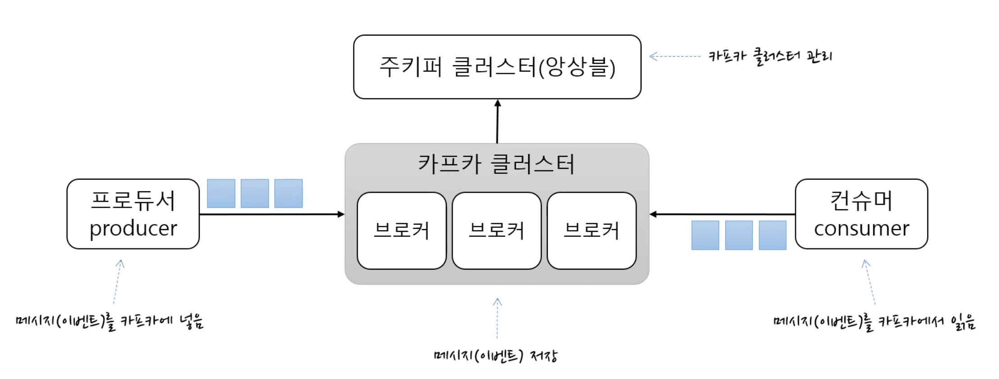
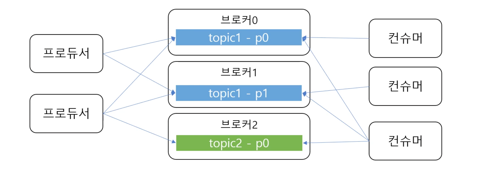
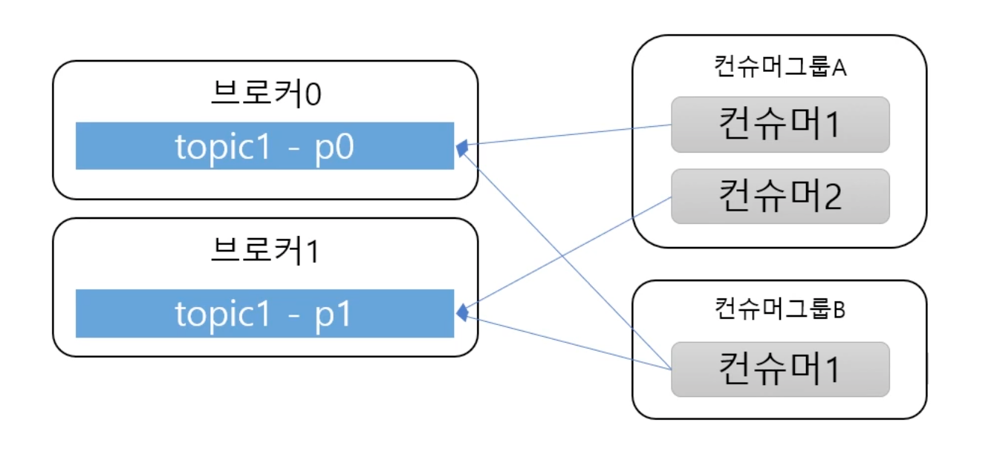
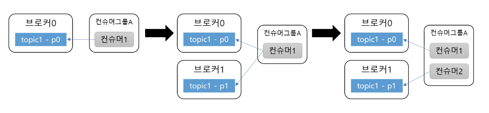
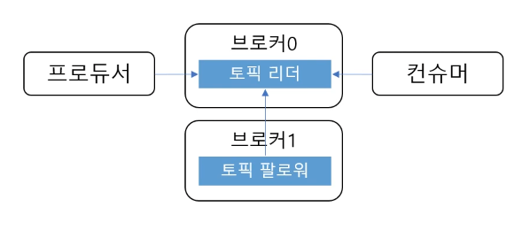
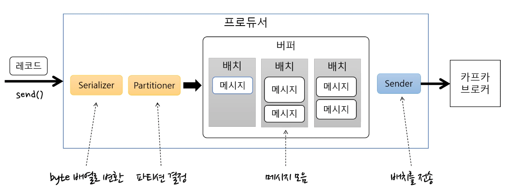
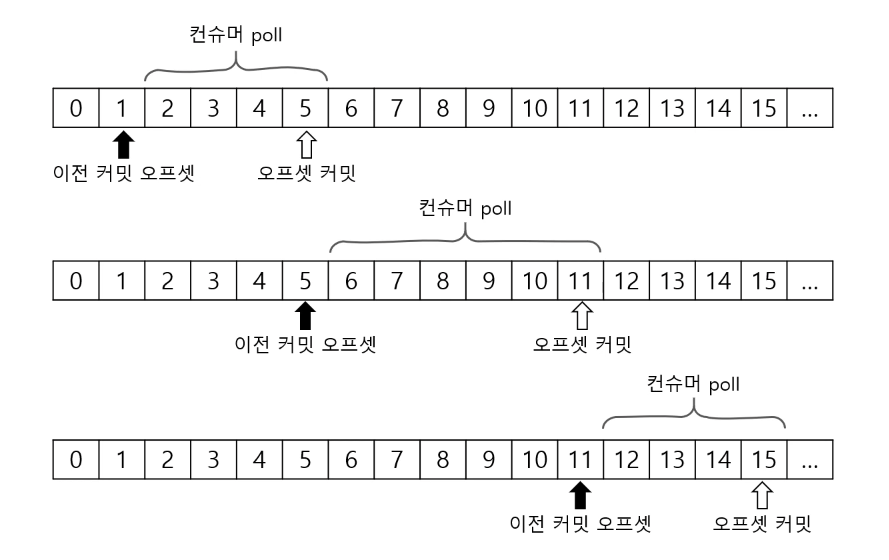

자료

- https://youtu.be/0Ssx7jJJADI
- https://youtu.be/geMtm17ofPY
- https://youtu.be/xqrIDHbGjOY

# 카프카 개요

## 카프카?

- 스트리밍을 처리하기 위한 플랫폼(분산 이벤트 기반)
- 고성능

## 카프카 기본 구조



- 카프카 클러스터
  - 메시지 저장소
  - 여러개의 브로커로 구성됨
  - 브로커(각각의 서버라고 보면 됨)들이 메시지를 나눠서 저장하고, 장애나면 대체도 하고 등등 많이함
- 주키퍼 클러스터
  - 카프카 클러스터를 관리하기 위한 용도
  - 주키퍼 속에 카프카 클러스터와 관련된 정보가 기록되고 관리됨
- 프로듀서
  - 카프카 클러스터에 메시지를 보내는 것
- 컨슈머
  - 메시지를 카프카에서 읽어옴

## 토픽과 파티션

- 토픽
  - 메시지를 저장하는 단위
  - 메시지를 구분하기 위한 용도
  - 폴더, 메일함과 유사함
  - 1개의 토픽은 1개 이상의 파티션으로 구성
- 파티션
  - 메시지를 저장하는 물리적인 파일



프로듀서와 컨슈머는 토픽을 기준으로 메시지를 주고받음

## 파티션과 오프셋, 메시지 순서

- 오프셋 : 파티션 내에서 각 메시지 저장 위치
- 프로듀서가 넣은 메시지는 파티션의 맨 뒤에 추가
- 컨슈머는 오프셋 기준으로 메시지를 순서대로 읽음
- 메시지는 삭제되지 않고 설정에 따라 일정 시간이 지난 후 삭제됨
- 한 파티션 내에서만 메시지 순서 보장

## 한 토픽에 여러 파티션이 있다는데, 프로듀서는 어떤 파티션에 메시지를 저장하냐?

- 라운드 로빈으로 저장하거나, 키를 이용해서 파티션을 선택함
- 프로듀서가 카프카에 메시지를 전송할때, 토픽 뿐만 아니라 키도 지정할 수 있음
- 같은 키 -> 같은 파티션 -> 순서 보장

## 여러 파티션과 컨슈머



- 컨슈머는 컨슈머 그룹에 속함. 컨슈머를 브로커에 연결할때 그룹을 지정해야 함

- 1 파티션에는 컨슈머그룹의 1 컨슈머에만 연결 가능. 컨슈머그룹 내의 컨슈머들과 연결되는 파티션은 겹치면 안됨

  예시

  - 컨슈머그룹A 안의 컨슈머1, 2는 p0를 공유할 수 없다
  - 컨슈머그룹A 안의 컨슈머1, 2는 p1를 공유할 수 없다
  - 컨슈머1, 2는 p0, p1을 나눠 가져야함

## 성능

- 파티션 파일은 OS 페이지 캐시 사용
  - 파일 IO가 메모리에서 처리되기 때문에 빠름
  - 서버에서 페이지캐시를 카프카만 사용해야 성능에 유리
- Zero Copy
  - 디스크에서 데이터를 읽어다가 네트워크로 보내는 속도가 빨라짐
- 컨슈머 추적을 위해 브로커가 하는 일이 비교적 단순
  - 브로커는 컨슈머와 파티션 간 매핑을 관리함
  - 메시지 필터, 메시지 재전송과 같은 일은 프로듀서, 컨슈머가 직접 해야하고 브로커가 하지 않음
- 묶어서 보내고, 묶어서 받기(batch) -> 낱개 처리보다 처리량 증가
  - 프로듀서 : 일정 크기만큼 메시지를 모아서 전송 가능
  - 컨슈머 : 최소 크기만큼 메시지를 모아서 조회 가능
- 처리량 증대(확장)가 쉬움
  - 1개 장비의 용량 한계 -> 브로커 추가, 파티션 추가
  - 컨슈머가 느림 -> 컨슈머 추가 (+ 파티션 추가)
  - 

## 리플리카 - 복제

장애가 났을때 대체하기 위해서 리플리카라는 것을 사용함

- 리플리카 : 파티션의 복제본
  - 복제수(replication factor) 만큼 파티션의 복제본이 각 브로커에 생김
  - 토픽을 생성할때 복제수를 2로 지정하면 동일한 데이터를 갖고 있는 파티션이 서로 다른 브로커에 2개가 생김
- 여러 파티션들은 리더와 팔로워로 구성
  - 프로듀서와 컨슈머는 리더를 통해서만 메시지 처리
  - 팔로워는 리더로부터 복제
- 장애 대응
  - 리더가 속한 브로커 장애 시 다른 팔로워가 리더가 됨
  - 

# 프로듀서

## 프로듀서

프로듀서가 사용할 속성(설정 정보) 지정 : 브로커 목록, key나 value를 직렬화할 시리얼라이저, ack, batch size 등등

메시지를 보낼 때 토픽이름 + key(생략가능) + value로 메시지를 보낼 수 있음

## 프로듀서 기본 흐름



- send()로 레코드를 전송하면, Serializer를 이용해서 바이트 배열로 변환
- Partitioner가 어느 토픽의 파티션으로 보낼지 결정
- 변환된 메시지(바이트 배열)를 배치로 묶어서 버퍼에 저장
- Sender가 배치를 차례대로 가져와서 카프카 브로커로 전송함
  - Sender는 별도 쓰레드로 동작 (배치에 쌓는것과 배치를 전송하는 건 별로 쓰레드기 때문에 동시에 일어난다)
  - 배치가 찼는지 여부에 상관 없이 차례대로 브로커에 전송
  - -> 그래서 배치와 Sender에 대한 설정이 처리량에 영향을 미침

## 처리량 관련 주요 속성

- batch.size : 배치의 최대 크기. 배치가 다 차면 바로 전송
  - 그래서 너무 작으면 한번에 보낼 수 있는 메시지의 개수가 줄고 전송 회수가 많아짐 -> 처리량이 떨어짐
- linger.ms : Sender가 배치를 전송하는 대기 시간(기본값 0)
  - 0이면 배치를 바로 전송
  - 0이 아니면 그 시간만큼 기다렸다가 배치를 전송 -> 한번에 많이 보낼 수 있는 여지가 생김 -> 처리량 높아짐

## 전송결과

- 기본적으로 전송 결과를 확인 안함 -> 전송 실패를 알 수 없음

- 전송 결과를 알아야 할 때 

  - Future사용

    - ```java
      Future<RecodeMetadata> f = producer.send(new ProducerRecord<>("topic", "value"));
      try {
        RecordMetadata meta = f.get(); //블로킹
      }
      catch (ExecutionException e) {
        log.error(..);
      }
      ```

    - 블로킹 때문에 배치 효과 떨어짐 -> 처리량 저하

    - 처리량이 낮아도 되는 경우에 사용

  - Callback 사용

    - ```java
      producer.send(new ProducerRecord<>("topic", "value"),
        new Callback() {
          @Override
          public void onCompletion(RecordMetadata metadata, Exception e) {
            //Exception을 받는다면, 실패한 것
          }
      }
      ```

    - 블로킹하는 방식이 아니기 때문에 배치가 쌓이지 않는다 하는 단점이 없음 -> 처리량 저하 없음

## 전송보장과 ack

프로듀서는 전송을 보장하기 위해 ack라는 설정을 사용함

- ack = 0

  - 서버 응답을 기다리지 않음.
  - 전송 보장 x
  - 처리량은 많이 높아지지만 메시지가 유실되더라도 알 수 없음

- ack = 1

  - 파티션의 리더에 저장되면 응답 받음

  - 리더 장애시 메시지 유실 가능

    예를 들어 리더에 저장돼서 성공 응답(팔로워에는 아직 복제 안됨) -> 리더 장애 -> 팔로워 중 하나가 리더가 됨 -> 메시지 유실

- ack = all 또는 -1

  - 모든 리플리카에 저장 됐을때 응답 받음(min.insync.replicas 브로커 설정에 따라 달라짐)

## ack + min.insync.replicas

- min.insync.replicas (브로커 옵션)
  - 프로듀서 ack 옵션이 all일때 저장에 성공했다고 응답할 수 있는 동기화된 리플리카 최소 개수
  - 예1 : 리플리카 개수 3, ack = all, min.insync.replicas = 2일때 
    - 리더에 저장하고 팔로워 1개에 저장하면 성공 응답
  - 예2 : 리플리카 개수 3, ack = all, min.insync.replicas = 1일때 
    - 리더에 저장되면 성공 응답
    - ack = 1과 동일 (리더 장애시 메시지 유실 가능)
  - 예3 : 리플리카 개수 3, ack = all, min.insync.replicas = 3일때 
    - 리더 + 팔로워 2개에 저장되면 성공 응답
    - 팔로워 중 한개라도 장애가 나면 리플리카 부족으로 저장에 실패
    - -> 리플리카 개수와 min.insync.replicas가 같으면 안됨!!

## 에러 유형

- 전송 과정에서 실패
  - 전송 타임 아웃(일시적인 네트워크 오류)
  - 리더 다운에 의한 새 리더 선출 진행 중
  - 브로커 설정 메시지 크기 한도 초과
  - 등등
- 전송 전에 실패
  - 직렬화 실패, 프로듀서 자체 크기 제한 초과
  - 프로듀서 버퍼가 차서 기다린 시간이 최대 대기 시간 초과
  - 등등

## 실패 대응

- 재시도
  - 프로듀서는 자체적으로 재전송을 시도함
  - 익셉션에 따라 재전송할지 안할지 판단해야함
  - 아주아주 특별한 이유가 없으면 무한재시도 x
  - 브로커 응답이 늦게 와서 재시도할 경우 중복으로 발송할 수도 있음(참고 : enable.idempotence 속성)
  - 전송 실패가 발생해도 메시지 순서가 중요하다면 max.in.flight.requests.connection=1로 지정
- 기록
  - 추후 처리 위해 기록
    - 별도 파일, DB등을 이용해서 실패한 메시지 기록
    - 추후에 수동(또는 자동) 보정 작업 진행
  - 기록 위치
    - send() 메서드에서 익셉션 발생 시
    - send() 메서드에 전달한 콜백에서 익셉션을 받는 경우
    - send() 메서드가 리턴한 Future의 get()에서 익셉션 발생 시

# 컨슈머

컨슈머 : 특정 토픽의 파티션에서 레코드를 조회하는 역할.

서버, 그룹id, 역직렬화 설정 등등을 하고 토픽 목록을 구독함

## 토픽 파티션은 그룹 단위 할당

- 파티션 개수와 컨슈머 개수는 밀접하게 관련됨
  - 파티션 개수 < 컨슈머 개수 : 컨슈머 놀게됨
  - -> 그래서 처리량이 떨어져서 컨슈머를 늘려야 한다면 파티션 개수도 늘려야 함

## 커밋과 오프셋

카프카 컨슈머를 잘 사용하려면 커밋과 오프셋에 대한 이해가 필요함



- KafkaConsumer.poll() : 이전에 커밋한 오프셋이 있으면 그 오프셋 이후의 레코드를 읽어오고, 마지막 읽어온 레코드의 오프셋을 커밋함
  - 커밋된 오프셋이 없는 경우(젤 처음 요청한다던가 등등) `auto.offset.reset` 설정을 사용함
    - `earliest` : 맨 처음 오프셋 사용
    - `latest` : 가장 마지막 오프셋 사용 (기본값)
    - `none` : 컨슈머 그룹에 대한 이전 커밋이 없으면 익셉션 발생 (잘 안씀)

## 조회에 영향을 주는 주요 컨슈머 설정

- `fetch.min.bytes` : 조회 시 브로커가 전송할 최소 데이터 크기
  - 이 값이 크면 대기 시간은 늘지만 처리량이 증가
  - 기본값 : 1
- `fetch.max.wait.ms` : 데이터가 최소 크기가 될때 까지 기다릴 시간
  - 브로커가 리턴할 때까지 대기하는 시간으로 poll()메서드의 대기 시간과 다름
  - 기본값 : 500
- `max.partition.fetch.bytes` : 파티션 당 서버가 리턴할 수 있는 최대 크기
  - 기본값 : 1048576 (1MB)

## 자동 커밋

- enable.auto.commit
  - true(기본값) : 일정 주기로 컨슈머가 읽은 오프셋을 커밋
    - true면 auto.commit.interval.ms로 자동커밋 주기 설정 (기본값 5000(5초))
    - 자동 커밋은 poll(), close() 메서드 호출 시 발생
  - false : 수동으로 커밋 실행

## 수동 커밋

- 동기 커밋

  - ```java
    ConsumerRecords<String, String> records = consumer.poll(Duration.ofSeconds(1));
    for (ConsumerRecord<String, String> record : records) {
      ... 처리
    }
    try {
      consumer.commitSync();
    } catch (Exception e) {
      //커밋 실패시 에러 발생 -> 알맞은 처리 해야함
    }
    ```

- 비동기 커밋

  - ```java
    ConsumerRecords<String, String> records = consumer.poll(Duration.ofSeconds(1));
    for (ConsumerRecord<String, String> record : records) {
      ... 처리
    }
    consumer.commitAsync(); //비동기이기 때문에 코드 자체에서 실패여부 알 수 없음. OffsetCommitCallback을 받아서 처리해야함
    ```

## 재처리와 순서

- 주의해야 할 점은 카프카다 동일 메시지를 읽어올 가능성이 있다는것
  - 일시적 커밋 실패, 리밸런스 등에 의해
- 그래서 컨슈머는 멱등성을 고려해야 함
  - 예 : `조회수 1증가 -> 좋아요 1증가 -> 조회수 1증가` 옆의 메시지를 멱등성을 고려하지 않고 단순 처리하면 조회수는 2가 아니라 4가 될 수 있음
  - 그래서 컨슈머는 데이터 특성에 따라서 타임스탬프, 일련 변호 등을 활용해서 중복해서 처리해도 문제없도록 처리해야 함

## 세션 타임아웃, 하트비트, 최대 poll 간격

카프카는 컨슈머 그룹을 알맞게 유지하기 위해서 몇가지 설정을 사용함

- 컨슈머는 하트비트를 계속해서 브로커에 전송해서 연결 유지함
  - 브로커는 일정 시간 컨슈머로부터 하트비트가 없으면 컨슈머를 그룹에서 빼고 리밸런스 진행
  - 관련 설정
    - session.timeout.ms : 세션 타임 아웃 시간(기본값 10초)
    - heartbeat.interval.ms : 하트비트 전송 주기(기본값 3초), session.timeout.ms의 1/3 이하 추천
- max.poll.interval.ms : poll() 메서드의 최대 호출 간격
  - 이 시간이 지나도록 poll()하지 않으면 컨슈머를 그룹에서 빼고 리밸런스 진행

## 종료처리

컨슈머를 다 사용하고 나면 close()메서드를 사용하여 종료.

- 같은 쓰레드는 힘들고 다른 쓰레드에서 wakeup() 메서드를 호출하면 poll()메서드가 WakeupException() 뱉음 -> close() 메서드로 종료 처리

## 컨슈머는 쓰레드에 안전하지 않음

- 여러 쓰레드에서 카프카를 동시에 사용하면 안됨
- wakeup() 메서드는 예외