# 1부 소개
- 프로그램이 동작하도록 만드는 데에는 엄청난 수준의 지식과 기술이 필요하지 않지만, 제대로 만드는 것은 어렵다
	- 적정 수준의 지식과 기술, 사고력과 통찰력, 헌신이 필요하다
- 제대로 된 소프트웨어를 만들면 아주 적은 인력만으로도 기능 추가 및 유지보수가 가능하다
## 1장 설계와 아키텍처란?
- 좋은 소프트웨어 설계의 목표는? 기능추가 / 유지보수에 투입되는 인력을 최소화하는 것
- 개발자들은 종종 "구현 먼저, 코드 정리는 나중!"라며 자신을 과신한다
- 빨리 가는 유일한 방법은 제대로 가는 것이다
- 아키텍쳐가 엉망이면 생산성은 시간이 갈수록 0에 수렴한다
	- 이걸 막으려면 개발자들은 본인을 과신하지 말고, 엉망진창인 코드를 스스로 책임져야 한다
## 2장 두 가지 가치에 대한 이야기
- 소프트웨어의 두가지 가치 : 행위와 구조
	1. 행위 : 소프트웨어의 기능. 많은 프로그래머가 이것이 할 일의 전부라고 생각한다.
	2. 구조(아키텍쳐) : 반드시 변경하기 쉬어야 한다.
- 개발팀은 아키텍처의 중요성을 관리팀에게 책임지고 설득해야 한다. (투쟁해야 한다!)

# 2부 벽돌부터 시작하기: 프로그래밍 패러다임
## 3장 패러다임 개요
- 각 패러다임은 프로그램으로부터 어떤 권한을 박탈하느냐에 따라 나뉜다.
	- 구조적 -> goto문, 객체지향 -> 함수 포인터, 함수형 -> 할당문
- 더 박탈할 만한 게 없다. 다른 패러다임은 나오지 않을 것이다.
## 4장 구조적 프로그래밍
- 데이크스트라는 goto문이 분할 정복 접근법에 방해되고, 분기/반복으로 대체하면 증명 가능한 단위로까지 모듈을 재귀적으로 세분화하는것이 가능하다는 걸 발견했다
- 구조적 프로그래밍을 통해 모듈을 증명 가능한 더 작은 단위로 재귀적으로 분해하여, 분할정복이 가능해졌다
- 구조적 프로그래밍이 가치있는 이유는 반증 가능한 단위를 만들어 낼 수 있기 때문이다
## 5장 객체 지향 프로그래밍
- 객체지향 프로그래밍이란?
	- 데이터와 함수의 조합이다?
	- 실제 세계를 모델링하는 새로운 방법이다?
	- 캡슐화, 상속, 다형성을 지원하는 프로그래밍이다?
- 캡슐화
	- 내부 데이터 구조와 함수가 어떻게 구현되어 있는지 전혀 몰라야 완벽한 캡슐화다. (멤버 변수 등이 변경되어도 재컴파일이 필요없어야 한다)
	- 객체지향이 아닌 언어도 캡슐화를 지킬수 있다
- 상속
	- 객체지향이 아닌 언어에서도 흉내는 낼 수 있다
- 다형성
	- 함수를 가리키는 포인터를 응용한 것.
	- 함수 포인터를 직접 사용하면 위험하다. 객체지향 언어는 언어 차원에서 위험을 막아준다
	- 다형성을 사용하면 플러그인 아키텍쳐를 적용할 수 있다
	- 의존성 역전을 이용하면 소스코드 의존성을 원하는 대로 설정할 수 있다
- 그래서 객체지향 프로그래밍이란?
	- 다형성을 이용하여 전체 시스템의 모든 소스 코드 의존성에 대한 절대적인 제어 권한을 획득할 수 있는 능력이다.
## 6장 함수형 프로그래밍
- 함수형 프로그램에서 변수는 불변이다
- 다수의 쓰레드를 사용하는 프로그램에서 발생하는 동시성 문제(race condition, 데드락, 동시 업데이트)가 발생하지 않는다

# 3부 설계 원칙
- SOLID
	- 좋은 벽돌로 좋은 아키텍쳐를 정의하는 원칙
	- 함수와 데이터 구조를 클래스로 배치하는 방법, 이들 클래스를 결합하는 방법을 설명한다
	- 목적은 중간 수준의 소프트웨어(모듈 수준) 구조가 변경에 유연하고, 이해하기 쉽고, 사용될 수 있는 컴포넌트의 기반이 되는것이 목적이다.
## 7장 SRP: 단일 책임 원칙
- SRP : 하나의 모듈은 하나의 액터(변경되기를 원하는 집단)에 대해서만 책임져야 한다
- SRP를 위반하는 징후들
	1. 우발적 중복
		- `Employee` 클래스에 `calculatePay()`, `reportHours()`, `save()` 메서드가 있다고 가정하자
		- 각각 매우 다른 액터를 책임진다 (CFO, COO, CTO)
		- `calculatePay()`, `reportHours()` 두 메서드가 동일한 알고리즘을 하나의 코드로 공유한다고 가정하자
		- CFO 팀의 요구사항에 의해 그 알고리즘 코드를 수정하면 두 액터에 영향을 끼쳐서 COO팀에 문제를 일으킨다
		- 원인은 뭔가? 서로 다른 액터가 의존하는 코드를 너무 가까이 배치했기 때문
	2. 병합
		- 하나의 클래스 / 메서드가 다른 액터를 책임진다면 병합 시 문제가 발생할 가능성이 높다
		- 병합 시 문제가 발생할 수 있다. 최근 IDE는 뛰어나지만 완벽하지 않다
		- 해결책은? 서로 다른 액터를 책임지는 코드를 서로 분리해야 한다
- 해결책
	- 해결책은 모두 메서드를 각기 다른 클래스로 이동시키는 것이다.
	- 예시1.
		- `calculatePay()`, `reportHours()`, `save()` 을 각각 담당하는 새 클래스 3개를 만든다
		- 아무 메서드도 없는 `EmployeeData` 를 만들어 세 클래스가 공유하도록 한다
		- 각 클래스는 서로를 몰라야 한다
	- 예시2.
		- 예시1에서 세 클래스를 인스턴스화하고 추적해야 하는게 싫다면..
		- 세 클래스 앞단에 세 클래스의 인스턴스를 생성하고 위임하는 역할을 하는 파사드를 만든다 (파사드 패턴)
	- 예시3.
		- 가장 중요한 업무 규칙(`calculatePay()`)을 데이터와 가까이 배치하고 싶다면..
		- Employee 클래스에 `calculatePay()` 를 유지하고,  나머지 메서드들에 대한 파사드 역할을 하도록 한다
## 8장 OCP: 개방-폐쇄 원칙
- OCP : 소프트웨어 개체는 확장에는 열려 있어야 하고, 변경에는 닫혀 있어야 한다
- 소프트웨어 아키텍쳐를 공부하는 가장 근본적인 이유!
- OCP를 클래스와 모듈을 설계할때 도움되는 원칙으로 많이 알고 있지만 아키텍쳐 컴포넌트 수준에서 고려할때 훨씬 중요한 의미를 가진다
- 예시
	- 요구사항
		- 재무제표를 웹 페이지를 보여주는 시스템
		- 웹 페이지에 표시될땐 : 스크롤 가능, 음수는 빨간색으로 출력
		- 흑백 프린터로 출력할땐 : 페이지번호, 머리글/바닥글, 표의 각 열에는 레이블, 음수를 괄호로 감싸야 함 등등..
	- 어떻게 할까?
		- 서로 다른 목적으로 변경되는 요소를 적절하게 분리한다 (SRP)
			- 책임1. 재무 데이터를 계산하여 보고서용 재무 데이터를 생성한다
			- 책임2. 적합한 형태로 표현한다 (웹 or 프린터)
		- 이들 요소 사이에서 의존성을 체계화함으로써 변경량을 최소화한다 (DIP)
			- 책임들 중 하나에서 변경하더라고 다른 하나는 변경되지 않도록 의존성을 조직화해야 한다
			- 어떻게? 덜 중요한 것이 더 중요한 것을 의존하도록!
	- 전체 구조
		- 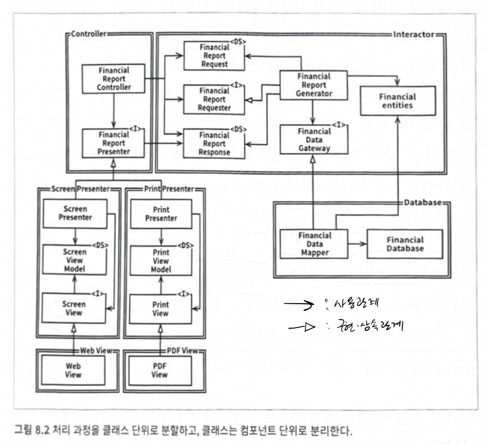
		- 모든 컴포넌트 관계는 단방향으로 이루어진다 (보호하려는 컴포넌트를 향하도록 그려진다)
			- Interactor는 업무 규칙을 포함하기 때문에 가장 높은 수준으로 설계
			- View -> Presenter -> Controller -> **Interactor** <- Database
			- 다른 어느 컴포넌트의 변경도 Interactor에 영향을 주지 않는다 (최고의 보호를 받는다. 가장 높은 수준)
		- 방향성 제어
			- `FinancialDataGateway` 인터페이스가 없었다면 Interactor -> Database 의존성이 생긴다
			- Interactor <- Database 의존성만 생기도록 의도적으로 DIP를 사용했다
		- 정보 은닉
			- `FinancialReportRequester` 인터페이스는 방향성 제어 목적이 아니라 Controller가 Interactor에 대해서 너무 많이 알지 못하도록 존재한다
			- `FinancialReportRequester` 인터페이스가 없었다면 Controller는 `FinancialEntities`에 대한 추이종속성을 가지게 된다

## 9장 LSP: 리스코프 치환 원칙
- 상위 타입의 인스턴스 자리에 하위 타입을 치환하더라도 문제가 없어야 한다
- 초창기에는 상속을 사용하는 가이드로 간주되었지만, 인터페이스와 구현체에도 적용되는 광범위한 원칙으로 변모해왔다
- LSP를 준수하는 사례의 예
	- License 인터페이스가 calcFee() 메서드를 가지고 있고, PersonalLicense, BusinessLicense 클래스가 구현하고 있음
	- Billing 애플리케이션이 License 인터페이스에 의존성을 가짐
	- LSP를 준수한다. why? Billing 애플리케이션의 행위가 License의 하위타입중 무엇을 사용하는지에 전혀 의존하지 않기때문
- LSP를 준수하지 않는 사례의 예
	- 정사각형 / 직사각형 문제
		- 직사각형을 상위, 정사각형을 하위 클래스로 지정해놓고, 정사각형의 너비or높이 설정 코드에 너비, 높이 동시에 설정하도록 하는 코드를 넣는다면 LSP 위반
	- 택시 파견 서비스 앱
		- 요구사항
			- 고객은 어느 택시업체인지는 신경쓰지 않고 적합한 택시를 찾는다
			- 이용할 택시를 결정하면, 시스템은 REST 서비스를 통해 선택된 택시를 고객 위치로 파견한다
			- 택시 파견 REST 서비스의 URL가 운전기사 테이블에 저장되어 있다 (ex: `purplecab.com/driver/Bob`)
			- 이 URL에 필요한 정보를 붙여서 다음과 같이 호출한다
				- PUT `purplecab.com/driver/Bob`/pickupAddress/24 Maple St./pickupTime/153/destination/ORD
			- 다양한 택시 업체에서 PUT .../pickupAddress/?/pickupTime/?/destination/? 형식을 지켜야 하지만 지키지 않는 업체도 있을 수 있다
		- 어떻게 해야 할까?
			- 형식을 지키지 않는 업체때문에 분기를 넣어야 하나? 나중에 형식을 지키지 않는 업체가 purplecab을 인수하면?
			- 설정용 테이블을 이용해서 해결한다. (ex: url, dispatch_format 컬럼)
## 10장 ISP: 인터페이스 분리 원칙
- 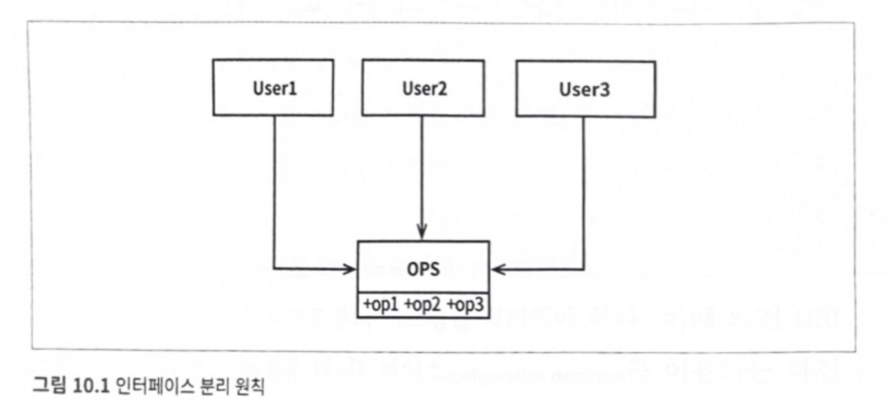
	- User1은 op1만을, User2은 op2만을, User3은 op3만을 사용한다고 가정해보자
	- User1은 op2, op3을 사용하지 않는데도 op2의 소스코드가 변경되면 User1은 재컴파일을 해야 한다
	- op1, op2, op3을 각각 인터페이스 단위로 분리하면 다시 컴파일하고 다시 배포하지 않아도 된다
- ISP는 언어 타입에 따라 영향 정도가 다르다
	- 정적 타입 언어는 import 같은 선언문을 강제하므로 재컴파일/재배포가 필요하다. 
	- 동적 타입 언어는 런타임 추론이 발생하므로 좀 더 유연하다
- 불필요한 짐을 실은 무언가에 의존하면 예상치 못한 문제에 빠진다
## 11장 DIP: 의존성 역전 원칙
- DIP에서 말하는 유연성이 극대화된 시스템이란? 소스코드 의존성이 추상에만 의존하고, 구체에는 의존하지 않는 시스템
	- import 구문은 오직 인터페이스나 추상클래스만을 참조해야 한다는 뜻
	- 하지만 비현실적이다. String 같은 구체 클래스를 의존하지 않을 수 없다. 그래서 OS나 플랫폼같이 안정성 있는 환경에서는 무시한다
	- 변동성이 큰 구체적인 요소는 의존하지 않아야 한다
- DIP 실천법
	1. 변동성이 큰 구체 클래스를 참조하지 말고 추상 인터페이스를 참조하라. 일반적으로 추상 팩토리를 사용하도록 강제한다
	2. 변동성이 큰 구체 클래스로부터 상속받지 말라. 상속은 신중하게 써야 한다
	3. 구체 함수를 오버라이드하지 말라. 의존성을 제거할 수 없게 된다. 차라리 추상 함수로 선언하고, 구현체들에서 각각 구현해야 한다.
	4. 구체적이며 변동성이 크다면 절대로 그 이름을 언급하지 말라(?)
- 추상 팩토리 패턴을 사용해서 DIP 준수하기
	- 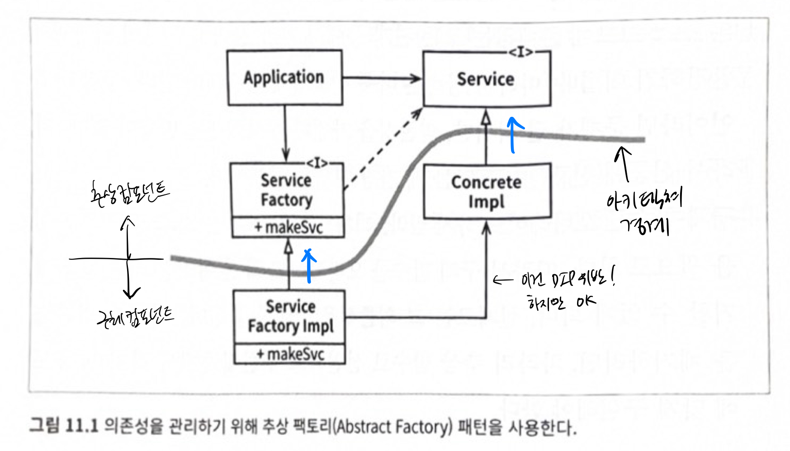
	- 목표 : 구체 컴포넌트 -> 추상 컴포넌트 의존성만을 갖도록 하면서 `ConcreteImpl` 인스턴스를 생성해서 사용하기
	- 구체적인 의존성이 하나 있어 DIP에 위배되지만 (`ServiceFactoryImpl` -> `ConcreteImpl`) 모두 없앨 순 없다. DIP를 위반하는 클래스들을 구체 컴포넌트 내부로 모을 수 있어서 OK

# 4부 컴포넌트 원칙
- SOLID 원칙 : 벽과 방에 벽돌을 배치하는 방법
- 컴포넌트 원칙 : 빌딩에 방을 배치하는 방법
## 12장 컴포넌트
- 컴포넌트란?
	- 배포 단위
	- 시스템의 구성요소로 배포할 수 있는 가장 작은 단위
	- 자바 - jar, 루비 - gem, 닷넷 - dll ...
- 컴포넌트로 할 수 있는 것들
	- 여러 컴포넌트를 서로 링크하여 실행 가능한 단일 파일로 생성할 수 있다
	- 여러 컴포넌트를 묶어서 war 같은 단일 아카이브로 만들 수 있다
	- 컴포넌트 각각을 플러그인이나 exe 파일로 만들어서 독립적으로 배포할 수 있다
	- 어쨌든 독립적으로 개발 / 배포가 가능하도록 잘 설계되어야 한다
- 컴포넌트의 역사
	- 소프트웨어 개발 초창기
		- 메모리에서 프로그램 위치와 레이아웃을 프로그래머가 직접 제어했다
		- 라이브러리 함수에 접근하려고 애플리케이션 코드에 직접 포함시켜 단일 프로그램으로 컴파일했다
		- 이 방식은 컴파일러가 소스코드 전체를 여러번에 걸쳐 읽어야 했지만, 메모리도 너무 작아서 소스코드 전체를 메모리에 로딩할수도 없었다
		- 컴파일 시간을 단축시키기 위해 함수 라이브러리와 소스코드를 애플리케이션 코드로부터 분리했다
		- 애플리케이션과 함수 라이브러리가 점점 커지면서 단편화가 계속되었다
		- 지능적인 로더를 사용해서 메모리에 재배치할 수 있는 형태의 바이너리를 생성하도록 컴파일을 수정했다
		- 오직 필요한 함수만 로드할 수 있게 되었다
		- 링킹 로더 탄생
	- 1960말 ~ 1970초
		- 프로그램이 점점 커지고, 링킹 로더가 너무 느려졌다
		- 링킹 로더를 로더와 링커 두 애플리케이션으로 분리하고, 프로그래머가 느린 링커를 담당했다
	- 1980년대
		- C나 다른 고수준 언어를 사용하기 시작했고, 프로그램도 점점 더 커졌다
	- 1980년대 후반
		- 디스크는 작아지고, 놀랄만큼 빨라졌다. 메모리는 굉장히 저렴해졌다.
	- 1990년대 후반
		- 프로그램이 성장하는 속도보다 링크 시간이 줄어드는 시간이 더 빨라지기 시작했다
		- 액티브X와 공유 라이브러리 시대가 열렸고 jar 파일도 등장했다
		- 로드와 링크를 동시에 할 수 있게 됐다
		- 컴포넌트 플러그인 아키텍쳐가 탄생했다
- 런타임에 플러그인 형태로 결합할 수 있는 동적 링크 파일이 컴포넌트다.
- 컴포넌트 플러그인 아키텍쳐를 적용하려면 엄청난 노력를 했어야 했지만, 지금은 기본이 됐다
## 13장 컴포넌트 응집도
- 컴포넌트 응집도와 관련된 세가지 원칙
	1. REP: 재사용/릴리스 등가 원칙 Reuse/Release Equivalence Principle
	2. CCP: 공통 폐쇄 원칙 Common Closure Principle
	3. CRP: 공통 재사용 원칙 Common Reuse Principle
- REP: 재사용/릴리스 등가 원칙
	- 재사용 단위 == 릴리스 단위
	- 릴리즈 번호와 문서가 있어야 개발자들이 업데이트 여부를 파악할 수 있다
	- 단일 컴포넌트는 응집성 높은 클래스와 모듈들로 구성되어야 한다. 컴포넌트를 구성하는 모든 모듈은 서로 공유하는 중요한 테마나 목적이 있어야 한다.
	- 이 원칙으론 컴포넌트로 묶는 방법을 제대로 설명하기 힘들지만, CCP와 CRP로 보완된다
- CCP: 공통 폐쇄 원칙
	- 동일한 이유, 시점에 변경되는 클래스를 같은 컴포넌트로 묶어라. 그 반대의 경우엔 분리하라.
	- 동일한 유형의 변경에 대해 닫혀 있는 클래스들을 묶어라.
	- 컴포넌트 수준의 SRP
	- 물리적/개념적으로 강결합되어 항상 함께 변경되는 클래스들은 하나의 컴포넌트에 속해야 한다
- CRP: 공통 재사용 원칙
	- 컴포넌트 사용자들을 필요하지 않는 것에 의존하게 강요하지 말라
	- 컴포넌트 수준의 ISP
	- A 컴포넌트가 B 컴포넌트를 의존하고 있다면, A 컴포넌트는 B 컴포넌트의 모든 클래스에 대해 의존하는 것이다
	- 같은 컴포넌트에 묶어야 하는 경우? 같이 재사용되는 경향이 있는 클래스와 모듈들
	- 같은 컴포넌트로 묶이면 안되는 경우? 강하게 결합되지 않은 클래스들
- 세 원칙에 대한 다이어그램
	- 
	- 각 변의 내용은 마주보는 꼭지점을 포기했을때 감수해야 할 비용.
	- REP와 CCP는 포함 원칙. 컴포넌트를 크게 만든다.
	- CRP는 배제 원칙. 컴포넌트를 작게 만든다.
	- 프로젝트 구조는 시간과 성숙도에 따라 변한다.
		- 프로젝트 초기 : CCP > REP. 개발 가능성 > 재사용성
		- 프로젝트 성숙기 : 점차 왼쪽으로 이동한다
- 결론 : 컴포넌트로 묶고자 할땐 재사용성과 개발 가능성이라는 트레이드오프를 고려해야 한다
## 14장 컴포넌트 결합
- 컴포넌트 사이의 관계를 설명하는 3가지 원칙
	1. ADP(Acyclic Dependencies Principle), 의존성 비순환 원칙
	2. SDP(Stable Dependencies Principle), 안정된 의존성 원칙
	3. SAP(Stable Abstractions Principle), 안정된 추상화 원칙
- 숙취 증후군?
	- 내가 의존하고 있는 무언가의 변경으로 인해 내 작업물이 동작하지 않는 현상
	- 이를 해결하는 두 가지 방법
		1. 주 단위 빌드 : 주 1회 머지하는 시간을 갖는 것. 프로젝트가 커질수록 힘들어진다
		2. 순환 의존성 제거하기
- 컴포넌트 의존성 그래프에 순환이 있으면 안된다 (ADP, 의존성 비순환 원칙)
	- 순환이 발생하면?
		- 하나의 거대한 컴포넌트가 되어버린다
		- 테스트할때에도 어려워진다. 내가 의존하는 컴포넌트가 의존하는 다른 컴포넌트도 빌드하고 통합해야 한다
		- 컴포넌트들을 어느 순서로 빌드해야 올바를지 파악하기 힘들어진다
	- 순환을 끊는 방법
		1. DIP를 적용한다
		2. 순환 중간을 끊고, 새로운 컴포넌트를 만든다. (요구사항이 변경되면 컴포넌트 구조도 변경될 수 있다)
	- 컴포넌트 구조는 하향식으로 설계할 수 없다
		- 컴포넌트는 시스템에서 가장 먼저 설계할 수 있는 대상이 아니다
		- 시스템이 성장하고 변경될때 함께 진화한다
		- 컴포넌트 의존성 다이어그램은 애플리케이션의 기능과는 거의 관련이 없고, 오히려 빌드 가능성과 유지보수성을 보여주는 지도와 같다.
- 덜 안정된 곳에서 더 안정된 곳으로 의존하라 (SDP, 안정된 의존성 원칙)
	- 변경이 쉽지 않은 컴포넌트가 변경이 예상되는 컴포넌트에 의존하며 절대 안된다. 의존성이 생기면 변경하기 어려워진다
	- 안정성? 컴포넌트 안쪽으로 들어오는(fan-in) 의존성이 많아지면 안정적이다. 나가는(fan-out) 의존성이 많아지만 불안정적이다.
	- `I(불안정성) = fan-out / (fan-in + fan-out)` [0, 1] 범위를 갖고, 1에 가까울수록 불안정한 컴포넌트다.
	- 모든 컴포넌트가 안정적일 필요 없고, 둘 다 존재해야 한다.
	- 불안정하도록(변경하기 쉽도록) 설계된 컴포넌트는 `I` 지표가 커야 한다
	- 위반했을때 DIP로 해결할 수 있다
		- Stable 컴포넌트 -> Flexible 컴포넌트 의존이 있을때
		- 사이에 UService 컴포넌트를 두고, US 라는 인터페이스를 두고, Flexible 컴포넌트 내 클래스가 구현하게 한다.
		- Stable 컴포넌트 -> UService 컴포넌트 <- Flexible 컴포넌트 의존성이 된다
- 안정된 정도만큼만 추상화되어야 한다 (SAP, 안정된 추상화 원칙)
	- A(추상화 정도) = Na(추상클래스, 인터페이스 개수) / Nc(클래스개수)
		- 0 = 모두 구체 클래스
		- 1 = 모두 추상클래스, 인터페이스
	- 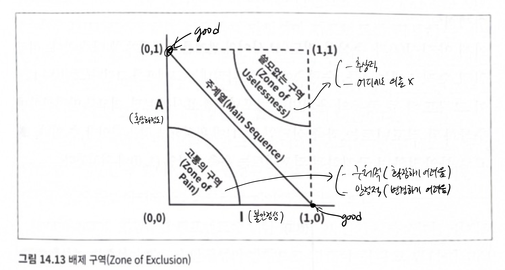
		- 고통의 구역
			- 구체적이라 확장할 수 없고, 안정적이어서 변경하기도 어렵다. ex) 데이터베이스 스키마, 구체적인 유틸리티 라이브러리
			- 변동성이 없는 컴포넌트는 (0, 0) 구역에 위치했더라도 해롭지 않다. ex) String 컴포넌트
		- 쓸모없는 구역
			- 최고로 추상적이지만, 누구도 그 컴포넌트에 의존하지 않아 쓸모없고, 폐기물이다.
		- 주계열
			- (0,1)과 (1,0)을 잇는 선분
			- 안정성에 비해 너무 추상적이지 않고, 추상화정도에 비해 너무 불안정하지 않다.
			- 추상화된 수준에 어울릴 정도만 다른 컴포넌트에 의존하며, 구체화된 수준에 어울릴 정도로만 다른 컴포넌트에 의존한다
			- 주계열에 많이 벗어난 컴포넌트는 검토해야 한다. 의존하는 컴포넌트가 없는데도 너무 추상적이거나, 자신에게 의존하는 컴포넌트가 많은데도 너무 구체적일 가능성이 있다.
			- 릴리즈별로 주계열과의 거리(D) 값을 보고, 어느 릴리즈부터 이상한 의존성이 스며들어 왔는지 판단할수도 있다

# 5부 아키텍처
## 15장 아키텍처란?
- 아키텍트란?
	- 코드에서 탈피하여 고수준의 문제에 집중하는 사람이 아니다!
	- 아키텍트는 코드와 동떨어져서는 안된다. 여전히 프로그래머다.
	- 팀원들이 생산성을 극대화시키는 설계를 하도록 이끈다
- 아키텍쳐란?
	- 시스템을 분할하는 방법, 분할된 컴포넌트를 배치하는 방법, 컴포넌트가 서로 의사소통하는 방식에 따라 정해진다
	- 좋은 아키텍쳐는 쉽게 이해하고, 쉽게 개발하며, 쉽게 유지보수하고, 쉽게 배포할 수 있게 해준다
	- 궁극적인 목표는 시스템의 수명과 관련된 비용은 최소화하고, 생산성은 극대화하는 데 있다
- 쉽게 개발할 수 있어야 한다
	- 개발초기, 소수의 인원이라면 모놀리틱이 빠를지 모르지만 다수의 인원이고, 컴포넌트 단위가 잘 분리되어 있지 않으면 개발이 진척되지 않는다
- 쉽게 배포할 수 있어야 한다
- 개발자에게 시스템의 운영 방식을 잘 드러내준다
	- 사실 운영에서 겪는 문제는 하드웨어를 더 투입해서 해결할 순 있다
	- 유즈케이스, 기능, 시스템의 필수 행위를 일급 엔티티로 격상시킴으로써 개발자에게 주요 목표로 인식되도록 한다
- 유지보수가 쉬워야 한다
	- 기존 소프트웨어에 기능을 추가하거나, 수정할때의 위험 부담을 크게 줄일 수 있다
	- 시스템을 컴포넌트로 분리하고, 인터페이스를 두어 서로 격리하면 된다
- 선택사항을 열어두어야 한다
	- 선택사항 = 세부사항
	- 개발 초기에는 DB를 뭘쓸지, 웹서버를 뭘 쓸지, REST로 할지, DI 프레임워크를 적용할지 등을 고려하지 않아도 된다
	- 선택사항을 오랫동안 열어둘 수 있다면 많은 걸 실험, 시도를 해볼 수 있다.
	- 결정을 더이상 연기할 수 없는 순간이 닥쳐온다면, 실험과 시도 덕분에 많은 정보를 획득한 상태일 것이다.
- 장치와 독립적이어야 한다
## 16장 독립성
- 좋은 아키텍쳐는..
	- 시스템의 의도, 유즈케이스를 지원해야 한다
		- 장바구니 애플리케이션이 좋은 아키텍쳐를 갖춘다면, 아키텍쳐 수준에서 장바구니 애플리케이션처럼 보일 것이다.
	- 필요한 처리량과 응답시간을 지키며 운영할 수 있어야 한다
	- 각 팀이 독립적으로 개발할 수 있어야 한다
	- 시스템이 빌드된 후 즉각 배포할 수 있어야 한다 
	- 선택사항을 열어놔야 한다
		- 모든 유스케이스를 알수도 없고, 시시각각 바뀌기 때문에 선택사항을 열어놔야 향후 변경이 필요할때 쉽게 변경할 수 있다
- 유스케이스 자체도 다른 시점에, 다른 이유로 변경된다면 분리해야 한다
	- 분리할 때 적절한 모드를 선택해야 한다.
		1. 소스 수준 (모놀리틱)
			- 모든 컴포넌트가 같은 주소 공간에서 실행되고, 서로 통신할 땐 함수 호출을 사용한다
		2. 배포 수준
			- 분리된 컴포넌트가 독립적으로 배포할 수 있는 단위로 분할되어 있음 (jar)
		3. 서비스 수준 (MSA)
			- 네트워크 패킷을 통해서만 통신
			- 서로 완전히 독립적
	- 어떤 모드를 선택할지에 대한 선택권도 열어둬야 한다
	- 좋은 아키텍쳐는 모놀리틱 -> MSA으로, 혹은 그 반대 방향으로도 되돌릴 수 있어야 한다
- 중복이 발생하면 자동반사적으로 중복을 제거하고 싶은 유횩을 떨쳐내라
	- 진짜 중복과 가짜(우발적) 중복이 있다. 
	- DB 레코드를 그대로 UI까지 전달하지 마라. 이런 건 우발적 중복이다
## 17장 경계: 선 긋기
- 소프트웨어 아키텍쳐는 선(경계)를 긋는 기술이다
- 경계는 소프트웨어 요소를 서로 분리하고, 경계를 기준으로 서로 알지 못하도록 막는다
- 경계는 프로젝트 극초기에 그어지기고 하고, 매우 나중에 그어지기도 한다
	- 초기에 그어지는 경계는 가능한 한 오랫동안 결정을 연기시키기 위해, 이 결정이 핵심적인 업무 로직을 오염시키지 못하게 하려고 그어짐
- 너무 일찍 내려진 결정은 결합(coupling)이 생겨 효율을 떨어뜨릴 수 있다
	- ex) 프레임워크, DB, 웹 서버, 유틸 라이브러리, DI에 대한 결정 등
	- BAD 사례1) 추후에 별개의 장비에서 실행할 것을 너무 빨리 결정해버려서 끝까지 단일 서버에서 실행함에도 불구하고 별개의 장비에서 실행할때를 대비한 작업을 계속 했던 P사 이야기
	- BAD 사례2) SOA를 약속하는 도구들을 너무 일찍 채택한 W사 이야기
	- GOOD 사례) DB에 대한 결정을 미룬 FitNesse 이야기. 나중에 영속성을 구현해야 할 시점이 오자 DB는 필요 없다는 것을 깨닫고, 플랫 파일에 저장함.
- 경계선을 그리면서 컴포넌트 단위로 분할하고, 일부는 핵심 업무 규칙으로, 나머지는 플러그인에 해당한다.
	- 핵심 업무 규칙을 향하도록 배치한다
	- 저수준 세부사항에서 고수준 추상화를 향하도록 배치한다
## 18장 경계 해부학
- 소스코드 의존성 구성을 잘 하면 변경이 전파(재컴파일, 재배포 등)되는 것을 막는 방화벽을 세울 수 있다
- 경계의 형태
	1. 소스 수준 분리 모드 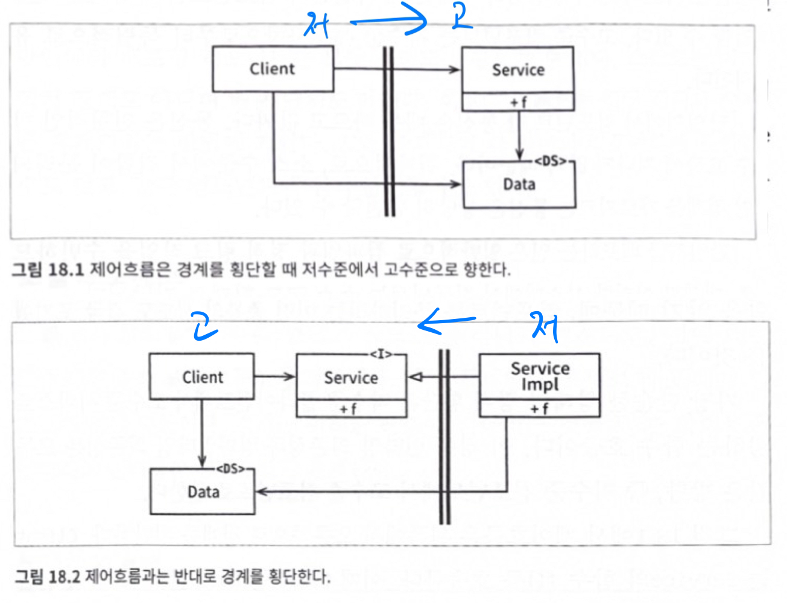
		- 그림18.1
			- 저수준 클라이언트가 고수준 서비스를 호출하는 경우
			- 경계 횡단 방향은 오른쪽
			- Data가 호출되는 쪽에 위치한다
		- 그림18.2
			- 고수준 클라이언트가 저수준 서비스를 호출하는 경우
			- 경계 횡단 방향은 왼쪽
			- 런타임 의존성(->방향)은 컴파일타임 의존성(<-방향)과는 반대가 된다
			- Data가 호출하는 쪽에 위치한다
	2. 배포 수준 분리 모드
		- 배포 과정에서만 차이날 뿐, 소스 수준 분리모드와 동일하다
	3. 서비스 수준 분리 모드
		- 물리적 형태를 띠는 가장 강력한 경계
		- 저수준 서비스는 고수준 서비스에 플러그인 되어야 한다
		- 고수준 서비스의 소스코드에는 저수준 서비스를 특정짓는 어떤 정보(URI같은)도 포함돼서는 안된다
## 19장 정책과 수준
- 소프트웨어 시스템이란 정책을 기술한 것이다.
- 하나의 정책은 여러 조그만 정책들로 쪼갤 수 있다
	- 이런 정책들을 신중하게 분리하고 재편성 할줄도 알아야 한다
	- 같은 이유/시점에 변경되는 정책은 동일한 수준에, 다른 이유/시점에 변경되는 정책은 다른 수준에 위치해야 한다
- 재편성된 컴포넌트들은 비순환 방향그래프 구조가 되어야 한다
	- 정점(노드) : 동일한 수준의 정책을 포함하는 컴포넌트
	- 방향이 있는 간선 : 컴포넌트 사이의 의존성 (컴파일 타임의 의존성. java의 경우엔 import문)
	- 좋은 아키텍쳐는 의존성의 방향이 컴포넌트 수준을 기반으로 연결되도록 만들어야 한다. (저 -> 고)
- 수준?
	- 엄밀히 말하자면 '입력과 출력까지의 거리'
	- 입력과 출력 모두로부터 멀어질수록 정책의 수준은 높아진다. 입력과 출력을 다루는 정책이라면 최하위 수준이다.
	- 잘 설계된 간단한 암호화 프로그램 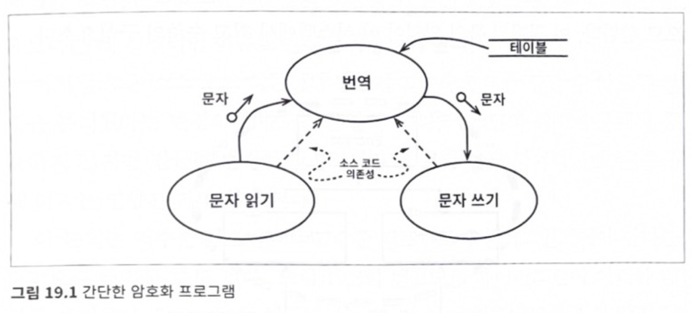
		- 입력 장치에서 문자를 읽는다 -> 테이블을 참조해서 번역한다 -> 출력장치로 기록한다
		- 번역 컴포넌트는 최고 수준 컴포넌트다 (입출력으로부터 가장 멀리 떨어져 있기 때문)
		- 데이터 흐름과 소스코드 의존성이 일치하지 않는다!
			- 소스코드 의존성은 수준에 따라 결합되어야 한다 (데이터 흐름 기준 X)
		- 코드로 나타내면?
			- 번역 컴포넌트 : Encrypt, CharReader(interface), CharWriter(interface)
			- 그 외 : ConsoleReader(CharReader 구현체), ConsoleWriter(CharWriter 구현체)
## 20장 업무 규칙
- 업무 규칙?
	- 사업적으로 수익을 얻거나 비용을 줄일 수 있는 규칙 / 절차
- 핵심 업무 규칙?
	- 자동화 시스템이 있던 없던, 사업 자체에 핵심적인 업무 규칙
	- ex) 대출에 N%의 이자를 부과하는 은행
- 핵심 업무 데이터?
	- 핵심 업무 규칙에는 보통 데이터를 요구하고, 이때의 데이터
- 엔티티
	- 핵심 규칙 + 핵심 데이터
	- 핵심 엄무 데이터를 직접 포함하거나, 매우 쉽게 접근한다
	- 핵심 업무 규칙을 구현한 함수들로 구성된다
	- DB, UI, 서드파티 프레임워크에 대한 고려사항으로 오염되어서는 절대 안된다
- 유즈케이스
	- 자동화된 시스템을 어떻게 쓰는지?
	- 사용자의 입력, 출력, 그 사이의 처리 단계를 설명한다
	- 어플리케이션에 특화된 업무 규칙을 설명한다
	- 엔티티 내부의 핵심 업무 규칙을 어떻게, 언제 호출할지를 담는다
	- UI를 기술하지 않는다. (웹 기반인지? 콘솔 기반인지? 등..)
	- ex) 은행 직원이 사용하는 어플리케이션에서 "신청자의 신용도가 500보다 낮다면 대출 견적을 제공하지 않는다"는 기능을 제공하는 것
- 엔티티는 고수준, 유즈케이스는 저수준이다
	- 엔티티는 유즈케이스를 모르고, 유즈케이스는 엔티티를 안다 (의존성 방향 : 유즈케이스 -> 엔티티)
	- 유즈케이스는 단일 애플리케이션에 특화되어 있고, 입출력에 보다 가깝게 위치한다
	- 엔티티는 다양한 애플리케이션에서 사용될 수 있도록 일반화된 것이다
- 유즈케이스 객체는 다른 컴포넌트와 주고받는 방식을 몰라야 한다
	- 유즈케이스의 코드가 HTML이나 SQL에 대해 알 수 없어야 한다
	- 유즈케이스의 입/출력 데이터 구조는 어떤것에도 의존하지 않는다(HttpRequest, HttpResponse 같은 표준 인터페이스로부터도 파생되면 안된다)
	- 의존시켜 버리면 나중에 분리하느라, 그리고 수많은 조건문으로 고생하게 될 것이다
## 21장 소리치는 아키텍처
- 당신의 애플리케이션 아키텍쳐는 뭐라고 소리치는가?
	- "헬스케어 시스템이야" 혹은 "재고 관리 시스템이야"라고 소리치는가? 아님 "스프링/하이버네이트야"라고 소리치는가?
- 아키텍쳐는 프레임워크에 대한 것이 아니고, 아키텍쳐를 프레임워크로부터 제공받아서는 절대 안된다
- 좋은 아키텍쳐는 프레임워크 뿐만 아니라 DB, 웹서버 등에 해당 결정을 미룰 수 있도록 한다
- 웹도 아키텍쳐가 아니다. 전달 메커니즘 중 하나이며, 세부사항이다.
- 아키텍쳐를 유즈케이스에 중점을 두어야 하고, 프레임워크가 중심을 차지하지 않도록 해야 한다
- 테스트하기 쉬워야 한다
	- 프레임워크, 웹서버, DB를 전혀 준비하지 않아도 단위 테스트가 가능해야 한다
## 22장 클린 아키텍처
- 지난 수십년간 시스템 아키텍쳐와 관련된 여러 아이디어(육각형 아키텍쳐, DCI, BCE 등..)가 있었지만, 목표는 모두 '관심사의 분리'이다.
	- 소프트웨어를 계층으로 분리하여 관심사의 분리라는 목표를 달성한다
	- 이들 아키텍쳐는 다음의 특징을 지니도록 만든다
		1. 프레임워크 독립성
		2. 테스트 용이성
		3. UI 독립성
		4. 데이터베이스 독립성
		5. 모든 외부 에이전시에 대한 독립성
- 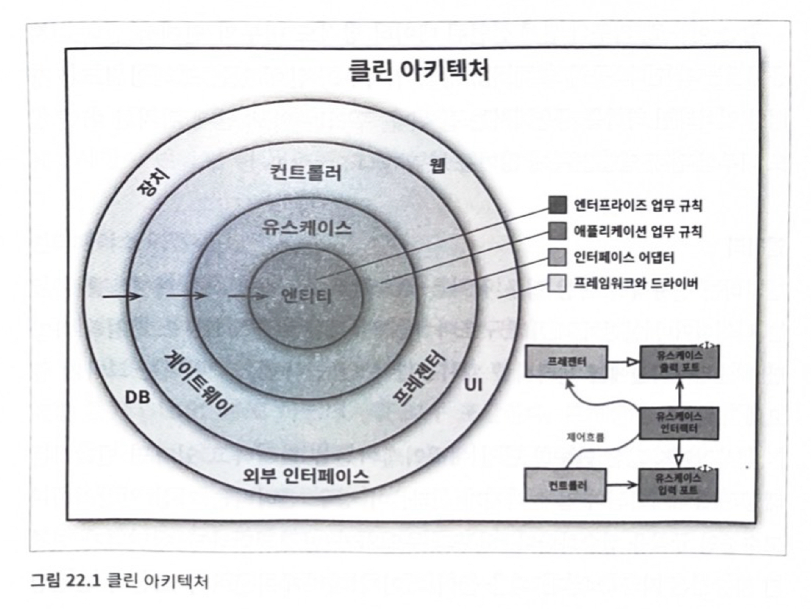
	- 소스 코드 의존성은 반드시 안쪽(고수준)으로 향해야 한다
		- 바깥쪽은 메커니즘, 안쪽은 정책
		- 내부의 원에 속한 요소는 외부의 원에 선언된 어떤 것에 대해서도 알지 못한다
		- 안쪽일수록 가장 범용적이고 추상화와 정책의 수준은 높아진다
	- 엔티티
		- 전사적인 핵심 업무 규칙을 캡슐화한다
		- 운영 관점에서 특정 애플리케이션에 무언가 변경이 필요하더라도 엔티티 계층에는 절대로 영향을 주어서는 안된다
	- 유스케이스
		- 애플리케이션에 특화된 업무 규칙을 포함한다
		- 엔티티로 들어오고 나가는 데이터 흐름을 조정하며, 엔티티가 목적을 달성하도록 이끈다
		- 운영 관점에서 애플리케이션이 변경되면 유즈케이스가 영향을 받는다
	- 인터페이스 어댑터
		- 프레젠터, 뷰, 컨트롤러같은 일련의 어댑터들로 구성된다
		- 유즈케이스/엔티티에게 가장 편한 데이터 형식과 DB/웹 등에게 가장 편한 데이터 형식 사이에서 변환을 수행한다
		- 이 원 안에 속한 어떤 코드도 데이터베이스에 대해 조금도 알아서는 안된다
	- 프레임워크와 드라이버
		- 모든 세부사항이 위치하는 곳
	- 원은 4개여야만 하나?
		- 더 많은 원이 필요할 수 있지만 소스 코드 의존성은 항상 안쪽을 향한다는 것은 변하지 않는다
	- 경계를 횡단하려면?
		- 그림 22.1의 우측 하단은 제어 흐름이 '컨트롤러 -> 유즈케이스 -> 프레젠터' 인 예시를 보여줌
		- 제어흐름과 의존성의 방향이 반대인 경우, DIP를 사용하여 해결한다
		- 경계를 횡단하는 데이터는 여러 형태일 수 있다 (구조체, DTO, 함수 파라미터, 해시맵, 객체 등..)
			- 엔티티 객체나 DB row 등은 X
- 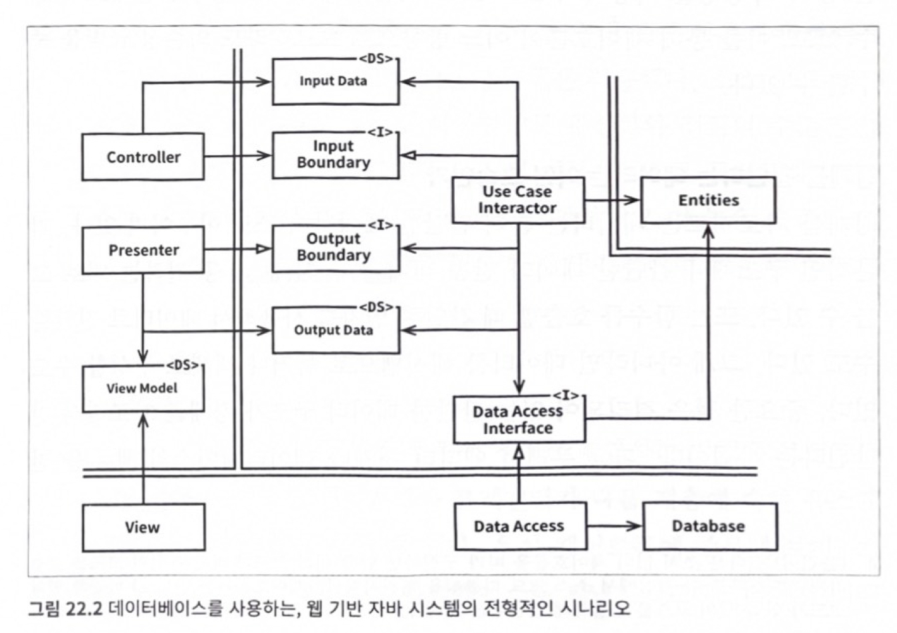
	- 웹서버는 사용자로부터 입력 데이터를 모아 Controller로 전달한다
	- Controller는 데이터를 POJO로 묶은 후 InputBoundary를 통해 UseCaseInteractor로 전달한다
	- UseCaseInteractor는
		- 받은 데이터를 해석해서 Entities가 어떻게 동작할지 제어하는 데 사용한다
		- DataAccessInterface를 사용해서 Entities가 사용할 데이터를 DB에서 불러와서 메모리로 로드한다
		- Entities가 완성되면 Entities로부터 데이터를 모아서 OutputData를 구성한다
	- OutputData는 OutputBoundary 인터페이스를 통해 Presenter로 전달된다
	- Presenter는 OutputData를 ViewModel로 재구성한다
		- 예) Date 객체 -> 문자열, Currency 객체 -> 문자열 등
	- View에서 ViewModel로 화면을 출력한다
## 23장 프레젠터와 험블 객체
- 프레젠터 : 험블 객체 패턴을 따른 형태
- 험블 객체 패턴
	- 테스트하기 쉬운 행위와 어려운 행위를 분리하기 쉽게 하기 위해 고안되었다
	- 행위들을 두 개의 모듈 또는 클래스로 나누고, 하나는 본질, 나머지 하나는 테스트 하기 어려운 행위를 모은다. 후자가 험블 객체다 (humble: 보잘 것 없는)
	- 예를 들어 GUI의 경우 화면의 각 요소가 올바른 위치에 표시됐는지 테스트하기 어렵지만, GUI에서 수행하는 행위는 쉽게 테스트할 수 있다
	- 험블 객체 패턴을 사용하면 두 부류의 행위를 분리하여 프레젠터와 뷰로 나눌 수 있다
- 프레젠터는 테스트하기 쉽다. 뷰는 테스트하기 어렵고 험블 객체다.
	- 프레젠터
		- 테스트하기 쉽다
		- 역할 : 애플리케이션으로부터 데이터를 받아 화면에 표현할 수 있는 형태로 만드는 것
		- 예) 애플리케이션이 프레젠터에 Date 객체를 전달하면 프레젠터는 적절한 포멧으로 변환 후 뷰 모델에 담는다. 빨간색으로 표시되어야 한다면 해당하는 boolean 타입 플래그도 포함한다. 버튼 이름이나, 비활성화 여부 등도 포함할 수 있다
	- 뷰
		- 테스트하기 어렵다. 코드를 간단하게 유지해야 한다.
		- 역할 : 데이터를 GUI로 이동시키지만, 데이터를 직접 처리하진 않는다.
		- 예) 프레젠터가 뷰모델에 넣은 데이터를 활용해서 화면에 로드한다
	- 이렇게 테스트 용이한 부분과 어려운 부분을 나누면 아키텍쳐 경계가 정의된다.
- 데이터베이스 게이트웨이
	- 유즈케이스 인터렉터와 데이터베이스 사이에 위치한다
	- 애플리케이션이 DB에 수행하는 CRUD과 관련된 모든 메서드를 포함한다
	- 만약 어제 로그인한 모든 사용자의 성이 필요하다면 UserGateway 인터페이스에 getLastNamesOfUsersWhoLogginedAfter이라는 메서드가 있어야 한다
	- 메서드의 구현은 DB계층에 있어야 하고, 이 구현체는 험블 객체다
- ORM은 DB계층이다
- 외부 서비스와 통신할때에도 험블 객체 패턴을 발견할 수 있다
## 24장 부분적 경계
- 아키텍쳐 경계를 완벽하게 만드는 데는 비용이 많이 든다
	- 쌍방의 다형적 Boundary 인터페이스, Input/Output을 위한 데이터 구조 등등..
- 비용이 너무 크지만, 나중에 필요할 것이라 판단되는 경우엔 부분적 경계를 구현하는 것이 대안이 될 수 있다
- 부분적 경계를 구현하는 방법
	1. 마지막 단계 건너뛰기
		- 독립적으로 컴파일하고 배포할 수 있는 컴포넌트를 만들기 위한 작업을 모두 수행한 후, 단일 컴포넌트에 그대로 모아만 두는 방법.
		- 완벽한 경계를 구성하는 것과 무슨 차이냐? 비용이 큰 건 마찬가지 아니냐? 라고 할 수 있지만, 버전번호 관리나 배포 관리 부담을 덜 수 있다.
	2. 전략 패턴을 활용하여 일차원 경계 만들기
		- 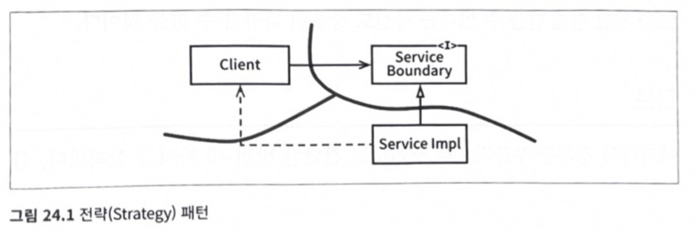
		- 전략패턴을 통해 미래에 필요할 아키텍쳐 경계를 위한 무대를 마련한다 (의존성 역전이 이미 적용되었다)
		- 위험천만한 점선 화살표로 인해 이러한 분리가 붕괴될 가능성이 있다
	3. 퍼사드
		- 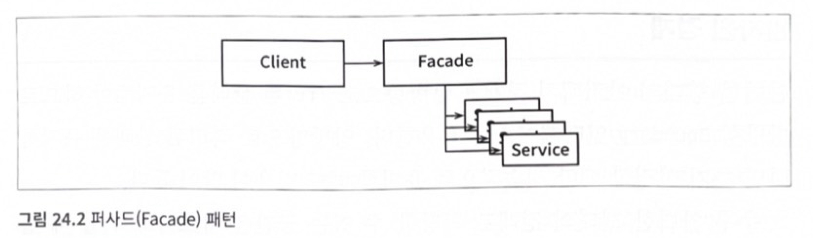
		- 경계는 Facade 클래스로만 간단히 정의된다. (의존성 역전도 없다)
		- Facade가 모든 서비스 클래스를 메서드 형태로 정의한다.
		- 하지만 Client가 모든 서비스 클래스에 대해 추이 종속성을 갖는다. 서비스 클래스 중 하나의 코드 변경이 발생하면 Client도 재컴파일해야 한다
## 25장 계층과 경계
- 시스템이 3가지 컴포넌트(UI, 업무규칙, DB)로만 구성된다고 착각하기 쉽지만 훨씬 많다
- 움퍼스 사냥 게임의 예로 알아보자.
	- 1972년에 발매된 이 게임은 텍스트 기반 게임이고, 플레이어는 동굴 속에서 움퍼스를 사냥하면서 위험들은 피해야 한다
- 영어 뿐만 아니라 스페인어도 지원해야 한다면? 데이터를 클라우드에도 저장해야 한다면? 콘솔 뿐 아니라 SMS으로 조작하고자 한다면?
	- 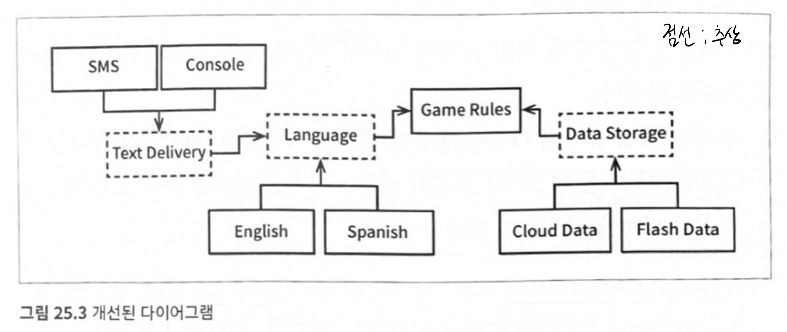
	- 의존성을 모두 GameRules를 향하도록 한다
	- GamesRules는 Language와 어떻게 통신하나?
		- GamesRules가 정의하고 Language가 구현하는 API를 통해
		- API는 구현하는 쪽이 아닌 사용하는 쪽에 정의되고 소속된다
	- 의존성의 방향과 데이터의 흐름은 일치하지 않는다
	- 만약 게임을 온라인으로 만든다면? Network 컴포넌트를 새로 만들어서 GameRules에 의존성을 갖도록 한다
- GameRules를 분리하고, MSA까지 적용하기
	- 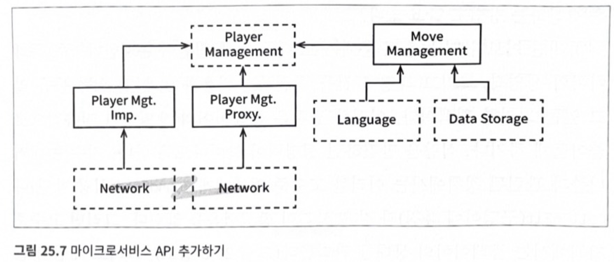
	- GameRules를 MoveManagement와 PlayerManagement로 분리
		- MoveManagement : 각 동굴이 연결되는 방식, 동굴에 어느 물체가 위치하는지 등
		- PlayerManagement : 플레이어 상태
		- MoveManagement(저수준)는 PlayerManagement(고수준)에게 '식량 발견'이나 '구덩이에 빠짐' 같은 이벤트를 알린다
		- MoveManagement은 플레이어의 컴퓨터에서, PlayerManagement은 서버에서 처리됨
		- MoveManagement와 PlayerManagement 사이에는 완벽한 형태의 아키텍쳐 경계가 존재한다
- 왜 이렇게까지 하는가? 아래를 보여주기 위해!
	- 아키텍쳐 경계는 어디에나 존재한다
	- 이러한 경계를 제대로 구현하려면 비용이 많이 든다
	- 이러한 경계가 무시되었다면 나중에 추가되는 비용이 크다
- 미래를 내다봐야만 한다
	- 미리 구현했을때의 오버 엔지니어링 비용과, 무시했을때의 나중에 감수할 비용 사이에서 현명하게 추측해야 한다
	- 계속 발전해 나가다가, 경계가 필요한 시점에 구현하는 비용과 무시할때 감수할 비용을 가늠하고, 전자가 작아지는 시점에 경계를 구현해야 한다
	- 그러려면 시스템이 발전함에 따라 계속 관찰해야 한다
## 26장 메인(Main) 컴포넌트
- 메인 컴포넌트? 
	- 나머지 컴포넌트들을 생성, 조정, 관리하는 컴포넌트
	- 궁극적인 세부사항으로, 가장 낮은 수준의 정책이다. 클린 아키텍쳐에서 가장 바깥 원에 위치한다.
	- 시스템의 초기 진입점이고, OS를 제외하면 어떤것도 메인에 의존하지 않는다
	- 메인은 모든 기반 설비를 생성한 후, 고수준으로 제어권을 넘기는 역할이다
	- ex) DI 프레임워크를 이용해 의존성 주입하는 일
## 27장 ‘크고 작은 모든’ 서비스들
- SOA, MSA가 최근에 인기있는 이유
	- 서비스를 사용하면 상호 결합이 철저하게 분리된다?
		- 하지만 일부만 맞다
		- 네트워크 상의 공유 자원 때문에 결합될 가능성이 있다
	- 서비스를 사용하면 개발과 배포 독립성을 지원한다?
		- 이것도 일부만 맞다
		- 데이터나 행위에서 어느정도 결합되어 있다면 결합된 정도에 맞게 개발/배포/운영을 조정해야 한다
- 서비스를 사용한다는 것이 본질적으로 아키텍쳐에 해당하는가?
	- 단순히 행위를 분리하는 수준이라면 값비싼 함수호출에 불과하다
- 9장에서의 택시 파견 서비스앱을 다시 보자.
	- AC
		- 고객은 승차 시간, 비용, 고급 택시 여부, 운전자 경력 등의 기준에 따라 택시를 선택할 수 있다
	- 변경 전 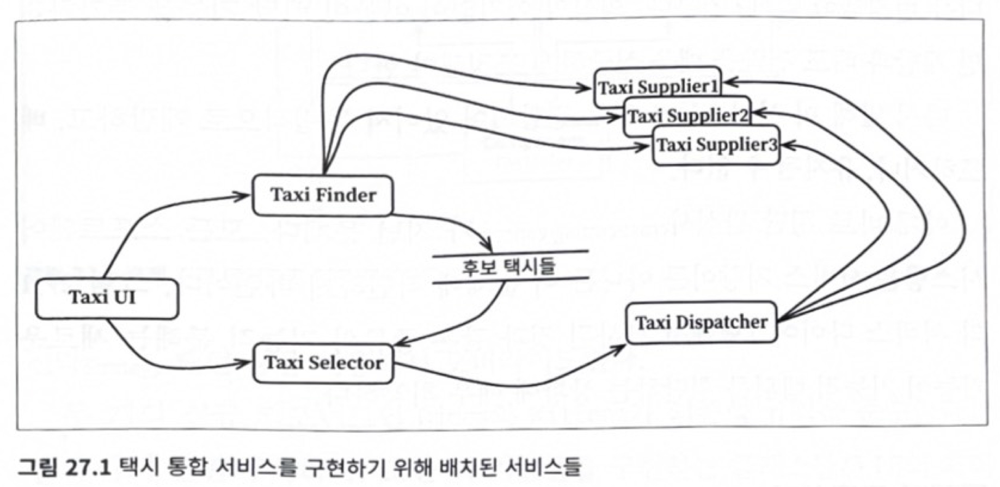
		- MSA로 구성
		- TaxiUI : 고객을 담당, 고객은 모바일로 택시를 호출한다
		- TaxiFinder : TaxiSupplier들의 현황을 검토하고 적합한 택시 후보를 선별한다
		- TaxiSelector : 조건을 기초로 후보 택시들 중 적합한 택시를 선택하고 TaxiDispatcher로 전달한다
		- TaxiDispatcher : 택시에 배차 지시를 한다
	- 고양이 배달 서비스를 추가한다고 하자.
		- AC
			- 사용자는 원하는 곳으로 고양이를 배달해달라고 주문할 수 있다
			- 고양이 알러지가 있는 운전자는 제외되어야 한다
			- 고양이 알러지가 있는 고객은 3일 사이에 고양이를 배달했던 택시에 배차되면 안된다
		- 위 다이어그램에서 어디를 변경해야 할까?
			- 전부 변경해야 한다.
			- 서비스들이 모두 결합되어 있어서 독립적으로 개발/배포/유지가 어렵다
			- 위 그림처럼 기능적 분해는 새 기능이 기능적 행위를 횡단하는 상황에 매우 취약하다
	- 컴포넌트 기반 아키텍쳐에서 SOLID로 해결하기
		- 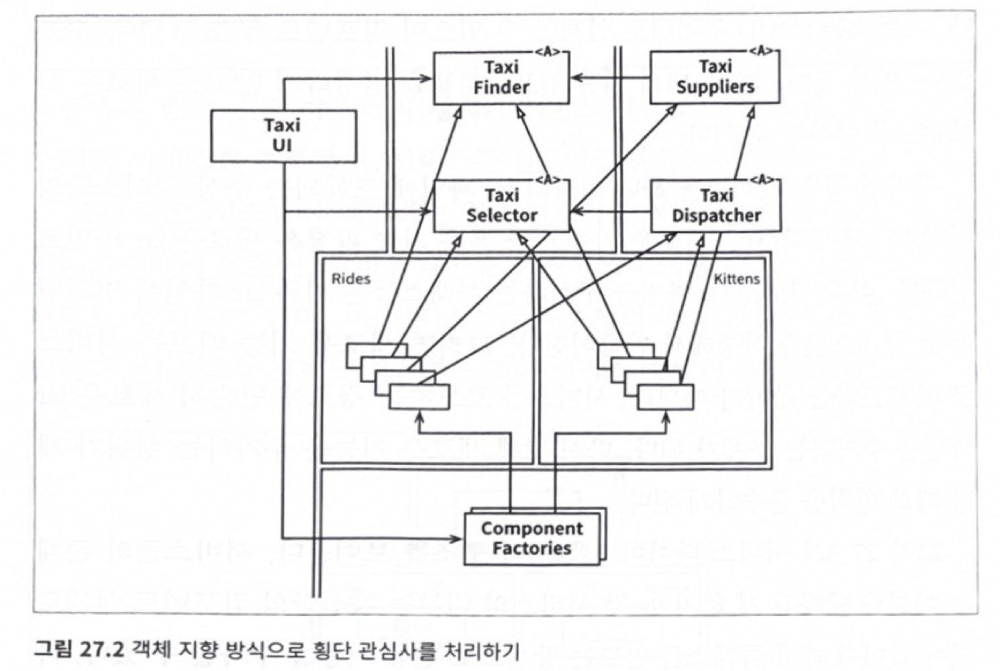
		- 클래스들은 변경 전과 거의 일치하지만 경계를 주목하자
		- 배차에 특화된 로직 부분은 Rides, 고양이에 대한 신규 기능은 Kittens 컴포넌트에 들어갔다
		- Rides와 Kittens 의존성 규칙을 준수한다
		- 기능들을 구현하는 클래스들은 UI의 제어 하에 팩토리가 생성한다
	- 서비스기반 아키텍쳐에서 해결하기
		- 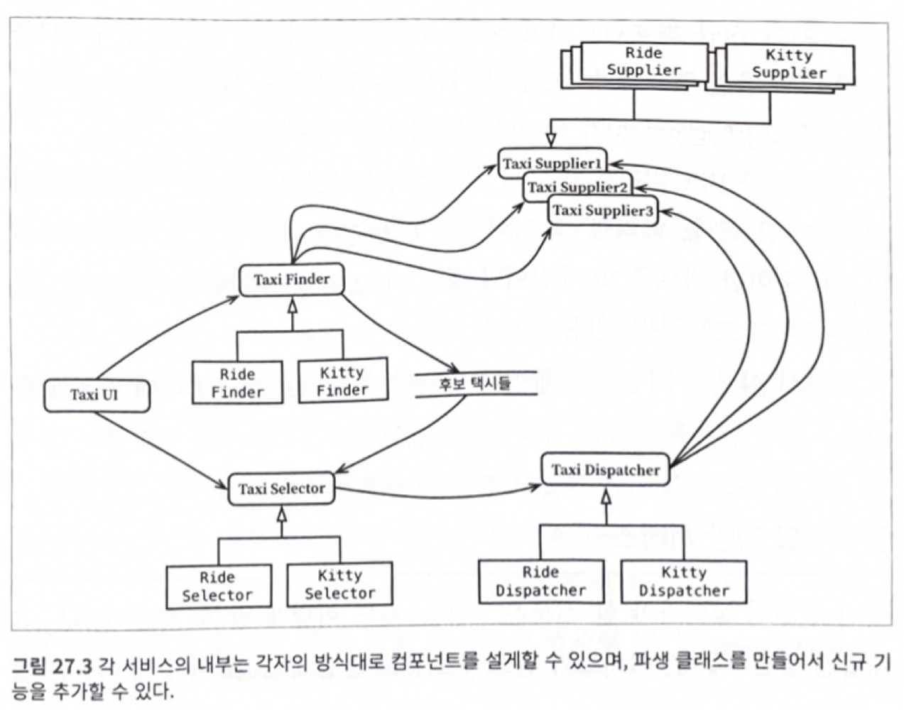
		- 각 서비스의 내부는 자신만의 컴포넌트 설계로 되어 있어서, 파생 클래스를 만드는 방식으로 신규 기능을 추가할 수 있다 (OCP)
- 결론
	- 시스템의 아키텍쳐는 시스템 내부에 그어진 경계와 경계를 넘나드는 의존성에 의해 정의된다
	- 시스템의 구성 요소가 통신하고 실행되는 물리적인 메커니즘에 의해 아키텍쳐가 정의되는 것이 아니다
## 28장 테스트 경계
- 테스트는
	- 세부적이고 구체적이다. 아키텍쳐에서 가장 바깥쪽 원이다
	- 테스트는 독립적으로 배포 가능하다. 테스트 시스템에만 배포된다
- 테스트는 시스템의 일부이고, 아키텍쳐에도 관여한다
	- 테스트도 변동성이 큰 것에 의존하면 안된다
		- GUI 테스트코드는 변동성이 커 깨지기 쉽다
		- 살짝 바꿨는데 1000개의 테스트코드가 깨진다면 개발자는 변경하지 않으려 할 것이다.
- 모든 업무 규칙을 검증하는데 사용하는 테스트 API를 만들수도 있다
	- 테스트를 어플리케이션으로 분리할 목적으로 사용한다
	- 시간이 지날수록 테스트는 계속 구체적이고 더 특화된 형태로 변할 것이고, 상용 코드는 더 추상적이고 범용적인 형태로 변할 것이다
	- 보안을 위해 운영 시스템에서 위험한 부분을 분리할 수 있어야 한다
## 29장 클린 임베디드 아키텍처
- 펌웨어?
	- 소프트웨어는 닳지 않지만, 펌웨어와 하드웨어는 낡아가므로 소프트웨어도 수정해야 한다
		- 펌웨어와 하드웨어에 대한 의존성을 관리하지 않으면 안으로부터 파괴된다
	- ROM에 상주하는 소프트웨어라고 해서 펌웨어인건 아니다.
	- 펌웨어를 너무 양산하면 안된다. 펌웨어는 더 적게 만들고 소프트웨어는 더 많이 만들어야 한다.
	- 저자는 "하드웨어/기술에 의존적인 소프트웨어"를 펌웨어로 칭하는듯..
- 앱-티튜드 테스트
	- 왜 잠재적인 임베디드 소프트웨어는 그렇게 많이 펌웨어로 변하는가? 동작하게만 만들고 구조화엔 신경쓰지 않기 때문이다
	- 앱-티튜드 테스트를 통과한다는 건 동작한다는 뜻이고, 클린 임베디드 아키텍쳐를 가진다고 말하기는 어렵다
- 타깃-하드웨어 병목현상
	- 임베디드 개발자들은 임베디드가 아니었다면 다루지 않아도 될 특수한 관심사를 많이 가지고 있다
	- 임베디드 코드가 클린 아키텍쳐 원칙과 실천법을 따르지 않는다면, 코드를 테스트할 수 있는 환경이 해당 특정 타겟으로만 제한된다
- 클린 임베디드 아키텍쳐는?
	- 테스트하기 쉽다
		- 임베디드 소프트웨어 개발자는 소프트웨어와 펌웨어 사이의 경계(HAL)를 분명하게 정의해야 한다
	- HAL 사용자는 하드웨어 세부사항을 몰라야 한다
		- 프로세서, 운영체제는 세부사항이다
		- OSAL(OS 추상화 계층)을 통해 소프트웨어를 운영체제로부터 격리시켜야 한다
	- 인터페이스를 통하고, 대체 가능성을 높여야 한다
	- DRY원칙: 조건부 컴파일 지시자를 반복하지 말라

# 6부 세부사항
## 30장 데이터베이스는 세부사항이다  
## 31장 웹은 세부사항이다    
## 32장 프레임워크는 세부사항이다  
## 33장 사례 연구: 비디오 판매 
## 34장 빠져 있는 장