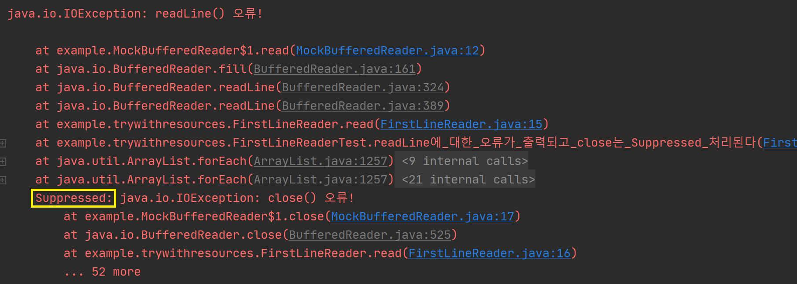

# 이펙티브 자바

## 아이템1. 생성자 대신 정적 팩터리 메서드를 고려하라

### 정적 팩터리 메서드?

- 클래스의 인스턴스를 반환하는 static 메서드

  예 : `Boolean::valueOf`

  ```java
  public static Boolean valueOf(boolean b) {
  	return b ? Boolean.TRUE : Boolean.FALSE;
  }
  ```

### 정적 팩터리 메서드가 생성자보다 좋은점

1. 이름을 가질 수 있다

   - 반환될 객체의 특성을 쉽게 묘사할 수 있다

     예 : `BigInteger.probablePrime`는 `BigInteger.BigInteger(int, int, Random)`보다 더 잘 묘사하고 있다

2. 호출될 때마다 인스턴스를 새로 생성하지는 않아도 된다

   - 인스턴스를 미리 만들어 놓거나 캐싱하여 재활용 할 수 있다

     예 : `Boolean.valueOf`는 객체를 아예 생성하지 않는다

   - 인스턴스 통제 클래스로 만들 수 있다 (언제 어느 인스턴스를 살아있게 할지를 통제할 수 있다)

     - 싱글톤으로 만들수도, 인스턴스화 불가로 만들수도 있다

3. 반환타입의 하위 타입 객체를 반환할 수 있는 능력이 있다

   - 구현 클래스를 공개하지 않고도 그 객체를 반환할 수 있어 API를 작게 유지할 수 있다

4. 입력 매개변수에 따라 매번 다른 클래스의 객체를 반환할 수 있다

   - 반환 타입의 하위 타입이기만 하면 어떤 클래스의 객체를 반환하든 상관없다

     예 : `EnumSet`의 `RegularEnumSet`과 `JumboEnumSet`

5. 정적 팩터리 메서드를 작성하는 시점에는 반환할 객체의 클래스가 존재하지 않아도 된다

### 정적 팩터리 맥서드가 생성자보다 안좋은점

1. 상속을 하려면 public이나 protected 생성자가 필요하니 정적 팩터리 메서드만 제공하면 하위 클래스를 만들 수 없다

   - 상속보다 컴포지션을 유도하므로 오히려 장점일 수 있다

2. 정적 팩터리 메서드는 프로그래머가 찾기 어렵다

   - 정적 팩터리 메서드에서 흔히 사용하는 명명 방식을 사용하여 이 문제를 완화할 수 있다

     - `from` : 매개변수 하나, 형변환 메서드

       예 : `Date d = Date.from(instant);`

     - `of` : 매개변수 여러개, 집계 메서드

       예 : `Set<Rank> faceCards = EnumSet.of(JACK, QUEEN, KING);`

     - `valueOf` : `from`과 `of`의 더 자세한 버전

       예 : `BigInteger prime = BigInteger.valueOf(Integer.MAX_VALUE);`

     - `instance`, `getInstance` : 매개변수로 명시한 인스턴스를 반환하지만, 같은 인스턴스임은 보장X

       예 : `StackWalker luke = StackWalker.getInstance(options);`

     - `create`, `newInstance` : 매번 새로운 인스턴스를 생성하여 반환

       예 : `Object newArray = Arrays.newInstance(classObject, arrayLen);`

     - `get(클래스이름)` : 다른 클래스에 (같은 인스턴스임을 보장하지 않는 인스턴스를 반환하는) 팩터리 메서드를 정의할때

       예 : `FileStore fs = Files.getFileStore(path);`

     - `new(클래스이름)` : 다른 클래스에 (새로운 인스턴스를 반환하는) 팩터리 메서드를 정의할때

       예 : `BufferedReader br = Files.newBufferedReader(path);`

     - `(클래스이름)` : `get(클래스이름)`과 `get(클래스이름)`의 간결한 버전

       예 : `List<Complaint> litany = Collections.list(legacyLitany);`

<br/>

## 아이템2. 생성자에 매개변수가 많다면 빌더를 고려하라

### 생성자에 매개변수가 많을때 쓰이는 패턴들

1. 점층적 생성자 패턴
   - 매개변수가 많아지면 헷갈린다. 가독성이 떨어지고 찾기 어려운 버그를 야기할 수 있다
2. 자바 빈즈 패턴
   - 객체가 완전히 생성되기 전까지는 일관성이 무너진 상태다. 불변으로 만들 수 없다
3. 빌더 패턴
   - 위 두 패턴의 단점을 해결할 수 있고, 장점을 겸비했다

### 빌더 패턴

- 불변으로 만들 수 있다.
- 빌더의 세터 메서드를 연쇄적으로 호출할 수 있어 가독성이 좋다
- 필수 매개변수를 지정할 수 있다
- 

<br/>

## 아이템3. private 생성자나 열거 타입으로 싱글턴임을 보증하라

### 싱글턴?

- 인스턴스를 오직 하나만 생성할 수 있는 클래스

  예 : 함수 같은 무상태 객체, 설계상 유일해야 하는 시스템 컴포넌트

### 싱글턴을 만드는 방법

1. 생성자를 private으로 감추고, public static final 필드를 마련해두기

   ```java
   public class Singleton {
     //외부에서 인스턴스에 접근할 수 있는 유일한 수단
     public static final Singleton INSTANCE = new Singleton();
     
     private Singleton() {
       throw new ... //리플렉션을 이용해서 생성자를 호출하는 경우도 막아버림
     }
     
     public void method() {
       ...
     }
   }
   ```

   장점 : 싱글턴임이 명백히 드러난다. 간결하다

   단점 : 직렬화 과정에서 싱글턴이 깨지지 않게 하기 위해선 추가 노력이 필요하다(`transient`, `readResolve` 등..)

2. 생성자를 private으로 감추고, public static 메서드를 마련해두기

   ```java
   public class Singleton {
     private static final Singleton INSTANCE = new Singleton(); //private 해야 함
     
     private Singleton() {
       throw new ... //리플렉션을 이용해서 생성자를 호출하는 경우도 막아버림
     }
     
     //외부에서 인스턴스에 접근할 수 있는 유일한 수단
     public static Singleton getInstance() {
       return INSTANCE;
     }
     
     public void method() {
       ...
     }
   }
   ```

   장점 : 마음이 바뀌면 API를 바꾸지 않고도 싱글턴이 아니게 변경할 수 있다? 원한다면 정적 팩터리를 제네릭 싱글턴 팩터리로 만들 수 있다? 정적 팩터리의 메서드 참조를 supplier로 사용할 수 있다?

   단점 : 직렬화 과정에서 싱글턴이 깨지지 않게 하기 위해선 추가 노력이 필요하다(`transient`, `readResolve` 등..)

3. 원소가 하나뿐인 열거타입 선언하기

   ```java
   public enum Singleton {
     INSTANCE;
     
     public void method() {
       ...
     }
   }
   ```

   장점 : 간결하다, 추가 노력 없이 직렬화 가능, 리플렉션 공격도 막을 수 있음, 대부분의 상황에선 가장 좋은 방법

   단점 : 조금 부자연스러워 보임, Enum 외의 클래스를 상속해야 한다면 사용 불가

<br/>

## 아이템4. 인스턴스화를 막으려거든 private 생성자를 사용하라

정적 메서드와 정적 필드만을 담은 클래스를 만들고 싶을 땐 인스턴스화를 막기 위해서 private 생성자를 만들어야 한다.

```java
public class Collections {
  // "인스턴스화 방지용" 이라고 주석 달아놓으면 더 직관적이다.
  private Collections() {
    //클래스 내부에서 혹시 호출할수도 있으니까 AssertionError를 throw할수도 있다
  }
  
  private static final ...
  private static final ...
    
  public static ...
  public static ...
}
```

<br/>

## 아이템5. 자원을 직접 명시하지 말고 의존 객체 주입을 사용하라

맞춤법 검사기를 구현한다 했을때, 아래와 같이 정적 유틸리티 클래스나 싱글톤으로 구현하는 경우가 많다. 

- 정적 유틸리티 클래스 방식

  ```java
  public class SpellChecker {
  
      private static final Lexicon DICTIONARY = ...; //직접생성
  
      private SpellChecker() { //객체 생성 방지
      }
  
      public static boolean isValid(String word) {...}
      public static List<String> suggestions(String typo) {...}
  }
  ```

- 싱글톤 방식

  ```java
  public class SpellChecker {
  
      private final Lexicon dictionary = ...; //직접생성
  
      private SpellChecker(...) {...}
      public static SpellChecker INSTANCE = new SpellChecker(...);
  
      public boolean isValid(String word) {...}
      public List<String> suggestions(String typo) {...}
  }
  ```

하지만, 위 두 방식은 유연하지 않고 테스트하기 어렵다. 왜냐하면

- 사용할 사전이 단 한가지라고 가정하고 있다.
- 의존하는 객체를 직접 생성하고 있다.

그럼, `SpellChecker`가 여러 사전을 바꿔가며 사용할 수 있도록 setter를 추가해보자.

```java
public class SpellChecker {

    private Lexicon dictionary = ...; //final 제거

    public SpellChecker() {
    }
    
    public void setDictionary(Lexicon dictionary) { //사전 변경 메서드
        this.dictionary = dictionary;
    }

    public boolean isValid(String word) {...}
    public List<String> suggestions(String typo) {...}
}
```

하지만 위의 방법에도 문제가 있다.

- 어색하고 오류를 내기 쉽다
- 멀티쓰레드 환경에서는 쓸 수 없다

이 문제들을 한방에 해결하려면 의존 객체 주입 패턴을 사용하자.

```java
public class SpellChecker {

    private final Lexicon dictionary; //final로 불변을 보장하자

    public SpellChecker(Lexicon dictionary) { //생성자에 필요한 자원을 넘겨준다
        this.dictionary = Objects.requireNonNull(dictionary);
    }
    
    public boolean isValid(String word) {...}
    public List<String> suggestions(String typo) {...}
}
```

```java
//클라이언트
Lexicon lexicon = ...; //Lexicon객체 생성
SpellChecker spellChecker = new SpellChecker(lexicon); //주입
spellChecker.isValid("마춤뻡"); //false
```

의존 객체 주입 패턴의 장점

- 자원이 몇개든 의존관계가 어떻든 상관없이 잘 동작한다
- 유연하고 테스트가 쉽다

또한, 의존 객체가 불변이라면, 여러 클라이언트가 의존 객체들을 공유할 수 있다

의존 객체 주입 패턴의 쓸만한 변형으로는 생성자에 자원 팩터리를 넘겨주는 방식이 있다.

- 팩터리 : 호출할 때마다 특정 타입의 인스턴스를 반복해서 만들어주는 객체 (아래 예에선 `Supplier<? extends Tile>`)

```java
Mosaic flowerMosaic = mosaicCreator.create(() -> new Tile("꽃무늬"));
Mosaic checkMosaic = mosaicCreator.create(() -> new Tile("체크무늬"));
```

```java
//MosaicCreator.java
public Mosaic create(Supplier<? extends Tile> tileFactory) {
    Tile tile1 = tileFactory.get();
    Tile tile2 = tileFactory.get();
    Tile tile3 = tileFactory.get();
    Tile tile4 = tileFactory.get();
    return new Mosaic(Arrays.asList(tile1, tile2, tile3, tile4));
}
```

([여기](https://github.com/hwanghe159/lab/tree/master/functionalinterface/src)에서 전체 코드를 볼 수 있습니다.)

의존 객체 주입은 유연성과 테스트 용이성을 개선해주지만, 의존성이 많은 경우 코드를 어지럽게 할 수 있다.

-> 의존 객체 주입 프레임워크(대거, 주스, 스프링 등)를 사용하면 해소할 수 있다

### 결론

- 클래스가 자원에 의존하고 있고, 자원이 클래스 동작에 영향을 준다면 정적 유틸리티 클래스나 싱글턴을 이용하지 않는 게 좋다
- 자원들을 클래스가 직접 만들게 해서도 안된다
- 필요한 자원(또는 그 자원을 만들어주는 팩터리)을 생성자(또는 정적 팩터리나 빌더)에 넘겨주면 클래스의 유연함, 재사용성, 테스트 용이성을 개선해준다

<br/>

## 아이템6. 불필요한 객체 생성을 피하라

### 불필요한 객체 생성을 피하는 몇가지 팁들

1. new String 보단 문자열 리터럴로.

   ```java
   String s = new String("bikini"); //따라하지 말것. 쓸데없이 String인스턴스가 만들어진다.
   String s = "bikini"; //같은 문자열을 재사용할 수 있다
   ```

2. 생성자 대신 정적 팩터리 메서드로

<br/>

## 아이템9. try-finally보다는 try-with-resources를 사용하라

`close()`를 통해서 직접 닫아줘야 하는 자원이 많이 있다. (`InputStream`, `OutputStream`, `java.sql.Connection` 등)

자원을 제대로 닫기 위해서 아래와 같이 try-finally 방식으로 구현해왔다.

```java
//try-finally방식
static void copy(String src, String dst) throws IOException {
    InputStream in = new FileInputStream(src);
    try {
        OutputStream out = new FileOutputStream(dst);
        try {
            byte[] buf = new byte[BUFFER_SIZE];
            int n;
            while ((n = in.read(buf)) >= 0)
                out.write(buf, 0, n);
        } finally {
            out.close();
        }
    } finally {
        in.close();
    }
}
```

다음은 위 코드를 자바7에 등장한 try-with-resources방식으로 바꾼 코드다.

```java
//try-with-resources방식
static void copy(String src, String dst) throws IOException {
    try (InputStream in = new FileInputStream(src);
         OutputStream out = new FileOutputStream(dst)) {
        byte[] buf = new byte[BUFFER_SIZE];
        int n;
        while ((n = in.read(buf)) >= 0)
            out.write(buf, 0, n);
    }
}
```

단, 이 구조를 사용하려면 해당 자원이 `AutoClosable` 인터페이스를 구현해야 한다.

### try-with-resources방식의 장점

1. 가독성이 좋다

   - try-finally방식은 자원이 2개 이상인 경우 try문을 중첩으로 사용하지만, try-with-resources방식은 그렇지 않다

2. 자원을 닫지 않는 실수를 막을 수 있다

3. try-finally방식보다 문제를 진단하기에 좋다

   - 예를 들어 아래의 코드의 try-finally방식에서, 물리적인 문제 때문에 `br.readLine()` `br.close()` 두 곳에서 예외가 발생한다고 가정했을 때,

   - ```java
     //try-finally방식
     static String firstLineOfFile(String path) throws IOException {
         BufferedReader br = new BufferedReader(new FileReader(path));
         try {
             return br.readLine();//실패
         } finally {
             br.close();//실패
         }
     }
     
     //try-with-resources방식
     static String firstLineOfFile(String path) throws IOException {
         try (BufferedReader br = new BufferedReader(new FileReader(path))) {
             return br.readLine();
         }
     }
     ```

   -  try-finally방식은 `br.readLine()`에 대한 스택 추적 내역은 남지 않고 `br.close()`의 스택 추적 내역만 남는다

   - try-with-resources방식은 `br.readLine()`은 기록되고, `br.close()`는 '숨겨졌다'(Suppressed)는 꼬리표를 달고 출력된다.

     

     -> [여기](https://github.com/hwanghe159/lab/tree/master/trywithresources)에서 예제 코드를 볼 수 있습니다

### 결론

회수해야 하는 자원을 다룰 때는 예외없이 try-finally 보다는 try-with-resources를 쓰자. 가독성도 좋아지고 만들어지는 예외 정보도 훨씬 유용하다.

<br/>

## 아이템10. equals는 일반 규약을 지켜 재정의하라

### `equals`란?

```java
//Object.java
public boolean equals(Object obj) {
    return (this == obj);
}
```

- 다른 객체가 이 객체와 같은지( = 메모리상에서 같은 위치에 있는지) 여부를 나타냄
- 메모리 상에서 같은 위치에 있는지가 아니라 다른 기준으로 같음을 나타내고 싶을 때 재정의한다.

### (참고)`instanceof` 란?

`a instanceof B` 

- "a객체는 B클래스의 인스턴스이거나 B클래스 하위 클래스의 인스턴스인가요?" 라는 뜻
- a가 null이면 `false`

### `equals`를 재정의하면 안되는 경우

1. 각 인스턴스가 본질적으로 고유할때

   - 값을 표현하는 게 아닌 동작하는 개체를 표현하는 클래스일때 (예: `Thread`)

2. 인스턴스의 논리적 동치성을 검사할 일이 없을때

   - 논리적 동치성 검사의 예 : `java.util.regex.Pattern`의 `equals`

3. 상위 클래스에서 재정의한 `equals`가 하위 클래스에도 딱 들어맞을때

4. 클래스가 `private`이거나 `package-private`이고 `equals`를 호출할 일이 없을때

   - equals가 실수로라도 호출되는 걸 막고 싶을땐

     ```java
     @Override
     public boolean equals(Object o) {
         throw new AssertionError(); //호출 금지!
     }
     ```

### `equals`를 재정의해야 하는 경우

1. 객체 식별성(메모리상의 같은 위치에 있는지)이 아니라 논리적 동치성을 확인해야 하는데 상위 클래스의 `equals`가 논리적 동치성 비교가 아닐때
   - 주로 값 클래스가 이에 해당 (`String`, `Integer`등..) 
   - 값 클래스라도 싱글톤이면, 또는 enum일땐 `equals`를 재정의하지 않아도 된다.

###  `equals`를 재정의할때 반드시 따라야 하는 요건 (동치관계를 만족시키기 위해)

- 반사성(reflexivity) : null이 아닌 모든 참조값 x에 대해, `x.equals(x)`는 true다.

  - 객체는 자기 자신과 같아야 한다

- 대칭성(symmetry) : null이 아닌 모든 참조값 x,y에 대해, `x.equals(y)`가 true면 `y.equals(x)`도 true다.

  - 두 객체는 서로에 대한 동치 여부에 똑같이 답해야 한다

  - ```java
    public final class CaseInsensitiveString {
        private final String s;
    
        public CaseInsensitiveString(String s) {
            this.s = Objects.requireNonNull(s);
        }
    
        //대칭성 위배
        @Override
        public boolean equals(Object o) {
            if (o instanceof CaseInsensitiveString)
                return s.equalsIgnoreCase(((CaseInsensitiveString) o).s);
            //String도 연동하겠다는 허황된 꿈을 버려라! CaseInsensitiveString만 비교하자
            if (o instanceof String)
                return s.equalsIgnoreCase((String) o);
            return false;
        }
    }
    ```

    ```java
    CaseInsensitiveString ABC = new CaseInsensitiveString("ABC");
    String abc = "abc";
    
    ABC.equals(abc) //true
    abc.equals(ABC) //false
    ```

- 추이성(transitivity) : null이 아닌 모든 참조값 x, y, z에 대해, `x.equals(y)`가 true이고 `y.equals(z)`도 true면, `x.equals(z)`도 true다.

  - 다음은 대칭성은 만족하지만 추이성을 위반한 코드다.

  - ```java
    public class Point {
        private final int x;
        private final int y;
    
        public Point(int x, int y) {
            this.x = x;
            this.y = y;
        }
    
        @Override
        public boolean equals(Object o) {
            if (!(o instanceof Point))
                return false;
            Point p = (Point)o;
            return p.x == x && p.y == y;
        }
    }
    ```

    ```java
    public class ColorPoint extends Point {
        private final Color color;
    
        public ColorPoint(int x, int y, Color color) {
            super(x, y);
            this.color = color;
        }
    
        //추이성 위반
        @Override
        public boolean equals(Object o) {
            if (!(o instanceof Point))
                return false;
          
            //Point와 비교할 땐 색상을 무시하고 있다.
            if (!(o instanceof ColorPoint))
                return o.equals(this);
            return super.equals(o) && ((ColorPoint) o).color == color;
        }
    }
    ```

    ```java
    ColorPoint redPoint = new ColorPoint(1, 2, Color.RED);
    Point point = new Point(1, 2);
    ColorPoint bluePoint = new ColorPoint(1, 2, Color.BLUE);
    
    redPoint.equals(point); //true
    point.equals(bluePoint); //true
    redPoint.equals(bluePoint); //false
    ```

    `redPoint`와 `point`와의 비교에서, 그리고 `point`와 `bluePoint`와의 비교는 색상을 무시했지만, `redPoint`와 `bluePoint`와의 비교에서는 색상을 고려했기 때문에 추이성이 깨졌다.

  - 이 문제를 해결하려면 상속대신 컴포지션을 사용하라.

    ```java
    public class ColorPoint {
        private final Point point;
        private final Color color;
    
        public ColorPoint(int x, int y, Color color) {
            point = new Point(x, y);
            this.color = Objects.requireNonNull(color);
        }
    
        @Override
        public boolean equals(Object o) {
            if (!(o instanceof ColorPoint))
                return false;
            ColorPoint cp = (ColorPoint) o;
            return cp.point.equals(point) && cp.color.equals(color);
        }
    }
    ```

- 일관성(consistency) : null이 아닌 모든 참조값 x,y에 대해, `x.equals(y)`를 반복해서 호출하면 항상 true를 반환하거나 false를 반환한다.

  - 불변 객체는 한번 같으면 끝까지 같아야 하고, 다르면 끝까지 달라야 한다
  - `equals`의 판단에 신뢰할 수 없는 자원이 끼어들게 해서는 안된다
  - `equals`는 항상 메모리에 존재하는 객체만을 사용한 결정적 계산만 수행해야 한다

- null-아님 : null이 아닌 모든 참조값 x에 대해, `x.equals(null)`은 false다.

  - 모든 객체가 null과 같지 않아야 한다
  - `NullPointerException`도 발생시키지 않아야 한다

### 양질의 `equals`를 구현하는 단계

1. `==` 연산자를 사용해 입력이 자기 자신의 참조인지 확인한다
   - 단순 성능 최적화용
2. `instanceof` 연산자로 입력이 올바른 타입인지 확인한다
   - 같은 인터페이스를 구현한 클래스끼리 비교하고 싶을 땐 equals에서 인터페이스를 사용해야 한다 ex) `List`, `Map`, `Map.Entry`
3. 입력을 올바른 타입으로 형변환한다
   - 2단계에서 `instanceof `검사를 했기 때문에 100% 통과함
4. 입력 객체와 자기 자신의 대응되는 핵심 필드들이 모두 일치하는지 하나씩 검사한다
   - 필드가 어떤 타입일때 어떻게 비교해야 할까?
     - `float`, `double`을 제외한 기본 타입 : == 비교
     - `float`, `double` : 각각 `Float.compare(float, float)`, `Double.compare(double, double)`으로 비교
     - 참조 타입 : 각각의 `equals`로 비교
     - 배열 : 원소 각각을 지침대로 비교
   - 뭐부터 비교해야 할까?
     - 다를 가능성이 큰 것부터
     - 객체의 전체 상태를 대표하는 필드가 있다면 그 필드 먼저 비교하는게 효율적일 수도 있음

### 주의사항

- equals를 재정의할땐 hashCode도 반드시 재정의하자

- 필드들의 동치성만 검사하고 너무 욕심부려서 비교하려 하지 말자

- 매개변수의 타입을 Object로 하라.

  ```java
  //이건 Object.equals를 override한게 아니라 overload한 것이다. 제대로 동작하지 않음
  public boolean equals(Person p) {
    ...
  }
  
  //매개변수를 항상 Object로 하자. @Override를 붙이는 습관은 컴파일 오류를 통해 뭐가 잘못됐는지 빠르게 알 수 있게 도와준다.
  @Override
  public boolean equals(Object o) {
    ...
  }
  ```

### intelliJ의 `equals()`와 `hashCode()` 자동완성


```
[ ] equals()의 매개변수로 하위클래스 허용

일반적으로 Object.equals()의 사양을 준수하진 않지만, 생성된 메서드가 Hibernate와 같은 프록시 하위 클래스를 생성하는 프레임워크에서 올바르게 작동하려면 허용해야 할 수도 있습니다.
```

```java
public class Person extends Animal {

  private String name;

  public Person(String name) {
    this.name = name;
  }
}

----------------------------------------------------------------------

//허용 할때 (Object.equals()의 사양 준수X)
@Override
public boolean equals(Object o) {
  if (this == o) {
    return true;
  }
  if (!(o instanceof Person)) { //유일하게 다른 부분
    return false;
  }
  Person person = (Person) o;
  return Objects.equals(name, person.name);
}

@Override
public int hashCode() {
  return Objects.hash(name);
}


//허용 안할때 (Object.equals()의 사양 준수)
@Override
public boolean equals(Object o) {
  if (this == o) {
    return true;
  }
  if (o == null || getClass() != o.getClass()) { //유일하게 다른 부분
    return false;
  }
  Person person = (Person) o;
  return Objects.equals(name, person.name);
}

@Override
public int hashCode() {
  return Objects.hash(name);
}
```

### 결론

필요하지 않다면 equals를 재정의하지 말라. 꼭 필요하다면 다섯 가지 규약을 지켜라.

<br/>

## 아이템15. 클래스와 멤버의 접근 권한을 최소화하라

어설프게 설계된 컴포넌트와 잘 설계된 컴포넌트의 가장 큰 차이는 클래스 내부 데이터와 내부 구현 정보를 외부 컴포넌트로부터 얼마나 잘 숨겼느냐(정보 은닉, 캡슐화)이다.

### 정보 은닉의 장점

- 시스템 개발 속도를 높인다
  - 여러 컴포넌트를 병렬로 개발 가능
- 시스템 관리 비용을 낮춘다
  - 각 컴포넌트를 더 빨리 파악하고, 디버깅 가능
  - 다른 컴포넌트로 교체하는 부담이 적음
- 성능 최적화에 도움을 준다
  - 다른 컴포넌트에 영향을 주지 않고 해당 컴포넌트만 최적화 가능
- 소프트웨어 재사용성을 높인다
  - 외부에 거의 의존하지 않고 독자적으로 동작할 수 있는 컴포넌트는 낯선 환경에서도 유용하게 쓰일 가능성이 큼
- 큰 시스템을 제작하는 난이도를 낮춰준다
  - 개발중에도 개별 컴포넌트의 동작을 검증할 수 있음

기본 원칙 : 모든 클래스와 멤버의 접근성을 가능한 한 좁혀야 한다.

### 클래스에 부여하는 접근 수준

- 톱 레벨 클래스와 인터페이스에는 `public`과` package-private` 만 부여할 수 있다
  - public으로 선언하면 공개 API가 되어 하위 호환을 위해 영원히 관리해줘야 한다
  - package-private로 선언하면 해당 패키지 안에서만 사용할 수 있다
  - 외부에서 쓸 이유가 없다면 package-private로 선언하여 내부구현으로 만들자
- 한 클래스에서만 사용하는 package-private 톱레벨 클래스나 인터페이스는 이를 사용하는 클래스 안에 private static으로 중첩시키자

### 멤버(필드, 메서드, 중첩 클래스, 중첩 인터페이스)에 부여하는 접근 수준

- public, protected, package-private, private 모두 부여할 수 있다

|                 | 해당 클래스 안에서 접근 가능? | 같은 패키지 안에서 접근 가능? | 상속받은 클래스에서 접근 가능? | 외부에서 접근 가능? |
| --------------- | ----------------------------- | ----------------------------- | ------------------------------ | ------------------- |
| public          | O                             | O                             | O                              | O                   |
| protected       | O                             | O                             | O                              | X                   |
| package-private | O                             | O                             | X                              | X                   |
| private         | O                             | X                             | X                              | X                   |

protected 멤버 수는 적을수록 좋다

- package-private에서 protected로 변경하는 순간 접근할 수 있는 대상 범위가 넓어진다

테스트만을 위해 클래스, 인터페이스, 멤버를 공개 API로 만들면 안된다

public클래스의 인스턴스 필드는 상수가 아니라면 되도록 public이 아니여야 한다

클래스에 길이가 0이 아닌 public static final배열 필드를 두거나 이 필드를 반환하는 접근자 메서드를 제공하면 안된다

- 배열의 내용이 수정될 수 있다

### 결론

꼭 필요한 것만 골라 최소한의 public API를 설계하자. public 클래스는 상수(불변) 외에는 public필드를 가지면 안된다.

<br/>

## 아이템17. 변경 가능성을 최소화하라

### 불변 클래스

- 인스턴스 내부값을 수정할 수 없는 클래스 (예 : `String`, 래퍼클래스, `BigInteger`, `BigDecimal` ... )

### 불변 클래스를 만들기 위한 규칙

1. 객체의 상태를 변경하는 메서드(변경자)를 제공하지 않는다
2. 클래스를 확장할 수 없도록 한다
   - 상속을 막는 방법
     1. 클래스를 final로 선언
     2. 모든 생성자를 private 또는 package-private으로 만들고 public 정적 팩터리를 제공 (방법1보다 추천)
3. 모든 필드를 final로 선언한다
4. 모든 필드를 private으로 선언한다
5. 자신 외에는 내부의 가변 컴포넌트에 접근할 수 없도록 한다

### 불변 클래스의 장점

- 단순하다

  - 가변 객체는 임의의 복잡한 상태에 놓일 수 있기 때문에 믿고 사용하기 어렵다. 반면 불변클래스는 믿고 사용 가능하다

- 근본적으로 스레드 안전하여 따로 동기화할 필요가 없다

  - 안심하고 공유, 재활용할 수 있다 (예 : 자주 쓰이는 값들을 상수로 제공, 방어적 복사 불필요)

- 불변 객체끼리는 내부 데이터를 공유할 수 있다

  - ```java
    public class BigInteger extends Number implements Comparable<BigInteger> {
        
      final int signum; //부호
      final int[] mag; //크기(절대값)
      
      // 부호만 반대인 BigInteger 반환
      public BigInteger negate() {
        return new BigInteger(this.mag, -this.signum);
      }
    }
    ```

    배열은 가변이지만 복사하지 않고 원본 인스턴스와 공유해도 된다

- 객체를 만들때 다른 불변 객체들을 구성요소로 사용하면 이점이 많다

  - 구조가 아무리 복잡하더라도 불변식을 유지하기 수월해진다

- 불변 객체는 그 자체로 실패 원자성을 제공한다

  - 실패 원자성 : 메서드에서 예외가 발생한 후에도 그 객체는 여전히 유효한 상태여야 한다는 성질

### 불변 클래스의 단점

- 값이 다르면 반드시 독립된 객체로 만들어야 한다

<br/>

## 아이템18. 상속보다는 컴포지션을 사용하라

### 상속의 단점

- 메서드 호출과 달리 상속은 캡슐화를 깨뜨린다 (상위 클래스가 어떻게 구현되느냐에 따라 하위 클래스의 동작에 이상이 생길 수 있다.)
- 깨지기 쉽다

<br/>

## 아이템22. 인터페이스는 타입을 정의하는 용도로만 사용하라

```java
List<String> names = new ArrayList<>();
```

위 코드는 ArrayList가 클라이언트에게 다음과 같은 말을 하는 것과 같다.

> ArrayList : "클라이언트야, 나는 List라는 인터페이스를 구현하고 있어. 그러니까 내 인스턴스(names)로 할 수 있는 게 궁금하면 List 인터페이스를 보면 돼."

인터페이스는 위의 용도로만 사용해야 한다.

위의 용도 외로 사용하는 예로는 상수 인터페이스가 있다 (안티패턴!)

```java
// 따라하지 말 것
public interface PhysicalConstants { 
    static final double AVOGADROS_NUMBER = 6.022_140_857e23;
    static final double BOLTZMANN_CONSTANT = 1.380_648_52e-23;
    static final double ELECTRON_MASS = 9.109_383_56e-31; 
}
```

상수 인터페이스를 구현하는 것은 내부 구현을 API로 노출하는 행위다 

-> 내부구현임에도 불구하고 클라이언트가 이 상수들에 종속되게 됨

-> 이 상수들이 더는 쓰이지 않더라도 바이너리 호환성을 위해 이 상수 인터페이스를 구현하고 있어야 한다

### 상수를 공개할 목적이라면? 다음과 같은 방법을 사용하자.

1. 특정 클래스나 인터페이스와 강하게 연관된 상수라면 그 클래스나 인터페이스 자체에 추가한다.

   ex) `Integer.MIN_VALUE`, `Double.MAX_VALUE` 등

2. 열거타입으로 나타내기 적합한 상수라면 열거타입으로 공개한다.

3. 인스턴스화 할 수 없는 유틸리티 클래스에 담아 공개한다.

   (static import로 클래스 이름을 생략하면 코드가 좀 더 깔끔해질 수 있다)

<br/>

## 아이템23. 태그 달린 클래스보다는 클래스 계층구조를 활용하라

### 태그 달린 클래스 예시

```java
class Figure {
  enum Shape { RECTANGLE, CIRCLE }
  
  final Shape shape; // 모양을 나타내는 태그
  double length; // RECTANGLE일때만 쓰임
  double width; // RECTANGLE일때만 쓰임
  double radius; // CIRCLE일때만 쓰임
  
  Figure(double radius) { //CIRCLE용 생성자
    shape = Shape.CIRCLE;
    this.radius = radius;
  }
  
  Figure(double length, double width) { //RECTANGLE용 생성자
    shape = Shape.RECTANGLE;
    this.length = length;
  }
  
  double area() {
    switch(shape) {
      case RECTANGLE:
        return length * width;
      case CIRCLE:
        return Math.PI * (radius * radius);
      default:
        throw new AssertionError(shape);
    }
  }
}
```

### 태그 달린 클래스 단점

- 쓸데없는 코드가 많다 (열거 타입 선언, 태그 필드, switch문 등..)
- 여러 구현이 한 클래스에 혼합되어 있어서 가독성이 나쁘다
- 다른 의미를 위한 코드도 언제나 함께 하니 메모리도 많이 사용한다 (쓰이지 않는 필드들까지도 초기화해야 한다.)
- 엉뚱한 필드를 초기화해도 컴파일러가 도와주지 못하고 런타임에야 문제가 드러난다
- 인스턴스의 타입만으로 RECTANGLE인지, CIRCLE인지 알 수 없다

-> 즉, 장황하고, 오류를 내기 쉽고, 비효율적이다.

### 클래스 계층구조 예시

```java
//루트 클래스. 공통으로 사용하는 필드나 메서드를 넣는다
abstract class Figure {
  abstract double area(); //태그에 따라 동작이 달라지는 메서드들을 추상 메서드로 선언
}

class Circle extends Figure {
  final double radius;
  
  Circle(double radius) {
    this.radius = radius;
  }
  
  @Override
  double area() {
    return Math.PI * (radius * radius);
  }
}

class Rectangle extends Figure {
  final double length;
  final double width;
  
  Rectangle(double length, double width) {
    this.length = length;
    this.width = width;
  }
  
  @Override
  double area() {
    return length * width;
  }
}
```

### 클래스 계층구조 장점

- 간결하고 명확하며, 쓸데없는 코드도 모두 사라진다
- 각 의미를 독립된 클래스에 담아 관련없는 데이터 필드가 모두 제거됨
- 각 클래스의 생성자가 모든 필드를 초기화하고 추상 메서드를 모두 구현했는지 컴파일러가 확인해준다.
- 타입 사이의 자연스러운 계층 관계를 반영할 수 있어서 유연성은 물론 컴파일 타입 검사 능력을 높여준다

<br/>

## 아이템24. 멤버 클래스는 되도록 static으로 만들라

<br/>

## 아이템25. 톱레벨 클래스는 한 파일에 하나만 담으라

<br/>

## 아이템26. 로 타입은 사용하지 말라

<br/>

## 아이템27. 비검사 경고를 제거하라

<br/>

## 아이템28. 배열보다는 리스트를 사용하라

<br/>

## 아이템29. 이왕이면 제네릭 타입으로 만들라

<br/>

## 아이템30. 이왕이면 제네릭 메서드로 만들라

<br/>

## 아이템31. 한정적 와일드카드를 사용해 API 유연성을 높이라

<br/>

## 아이템32. 제네릭과 가변인수를 함께 쓸 때는 신중하라

<br/>

## 아이템33. 타입 안전 이종 컨테이너를 고려하라

<br/>

## 아이템34. int 상수 대신 열거 타입을 사용하라

### 정수 열거 패턴과 열거 타입의 예

```java
//정수 열거 패턴(따라하지 말것!)
public class Constants {
    public static final int MONDAY = 0;
    public static final int TUESDAY = 1;
    public static final int WEDNESDAY = 2;
    public static final int THURSDAY = 3;
    public static final int FRIDAY = 4;
    public static final int SATURDAY = 5;
    public static final int SUNDAY = 6;

    public static final int APPLE = 0;
    public static final int ORANGE = 1;
    public static final int GRAPE = 2;
    public static final int MELON = 3;
}
--------------------------------------------------------------
//열거 타입
public enum Day {
    MONDAY, TUESDAY, WEDNESDAY, THURSDAY, FRIDAY, SATURDAY, SUNDAY
}
public enum Fruit {
    APPLE, ORANGE, GRAPE, MELON
}
```

### 정수 열거 패턴 보다는 열거 타입을 사용하는게 더 좋은 이유

- 어떤 게 타입 안정성이 좋은가?

  - 정수 열거 패턴 :-1:

    ```java
    public void function(int day) { //요일 관련 상수만 들어가야 하는 메서드
        ...
    }
    
    ...
    function(MONDAY); //OK
    function(APPLE); //과일 관련 상수가 들어가도 컴파일러는 모른다!
    ```

  - 열거 타입 :+1:

    ```java
    public void function(Day day) { //요일만 들어가야 하는 메서드
        ...
    }
    
    ...
    function(MONDAY); //OK
    function(APPLE); //컴파일 에러!
    ```

- 어떤 게 프로그램이 깨지기 어려운가?

  - 정수 열거 패턴 :-1:
    - 컴파일하면 그 값이 클라이언트 파일에 그대로 새겨진다
    - 상수의 값이 바뀌면 클라이언트도 다시 컴파일 해야 한다
  - 열거 타입 :+1:
    - 공개되는 건 필드의 이름뿐이라서 추가하거나 순서를 바꿔도 다시 컴파일하지 않아도 된다.
    - 상수를 하나 제거하더라도 제거한 상수를 참조하지 않는 클라이언트에는 아무 영향이 없다. 제거한 상수를 참조하는 클라이언트에는 컴파일 오류가 발생하여 즉시 알아챌 수 있다.

- 문자열로 출력하기에 좋은가?

  - 정수 열거 패턴 :-1:
    
    - ```java
      System.out.println(Constants.MONDAY); //0
      ```
      
    - 의미가 아닌 숫자로만 보여서 썩 도움이 안된다
    
  - 열거 타입 :+1:
    
    - ```java
      System.out.println(Day.MONDAY); //MONDAY
      ```
      
    - `toString()`는 출력하기에 적합한 메서드를 내어준다

### 그 외의 열거 타입의 장점

- 인스턴스를 통제할 수 있다

  - 클라이언트가 인스턴스를 직접 생성하거나 확장할 수 없다 (public 생성자를 제공하지 않으므로)
  - 열거 타입 인스턴스들은 딱 하나만 존재함이 보장된다

- 임의의 메서드나 필드를 추가할 수 있고 임의의 인터페이스를 구현하게 할 수도 있다

  - ```java
    public enum Day {
        MONDAY("월요일", x -> x),
        TUESDAY("화요일", x -> x),
        WEDNESDAY("수요일", x -> x),
        THURSDAY("목요일", x -> x),
        FRIDAY("금요일", x -> x),
        SATURDAY("토요일", x -> 1.5 * x),
        SUNDAY("일요일", x -> 1.5 * x);
    
        private final String korean;
        private final Function<Double, Double> additionalPay;
    
        Day(String korean, Function<Double, Double> additionalPay) {
            this.korean = korean;
            this.additionalPay = additionalPay;
        }
    
        public static void printAllHourlyWage(double hourlyWage) {
            System.out.printf("기본 시급이 %.2f원 일때,%n", hourlyWage);
            for (Day day : values()) {
                System.out.printf("%s의 시급은 %.2f원 입니다.%n", day.korean, day.additionalPay.apply(hourlyWage));
            }
        }
    }
    ---------------------------------------------------------------------------------------------------------
    Day.printAllHourlyWage(10000);
    //기본 시급이 10000.00원 일때,
    //월요일의 시급은 10000.00원 입니다.
    //화요일의 시급은 10000.00원 입니다.
    //수요일의 시급은 10000.00원 입니다.
    //목요일의 시급은 10000.00원 입니다.
    //금요일의 시급은 10000.00원 입니다.
    //토요일의 시급은 15000.00원 입니다.
    //일요일의 시급은 15000.00원 입니다.
    ```

  - 열거 타입 상수 일부가 같은 동작을 공유할땐 전략 열거 타입으로 개선할 수 있다

    ```java
    public enum Day {
        MONDAY("월요일", WEEKDAY),
        TUESDAY("화요일", WEEKDAY),
        WEDNESDAY("수요일", WEEKDAY),
        THURSDAY("목요일", WEEKDAY),
        FRIDAY("금요일", WEEKDAY),
        SATURDAY("토요일", WEEKEND),
        SUNDAY("일요일", WEEKEND);
    
        private final String korean;
        private final DayType dayType;
    
        Day(String korean, DayType dayType) {
            this.korean = korean;
            this.dayType = dayType;
        }
    
        public static void printAllHourlyWage(double hourlyWage) {
            System.out.printf("기본 시급이 %.2f원 일때,%n", hourlyWage);
            for (Day day : values()) {
                System.out.printf("%s의 시급은 %.2f원 입니다.%n", day.korean, day.dayType.apply(hourlyWage));
            }
        }
    
        enum DayType {
            WEEKDAY(x -> x), WEEKEND(x -> 1.5 * x);
    
            private final Function<Double, Double> additionalPay;
    
            DayType(Function<Double, Double> additionalPay) {
                this.additionalPay = additionalPay;
            }
    
            public double apply(double hourlyWage) {
                return additionalPay.apply(hourlyWage);
            }
        }
    }
    ```


### 결론

정수 열거 패턴보다는 열거 타입을 쓰자. 읽기 쉽고 강력하다.

열거 타입에서 상수마다 다르게 동작해야 할 땐 상수별로 메서드를 구현해서 사용하자, 일부 상수가 같은 행동을 공유한다면 전략 열거 패턴을 사용하자

<br/>

## 아이템35. ordinal 메서드 대신 인스턴스 필드를 사용하라

### `ordinal()`이란?

- enum안의 해당 상수가 몇번째인지 반환하는 메서드

```java
public enum Ensemble {
  SOLO, DUET, TRIO, QUARTET;
  
  public int numberOfMusicians() {
    return ordinal() + 1;
  }
}

// SOLO.numberOfMusicians() == 1
// DUET.numberOfMusicians() == 2
// TRIO.numberOfMusicians() == 3
```

### `ordinal()`을 쓰면 안되는 이유

- 상수 선언 순서를 바꾸는 순간 `ordinal()`을 사용하는 메서드는 오동작한다

- 이미 사용중인 정수와 값이 같은 상수는 추가할 방법이 없다

  예 : `TRIO`가 이미 있으므로 3명이 연주하는 앙상블을 나타내는 상수를 추가할 수 없다

- 값을 중간에 비워둘 수 없다

  그래서 굳이 더미 상수를 같이 추가해야 한다. -> 가동성, 실용성이 안좋다

### `ordinal()` 말고 인스턴스 필드를 사용하자

```java
public enum Ensemble {
  SOLO(1), DUET(2), TRIO(3), QUARTET(4);
  
  private final int numberOfMusicians;
  
  Ensemble(int size) {
    this.numberOfMusicians = size;
  }
  
  public int numberOfMusicians() {
    return numberOfMusicians;
  }
}

// SOLO.numberOfMusicians() == 1
// DUET.numberOfMusicians() == 2
// TRIO.numberOfMusicians() == 3
```

> 대부분 프로그래머는 이 메서드를 쓸 일이 없다. 이 메서드는 `EnumSet`과 `EnumMap` 같이 열거 타입 기반의 범용 자료구조에 쓸 목적으로 설계되었다 (`Enum`의 API 문서)

<br/>

## 아이템36. 비트 필드 대신 EnumSet을 사용하라

<br/>

## 아이템37. ordinal 인덱싱 대신 EnumMap을 사용하라

<br/>

## 아이템38. 확장할 수 있는 열거 타입이 필요하면 인터페이스를 사용하라

### 타입 안전 열거 패턴 vs 열거타입

타입 안전 열거 패턴

```java
public class Operation {
  public static final Operation PLUS = new Operation("+", (x, y) -> x + y);
  public static final Operation MINUS = new Operation("-", (x, y) -> x - y);
  public static final Operation TIMES = new Operation("*", (x, y) -> x * y);
  public static final Operation DIVIDE = new Operation("/", (x, y) -> x / y);

  private final String symbol;
  private final BiFunction<Double, Double, Double> func;

  private Operation(String symbol, BiFunction<Double, Double, Double> func) {
    this.symbol = symbol;
    this.func = func;
  }

  public double apply(double x, double y) {
    return this.func.apply(x, y);
  }
}
```

열거 타입

```java
public enum Operation {
  PLUS("+", (x, y) -> x + y),
  MINUS("-", (x, y) -> x - y),
  TIMES("*", (x, y) -> x * y),
  DIVIDE("/", (x, y) -> x / y);

  private final String symbol;
  private final BiFunction<Double, Double, Double> func;

  Operation(String symbol, BiFunction<Double, Double, Double> func) {
    this.symbol = symbol;
    this.func = func;
  }

  public double apply(double x, double y) {
    return this.func.apply(x, y);
  }
}
```

- 거의 모든 상황에서 타입 안전 열거 패턴보다 열거 타입이 우수하다.

- 단, 타입 안전 열거 패턴은 확장가능, 열거타입은 확장 불가능

  ```java
  //타입 안전 열거 패턴은 확장가능 (단, 부모 클래스인 Operation의 생성자가 protected 여야 함)
  public class ExtendedOperation extends Operation {
  
    public static final ExtendedOperation EXP = new ExtendedOperation("^", (x, y) -> Math.pow(x, y));
    public static final ExtendedOperation REMAINDER = new ExtendedOperation("%", (x, y) -> x % y);
  
    protected ExtendedOperation(String symbol, BiFunction<Double, Double, Double> func) {
      super(symbol, func);
    }
  }
  ```
  
  ```java
  //열거 타입은 확장 불가능 (컴파일 에러)
  public enum ExtendedOperation extends Operation {
    ...
  }
  ```

### 대부분의 상황에선 열거 타입을 확장하는 건 좋지 않다

- 확장타입의 원소는 기반타입의 원소지만 기반타입의 원소는 확장타입의 원소가 아니다
- 기반타입과 확장타입들의 원소를 모두 순회할 방법이 마땅치 않다
- 확장성을 높이려면 고려요소가 늘어나 설계와 구현이 복잡해진다

### 그래도 확장하고 싶은 경우엔?

인터페이스를 활용하자.

```java
public interface Operation {
  double apply(double x, double y);
}
```

```java
public enum BasicOperation implements Operation {
  PLUS("+", (x, y) -> x + y),
  MINUS("-", (x, y) -> x - y),
  TIMES("*", (x, y) -> x * y),
  DIVIDE("/", (x, y) -> x / y);

  private final String symbol;
  private final BiFunction<Double, Double, Double> func;

  BasicOperation(String symbol, BiFunction<Double, Double, Double> func) {
    this.symbol = symbol;
    this.func = func;
  }

  @Override
  public double apply(double x, double y) {
    return this.func.apply(x, y);
  }

  @Override
  public String toString() {
    return symbol;
  }
}
```

```java
public enum ExtendedOperation implements Operation {
  EXP("^", (x, y) -> Math.pow(x, y)), 
  REMAINDER("%", (x, y) -> x % y);

  private final String symbol;
  private final BiFunction<Double, Double, Double> func;

  ExtendedOperation(String symbol, BiFunction<Double, Double, Double> func) {
    this.symbol = symbol;
    this.func = func;
  }

  @Override
  public double apply(double x, double y) {
    return this.func.apply(x, y);
  }

  @Override
  public String toString() {
    return symbol;
  }
}
```

그럼, `Operation` 인터페이스를 사용하는 곳에서는 기존 연산과 확장한 연산을 모두 쓸 수 있다.

```java
public static void main(String[] args) {
  double x = 2;
  double y = 4;
  print(BasicOperation.PLUS, x, y);         //2.000000 + 4.000000 = 6.000000
  print(ExtendedOperation.REMAINDER, x, y); //2.000000 % 4.000000 = 2.000000
}

public static void print(Operation op, double x, double y) {
  System.out.printf("%f %s %f = %f%n", x, op, y, op.apply(x, y));
}
```

<br/>

## 아이템39. 명명 패턴보다 애너테이션을 사용하라

<br/>

## 아이템40. @Override 애너테이션을 일관되게 사용하라

<br/>

## 아이템41. 정의하려는 것이 타입이라면 마커 인터페이스를 사용하라

<br/>

## 아이템42. 익명 클래스보다는 람다를 사용하라

<br/>

## 아이템43. 람다보다는 메서드 참조를 사용하라

```java
Person person1 = new Person("김OO");
Person person2 = new Person("이OO");
Person person3 = new Person("김OO");
Person person4 = new Person("최OO");

List<Person> people = Arrays.asList(person1, person2, person3, person4);
```

위 코드와 같이 여러 사람들이 있을때, 각 이름의 사람 수를 나타내는 `Map`을 구하고 싶다고 하자.

그럼 다음과 같이 구현할 수 있다.

```java
//람다 방식
Map<String, Integer> counts = new HashMap<>();
for (Person person : people) {
    counts.merge(person.getName(), 1, (existingValue, providedValue) -> existingValue + providedValue);
}
//counts = {이OO=1, 최OO=1, 김OO=2}
```

하지만 `existingValue`나 `providedValue` 는 크게 하는 일 없이 공간을 많이 차지한다.

메서드 참조 방식으로 더욱 간결하게 나타낼 수 있다.

```java
//메서드 참조 방식
Map<String, Integer> counts = new HashMap<>();
for (Person person : people) {
    counts.merge(person.getName(), 1, Integer::sum);
}
//counts = {이OO=1, 최OO=1, 김OO=2}
```

이번에는 김씨만 모으고 싶다고 하자.

먼저 익명 클래스 방식을 보자.

```java
//익명 클래스 방식
List<Person> onlyKim = people.stream()
        .filter(new Predicate<Person>() {
            @Override
            public boolean test(Person person) {
                return person.getName().startsWith("김");
            }
        })
        .collect(toList());
```

아래와 같이 람다를 이용하면 더 간결하게 나타낼 수 있다.

```java
//람다 방식
List<Person> onlyKim = people.stream()
        .filter(person -> person.getName().startsWith("김"))
        .collect(toList());
```

여기에서 `person -> person.getName().startsWith("김")` 에 해당하는 로직을 분리하고, 메서드 참조를 이용하면 더 간결하게 나타낼 수 있다.

```java
//메서드 참조 방식
List<Person> onlyKim = people.stream()
        .filter(Person::isLastNameKim)
        .collect(toList());
```

이처럼 기능을 잘 드러내는 메서드명을 지어주면 가독성이 더 좋아진다.

그렇다고 해서 메서드 참조 방식이 람다 방식보다 무조건 나은 건 아니다. 다음의 경우엔 람다 방식이 더 가독성이 좋을 수 있다.

- 메서드와 람다가 같은 클래스 안에 있을때

  - ```java
    public class SoLooooooooongName {
        public void function() {
            //람다 방식
            execute(() -> action());
            //메서드 참조 방식
            execute(SoLooooooooongName::action);
        }
        private void execute(Supplier<?> supplier) {
    		    ...
        }
        public static Object action() {
            ...
        }
    }
    ```

- `Function.identity()` 보다는 `(x -> x)`가 더 짧고 명확하다

참고로, 메서드 참조 유형은 5가지가 있다.

| 메서드 참조 유형    | 예                       | 같은 기능을 하는 람다                                       | 비고                                                         |
| ------------------- | ------------------------ | ----------------------------------------------------------- | ------------------------------------------------------------ |
| 정적                | `Integer::parseInt`      | `str -> Integer.parseInt(str)`                              |                                                              |
| 한정적 (인스턴스)   | `Instant.now()::isAfter` | `Instant then = Instant.now();`<br />`t -> then.isAfter(t)` | 수신 객체(참조 대상 인스턴스)를 특정한다.<br />함수 객체가 받는 인수와 참조되는 메서드가 받는 인수가 똑같다 |
| 비한정적 (인스턴스) | `String::toLowerCase`    | `str -> str.toLowerCase()`                                  | 수신 객체를 특정하지 않음<br />함수 객체를 적용하는 시점에 수신 객체를 알려준다 |
| 클래스 생성자       | `TreeMap<K,V>::new`      | `() -> new TreeMap<K,V>()`                                  | 팩터리 객체로 사용됨                                         |
| 배열 생성자         | `int[]::new`             | `len -> new int[len]`                                       | 팩터리 객체로 사용됨                                         |

### 결론

가독성을 위해 람다 대신 메서드 참조 방식을 사용하자. 하지만 람다 방식이 더 가독성이 좋다면 람다 방식을 쓰자.

<br/>

## 아이템44. 표준 함수형 인터페이스를 사용하라

### 함수형 인터페이스를 새로 정의하기 보다는 기본 함수형 인터페이스를 사용하자

`LinkedHashMap`을 이용하여 캐시를 구현한다고 생각해보자.

- `removeEldestEntry`를 override하면 캐시로 사용할 수 있다.

  ```java
  public class Cache<K, V> extends LinkedHashMap<K, V> {
  
    private final int limit;
  
    public Cache(int limit) {
      this.limit = limit;
    }
  
    @Override
    protected boolean removeEldestEntry(Entry<K, V> eldest) {
      return size() > this.limit;
    }
  }
  ```

  ```java
  Cache<String, Integer> cache = new Cache<>(3);
  cache.put("1", 1);
  cache.put("2", 2);
  cache.put("3", 3);
  cache.put("4", 4);
  System.out.println(String.join(", ", cache.keySet())); // 2, 3, 4
  ```

- 함수형 인터페이스로 구현할 수도 있다.

  ```java
  public class Cache<K, V> extends LinkedHashMap<K, V> {
  
    private final EldestEntryRemovalFunction<K, V> eldestEntryRemovalFunction;
  
    public Cache(EldestEntryRemovalFunction<K, V> eldestEntryRemovalFunction) {
      this.eldestEntryRemovalFunction = eldestEntryRemovalFunction;
    }
  
    @Override
    protected boolean removeEldestEntry(Entry<K, V> eldest) {
      return eldestEntryRemovalFunction.remove(this, eldest);
    }
  }
  ```

  ```java
  @FunctionalInterface
  public interface EldestEntryRemovalFunction<K, V> {
    boolean remove(Map<K, V> map, Map.Entry<K, V> eldest);
  }
  ```

  ```java
  Cache<String, Integer> cache = new Cache<>((map, eldest) -> map.size() > 3);
  cache.put("1", 1);
  cache.put("2", 2);
  cache.put("3", 3);
  cache.put("4", 4);
  System.out.println(String.join(", ", cache.keySet())); // 2, 3, 4
  ```

  -> 하지만 함수형 인터페이스를 굳이 새로 만들 필요가 없다. 기존의 것을 잘 사용하면 된다.

- BiPredicate 사용

  ```java
  public class Cache<K, V> extends LinkedHashMap<K, V> {
  
    private final BiPredicate<Map<K, V>, Map.Entry<K, V>> biPredicate;
  
    public Cache(BiPredicate<Map<K, V>, Map.Entry<K, V>> biPredicate) {
      this.biPredicate = biPredicate;
    }
  
    @Override
    protected boolean removeEldestEntry(Entry<K, V> eldest) {
      return biPredicate.test(this, eldest);
    }
  }
  // 나머지 동일
  ```

### 기본 함수형 인터페이스

#### `UnaryOperator<T>` : 인수 1개, 인수의 타입 == 반환 타입

- 함수 시그니처 : `T apply(T t)`
- 예 : `String::toLowerCase`
- 변형
  - 기본타입용 `DoubleUnaryOperator`, `IntUnaryOperator`, `LongUnaryOperator`

#### `BinaryOperator<T>` : 인수 2개, 인수의 타입 == 반환 타입

- 함수 시그니처 : `T apply(T t1, T t2)`
- 예 : `BigInteger::add`
- 변형
  - 기본타입용 `DoubleBinaryOperator`, `IntBinaryOperator`, `LongBinaryOperator`

#### `Predicate<T>` : 인수 1개,  반환타입 == boolean

- 함수 시그니처 : `boolean test(T t)`
- 예 : `Collection::isEmpty`
- 변형
  - 기본타입용 `DoublePredicate`, `IntPredicate`, `LongPredicate`
  - 인수를 2개받고 boolean 반환 `BiPredicate<T, U>`

#### `Function<T,R>` : 인수의 타입 != 반환 타입

- 함수 시그니처 : `R apply(T t)`
- 예 : `Arrays::asList`
- 변형
  - 입력은 기본타입, 출력은 R타입 :  `DoubleFunction<R>`, `IntFunction<R>`, `LongFunction<R>`
  - 입력과 출력 모두 기본타입(`..To..Function`) : `LongToIntFunction`, `DoubleToLongFunction` 등등...
  - 출력이 기본타입 : `ToDoubleFunction<T>`, `ToIntFunction<T>`, `ToLongFunction<T>`
  - 인수를 2개받고 R타입 반환 `BiFunction<T,U,R>`
  - 인수를 2개받고 기본타입 반환 `ToDoubleBiFunction<T,U>`, `ToIntBiFunction<T,U>`, `ToLongBiFunction<T,U>`

#### `Supplier<T>` : 인수 X, 반환 O

- 함수 시그니처 : `T get()`
- 예 : `Instant::now`
- 변형
  - 기본타입용 `DoubleSupplier`, `IntSupplier`, `LongSupplier`, `BooleanSupplier`

#### `Consumer<T>` : 인수 1개, 반환 X

- 함수 시그니처 : `void accept(T t)`
- 예 : `System.out::println`
- 변형
  - 기본타입용 `DoubleConsumer`, `IntConsumer`, `LongConsumer`
  - 인수 2개받는 `BiConsumer<T, U>`
  - T타입, 기본타입 받는 `ObjDoubleConsumer<T>`, `ObjIntConsumer<T>`, `ObjLongConsumer<T>`

### 기본 함수형 인터페이스에 박싱된 기본 타입을 넣어 사용하지 말라

- 예)
  - `Function<Integer, Double>` 보다는 `IntToDoubleFunction`
  - `Supplier<Long>` 보다는 `LongSupplier`
  - 등등 ...

### 표준 함수형 인터페이스 대신 직접 구현해야 할 때도 있다

```java
@FunctionalInterface
public interface Comparator<T> {
  int compare(T o1, T o2);
  //이하 생략
}
```

1. 자주 쓰이며, 이름 자체가 용도를 명확히 설명해준다
   - 예 : 구조적으로는 `ToIntBiFunction<T,U>`와 같지만 `Comparator<T>`라는 이름이 훨씬 명확하다
2. 반드시 따라야 하는 규약이 있다
   - 예 : `compare()` 는 따라야 하는 규약이 많다
3. 유용한 디폴트 메서드를 제공할 수 있다
   - 예 : `Comparator<T>`는 `reversed()`, `thenComparing()` 등등의 메서드를 제공한다

이 중 하나 이상을 만족한다면 전용 함수형 인터페이스를 구현해야 하는 건 아닌지 고민해야 한다.

### 함수형 인터페이스를 직접 구현할 때의 주의사항

- `@FunctionalInterface`를 붙여야 한다

  - 해당 인터페이스가 람다용으로 설계된 것임을 명확하게 알려준다
  - 해당 인터페이스가 추상 메서드를 오직 하나만 가지고 있어야 컴파일이 되도록 한다 -> 누군가 실수로 메서드를 추가할 수 없게 막아준다

- 서로 다른 함수형 인터페이스를 같은 위치의 인수로 받는 메서드들을 오버로딩하면 안된다.

  ```java
  public interface ExecutorService extends Executor {
    // ...
    
    <T> Future<T> submit(Callable<T> task);
    Future<?> submit(Runnable task);
  
    // ...
  }
  ```

  - 올바른 메서드를 알려주기 위해 형변환을 해야 할때가 많이 생긴다 (아이템52)
  - 함수형 인터페이스의 위치를 다르게 해서 오버로딩하자.

<br/>

## 아이템52. 다중정의는 신중히 사용하라

### **다중정의(오버로딩)란?**

- 서로 다른 시그니처를 갖는 여러 메소드를 같은 이름으로 정의하는 것
  - 시그니처가 같다? -> 메서드명, 매개변수의 개수, 타입, 순서까지 모두 같다
- 즉, 메서드명은 같지만 매개변수의 개수, 타입, 순서 중 하나라도 다른 메서드를 선언하는 것

**오버로딩과 오버라이딩은 어떤 메서드가 실행될지 결정되는 시점이 다르다**

- 오버로딩에선 어떤 메서드가 실행될지는 컴파일 타임에 정해진다.

  ```java
  public class CollectionClassifier {
      public static String classify(Set<?> s) {
          return "집합";
      }
  
      public static String classify(List<?> lst) {
          return "리스트";
      }
  
      public static String classify(Collection<?> c) {
          return "그 외";
      }
  }
  ```

  ```java
  Collection<?>[] collections = {
          new HashSet<String>(),
          new ArrayList<BigInteger>(),
          new HashMap<String, String>().values()
  };
  
  for (Collection<?> c : collections) {
      System.out.println(CollectionClassifier.classify(c));
  }
  //그 외
  //그 외
  //그 외
  ```

- 오버라이딩에선 어떤 메서드가 실행될지는 런타임에 정해진다.

  ```java
  public class 동물 {
      String name() {
          return "동물";
      }
  }
  ```

  ```java
  public class 포유류 extends 동물 {
      @Override
      String name() {
          return "포유류";
      }
  }
  ```

  ```java
  public class 인간 extends 포유류 {
      @Override
      String name() {
          return "인간";
      }
  }
  ```

  ```java
  List<동물> animals = Arrays.asList(new 동물(), new 포유류(), new 인간());
  
  for (동물 animal : animals) {
      System.out.println(animal.name());
  }
  //동물
  //포유류
  //인간
  ```

**웬만하면 매개변수 개수가 같은 오버로딩은 하지 말자**

- 매개변수 개수가 같아야 한다면 오버로딩 대신 메서드 이름을 다르게 지어주는게 좋다

**매개변수 개수가 같은 오버로딩을 피할 수 없다면?**

- 매개변수 중 하나 이상이 근본적으로 다르면(서로 어느쪽으로든 형변환 할 수 없으면) 그나마 괜찮다
  - ex) `ArrayList`의 인자가 1개인 생성자는 `ArrayList(int initialCapacity)`와  `ArrayList(Collection<? extends E> c)`가 있지만 `int`와 `Collection`은 근본적으로 다르므로 괜찮다

**하지만 매개변수가 근본적으로 달라도 항상 안전하진 않다**

- ```java
  List<Integer> list = Arrays.asList(1, 2, 3, 4, 5);
  list.remove(3); //3을 지우라는 것일까? index 3번째 원소를 지우라는 것일까?
  ```

- 혼란스러운 이유는 `List<E>`인터페이스가 `remove(int index) `와 `remove(Object o)` 를 오버로딩 했기 때문이다.

- 제네릭과 오토박싱이 등장하면서 int를 Integer로 자동 변환 해주니까 근본적으로 달라지지 않게 되었다.

**오버로딩할때 서로 다른 함수형 인터페이스라도 같은 위치의 인수로 받아서는 안된다**

- ```java
  new Thread(System.out::println).start(); //컴파일 성공
  
  ExecutorService exec = Executors.newCachedThreadPool();
  exec.submit(System.out::println); //컴파일 에러
  ```

- 넘겨진 인수는 모두 `System.out::println` 로 똑같고, 둘 다 Runnable을 받는 형제 메서드를 오버로딩 하고 있다

- 하지만 아래만 컴파일 에러가 발생한다.

- 컴파일러는 `<T> Future<T> submit(Callable<T> task);`와 `Future<?> submit(Runnable task);`사이에 어떤 메서드를 사용해야 할 지 결정할 수 없다. 

- 서로 다른 함수형 인터페이스라도 인수 위치가 같으면 혼란이 발생한다. (사실 함수형 인터페이스들은 근본적으로 같다.)

### 결론

매개변수 수가 같을 땐 오버로딩을 피하는 게 좋다.

<br/>

## 아이템55. 옵셔널 반환은 신중히 하라

### 어느 메서드가 값을 반환할 수 없을 때?

- 자바8 이전엔..

  1. 예외를 던진다

     But..

     - 예외는 진짜 예외적인 상황에서만 사용해야 한다
     - 예외를 생성할 때 스택 추적 전체를 캡쳐하므로 비용이 크다

  2. null을 반환한다

     But..

     - `null`을 반환하는 메서드를 호출할 때는 별도의 `null`처리 코드를 추가해야 한다 -> 전혀 상관없는 코드에 NPE가 발생할 수 있다

- 자바8 이후엔 `Optional`

### `Optional<T>`란?

- 원소를 최대 1개 가질 수 있는 불변 컬렉션
- `null`이 아닌 T타입 참조를 하나 담거나("비지 않았다") 아무것도 담지 않을 수 있다("비었다")
- 보통은 T를 반환해야 하지만 특정 조건에서는 아무것도 반환하지 않아야 할 때 T대신 `Optional<T>`를 반환하도록 선언하면 된다
- 장점
  - 옵셔널을 반환하면 예외를 던지는 것보다 유연하고 사용하기 쉽다. 
  - `null`을 반환하는 것보다 오류가능성이 적다

### `Optional`을 생성하는 법

- `Optional.empty()` : 빈 옵셔널
- `Optional.of(value)` : 값이 든 옵셔널 (value에 `null`을 넣으면 NPE를 던진다)
- `Optional.ofNullable(value)` : value가 `null`이면 빈 옵셔널
- 옵셔널을 반환하는 메서드에서는 절대로 `null`을 반환하지 말자.

### 언제 null을 반환하거나 예외를 던지는 것보단 `Optional`을 반환하는 게 더 좋을까?

- 반환값이 없을수도 있음을 API 사용자에게 명확히 알려주고 싶을때
- 클라이언트에게 빈 옵셔널일때의 행동을 정의하도록 강제하고 싶을때

### 옵셔널을 반환하는 메서드를 사용하는 클라이언트에서는..

```java
public class Person {
  private final String name;
  private final int age;
  // 생성자, getter 생략
}
```

```java
//인자에 아무것도 주어지지 않으면 빈 옵셔널 반환, 주어지면 age가 가장 큰 Person을 담은 옵셔널 반환
public Optional<Person> pickOldest(Person... people) {
  return Arrays.stream(people)
      .max(Comparator.comparingInt(Person::getAge));
}
```

1. 기본값을 정해둘 수 있다

   ```java
   Person oldest = pickOldest(person1, person2, person3)
       .orElse(new Person("기본이름", 0));
   ```

   ```java
   //기본값을 생성하는 비용이 큰 경우 orElseGet을 사용할 수도 있다
   Person oldest = pickOldest(person1, person2, person3)
       .orElseGet(() -> new Person("기본이름", 0));
   ```

2. 원하는 예외를 던질 수 있다

   ```java
   Person oldest = pickOldest(person1, person2, person3)
       .orElseThrow(() -> new RuntimeException());
   ```

   실제 예외가 아니라 팩터리를 건넸으므로 예외가 실제로 발생하지 않는다면 예외 생성 비용은 들지 않는다

3. 값이 채워있다고 가정하고 그냥 값을 꺼낸다

   ```java
   Person oldest = pickOldest(person1, person2, person3).get();
   ```

   빈 옵셔널이라면 `NoSuchElementException`이 발생한다
   
4. 그 외에도 `filter`, `map`, `flatMap`, `ifPresent` 등 여러 메서드도 있다

### `isPresent()`는 대부분의 경우 다른 메서드로 대체 가능하다

가장 나이많은 사람의 이름을 출력하고 싶을때..

```java
Optional<Person> oldest = pickOldest(person1, person2, person3);

//not good
System.out.println("가장 나이많은 사람은? " + (oldest.isPresent() ? oldest.get().getName() : "결과없음"));
//good
System.out.println("가장 나이많은 사람은? " + (oldest.map(p -> p.getName()).orElse("결과없음")));
```

`isPresent()` 후 `get()` 하는것보단 `map()`을 사용하는게 더 짧고 명확하고 용법에 맞다.

### 옵셔널의 스트림

`Stream<Optional<T>>`에서 채워진 옵셔널만을 뽑아서 `Stream<T>`로 만들고 싶을때..

```java
//not good (자바8)
Stream<Person> personStream = streamOfOptionals
  .filter(Optional::isPresent)
  .map(Optional::get);

//good (자바9 이상)
Stream<Person> personStream = streamOfOptionals
  .flatMap(Optional::stream);
```

### 주의사항

- 컬렉션, 스트림, 배열, 옵셔널같은 컨테이너 타입은 옵셔널로 감싸면 안된다.
  - `Optional<List<T>>` 보단 빈 `List<T>`을 반환하는 게 좋다
  - 그러면 클라이언트에서 옵셔널 처리 코드를 넣지 않아도 된다
- 박싱된 기본타입(`Integer`, `Long`, `Double`)을 담은 옵셔널을 반환하면 안된다.
  - 박싱된 기본타입을 담는 옵셔널은 기본 타입 자체보다 무겁기 때문에 자바 API 설계자는 기본타입 전용 옵셔널을 이미 만들어놨다.
  - `OptionalInt`, `OptionalLong`, `OptionalDouble`을 사용하자
  - 덜 중요한 기본타입용(`Boolean`, `Byte`, `Character`, `Short`, `Float`)은 제외
- 옵셔널을 컬렉션의 키, 값, 원소나 배열의 원소로 사용하는 게 적절한 상황은 거의 없다
  - 예를 들어 옵셔널을 맵의 값으로 사용한다면 쓸데없이 복잡성만 높아진다
- 옵셔널을 인스턴스 필드에 저장하는 건 대부분 안좋지만 필수가 아닌 필드에 경우엔 적절한 상황도 있다

<br/>

## 아이템56. 공개된 API 요소에는 항상 문서화 주석을 작성하라

코드가 변경되면 문서도 매번 함께 수정해줘야 하는데, javadoc이라는 유틸리티가 이 귀찮은 작업을 도와준다.

### 메서드용 문서화 주석에는? 

- how가 아닌 what을 기술해야 한다. (어떻게 동작하는지가 아니라 무엇을 하는지 기술해야 한다.)
- 클라이언트가 해당 메서드를 호출하기 위한 전제조건과 사후조건을 모두 나열해야 한다.
- 전제조건은 @throws로 비검사 예외를 선언한다. 비검사 예외 하나당 전제조건 하나와 연결된다.
- @param으로 그 전제조건에 영향받는 매개변수에 기술한다.

```java
/**
 * Returns the element at the specified position in this list.
 *
 * <p>This method is <i>not</i> guaranteed to run in constant
 * time. In some implementations it may run in time proportional
 * to the element position.
 *
 * @param  index index of element to return; must be
 *         non-negative and less than the size of this list
 * @return the element at the specified position in this list
 * @throws IndexOutOfBoundsException if the index is out of range
 *         ({@code index < 0 || index >= this.size()})
 */
E get(int index) {
    return null;
}
```

- HTML 태그를 사용할 수 있다
  
  - `<p>`, `<i>`등등.. `<table>`도 가능
  
- `@param`

  - 전제조건에 영향받는 매개변수에 붙인다
  - 모든 매개변수에 붙이는게 좋다
  - 관례상 명사구를 쓰고, 마침표를 붙이지 않는다

- `@return`
  - 반환타입이 void가 아니라면 붙인다
  - void가 아니라도 메서드의 설명과 일치할 경우엔 생략해도 된다
  - 관례상 명사구를 쓰고, 마침표를 붙이지 않는다
  
- `@throws`
  - 비검사 예외를 선언.
  - 비검사 예외 하나당 전제조건 하나를 연결한다.
  - 관례상 마침표를 붙이지 않는다
  
- `{@code ...코드... }`
  
  - 태그로 감싼 내용을 코드용 폰트로 렌더링한다
  - 태그로 감싼 내용에 포함된 HTML요소나 다른 자바독 태그를 무시한다
  - `<pre>{@code ...코드... }</pre>` 와 같이 사용하면 여러줄로 된 코드도 작성 가능하다. 단 @을 쓸땐 탈출문자 붙여야 함
  
- `@implSpec`

  - 해당 메서드와 하위 클래스 사이의 계약을 설명한다
  - 하위 클래스들이 그 메서드를 상속하거나 super키워드를 이용해 호출할 때 그 메서드가 어떨게 동작하는지를 명확히 인지하고 사용하도록 해야한다

- `{@literal ... }`
  
  - <, >, &등의 HTML메타문자를 포함시킨다.
  - `{@code ...코드... }` 와 비슷하지만 코드 폰트로 렌더링하진 않는다
  
- 첫 문장은 주로 요약 설명이다

  - 한 클래스 혹은 한 인터페이스 안에 요약설명이 중복되면 안된다. (특히 오버로딩된 메서드들에서 특히 조심하자)

  - 마침표에 주의해야 한다. 

    - ```java
      /**
       * A suspect, such as Colonel Mustard or Mrs. Peacock. 
      */
      ```

      -> `A suspect, such as Colonel Mustard or Mrs.` 까지 요약설명으로 간주된다.

      ```java
      /**
       * A suspect, such as Colonel Mustard or {@literal Mrs. Peacock}.
      */
      ```

      `@literal`로 감싸줌으로써 해결한다. 자바10부터는 요약 설명 전용 태그 `@summary`가 추가되었다. 이를 활용하면 더 깔끔하게 나타낼 수 있다.

      ```java
      /**
       * {@summary A suspect, such as Colonel Mustard or Mrs. Peacock.}
      */
      ```

    - 메서드와 생성자의 요약 설명

      - 주어가 없는 동사구여야 한다. 2인칭 문장(Return)이 아닌 3인칭 문장(Returns)을 사용해야 한다

        ```java
        /**
         * Constructs an empty list with the specified initial capacity.
         * ...
         */
        public ArrayList(int initialCapacity) { ... }
        ```

        ```java
        /**
         * Returns the number of elements in this collection. 
         * ...
         */
        int size();
        ```

    - 클래스, 인터페이스, 필드의 요약 설명

      - 명사절이어야 한다.

        ```java
        /**
         * The {@code double} value that is closer than any other to
         * <i>pi</i>, the ratio of the circumference of a circle to its
         * diameter.
         */
        public static final double PI = 3.14159265358979323846;
        ```

- `{@index ... }`

  - 중요한 용어를 추가로 색인화할 수 있다.

    ```java
    /**
     * This method complies with the {@index IEEE 754} standard.
     */
    public void function() {
    }
    ```

- 제네릭 문서화

  - 모든 타입 매개변수에 주석을 달아야 한다.

    ```java
    /**
     * An object that maps keys to values.  A map cannot contain duplicate keys; 
     * ...
     * @param <K> the type of keys maintained by this map
     * @param <V> the type of mapped values
     */
    public interface Map<K,V> { ... }
    ```

- 열거 타입 문서화

  - 상수들, 열거 타입 자체, public메서드에도 주석을 달아야 한다

    ```java
    /**
     * An instrument section of a symphony orchestra.
     */
    public enum OrchestraSection {
        /** Woodwinds, such as flute, clarinet, and oboe. */
        WOODWIND,
    
        /** Brass instruments, such as french horn and trumpet. */
        BRASS,
    
        /** Percussion instruments, such as timpani and cymbals. */
        PERCUSSION,
    
        /** Stringed instruments, such as violin and cello. */
        STRING;
    }
    ```

- 애너테이선 타입 문서화

  - 타입 자체, 멤버들에도 모두 주석을 달아야 한다.

  - 필드 설명은 명사구로 한다

  - 요약 설명은 동사구로 한다

    ```java
    /**
     * Indicates that the annotated method is a test method that
     * must throw the designated exception to pass.
     */
    @Retention(RetentionPolicy.RUNTIME)
    @Target(ElementType.METHOD)
    public @interface ExceptionTest {
        /**
         * The exception that the annotated test method must throw
         * in order to pass. (The test is permitted to throw any
         * subtype of the type described by this class object.)
         */
        Class<? extends Throwable> value();
    }
    ```

### 결론

공개 API라면 표준 규약을 잘 지키며 문서화하자.

<br/>

## 아이템60. 정확한 답이 필요하다면 float와 double은 피하라

### 정확한 답이 필요 없을때

- 근사치로 계산하도록 설계된 `float`, `double` 사용

### 정확한 답이 필요할때

- `BigDecimal` 
  - 단점 : 기본타입보다 쓰기 불편하고 훨씬 느리다
- `int`, `long`
  - 단점 : 다룰 수 있는 값의 크기가 제한되고(`int`:9자리, `long`:18자리), 소수점을 직접 관리해야 한다

<br/>

## 아이템61. 박싱된 기본 타입보다는 기본 타입을 사용하라

### 기본 타입 vs 박싱된 기본 타입

- 기본 타입은 값만 가지고 있으나 박싱된 기본 타입은 값 + 식별성을 갖는다 (값이 같아도 서로 다르다고 식별될 수도 있다)
- 기본 타입의 값은 항상 유효하나, 박싱된 기본 타입은 null을 가질 수 있다
- 기본 타입이 박싱된 기본 타입보다 시간과 메모리 사용면에서 더 효율적이다

### 박싱된 기본 타입을 잘못 사용한 사례들

1. 박싱된 기본타입의 `==`비교를 잘못 사용

   ```java
   Comparator<Integer> naturalOrder = (i, j) -> (i < j) ? -1 : (i == j ? 0 : 1);
   naturalOrder.compare(new Integer(42), new Integer(42)); // 0이 아니라 1을 반환한다
   ```

   값이 같더라도 `==`비교에서 `false`를 반환한다. 기본타입으로 언박싱 후 비교해야 한다

2. null참조를 언박싱 (NPE 발생함)

   ```java
   Integer i;
   if (i == 42) { // 기본 타입과 박싱된 기본 타입을 혼용한 연산에서는 언박싱됨 -> NPE 발생
     ...  
   }
   ```

   `i`를 `int`로 선언해주면 해결

3. 박싱과 언박싱이 반복해서 일어나도록 작성 (성능 저하)

   ```java
   Long sum = 0L;
   for (long i = 0; i <= Integer.MAX_VALUE; i++) {
     sum += i; // i가 박싱되어 sum에 더해진다
   }
   System.out.println(sum);
   ```

   `sum`을 `Long`이 아닌 `long`으로 선언해주면 해결

### 박싱된 기본 타입을 사용해야 하는 곳

1. 매개변수화 타입이나 매개변수화 메서드의 타입 매개변수로
   - 컬렉션의 원소, 키, 값으로
2. 리플렉션을 통해 메서드를 호출할때

<br/>

## 아이템62. 다른 타입이 적절하다면 문자열 사용을 피하라

자바는 `String`을 잘 지원해준다. 때문에 이를 의도하지 않은 용도로 사용하는 경우가 많다.

### `String`을 사용하지 말아야 하는 경우

- 다른 타입을 대신하지 말자

  - 입력받을 데이터가 진짜 문자열일때만 `String`으로 받는게 좋다
  - 수치형이라면 `int`, `float`, `BigInteger` 으로 변환해야 한다
  - 예/아니오라면 열거타입이나 `boolean`으로 변환해야 한다

- 열거 타입을 대신하지 말자

  - 상수를 열거할때는 열거타입을 쓰자

- 혼합타입을 대신하지 말자

  - ```java
    //따라하지 말 것!
    String compoundKey = className + "#" + i.next();
    ```

  - `#`이 `className` 혹은 `i.next`에 쓰인다면 혼란을 유발한다.

  - 각 요소를 개별로 접근하려면 파싱해야 한다 -> 느리고 귀찮다

  - 전용 클래스를 따로 만드는 게 낫다

- 권한을 표현하는데에 사용하지 말자

  - 권한이란?

    - 예) 스레드 지역변수 기능 설계

    - ```java
      //AS-IS : 클라이언트가 제공한 문자열 key로 스레드별 지역변수를 식별
      public class ThreadLocal {
          private ThreadLocal() { }
          public static void set(String key, Object value) {...}
          public static Object get(String key) {...}
      }
      ```

      - 스레드 구분용 문자열 key가 전역 네임스페이스에서 공유된다
      - 여러 클라이언트가 변수를 공유하게 될 수도 있다 (보안에 취약하다)

    - ```java
      //TO-BE : 스레드 지역변수가 위조할 수 없는 키(권한) 그 자체로 구현
      public final class ThreadLocal<T> {
          public ThreadLocal() {...}
          public void set(T value) {...}
          public T get() {...}
      }
      ```

      - 여러 클라이언트가 공유할 수 없다
      - 추가로 매개변수화 타입을 사용하여 타입안정성을 확보했다

  - 별개의 클래스를 만들자!

### 결론

`String`은 훌륭하지만 진짜 문자열을 나타낼 때 사용하면 좋다. `String`을 잘못 사용하지 말자.

<br/>

## 아이템63. 문자열 연결은 느리니 주의하라

문자열을 연결할때 `String`보다는  `StringBuilder`를 사용하라. 성능이 훨씬 좋다.

```java
// not good
List<String> strings = Arrays.asList("안", "녕", "하", "세", "요");
String result = "";
for (String str : strings) {
  result += str;
}
System.out.println(result); //"안녕하세요"
```

```java
// good
List<String> strings = Arrays.asList("안", "녕", "하", "세", "요");
StringBuilder result = new StringBuilder();
for (String str : strings) {
  result.append(str);
}
System.out.println(result.toString()); //"안녕하세요"
```

<br/>

## 아이템64. 객체는 인터페이스를 사용해 참조하라

<br/>

## 아이템65. 리플렉션보다는 인터페이스를 사용하라

### 리플렉션?

- 리플렉션을 이용하면 임의의 클래스에 접근하여 생성자, 메서드, 필드에 접근하고 조작할 수 있다
- 컴파일 당시에 존재하지 않던 클래스도 이용할 수 있다

### 리플렉션의 단점

1. 컴파일타임 타입 검사가 주는 이점을 하나도 누릴 수 없다
   - 리플렉션을 써서 존재하지 않는 혹은 접근할 수 없는 메서드를 호출하려 하면 런타임 오류가 발생한다
2. 코드가 지저분해지고 장황해진다
   - 일반 생성자를 사용하면 인스턴스 생성하는데 1줄이면 되지만, 리플렉션을 사용하면 여러 예외처리, 생성자 접근 등등 때문에 복잡해진다 
3. 성능이 떨어진다
   - 리플렉션을 통한 메서드 호출은 일반 메서드 호출보다 훨씬 느리다

### 리플렉션은 인스턴스 생성에만 쓰고, 인스턴스를 인터페이스나 상위 클래스로 참조해 사용하자

- 아주 제한된 형태로만 사용해야 이점만 취할 수 있다

- ```java
  // Set<String> 인스턴스를 생성 (예외처리 생략함. 예외처리까지 하면 코드가 훨씬 더 복잡함)
  Class<? extends Set<String>> cl = Class.forName("클래스이름");
  Constructor<? extends Set<String>> cons = cl.getDeclaredConstructor();
  Set<String> s = cons.newInstance()
  ```

### 리플렉션은 그럼 언제 유용한가?

- 드물긴 하지만 런타임에 존재하지 않을 수도 있는 다른 클래스, 메서드, 필드와의 의존성을 관리할 때 적합하다
  - 예 : 버전이 여러개 존재하는 외부 패키지를 다룰때
    - 가동할 수 있는 최소한의 환경(가장 오래된 버전)만을 지원하도록 컴파일한 후, 이후 버전의 클래스와 메서드는 리플렉션으로 접근

<br/>

## 아이템66. 네이티브 메서드는 신중히 사용하라

<br/>

## 아이템67. 최적화는 신중히 하라

최적화는 섣불리 진행하면 해로운 결과로 이어지기 쉽고, 빠르지도, 제대로 동작하지 않으면서 수정하기는 어려운 소프트웨어를 만들어낼 수도 있다.

### 빠른 프로그램보다는 좋은(정보 은닉이 잘 지켜진) 프로그램을 작성하라

- 좋은 프로그램이라면 성능이 나오지 않을때, 아키텍쳐 자체가 최적화할 수 있는 길을 안내해줄 것이다
- 정보 은닉 덕분에 개별 구성요소에서 독립적으로 다시 설계할 수 있다
- 성능을 위해 완성된 설계의 기본 틀을 변경하려면 매우 어려우므로 설계 단계에서 성능을 반드시 염두해 두어야 한다

### 성능을 제한하는 설계를 피하라

- 완성 후 가장 변경하기가 어려운 설계 요소는 컴포넌트끼리, 혹은 외부 시스템과의 소통 방식이다
  - API, 네트워크 프로토콜, 영구 저장용 데이터 포멧 등
- 그러므로 설계 단계에서 시스템 성능을 제한하는 설계를 해선 안된다

### API를 설계할 때 성능에 주는 영향을 고려하라

- public 타입을 가변으로 만들면 불필요한 방어적 복사를 유발할 수 있다
  - 예: `java.awt.Dimension`은 가변으로 설계되었기 때문에 매번 방어적 복사를 해야 한다.
- 컴포지션으로 해결할 수 있음에도 상속으로 설계한 public클래스는 상위 클래스에 영원히 종속되며 성능제약까지도 물려받는다
- 인터페이스가 아닌 구현 타입을 사용하면 특정 구현체에 종속되고, 나중에 더 빠른 구현체가 나오더라도 사용할 수 없다

### 잘 설계된 API는 성능도 좋은게 보통이므로, 성능을 위해 API를 왜곡하지 마라

- API를 왜곡하도록 만든 그 성능문제는 해당 플랫폼이나 아랫단 소프트웨어의 다음 버전에서 사라질 수 있다
- 하지만 왜곡된 API와 이를 지원하는데 따르는 고통은 영원할 것이다

### 최적화 시도 전후로 성능을 측정하라

- 최적화 후에 성능이 크게 좋아지지 않거나 오히려 나빠질 수도 있다
- 프로파일링 도구를 통해 최적화 노력을 어디에 집중해야 할지 찾을 수 있다

<br/>

## 아이템68. 일반적으로 통용되는 명명규칙을 따르라

<br/>

## 아이템69. 예외는 진짜 예외 상황에만 사용하라

<br/>

## 아이템70. 복구할 수 있는 상황에는 검사 예외를, 프로그래밍 오류에는 런타임 예외를 사용하라

<br/>

## 아이템72. 표준 예외를 사용하라

웬만하면 코드는 재사용하는 게 좋다. 예외도 마찬가지로 직접 만드는 것보단 표준 예외를 사용하는 게 좋다

### 표준 예외를 재사용하면 얻는 장점

1. 다른 사람이 익히고 사용하기 쉬워진다, 가독성이 좋아진다
2. 예외 클래스가 적을수록 메모리 사용량도 줄고 클래스를 적재하는 시간도 적게 걸린다
   - 예외는 직렬화할 수 있다 -> 직렬화엔 많은 부담이 따른다

### 많이 쓰이는 표준 예외

- `IllegalArgumentException`
  - 호출자가 인수로 부적절한 값을 넘길 때
  - 예: 반복 횟수를 지정하는 매개변수에 음수를 건넬 때
- `IllegalStateException`
  - 대상 객체의 상태가 호출된 메서드를 수행하기에 적합하지 않을 때
  - 예: 제대로 초기화되지 않은 객체를 사용하려 할 때
- `NullPointerException`
  - null값을 허용하지 않는 메서드에 null을 건넬 때
- `IndexOutOfBoundsException`
  - 어느 시퀀스의 허용 범위를 넘는 값을 건넬 때
  - 인덱스가 범위를 넘어섰을 때
- `ConcurrentModificationException`
  - 단일 스레드에서 사용하려고 설계한 객체를 여러 스레드가 동시에 수정하려고 할 때
  - 동시 수정을 확실히 검출할 수 있는 안정된 방법이 없으니, 이 예외는 문제가 생길 가능성을 알려주는 정도의 역할로 쓰임
- `UnsupportedOperationException`
  - 클라이언트가 요청한 동작을 대상 객체가 지원하지 않을 때
  - 보통은 구현하려는 인터페이스의 메서드 일부를 구현할 수 없을때 사용
  - 예 : 원소를 넣을수만 있는 `List`의 구현체에 `remove`메서드는 이 예외를 던짐
- `ArithmeticException`, `NumberFormatException`, ..
  - 복소수나 유리수를 다루는 객체에서 사용

### `Exception`, `RuntimeException`, `Throwable`, `Error`은 직접 재사용하지 말라

- 이 클래스들은 추상 클래스라고 생각하는 게 낫다
- 상위 클래스이므로(여러 성격의 예외들을 포괄하는 클래스이므로) 안정적으로 테스트할 수 없다

### 표준 예외중에 어떤 걸 사용해야 할지 헷갈린다면?

- 표준 예외들의 주요 쓰임이 상호 배타적이지 않기 때문에 선택하기 어려울 수 있다
- 예: 카드 덱을 표현하는 객체가 있고, 카드를 뽑아 나눠주는 메서드(인수로 건넨 수만큼)가 있을때
  - 인수가 너무 커서 어차피 실패할거라면? -> `IllegalArgumentException`
  - 덱의 카드가 너무 적으면? -> `IllegalStateException`

<br/>

## 아이템73. 추상화 수준에 맞는 예외를 던지라

### 예외 변역이란?

- 상위 계층에서 저수준 예외를 잡아 자신의 추상화 수준에 맞는 예외로 바꿔 던지는것

- ```java
  try {
    ...
  } catch (LowerLevelException e) {
    throw new HigherLevelException(...);
  }
  ```

- ```java
  /**
  * ...
  * @throws IndexOutOfBoundsException ...
  */
  public E get(int index) {
  	try {
  		return listIterator(index).next();
  	} catch (NoSuchElementException exc) {
  		throw new IndexOutOfBoundsException("Index: " + index);
  	}
  }
  ```

### 예외 번역을 하지 않으면?

- 수행하려는 일과 관련없어 보이는 예외가 튀어나와 프로그래머를 당황시킨다
- 내부 구현 방식을 드러내어 윗 레벨 API를 오염시킨다
- 다음 릴리즈에서 구현 방식을 바꾸면 다른 예외가 튀어나와 기존 클라이언트 프로그램을 깨지게 할 수 있다

### 예외 연쇄를 사용해서 번역할 수도 있다.

- 예외 연쇄 : 문제의 근본 원인인 저수준 예외를 고수준 예외에 실어 보내는 방식

- Throwable.getCause()를 통해 언제든 저수준 예외를 꺼내볼 수 있다

- 저수준 예외가 디버깅에 도움을 줄 수 있다

- ```java
  try {
    ...
  } catch (LowerLevelException cause) {
    throw new HigherLevelException(cause);
  }
  ```

  ```java
  class HigherLevelException extends Exception {
    HigherLevelException(Throwable cause) {
      super(cause);
    }
  }
  ```

### 하지만 예외 번역을 남용해서는 안된다.

- 가능하다면 저수준 메서드가 반드시 성공하도록 하여 아래 계층에서는 예외가 발생하지 않도록 하는 것이 최선이다

  - 어떻게? 상위 계층 메서드의 매개변수 값을 하위 계층 메서드로 건네기 전에 미리 검사해서 예외가 발생할 만한 매개변수를 하위 계층 메서드로 전달되지 않게끔 해서.

  - ```java
    public void function1(...) {
      //미리 검사
      function2(...);
    }
    ```

- 하위 계층에서의 예외를 피할 수 없다면?

  - 상위 계층에서 조용히 처리하여 예외를 API 클라이언트에까지 전파하지 않고 로그를 남길 수도 있다

  - 이렇게 하면 클라이언트 코드에 문제를 전파하지 않음 + 로그분석을 통해 조치를 취할 수 있음

  - ```java
    public void function1(...) {
      ...
      try {
        function2(...);
      } catch(...) {
        //로그 기록
      }
    }
    ```

### 결론

하위 계층의 예외를 예방하거나 스스로 처리할 수 없고, 그 예외를 상위 계층에 그대로 노출하기 곤란하다면 예외 번역을 사용하라.

</br>

## 아이템78. 공유 중인 가변 데이터는 동기화해 사용하라

### `synchronized`

- `synchronized`을 붙인 메서드나 블록은 한번에 한 스레드씩 수행되도록 보장된다
- 많은 프로그래머가 배타적 실행(한 스레드가 변경중이라서 다른 스레드가 보지 못하도록 막는)의 용도로만 생각한다

<br/>

## 아이템79. 과도한 동기화는 피하라

<br/>

## 아이템80. 스레드보다는 실행자, 태스크, 스트림을 애용하라

### `java.util.concurrent`의 실행자 프레임워크

- 코드가 간단하다

  ```java
  ExecutorService exec = Executors.newSingleThreadExecutor(); // 실행자 생성
  exec.execute(runnable); // 실행자에 태스크를 넘김
  exec.shutdown(); // 실행자 종료
  ```

- 특정 태스크가 완료되기를 기다린다

- 태스크 모음 중 아무것 하나 혹은 모든 태스크가 완료되기를 기다린다

- 실행자 서비스가 종료하기를 기다린다

- 완료된 태스크들의 결과를 차례로 받는다

- 태스크를 특정 시간에 혹은 주기적으로 실행하게 한다


<br/>

## 아이템81. wait와 notify보다는 동시성 유틸리티를 애용하라

<br/>

## 아이템82. 스레드 안전성 수준을 문서화하라

API 문서에 스레드 안정성에 대한 내용이 없으면 사용자는 동기화를 부족하게 하거나 과하게 하는 경우가 생길 수 있다.

멀티스레드 환경에서도 API를 안전하게 사용하게 하려면 클래스가 지원하는 스레드 안정성 수준을 명시해야 한다.

### 스레드 안정성 수준이 높은 순으로 나열

1. 불변 (immutable)
   - 이 클래스의 인스턴스는 마치 상수와 같아서 외부 동기화가 필요없다.
   - 예) String, Long, BigInteger 등..
2. 무조건적 스레드 안전 (unconditionally thread-safe)
   - 이 클래스의 인스턴스는 수정될 수 있으나, 내부에서 충실히 동기화하여 별도의 외부 동기화가 필요없다.
   - synchronized 메서드가 아닌 비공개 락 객체를 사용한다.
   - 예) AtomicLong, ConcurrentHashMap
3. 조건부 스레드 안전 (conditionally thread-safe)
   - 무조건적 스레드 안전과 같으나 일부 메서드는 동시에 사용하려면 외부 동기화가 필요하다
   - 그래서 주의해서 문서화해야 한다.
     - 어떤 순서로 호출할 때 외부 동기화가 필요한지, 그 순서로 호출하려면 어떤 락을 얻어야 하는지 등
     - 클래스의 스레드 안정성은 보통 클래스의 문서화 주석에 기재하지만, 독특한 메서드라면 해당 메서드에 문서화하자.
   - 예) Collections.synchronizedMap, Collections.synchronizedSet 등등이 반환한 컬렉션들
4. 스레드 안전하지 않음 (not thread-safe)
   - 클래스의 인스턴스가 수정될 수 있다
   - 동시에 사용하려면 클라이언트가 별도의 동기화를 수행해야 한다.
   - 예) ArrayList, HashMap 등의 기본 컬렉션
5. 스레드 적대적 (thread-hostile)
   - 이 클래스는 모든 메서드 호출을 외부 동기화로 감싸더라도 멀티스레드 환경에서 안전하지 않다.
   - 고의로 만드는 사람은 없지만 동시성을 고려하지 않고 작성하다보면 우연히 만들어질 수 있다.
   - 예) generateSerialNumber에서 내부 동기화를 생략했을 때

### 외부에서 사용할 수 있는 락을 제공하면?

```java
    /**
     *  synchronizedMap이 반환한 맵의 컬렉션 뷰를 순회하려면 반드시 그 맵의 락으로 사용해 수동으로 동기화하라.
     * <pre>
     *  Map m = Collections.synchronizedMap(new HashMap());
     *      ...
     *  Set s = m.keySet();  // 동기화 블록 밖에 있어도 된다.
     *      ...
     *  synchronized (m) {  // s가 아닌 m을 사용해 동기화해야 한다.
     *      Iterator i = s.iterator(); // 동기화 블록 안에 있어야 한다.
     *      while (i.hasNext())
     *          foo(i.next());
     *  }
     * </pre>
     * 이대로 하지 않으면 동작을 예측할 수 없다.
     */
    public static <K,V> Map<K,V> synchronizedMap(Map<K,V> m) {
        return new SynchronizedMap<>(m);
    }
```

- 장점 : 클라이언트에서 일련의 메서드를 원자적으로 수행할 수 있다.
- 단점
  - 내부에서 처리하는 고성능 동시성 제어 메커니즘과 혼용할 수 없다 -> 동시성 컬렉션과는 함께 사용할 수 없다
  - 클라이언트가 DOS공격(공개된 락을 오래 쥐고 놓지 않음)을 수행할 수도 있다.
  - DOS공격을 막으려면 비공개 락 객체를 사용해야 한다.

### 비공개 락 객체?

- ```java
  //락 객체가 교체되는 걸 방지하기 위해 final, 외부에서 못보게 private
  private final Object lock = new Object();
  
  public void foo() {
    synchronized(lock) {
      ...
    }
  }
  ```

- 클라이언트가 객체의 동기화에 관여할 수 없다

- 무조건적 스레드 안전 클래스에서만 사용할 수 있다. 조건부 스레드 안전 클래스에서는 사용할 수 없다

- 상속용으로 설계한 클래스에 특히 잘 맞는다.

  - 하위 클래스에서 기반 클래스의 락을 사용한다면, 서로가 서로를 훼방놓는 상태에 빠진다. 기반 클래스의 락에 애초에 접근할 수 없으므로 상속용으로 좋다.

### 결론

모든 클래스는 스레드 안정성 정보를 명확하게 문서화해야 한다.

</br>

## 아이템83. 지연 초기화는 신중히 사용하라

### 지연 초기화?

- 필드의 초기화 시점을 그 값이 처음 필요할 때까지 늦추는 기법.
- 값이 쓰이지 않는다면 초기화도 일어나지 않는다
- 주로 최적화 용도로 사용한다
- 클래스와 인스턴스 초기화 때 발생하는 순환 문제를 해결하는 효과도 있다.

### 지연 초기화는 양날의 검이다.

- 클래스 혹은 인스턴스 생성 시 초기화 비용은 줄지만 그 대신 지연 초기화하는 필드에 접근하는 비용은 커진다.
- 필드를 사용하는 인스턴스 비율이 낮고, 그 필드를 초기화 하는 비용이 크다? -> 지연 초기화의 효과 Good
- 지연 초기화 하려는 필드 중 결국 초기화가 이뤄지는 비율이 높고 비용이 크다? -> 오히려 성능을 느리게 할 수도 있다
- 지연 초기화가 제 역할을 하는지 아는 방법은 적용 전후의 성능을 측정하는 방법밖에 없다.

<br/>

## 아이템84. 프로그램의 동작을 스레드 스케쥴러에 기대지 말라

<br/>

## 아이템90. 직렬화된 인스턴스 대신 직렬화 프록시 사용을 검토하라

`Serializable`을 구현하는 순간 생성자 이외의 방법으로 인스턴스를 생성할 수 있게 되어 보안 문제가 생긴다. 하지만 직렬화 프록시 패턴을 사용하면 이 위험을 크게 줄일 수 있다.

### 직렬화 프록시 패턴?

- ```java
  public final class Period implements Serializable {
  
    private final Date start;
    private final Date end;
  
    public Period(Date start, Date end) {
      if (this.start.compareTo(this.end) > 0) {
        throw new IllegalArgumentException(start + "가 " + end + "보다 늦다.");
      }
      this.start = new Date(start.getTime());
      this.end = new Date(end.getTime());
    }
  
    //자바의 직렬화 시스템이 바깥 클래스의 인스턴스 말고 SerializationProxy의 인스턴스를 반환하게 하는 역할
    //이 메서드 덕분에 직렬화 시스템은 바깥 클래스의 직렬화된 인스턴스를 생성해낼 수 없다
    //"프록시야 너가 대신 직렬화되라"
    private Object writeReplace() {
      return new SerializationProxy(this);
    }
  
    //불변식을 훼손하고자 하는 시도를 막을 수 있는 메서드
    //"Period 인스턴스로 역직렬화를 하려고해? 안돼"
    private void readObject(ObjectInputStream stream) throws InvalidObjectException {
      throw new InvalidObjectException("프록시가 필요합니다");
    }
  
    //바깥 클래스의 논리적 상태를 정밀하게 표현하는 중첩 클래스(Period의 직렬화 프록시)
    private static class SerializationProxy implements Serializable {
  
      private static final long serialVersionUID = 234098243823485285L;
  
      private final Date start;
      private final Date end;
  
      //생성자는 단 하나여야 하고, 바깥 클래스의 인스턴스를 매개변수로 받고 데이터를 복사해야 함
      SerializationProxy(Period p) {
        this.start = p.start;
        this.end = p.end;
      }
  
      //역직렬화시 직렬화 시스템이 직렬화 프록시를 다시 바깥 클래스의 인스턴스로 변환하게 해줌.
    //역직렬화는 불변식을 깨뜨릴 수 있다는 불안함이 있는데, 
      //이 메서드가 불변식을 깨뜨릴 위험이 적은 정상적인 방법(생성자, 정적 팩터리, 다른 메서드를 사용)으로 역직렬화된 인스턴스를 얻게 한다.
      //"역직렬화 하려면 이거로 대신해"
      private Object readResolve() {
        return new Period(start, end);
      }
    }
  }
  ```
  
- 가짜 바이트 스트림 공격과 내부 필드 탈취 공격을 프록시 수준에서 차단해준다

- 필드들을 `final`로 선언해도 되므로 `Period` 클래스를 진정한 불변으로 만들 수 있다.

- 역직렬화때 유효성 검사를 하지 않아도 된다

- 역직렬화한 인스턴스와 원래의 직렬화된 인스턴스의 클래스가 달라도 정상 작동한다.

### 직렬화 프록시 패턴의 한계

- 클라이언트가 멋대로 확장할 수 있는 클래스에는 적용할 수 없다
- 객체그래프 순환이 있는 클래스에는 적용할 수 없다
- 방어적 복사보다 느리다

### 결론

확장할 수 없는 클래스라면 가능한 직렬화 프록시 패턴을 사용하자.