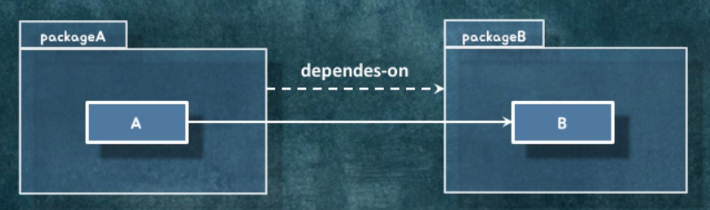

- 발표 영상 https://youtu.be/dJ5C4qRqAgA
- 발표자료 https://www.slideshare.net/baejjae93/ss-151545329


## 설계란?

- "어디에다가 어떤 코드를 배치할 것인가?" 에 대한 의사결정
- 같이 변경되는 코드를 같이 배치해야 하고 따로 변경되는 코드는 분리한다.
- 변경의 핵심은? 의존성!

## 의존성?

- A가 B에 의존한다 : B가 변경되면 A도 변경될 수 있다
- 클래스 사이의 의존성이 있고 패키지 사이의 의존성이 있다.

### 클래스 사이의 의존성


- 연관관계

  - "A에서 B로 이동할 수 있어요."

  - A에서 B로 영구적으로 갈 수 있는 경로가 있음

    ```java
    class A {
      private B b;
    }
    ```

- 의존관계

  - 파라미터에 그 타입이 나오거나, 리턴 타입에 그 타입이 나오거나, 메서드 안에서 그 타입의 인스턴스를 생성한다

  - 협력을 하는 어떤 시점에 일시적으로 관계를 맺고 헤어지는 관계

    ```java
    class A {
      public B method(B b){
        return new B();
      }
    }
    ```

- 상속관계

  - 구현이 바뀌더라도 영향을 받을 수 있음

    ```java
    class A extends B {
    }
    ```

- 실체화 관계

  - 인터페이스의 시그니처가 바뀌었을때만 영향을 받음

    ```java
    class A implements B {
    }
    ```

### 패키지 사이의 의존성



- "패키지B안에 있는 클래스가 바뀌면 패키지A에 있는 클래스가 바뀌어요"
- "import문에 다른 패키지의 클래스가 존재해요"

### 좋은 의존성을 관리하기 위한 몇가지 규칙

- 양방향 의존성을 피하라 : 양방향이 이루어지는 건 하나의 클래스를 억지로 찢어놓은 것일수도 있다

- 다중성이 적은 방향을 선택하라

  ```java
  class A {
    private Collection<B> bs;
  }
  class B {
  }
  //보다는
  
  class A {
  }
  class B {
    private A a;
  }
  //가 낫다.
  ```

- 의존성이 필요없다면 제거하라

- 패키지 사이의 의존성 사이클을 제거하라

  packageA -> packageB -> packageC -> packageA 이런 경우 세 패키지는 하나로 묶여야 한다

## AS-IS


## 관계의 방향 결정하기

- 관계의 방향 = 협력의 방향 = 의존성의 방향
- 런타임에 객체가 어떤 방향으로 협력하는지 결정해야 함

## 관계의 종류 결정하기

- 연관관계 : 협력을 위해 필요한 **영구적인** 탐색 구조
  - 연관관계 = 탐색 가능성
  - 어떤 객체에서 다른 객체로 빈번하게 가야 하고, 계속 협력해야 한다면 연관관계를 고려
  - 일반적으로 객체 참조를 사용해여 연관관계를 구현한다.
- 의존관계 : 협력을 위해 **일시적으로** 필요한 의존성 (파라미터, 리턴타입, 지역변수)

## 구현 시작하기

```java
public class Order {
  
  public void place() {
    validate(); //검증
    ordered(); //주문의 상태 변경
  }
  
  private void validate() {
    ...
  }
  
  private void ordered() {
    ...
  }
}
```

- 주문하기라는 기능은 Order라는 객체에 주문하기라는 메시지가 도착했을때 시작한다.
- 어떤 객체가 어떤 메시지를 받는다는 것은 public 메서드가 있다는 것.
- 메시지를 받기 때문에 메서드가 필요한 것! 메서드를 만들었기 때문에 메시지를 받는 게 아니다. (순서는 메시지 -> 메서드)

## 설계 개선하기

설계를 개선하고 싶다면 일단 의존성을 나타내는 그림을 그려보자 (의존성이 어떤 모양인지, 사이클은 있는지 ... )

객체참조가 가져오는 문제점