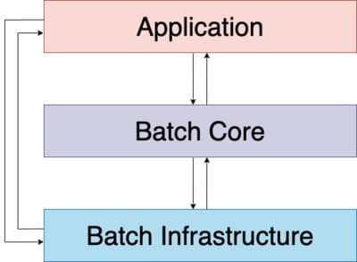

# 스프링 배치

## 스프링 배치 계층구조



- Application: 개발자가 작성한 모든 배치 작업과 사용자 정의 코드 포함
- Batch Core: 배치 작업을 시작하고 제어하는데 필요한 핵심 런타임 클래스 포함 (`JobLauncher`, `Job`, `Step`)
- Batch Infrastructure: 개발자와 어플리케이션에서 사용하는 일반적인 Reader와 Writer 그리고 RetryTemplate과 같은 서비스를 포함

## 도메인 용어


- Job(Flow) : 배치 작업

  -  최소 하나의 Step을 가져야 한다 (2~10개의 Step권장)

- Step
  - 읽기(ItemReader) -> 가공하기(ItemProcessor) -> 쓰기(ItemWriter)의 묶음 (Chunk processing)

  - Chunk processing의 컨셉

    ```java
    List items = new Arraylist();
    for (int i = 0; i < commitInterval; i++) {
        Object item = itemReader.read()
        Object processedItem = itemProcessor.process(item);
        items.add(processedItem);
    }
    itemWriter.write(items);
    ```

  - ItemReader : 데이터 읽기를 담당

    - `T read()` : 읽어들인 데이터를 반환, 데이터의 마지막엔 null을 반환
    - 반환값은 ItemProcessor의 input

  - ItemProcessor : 읽은 데이터를 가공 후에 전달 (필수x)

    - `public interface ItemProcessor<I,O>`
    - `O process(I item)`
    - ItemReader<T>의 T ==  ItemProcessor<I,O>의 I
    - ItemProcessor<I,O>의 O == ItemWriter<T>의 T

  - ItemWriter : 데이터 쓰기를 담당

    - `void write(List<? extends T> items)`
    - commit-interval 프로퍼티에 정의된 개수만큼 데이터가 모이면 `write` 메소드를 실행 (Step에서 정의)

- Tasklet: Step안에서 수행될 비즈니스 로직 전략의 인터페이스

  - Tasklet 하나와 Reader & Processor & Writer 한 묶음이 같은 레벨
  - -> Reader & Processor가 끝나고 Tasklet으로 마무리 짓는 등으로 만들순 없음

## 메타데이터 테이블 구조


- 여러 데이터를 가지고 있음
  - 이전에 실행한 Job이 어떤 것들이 있는지
  - 최근 실패한 Batch Parameter가 어떤것들이 있고, 성공한 Job은 어떤것들이 있는지
  - 다시 실행한다면 어디서 부터 시작하면 될지
  - 어떤 Job에 어떤 Step들이 있었고, Step들 중 성공한 Step과 실패한 Step들은 어떤것들이 있는지

### BATCH_JOB_INSTANCE

- Job Parameter(Spring Batch가 실행될때 외부에서 받을 수 있는 파라미터)에 따라 생성되는 테이블
- 컬럼 목록
  - JOB_INSTANCE_ID
  - VERSION
  - JOB_NAME : 수행한 배치 잡 이름
  - JOB_KEY

### BATCH_JOB_EXECUTION

- BATCH_JOB_EXECUTION와 BATCH_JOB_INSTANCE는 부모-자식 관계
