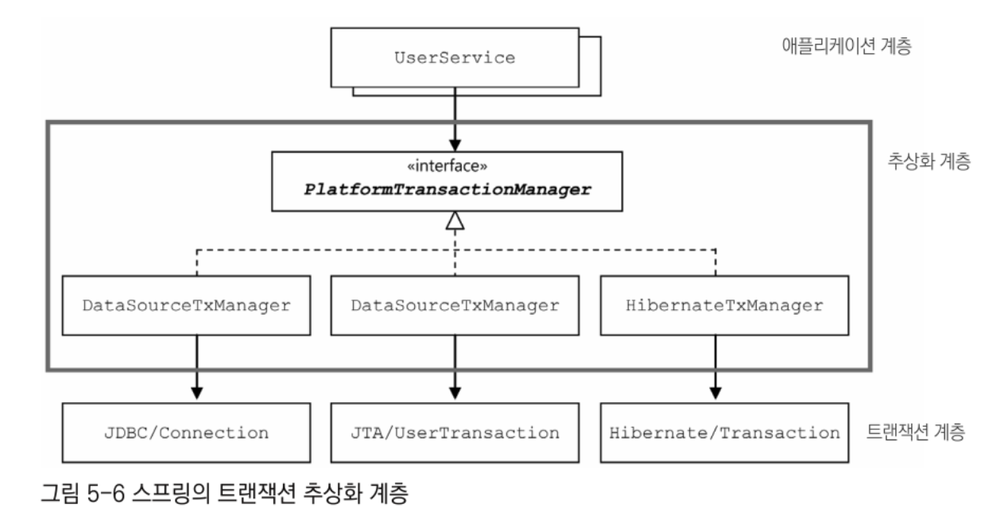
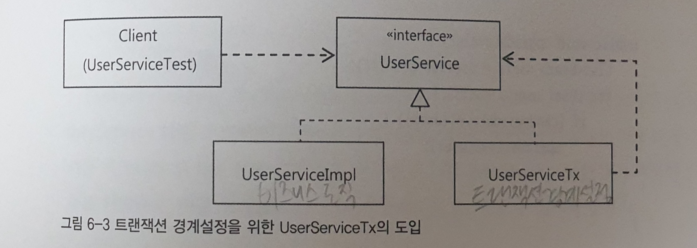
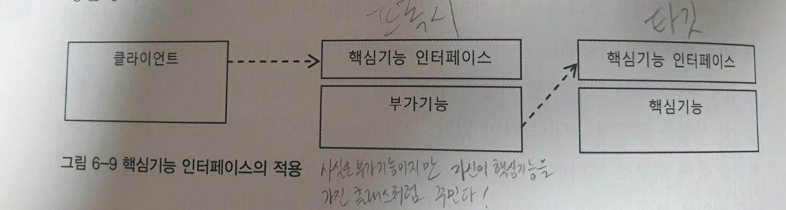
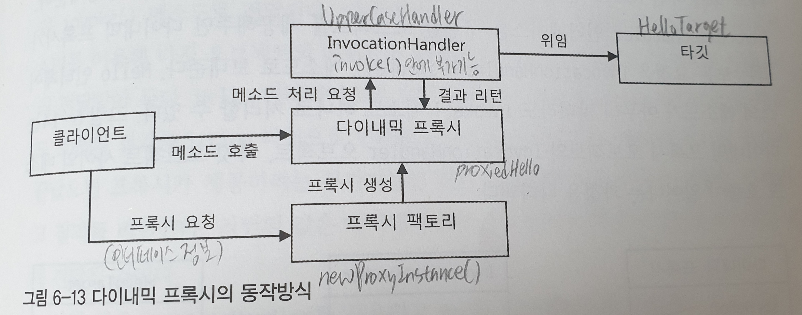
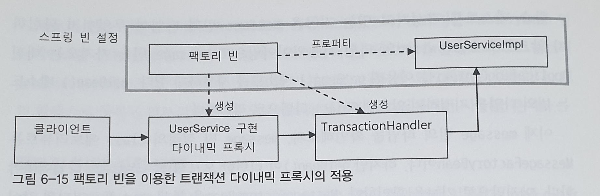
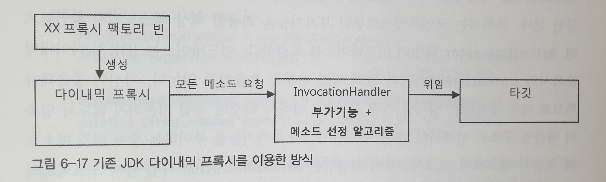
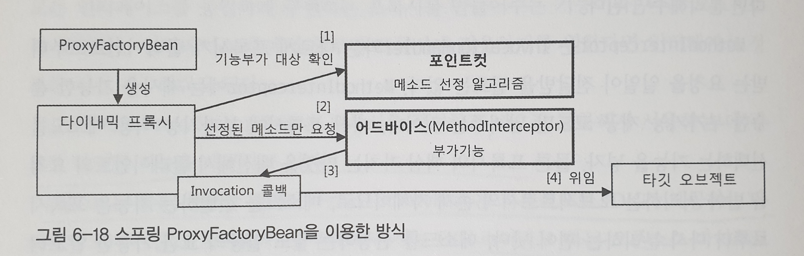
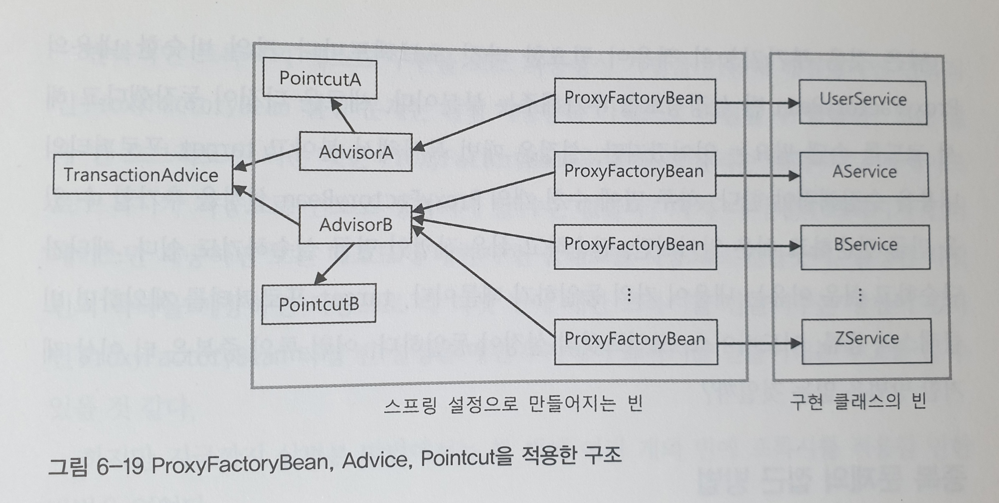
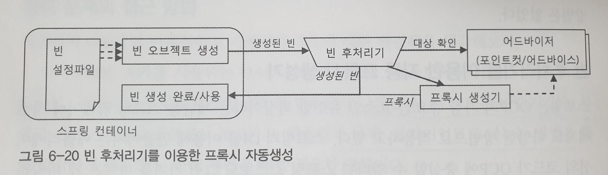

# 토비의 스프링 3.1 Vol.1 정리

## 1장 오브젝트와 의존관계

스프링의 핵심 철학은?

> 자바 엔터프라이즈 기술의 혼란 속에서 잃어버렸던 객체지향 기술의 진정한 가치를 회복시키고, 객체지향의 혜택을 누릴 수 있도록 기본으로 돌아가자.

<br/>

### 1.1 초난감 DAO

사용자 정보를 저장할때는 자바빈 규약을 따르는 오브젝트를 이용하면 편리하다. User클래스와 UserDao를 만들어보자.

자바빈 : 디폴트 생성자와 프로퍼티(getter, setter로 수정 또는 조회 가능)를 가진 오브젝트

```java
@Getter @Setter
public class User {
	String id;
	String name;
	String password;
}
```

```java
public class UserDao {
	public void add(User user) throws ClassNotFoundException, SQLException {
		Class.forName("com.mysql.jdbc.Driver");
		Connection c = DriverManager.getConnection("jdbc:mysql://localhost/springbook?characterEncoding=UTF-8", "spring", "book");

		PreparedStatement ps = c.prepareStatement(
			"insert into users(id, name, password) values(?,?,?)");
		ps.setString(1, user.getId());
		ps.setString(2, user.getName());
		ps.setString(3, user.getPassword());

		ps.executeUpdate();

		ps.close();
		c.close();
	}


	public User get(String id) throws ClassNotFoundException, SQLException {
		Class.forName("com.mysql.jdbc.Driver");
		Connection c = DriverManager.getConnection("jdbc:mysql://localhost/springbook?characterEncoding=UTF-8", "spring", "book");
		PreparedStatement ps = c.prepareStatement("select * from users where id = ?");
		ps.setString(1, id);

		ResultSet rs = ps.executeQuery();
		rs.next();
		User user = new User();
		user.setId(rs.getString("id"));
		user.setName(rs.getString("name"));
		user.setPassword(rs.getString("password"));

		rs.close();
		ps.close();
		c.close();

		return user;
	}
}
```

위 코드는 굉장히 난감한 코드다. 천천히 개선해보자.

<br/>

### 1.2 DAO의 분리

오브젝트에 대한 설계와 이를 구현한 코드는 항상 바뀐다. 미래의 변화에 가장 좋은 대처는 한 가지 관심이 한 군데에 집중되게 하는 것이다.

UserDao는 사실 3가지 관심이 혼재되어 있다.

1. DB와의 연결을 위한 커넥션을 어떻게 가져올까?
2. SQL을 담을 Statement를 만들고 실행하기
3. Statement와 Connection 오브젝트를 닫기

일단, 중복된 코드를 getConnection()으로 추출해보자.

```java
public class UserDao {
	public void add(User user) throws ClassNotFoundException, SQLException {
		Connection c = getConnection();

		PreparedStatement ps = c.prepareStatement(
			"insert into users(id, name, password) values(?,?,?)");
		ps.setString(1, user.getId());
		ps.setString(2, user.getName());
		ps.setString(3, user.getPassword());

		ps.executeUpdate();

		ps.close();
		c.close();
	}


	public User get(String id) throws ClassNotFoundException, SQLException {
		Connection c = getConnection();
        
		PreparedStatement ps = c.prepareStatement("select * from users where id = ?");
		ps.setString(1, id);

		ResultSet rs = ps.executeQuery();
		rs.next();
		User user = new User();
		user.setId(rs.getString("id"));
		user.setName(rs.getString("name"));
		user.setPassword(rs.getString("password"));

		rs.close();
		ps.close();
		c.close();

		return user;
	}


	private Connection getConnection() throws ClassNotFoundException, SQLException {
		Class.forName("com.mysql.jdbc.Driver");
		Connection c = DriverManager.getConnection("jdbc:mysql://localhost/springbook?characterEncoding=UTF-8", "spring", "book");
		return c;
	}
}
```

이제 커넥션을 가져오는 부분에 대한 수정을 하려면 getConnection() 메서드만 수정하면 된다.

UserDao를 그대로 이용하되, getConnection() 메서드만 변경해서 사용하고 싶으면 상속을 이용할 수 있다.

getConnection()을 추상 메서드로 변경하고, 이 UserDao를 상속받으면 된다. (템플릿 메소드 패턴)

상속받은 하위 오브젝트는 커넥션 생성 방법을 스스로 결정한다. (팩토리 메소드 패턴)

```java
public abstract class UserDao {
	public void add(User user) throws ClassNotFoundException, SQLException {
		Connection c = getConnection();
		...
	}


	public User get(String id) throws ClassNotFoundException, SQLException {
		Connection c = getConnection();
		...

	private abstract Connection getConnection() throws ClassNotFoundException, SQLException {
	}
}
```

```java
public class NUserDao extends UserDao {
    public Connection getConnection() throws ClassNotFoundException, SQLException {
        //N사 DB커넥션 생성코드
    }
}
```

```java
public class DUserDao extends UserDao {
    public Connection getConnection() throws ClassNotFoundException, SQLException {
        //D사 DB커넥션 생성코드
    }
}
```

- UserDao는 getConnection() 메소드에서 생성하는 오브젝트가 Connection인터페이스의 오브젝트라는 것 이외에는 관심이 없다.
- UserDao는 Connection 오브젝트가 만들어지는 방법, 내부 동작 방식에는 관심이 없고 사용할 뿐이다.
- NUserDao와 DUserDao는 어떤 식으로 Connection 오브젝트를 만들어내는지에만 관심을 가지고 있다.

하지만!

- 만약 이미 UserDao가 상속을 사용하고 있다면? 다음에 UserDao에 상속을 적용하기 힘들다
- 상속을 사용하면 상하위 클래스의 관계가 밀접해진다.
- 확장된 기능인 DB커넥션을 생성하는 코드를 다른 DAO에 적용할 수 없다.

<br/>

### 1.3 DAO의 확장

상속을 사용해서 분리하지 말고 아예 별개의 클래스를 만들어서 분리해보자.

```java
public class SimpleConnectionMaker {
    public Connection makeNewConnection() throws ClassNotFoundException, SQLException {
        ...
    }
}
```

```java
public class UserDao {
    private SimpleConnectionMaker simpleConnectionMaker;
    
    public UserDao() {
        simpleConnectionMaker = new SimpleConnectionMaker();
    }
    
    public void add(User user) throws ClassNotFoundException, SQLException {
		Connection c = simpleConnectionMaker.makeNewConnection();
		...
	}
    
    public User get(String id) throws ClassNotFoundException, SQLException {
		Connection c = simpleConnectionMaker.makeNewConnection();
		...
	}
}
```

- 하지만 UserDao클래스만 공급하고 상속을 통해 DB 커넥션 기능을 확장할 수 있었던 게 도로 못하게 됐다.
  - UserDao가 특정 클래스에 종속되어 있기 때문에 DB 커넥션 기능을 확장하려면 UserDao를 직접 수정해야 하기 때문에
- 이 코드의 문제점은?
  - D사의 DB커넥션 제공 클래스가 openConnection()이라는 메소드명을 사용한다면 UserDao.add(), UserDao.get()안의 makeNewConnection()을 모두 openConnection()으로 변경해야 한다.
  - DB커넥션을 제공하는 클래스가 어느것인지 UserDao가 구체적으로 알고 있어야 한다.
- 왜 그럴까?
  - UserDao가 DB커넥션을 가져오는 정보에 대해 너무 많이 알고 있기 때문이다.
  - UserDao가 SimpleConnectionMaker라는 특정 클래스에 종속적이기 때문이다.
  - 그래서 고객이 DB커넥션을 가져오는 방법을 자유롭게 확장하기가 힘들다.


그럼 ConnectionMaker라는 인터페이스를 만들어서 어떻게 구현했는지에 대한 관심을 두지 말자.

```java
public interface ConnectionMaker {
    public Connection makeConnection() throws ClassNotFoundException, SQLException;
}
```

```java
public class DConnectionMaker implements ConnectionMaker {
    public Connection makeConnection() throws ClassNotFoundException, SQLException {
        //D사의 커넥션 생성 코드
    }
}
```

```java
public class UserDao {
    private ConnectionMaker connectionMaker;
    
    public UserDao() {
        connectionMaker = new DConnectionMaker();
    }
    
    public void add(User user) throws ClassNotFoundException, SQLException {
		Connection c = connectionMaker.makeConnection();
		...
	}
    
    public User get(String id) throws ClassNotFoundException, SQLException {
		Connection c = connectionMaker.makeConnection();
		...
	}
}
```

- DConnectionMaker같은 친구를 많이 만들어도 UserDao는 전혀 변경되지 않을 것 같다.
- 하지만 DConnectionMaker라는 특정 오브젝트가 UserDao 코드 속에 존재한다. (구체적인 클래스를 알게 된다.)
- 이는 UserDao안에 또다른 관심사항이 존재하기 때문이다.(어떤 구현체를 사용할 것인가?에 대한 관심사항)
- 그럼 그 관심을 어디에 둘까? UserDao의 클라이언트가 적절하다.
  - 왜냐하면 클라이언트가 UserDao를 사용하는 입장이기 때문에 ConnectionMaker의 구현체를 선택해서 UserDao와 연결시켜줘야 하는 책임이 있다.
- UserDao의 클라이언트가 UserDao오브젝트와 ConnectionMaker오브젝트의 관계를 설정해준다(클래스와 클래스 관계를 설정해주는 게 아니다!)
- 클래스 사이의 관계와 오브젝트 사이의 관계를 잘 구분할 줄 알아야 한다.
  - 클래스 사이의 관계는 코드의 다른 클래스의 이름이 나타남으로써 생김
  - 오브젝트 사이의 관계는 런타임에 생김
  - 코드에서는 특정 클래스를 전혀 알고 있지 않더라도 해당 클래스가 구현한 인터페이스를 사용했다면 사용가능하다.
  - 다형성 덕분!

구현체 선택에 대한 관심을 클라이언트에 떠넘겨보자.

```java
public class UserDao {
    private ConnectionMaker connectionMaker;
    
    public UserDao(ConnectionMaker connectionMaker) {
        this.connectionMaker = connectionMaker; //DConnectionMaker가 사라졌다.
    }
    
    public void add(User user) throws ClassNotFoundException, SQLException {
		Connection c = connectionMaker.makeConnection();
		...
	}
    
    public User get(String id) throws ClassNotFoundException, SQLException {
		Connection c = connectionMaker.makeConnection();
		...
	}
}
```

```java
public static void main(String[] args) throws ClassNotFoundException, SQLException {
    ConnectionMaker connectionMaker = new DConnectionMaker();//클라이언트가 구현체 직접선택
    UserDao dao = new UserDao(connectionMaker);//오브젝트사이의 의존관계 설정
    ...
}
```

- 이제 DB커넥션을 가져오는 방법을 어떻게 변경하든 UserDao코드는 아무런 영향을 받지 않는다.
- DAO가 아무리 많아져도 DB접속방법에 대한 관심은 오직 한 군데에 집중되어 있다.

<br/>

### 1.4 제어의 역전(IoC)

IoC가 뭔지 살펴보기 위해 UserDao코드를 좀 더 개선해보자.

그동안 UserDao를 테스트하던 main메소드는 엉겁결에 UserDao가 어떤 ConnectionMaker 구현클래스를 사용할지에 대한 책임까지 떠맡고 있는 상황이다.

UserDao와 ConnectionMaker 구현 클래스의 오브젝트를 만드는 것과, 관계를 맺어주는 책임을 분리하자.

```java
public class DaoFactory {
    public UserDao userDao() {
        ConnectionMaker connectionMaker = new DConnectionMaker();
        UserDao userDao = new UserDao(connectionMaker);
        return userDao;
    }
}
```

```java
public static void main(String[] args) throws ClassNotFoundException, SQLException {
    UserDao dao = new DaoFactory.userDao();
    ...
}
```

- DaoFactory 같은 작업이 어플리케이션 전체에 걸쳐 일어난다면 컴포넌트 의존관계에 대한 설계도와 같은 역할을 한다.
- 어플리케이션의 컴포넌트 역할을 하는 오브젝트와 애플리케이션의 구조를 결정하는 오브젝트를 분리했다!
- 수정 전에는 UserDao나 main메서드가 본인이 사용할 오브젝트를 직접 생성하고, 사용하는 등 적극적으로 제어했다.
- 하지만 지금은 자신이 사용할 오브젝트를 직접 선택하지 않는다.
- 제어의 권한을 위임하므로써 수동적인 존재가 됐다. 이를 제어의 역전이라고 한다.
- IoC를 사용하면 설계가 깔끔해지고 유연성과 확장성이 좋아진다.

<br/>

### 1.5 스프링의 IoC

들어가기 전, 용어정리

- 빈/빈 오브젝트/스프링 빈
  - 스프링이 제어권을 가지고 직접 만들고 관계를 부여하는 오브젝트
  - 제어의 역전(스프링 컨테이너가 생성, 관계설정, 사용 등을 제어)이 적용된 오브젝트
  - 스프링 애플리케이션의 모든 오브젝트가 빈은 아니다.
- 빈 팩토리/어플리케이션 컨텍스트/IoC 컨테이너/스프링 컨테이너
  - 동일하다고 생각하면 됨. (정확하게는 어플리케이션 컨텍스트가 빈 팩토리를 확장한 것)
  - 스프링의 핵심
  - 빈 팩토리 : 빈의 생성과 관계설정같은 제어를 담당하는 IoC오브젝트. (IoC의 기본 기능에 초점)
  - 어플리케이션 컨텍스트 : IoC방식을 따라 만들어진 일종의 빈 팩토리. (IoC 엔진이라는 의미에 더 초점), 빈 팩토리 + 스프링의 부가 서비스
- 설정정보/설정 메타정보
  - 애플리케이션 컨텍스트 또는 빈 팩토리가 IoC를 적용하기 위해 사용되는 메타정보
  - 청사진(blueprints)라고도 함

<br/>

DaoFactory를 스프링의 빈 팩토리가 사용할 수 있는 설정정보로 만들어보자.

```java
@Configuration
public class DaoFactory {
    @Bean
    public UserDao userDao() {
        return new UserDao(connectionMaker());
    }
    
    @Bean
    public ConnectionMaker connectionMaker() {
        return new DConnectionMaker();
    }
}
```

그럼, DaoFactory를 설정정보로 사용하는 애플리케이션 컨텍스트를 만들어보자.

```java
public static void main(String[] args) throws ClassNotFoundException, SQLException {
    ApplicationContext context = new AnnotationConfigApplicationContext(DaoFactory.class);
    UserDao dao = context.getBean("userDao", UserDao.class);
}
```

DaoFactory를 직접 만들어 사용하는 것보다 더 번거로워졌다. 그런데 굳이 스프링을 사용하는 이유가 뭘까?

어플리케이션 컨텍스트의 장점은?

- 구체적인 팩토리 클래스를 알 필요 없다.
  - 추후에 오브젝트 팩토리 클래스가 많아져도 이를 알아야 하거나 직접 사용할 필요가 없다. 
  - 자바코드 대신 XML로 설정정보를 만들 수 있다.
- 오브젝트 생성, 관계설정만 해주는게 아니다.
  -  자동생성, 오브젝트 후처리, 정보의 조합, 설정방식의 다변화, 인터셉팅 등 다양한 기능을 제공한다.
- 빈을 검색하는 다양한 방법을 제공한다.
  - 이름, 타입, 애노테이션 기반으로도 검색 가능

<br/>

어플리케이션 컨텍스트 동작 방식

1. DaoFactory클래스를 설정 정보로 등록
2. @Bean이 붙은 메소드의 이름을 가져와 빈 목록 만듦
3. 클라이언트가 getBean("userDao", UserDao.class)을 호출하면 빈 목록에서 찾아서 userDao()를 실행하여 UserDao 오브젝트를 제공

<br/>

### 1.6 싱글톤 레지스트리와 오브젝트 스코프

애플리케이션 컨텍스트는 싱글톤을 저장하고 관리하는 싱글톤 레지스트리이다.

왜 스프링은 싱글톤으로 빈을 만들까?

- 스프링의 주요 적용 대상이 자바 엔터프라이즈 기술을 사용하는 서버 환경이기 때문.
- 매번 클라이언트에서 요청이 올 때마다 각 로직을 담당하는 오브젝트를 새로 만든다면 감당하기 힘들다
- 그래서 서블릿 클래스당 하나의 오브젝트만 만들어두고, 사용자의 요청을 담당하는 여러 스레드에서 하나의 오브젝트를 공유해 동시에 사용한다

하지만 싱글톤 패턴은 다음과 같은 한계점이 존재한다.

- private 생성자를 갖고 있기 때문에 상속할 수 없다. (다형성 적용 불가)
- 테스트하기 힘들다. (생성되는 방식이 제한적이기 때문에 목으로 대체하기 어렵다)
- 서버환경에서는 싱글톤을 보장하지 못한다. (클래스로더를 어떻게 구상하고 있는지에 따라 보장x, 여러개의 JVM에 분산되는 경우 등)
- 전역상태로 사용되기 쉽다. 객체지향적이지 않음

스프링의 싱글톤 레지스트리 덕분에

- 스태틱 메소드와 private 생성자를 사용하지 않고도 평범한 자바 클래스를 싱글톤으로 활용하게 해준다.
- 평범한 자바 클래스라도 제어권을 컨테이너에게 넘기면 손쉽게 싱글톤 방식으로 만들어져 관리된다.
- 싱글톤으로 사용되야 하는 환경이 아니라면 간단히 오브젝트를 생성해서 사용할 수 있다. -> 테스트 쉬움
- 싱글톤 패턴과 달리 객체지향, 디자인패턴 등을 적용하는데 아무런 제약이 없다.

하지만 조심해야함!

- 멀티스레드 환경에서 여러 스레드가 동시에 접근할 수 있다. 그래서 무상태(stateless)방식으로 만들어야 한다.
- 인스턴스 변수를 사용하더라도 읽기 전용으로 만들어야 한다.
- 파라미터와 로컬변수, 리턴 값 등을 이용하면 스레드에 안전하다(매번 독립적인 공간이 만들어져 저장되기 때문)

<br/>

빈의 스코프

- 빈이 생성되고, 존재하고, 적용되는 범위
- 빈의 기본 스코프는 싱글톤
- 스코프 종류
  - 싱글톤 스코프
  - 프로토타입 스코프(빈을 요청할때마다 새로운 오브젝트 생성함)
  - 요청 스코프, 세션 스코프 등..

<br/>

### 1.7 의존관계 주입(DI)

- 스프링 IoC 기능의 대표적인 동작원리는 주로 의존관계 주입(DI)이라고 불린다. 
- 스프링이 여타 프레임워크와 차별화돼서 제공해주는 기능은 DI라는 용어를 사용할 때 분명히 드러난다. 
- 그래서 지금은 스프링을 DI컨테이너라고 더 많이 불린다.

의존관계 주입(DI)이란?

- 구체적인 의존 오브젝트(DConnectionMaker)와 그것을 사용할 주체(클라이언트 오브젝트, UserDao)를 런타임 시에 연결해주는 작업
- 다음 3가지 조건을 충족해야 한다.
  1. 클래스 모델이나 코드에는 런타임 시점의 의존관계가 드러나지 않는다. 인터페이스에만 의존하고 있어야 한다.
  2. 런타임 시점의 의존관계는 컨테이너나 팩토리같은 제3의 존재가 결정한다.
  3. 의존관계를 사용할 오브젝트에 대한 레퍼런스를 외부에서 제공(주입)해줌으로써 만들어진다.

스프링이 제공하는 IoC 방법에는 DI만 있는게 아니다. 의존관계 검색(DL)이라는 것도 있다.

UserDao의 생성자를 다음과 같이 만들었다고 하자.

```java
public UserDao() {
    DaoFactory daoFactory = new DaoFactory();
    this.connectionMaker = daoFactory.connectionMaker();
}
```

위와 같이 해도 IoC 개념을 잘 따르고 있다. 다만 DI방식이 아닌 DL방식을 사용했다.(어플리케이션 콘텍스트의 getBean()이 DL)

의존관계 주입(DI) vs 의존관계 검색(DL)

- 코드안에 오브젝트 팩토리 클래스나 스프링 API가 노출되지 않는 DI쪽이 더 깔끔하다.
- 하지만 애플리케이션 기동 시점에서 적어도 한 번은 DL을 사용해야 한다. (스프링이 제공하기 때문에 직접 구현할 필요 x)
- DL에선 검색을 수행하는 오브젝트는 스프링 빈일 필요가 없는 반면, DI에선 주입받을 오브젝트, 주입할 오브젝트 모두 빈 오브젝트여야 한다. (DI를 원하는 오브젝트는 먼저 자신이 컨테이너가 관리하는 빈이 돼야한다.)

> 단지 외부에서 파라미터로 오브젝트를 넘겨줬다 해서 다 DI가 아니다!
>
> 주입받는 메소드 파라미터가 이미 특정 클래스 타입으로 고정되어 있다면 DI가 일어날 수 없다. 인터페이스 타입이어야 한다.

DI의 장점

- 코드에는 런타임 클래스에 대한 의존관계가 나타나지 않고, 인터페이스를 통해 결합도가 낮은 코드를 만드므로, 의존관계에 있는 대상이 바뀌어도 영향을 받지 않는다.
- 다양한 확장에 자유롭다.

DI의 방법

- 생성자 이용
- 수정자 이용
- 일반 메소드 이용

<br/>

### 1.8 XML을 이용한 설정

스프링은 DaoFactory같은 자바 클래스 이외에도, XML으로도 DI 의존관계 설정정보를 만들 수 있다.

XML의 장점

- 텍스트 파일이라 다루기 쉽다
- 쉽게 이해할 수 있다
- 컴파일 같은 빌드작업이 필요 없다
- 오브젝트 관계가 바뀌는 경우에도 빠르게 변경사항을 반영할 수 있다.

DaoFactory를 XML로 전환해보자.

```java
@Configuration
public class DaoFactory {
    @Bean
    public UserDao userDao() {
        UserDao userDao = new UserDao();
    	userDao.serConnectionMaker(connectionMaker());
    	return userDao;
    }
    
    @Bean
    public ConnectionMaker connectionMaker() {
        return new DConnectionMaker();
    }
}
```

```xml
<beans>
    <bean id="connectionMaker" class="springbook.user.dao.DConnectionMaker" />
    <bean id="userDao" class="springbook.user.dao.UserDao">
    	<property name="connectionMaker" ref="connectionMaker" />
    </bean>
</beans>
```

- @Configuration은 <beans>와 대응
- @Bean은 <bean>과 대응
  - id 애트리뷰트엔 빈의 이름
  - class 애트리뷰트엔 빈의 클래스(메소드의 리턴타입이 아니고 오브젝트를 만들때 사용하는 클래스이름)
- <property>는 의존 오브젝트와의 관계 정의
  - name 애트리뷰트는 프로퍼티의 이름
  - ref 애트리뷰트 수정자 메소드를 통해 주입해줄 오브젝트의 빈 이름(id)
  - 빈 오브젝트가 아니라 값을 주입할 땐 value 애트리뷰트를 사용한다.

그럼 이제 애플리케이션 컨텍스트가 DaoFactory대신 XML 설정정보를 활용하도록 해보자.

```xml
// applicationContext.xml

<?xml version="1.0" encoding="UTF-8"?>
<beans xmlns="http://www.springframework.org/schema/beans"
	xmlns:xsi="http://www.w3.org/2001/XMLSchema-instance"
	xsi:schemaLocation="http://www.springframework.org/schema/beans 
						http://www.springframework.org/schema/beans/spring-beans-3.0.xsd">
	<bean id="connectionMaker" class="springbook.user.dao.DConnectionMaker" />

	<bean id="userDao" class="springbook.user.dao.UserDao">
		<property name="connectionMaker" ref="connectionMaker" />
	</bean>
</beans>
```

```java
ApplicationContect context = new GenericXmlApplicationContext("applicationContext.xml");
```

- XML을 이용할때는 GenericXmlApplicationContext을 사용한다.
- 인자로는 XML파일의 클래스패스를 넣어준다
- 편리한 기능들이 추가된 ClassPathXmlApplicationContext을 이용할수도 있다.

<br/>

### 1.9 정리

> 스프링이란 '어떻게 오브젝트가 설계되고, 만들어지고, 어떻게 관계를 맺고 사용되는지에 관심을 갖는 프레임워크'이다. 어떤 의존관계를 가질지 결정하는 일은 개발자의 역할이다. 스프링은 단지 원칙을 잘 따르는 설계를 적용하려고 할 때 반복되는 작업을 도와주는 도구임을 잊지 말자.

### 1장 독후감

- 클래스와 클래스의 관계를 설정한다는 게 아니라 오브젝트와 오브젝트의 관계를 설정해준다는 것이 생각해보면 당연한건데, 읽으면서 뭔가 깨달은 듯한 띵함을 느꼈다.
- 템플릿 메서드 패턴과 팩토리 메서드 패턴의 차이를 명확하게 알고 가자.

<br/>

## 2장 테스트

애플리케이션의 변화에 대응하는 두가지 전략

1. 확장과 변화를 고려한 객체지향적 설계와 그것을 효과적으로 담아낼 수 있는 IoC/DI
2. 코드에 대한 확신을 주고 변화에 대처할 수 있는 자신감을 주는 **테스트**

### 2.1 UserDaoTest 다시 보기

테스트

- 예상하고 의도했던 대로 코드가 정확히 동작하는지 확인 -> 디버깅 -> 결함 제거
- 수정 후 테스트를 모두 돌려보면 되니까 더이상 수정에 두려움을 갖지 않아도 된다.

DAO를 테스트하기 위해 모든 레이어를 만들고, 서버에 배치하고 직접 값을 입력하고 등등.. 이런 작업을 하는 건 번거롭고 오류가 있을 때 어떤 곳에서 오류가 발생했는지 파악하기 힘들다.

단위 테스트

- 테스트는 가능하면 그 대상에만 집중해서 해야 한다.
- 단위는 작을수록 좋다
- 여기서의 단위는 딱 정해진 건 아니고 충분히 하나의 관심에 집중해서 효율적으로 테스트할만한 범위의 단위.
- 통제할 수 없는 외부의 리소스에 의존하는 테스트는 단위 테스트가 아니다.
- 단위 테스트를 하는 이유는 코드가 원래 의도대로 동작하는지 개발자 스스로 빨리 확인받기 위해
- 나중에 오류가 발견되어서 디버깅하는 것보단 초반에 발견하여 고치는 것이 더 효율적이다.

자동수행 테스트 코드

- 테스트를 할 때마다 웹을 띄우고, 개발자가 스스로 값을 입력하고 하는 등 귀찮은 작업은 자동화해야 한다.
- 자주 반복할 수 있다.

점진적인 개선을 위한 테스트

- 테스트가 있기 때문에 과감하게 리팩토링 할수 있었다.
- UserDao의 기능을 추가할 때에도 미리 만들어 놓은 테스트코드는 유용하게 쓰인다.

하지만 UserDaoTest도 문제가 있다.

1. 자동으로 진행되지만 기대값과의 비교는 개발자의 몫이다.
2. 나중에 기능이 많아지면 전체 기능을 테스트하기 위해 하나하나 실행해줘야 한다.

두 문제점을 개선해보자.

<br/>

### 2.2 UserDaoTest 개선

첫번째 문제점은 if-else문과 equals()로 비교할 수 있다.

두번째 문제점은 JUnit 프레임워크를 사용하면 해결할 수 있다.

JUnit 프레임워크를 사용하려면 main()메소드 테스트가 직접 제어권을 갖고 있으면 안된다. (IoC)

JUnit이 요구하는 두가지 조건을 따라야 한다.

1. 테스트 메소드는 public으로 선언돼야 한다.
2. 테스트 메소드에 @Test를 붙여줘서 JUnit에게 테스트 메소드임을 알린다.

```java
public class UserDaoTest {
    
    @Test
    public void addAndGet() throws SQLException {
        ApplicationContext context
            = new ClassPathXmlApplicationContext("applicationContext.xml");
        UserDao dao = context.getBean("userDao", UserDao.class);
        
        User user1 = new User("id", "name", "password");
        dao.add(user1);
        User user2 = dao.get(user1.getId());
        
        assertThat(user2.getName(), is(user1.getName()));
        assertThat(user2.getPassword(), is(user1.getPassword()));
    }
}
```

- is()는 매처의 일종으로, equals()로 비교해준다.
- assertThat()을 이용해 검증했을 때 기대한 결과가 아니면 AssertionError을 던진다.

<br/>

### 2.3 개발자를 위한 테스팅 프레임워크 JUnit

JUnit

- 사실상 자바의 표준 테스팅 프레임워크
- 한번에 여러 테스트 클래스를 동시에 실행할 수 있다
- 테스트 후 결과를 메일 등으로 통보받을 수도 있다

단위 테스트는 항상 일관성있는 결과가 보장돼야 한다.

- 코드에 변경사항이 없다면 테스트는 항상 동일한 결과를 내야 한다.
- 반복적으로 테스트를 했을 때 실패하기도, 성공하기도 하면 안된다
- 외부 상태, 또는 메서드 순서에 따라 결과가 달라져선 안된다
- 테스트 메서드 시작 또는 끝에 deleteAll()같은 메서드를 추가하여 구현할 수 있다. 

포괄적인 테스트

- 성공하는 테스트만 골라서 만들지 말자.
- 다양한 상황과 입력값을 고려하는 포괄적인 테스트를 만들자.
- "항상 네거티브 테스트를 먼저 만들라." -로드 존슨(스프링의 창시자)-

TDD

- 테스트코드는 잘 작성된 하나의 기능정의서다.
- 테스트가 실패하면 설계한 대로 코드가 만들어지지 않았음을 바로 알 수 있다.
- 테스트가 성공하면 그 순간 구현과 테스트가 동시에 끝나는 것이다.
- TDD의 기본 원칙 : 실패한 테스트를 성공시키기 위한 목적이 아닌 코드는 만들지 않는다.
- 테스트를 빼먹지 않고 꼼꼼하게 만들어낼 수 있다.
- 테스트를 작성하는 시간과 애플리케이션 코드를 작성하는 시간의 간격이 짧아진다. -> 피드백을 빨리 받아볼 수 있다. -> 성공하는 것을 보면서 코드에 대한 확신 -> 자신감과 마음의 여유를 준다.
- 테스트를 작성하고 성공하는 코드를 만드는 작업의 주기를 가능한 짧게 가져가도록 권장한다.
- TDD를 하면 자연스럽게 단위 테스트를 만들 수 있다. 단위테스트가 아니고서는 TDD는 불가능하다.
- 사실 모든 개발자는 코드를 작성하면서 머릿속으로 테스트를 해본다. 이걸 코드로 끄집어내면 TDD가 된다.
- 코드를 만들고 테스트를 실행하는 간격이 매우 짧아서 오류를 빨리 발견할 수 있다.
- 테스트 작성 시간때문에 지연될까 염려되지만 테스트 코드는 상대적으로 애플리케이션 코드보다 작성하기 쉽고, 오류를 빨리 잡아낼 수 있어서 전체적인 개발 속도는 오히려 빠르다.
- 스프링은 테스트하기 편리한 구조의 애플리케이션을 만들 수 있게 도와준다.

JUnit이 하나의 테스트 클래스를 가져와 테스트를 수행하는 방법

1. 테스트 클래스에서 @Test가 붙은 public이고 void형이며 파라미터가 없는 테스트 메소드를 모두 찾는다.
2. 테스트 클래스의 오브젝트를 하나 만든다.
3. @Before가 붙은 메소드가 있으면 실행한다.
4. @Test가 붙은 메소드를 하나 호출하고 테스트 결과를 저장해둔다.
5. @After가 붙은 메소드가 있으면 실행한다.
6. 나머지 테스트 메소드에 대해 2~5번을 반복한다.
7. 모든 테스트의 결과를 종합해서 돌려준다.

각 테스트 메소드를 실행할 때마다 테스트 클래스의 오브젝트를 새로 만든다.

- 한 번 만들어진 테스트 클래스의 오브젝트는 하나의 테스트 메소드를 사용하고 나면 버려진다.
- 왜? 각 테스트가 독립적으로 실행됨을 보장하기 위해.
- 인스턴스 변수를 마음껏 사용할 수 있다.

픽스처

- 테스트를 수행하는데 필요한 정보나 오브젝트
- 여러 테스트에서 반복되는 픽스처는 @Before메소드를 이용해 생성해두면 편하다

<br/>

### 2.4 스프링 테스트 적용

테스트는 가능한 독립적으로 매번 새로운 오브젝트를 만들어서 사용하는 것이 원칙이나, 애플리케이션 컨텍스트같이 많은 자원이 소모되는 경우엔 테스트 전체가 공유하는 오브젝트를 만들기도 한다.

- 애플리케이션 컨텍스트는 초기화되고 나면 내부의 상태가 바뀌는 일이 거의 없다
- 빈은 싱글톤 -> 상태를 갖지 않는다.
- 따라서 애플리케이션 컨텍스트는 한 번만 만들고 테스트들이 공유할 수 있다.

```java
@RunWith(SpringJUnit4ClassRunner.class)
@ContextConfiguration(locations="/applicationContext.xml")
public class UserDaoTest {
    @AutoWired
    private ApplicationContext context;
    ...
        
    @Before
    public void setUp() {
        this.dao = this.context.getBean("userDao", UserDao.class);
        ...
    }
}
```

- @RunWith(SpringJUnit4ClassRunner.class)

  - RunWith은 테스트 실행 방법을 확장할 때 사용
  - 스프링의 테스트 컨텍스트 프레임워크의 JUnit 확장기능 지정

- @ContextConfiguration(locations="/applicationContext.xml")

  - 테스트 컨텍스트가 자동으로 만들어줄 애플리케이션 컨텍스트의 위치를 지정한다.
  - 수백개의 클래스의 locations가 같다면 단 한개의 컨텍스트를 만들어서 공유한다.

- ApplicationContext

  - 테스트 오브젝트가 만들어지면 스프링 테스트 컨텍스트에 의해 자동으로 값이 주입됨
  - locations가 같은 테스트에선 이 오브젝트는 항상 같음

- @AutoWired

  - 테스트 컨텍스트 프레임워크는 타입이 일치하는 빈을 찾고, 있으면 인스턴스 변수에 주입해준다. (생성자나 수정자 없이도) 

    - 찾을땐 타입으로 먼저 찾고, 여러개면 변수의 이름과 같은 이름의 빈이 있는지 찾는다.

  - 그런데 ApplicationContext은 빈으로 등록하지 않았는데 DI됐다? -> 스프링 애플리케이션 컨텍스트는 초기화될때 자기 자신을 빈으로 등록하기 때문

  - DL방식보단 DI방식이 더 코드가 깔끔하다

    ```java
    ...
    public class UserDaoTest {
        @AutoWired
        private UserDao userDao;
        ...
    }
    ```

UserDao가 DataSource의 구현 클래스를 절대 바꾸지 않아도 구현 클래스에 의존하지 않고 인터페이스에 의존해서 DI를 통해 주입받아야 하는 이유

1. 바뀌지 않는 건 없다.
2. DI를 적용해두면 다른 차원의 서비스를 쉽게 도입할 수 있다. (DB커넥션 개수 카운팅하는 기능 등..)
3. DI는 테스트가 작은 단위의 대상에 대해 독립적으로 만들어지고 실행되게 하는 데 중요한 역할을 한다.

테스트에 DI를 이용하는 방법

1. 스프링이 제공하는 가장 빠른 DataSource인 SingleConnectionDataSource을 이용해서 테스트용 DataSource을 만들어보자.

   - ```java
     ...
     @DirtiesContext
     public class UserDaoTest {
         @Autowired
         UserDao userDao;
         
         @Before
         public void setUp() {
             ...
             DataSource dataSource = new SingleConnectionDataSource(
                 "jdbc:mysql://localhost/testdb", "spring", "book", true);
             
             dao.setDataSource(dataSource);
         }
         ...
     }
     ```

   - XML 설정파일을 수정하지 않고도 테스트 코드를 통해 오브젝트 관계를 재구성할 수 있다.

   - 하지만 어플리케이션 컨텍스트에서 설정정보를 따라 이미 구성된 오브젝트의 의존관계를 강제로 변경했다 -> 어플리케이션 컨텍스트는 싱글톤이므로 다른 테스트에 영향을 미칠 수 있다.

   - 그래서 @DirtiesContext을 추가해서 어플리케이션 컨텍스트의 공유를 허용하지 않도록 했다.

   - 이 방법은 바람직하지 않다.

2. 이번엔 테스트 전용 설정파일로 DataSource를 구성해보자.

   - ```xml
     // test-applicationContext.xml
     
     <bean id="dataSource" class="org.springframework.jdbc.datasource.SimpleDriverDataSource" >
     	<property name="driverClass" value="com.mysql.jdbc.Driver" />
     	<property name="url" value="jdbc:mysql://localhost/testdb" />
     	<property name="username" value="spring" />
     	<property name="password" value="book" />
     </bean>
     ```

   - ```java
     @RunWith(SpringJUnit4ClassRunner.class)
     @ContextConfiguration(locations="/test-applicationContext.xml")
     public class UserDaoTest {
         ...
     ```

   - 별개의 설정파일을 작성하는 수고만으로 어플리케이션 컨텍스트도 하나만 만들 수 있고, 안전하다.

   - UserDao가 DataSource인터페이스를 사용함으로써 DI를 할 수 있도록 준비한 덕분.

3. 이번엔 스프링 컨테이너를 이용하지 않고 테스트를 만들어보자 (애플리케이션 컨텍스트를 이용하는 곳이 없으니까)

   - ```java
     public class UserDaoTest {
         
         UserDao dao;
         ...
         
         @Before
         public void setUp() {
             ...
             dao = new UserDao();
             DataSource dataSource = new SingleConnectionDataSource(
                 "jdbc:mysql://localhost/testdb", "spring", "book", true);
             
             dao.setDataSource(dataSource);
         }
         ...
     }
     ```

   - @RunWith, @Autowired 제거됨

   - DataSource를 직접만드는 번거로움 있음, 하지만 애플리케이션 컨텍스트를 사용하지 않으니 코드가 이해가 쉬움

   - 매번 새로운 UserDao오브젝트가 생김. 이건 단점이지만 UserDao가 가볍기 때문에 괜찮음

   - 이렇게 컨테이너 없이 가능한 이유는 DI 덕분.

그럼 어떤 테스트 방식을 사용해야 할까?

- 항상 스프링 컨테이너 없이 테스트 할 수 있는 방법을 우선적으로 고려하자. (가장 빠르고 간결하기 때문)
- 여러 오브젝트와 복잡한 의존관계를 갖고 있는 오브젝트를 테스트할땐? 또는 테스트에서 어플리케이션 컨텍스트를 사용할땐?
  - 스프링의 설정을 이용한 DI방식을 이용하면 편리
- 예외적인 의존관계를 강제로 구성해야 할땐?
  - 수동 DI하고, @DirtiesContext붙이기
- 이 외에도 스프링의 테스트 지원 기능은 강력하다.

<br/>

### 2.5 학습 테스트로 배우는 스프링

학습테스트?

- 자신이 만들지 않은 프레임워크나 다른 개발팀에서 만들어서 제공한 라이브러리 등에 대한 테스트
- 기능을 테스트로 보면서 사용방법을 익힌다

학습테스트의 장점

- 다양한 조건에 따른 기능을 손쉽게 확인해 볼 수 있다.
  - 자동화된 여러 테스트 코드가 만들어지기 때문에 다양한 조건을 빠르게 확인 가능하다
- 학습 테스트 코드를 개발 중에 참고할 수 있다.
- 프레임워크나 제품을 업그레이드할 때 호환성 검증을 도와준다.
- 테스트 작성에 대한 좋은 훈련이 된다.
- 새로운 기술을 공부하는 과정이 즐거워진다.

<br/>

### 2.6 정리

- 테스트는 자동화돼야 하고, 빠르게 실행할 수 있어야 한다.
- main() 테스트 대신 JUnit 프레임워크를 이용한 테스트 작성이 편리하다.
- 테스트 결과는 일관성이 있어야 한다. 코드의 변경 없이 환경이나 테스트 실행 순서에 따라서 결과가 달라지면 안된다
- 테스트는 포괄적으로 작성해야 한다. 충분한 검증을 하지 않는 테스트는 없는 것보다 나쁠 수 있다.
- 코드 작성과 테스트 수행 간격이 짧을수록 효과적이다.
- 테스트하기 쉬운 코드가 좋은 코드다.
- 테스트를 먼저 만들고 테스트를 성공시키는 TDD도 유용하다.
- 테스트 코드도 애플리케이션 코드와 마찬가지로 리팩토링이 필요하다.
- @Before, @After를 사용해서 테스트 메소드들의 공통 준비 작업과 정리 작업을 처리할 수 있다.
- 스프링 테스트 컨텍스트 프레임워크를 이용하면 테스트 성능을 향상시킬수 있다.
- 동일한 설정파일을 사용하는 테스트는 하나의 애플리케이션 컨텍스트를 공유한다.
- @Autowired를 사용하면 컨텍스트의 빈을 테스트 오브젝트에 DI할 수 있다.
- 기술의 사용방법을 익히고 이해를 돕기 위해 학습 테스트를 작성하자.
- 오류가 발견될 경우 그에대한 버그 테스트를 만들어두면 유용하다.

> 스프링을 사용하는 개발자라면 자신이 만든 코드를 테스트로 검증하는 방법을 알고 있어야 하며, 테스트를 개발에 적극적으로 활용할 수 있어야 한다.

<br/>

### 2장 독후감

- p.168 밑에서 8줄 ???
- "테스트하기 쉬운 코드가 좋은 코드다"라고 입버릇처럼 말하지만 그 속에 내포돼있는 뜻을 정확히 알 필요가 있어 보인다.
- 성공하는 케이스만 테스트하지 말자!!

## 3장 템플릿

템플릿 : 변경이 거의 일어나지 않으며 일정한 패턴으로 유지되는 특성을 가진 부분을 자유롭게 변경되는 성질을 가진 부분으로부터 독립시켜서 효과적으로 활용할 수 있도록 하는 방법

### 3.1 다시 보는 초난감 DAO

기존의 UserDao는 예외처리를 하지 않았다. deleteAll() 메소드에 예외처리를 해보자.

```java
public void deleteAll() throws SQLException {
    Connection c = null;
    PreparedStatement ps = null;
    
    try {
        c = dataSource.getConnection();
        ps = c.preparedStatement("delete from users");
        ps.executeUpdate();
    } catch (SQLException e) {
        throw e;
    } finally {
        if(ps != null) {
            try {
                ps.close();
            } catch (SQLException e) {
            }
        }
        if(c != null) {
            try {
                c.close();
            } catch (SQLException e) {
            }
        }
    }
}
```

- 이젠 preparedStatement를 처리하는 중에 예외가 발생해도 close()로 리소스를 반환해준다.
- 반환되지 못한 Connection이 계속 쌓여서 커넥션 풀에 여유가 없어지고 리소스가 모자라서 서버가 중단되는 일이 이젠 발생하지 않는다
- close()는 닫는다, 종료한다기 보단 풀에 반환한다는 의미로 이해하는 게 좋다. 풀에 미리 만들어둔 리소스를 돌려가며 사용하기 때문.

<br/>

### 3.2 변하는 것과 변하지 않는 것

<br/>

### 3.3 JDBC 전략 패턴의 최적화

<br/>

### 3.4 컨텍스트와 DI

<br/>

### 3.5 템플릿과 콜백

<br/>

### 3.6 스프링의 JdbcTemplate

<br/>

### 3.7 정리

<br/>

### 3장 독후감

- 템플릿/콜백 패턴에서 콜백을 전략이라고 보면 되나? 맞는데 조금 다름
- p.233에 new StatementStrategy {..} 이부분이 콜백? ㅇㅇ
- p.258에 public <T> T ... 의 의미는?

<br/>

## 4장 예외

### 4.1 사라진 SQLException

초난감 예외처리의 대표선수들

- 예외 블랙홀

  - ```java
    try {
        ...
    }
    catch(SQLException e) {
    } //예외를 잡아놓고 아무것도 안함
    ```

  - 어디선가 오류가 발생해도 원인을 찾기 매우 힘들다

- 출력만 해줌

  - ```java
    try {
        ...
    }
    catch(SQLException e) {
        System.out.println(e);
        e.printStackTrace();
    }
    ```

- 무의미하고 무책임한 throws

  - ```java
    public void method1() throws Exception {
        method2();
    }
    public void method2() throws Exception {
        method3();
    }
    public void method3() throws Exception {
        method4();
    }
    ...
    ```

  - 메소드 선언에서 의미있는 정보를 얻기 힘들다

  - 적절한 처리를 통해 복구될 수 있는 예외상황도 제대로 다룰 수 있는 기회를 박탈당한다.

예외를 처리할 때 반드시 지켜야 할 핵심 원칙 : 적절하게 복구되든지, 작업을 중단시키고 운영자에게 통보되든지

throw를 통해 발생시킬 수 있는 예외

- Error
  - java.lang.Error의 서브클래스들
  - 시스템에서 비정상적일때 사용. JVM에서 발생시키는 것. 
  - 애플리케이션 코드에서 잡으려고 하면 안된다.
  - OutOfMemoryError나 ThreadDeath같은 에러는 잡아도 대응방법이 없다
- Exception
  - java.lang.Exception의 서브클래스들
  - 애플리케이션 코드에서 사용
  -  Checked Exception
    - Exception의 서브클래스이면서 RuntimeException을 상속하지 않은 것
    - Checked Exception가 발생할 수 있는 메소드를 사용할 경우 반드시 예외를 처리하는 코드를 함께 작성해야 한다.
    - 예외를 어떤식으로든 복구할 가능성이 있을 때 사용한다.
    - 예외상황이 발생할 수 있음을 인식시키고 적절한 처리를 시도해보도록 요구한다.
  -  Unchecked Exception / Runtime Exception
    - RuntimeException을 상속받음
    - 명시적인 예외처리를 강제하지 않음
    - 개발자의 부주의로 인해 발생할 수 있는 경우에 방생하도록 만든 것
    - NullPointerException, IllegalArgumentException ...

예외처리 방법

- 예외 복구

  - 예외상황을 파악하고 문제를 해결해서 정상 상태로 되돌려놓는 것

  - ```java
    int mexRetry = MAX_RETRY;
    while(maxRetry-- > 0){
        try {
            ... //예외가 발생할 수 있는 시도
            return;
        }
        catch(SomeException e){
            //로그 출력, 정해진 시간 대기
        }
        finally {
            //리소스 반납, 정리 작업
        }
    }
    throw new RetryFailedException();
    ```

- 예외처리 회피

  - 예외처리를 자신이 담당하지 않고 자신을 호출한 쪽으로 던짐

  - 잡아서 아무것도 안하는 건 예외처리 회피가 아님

  - 예외를 회피하는 것은 예외를 복구하는 것처럼 의도가 명확해야 한다.

  - 콜백/템플릿처럼 긴밀한 관계에 있는 다른 오브젝트에게 예외처리 책임을 분명히 지게 하거나, 자신을 사용하는 쪽에서 예외를 다루는 게 최선의 방법이라는 분명한 확신이 있어야 한다.

  - ```java
    public void add() throws SQLException {
        // JDBC API
    }
    ```

  - ```java
    public void add() throws SQLException {
        try {
            // JDBC API
        }
        catch(SQLException e) {
            //로그 출력
            throw e;
        }
    }
    ```

- 예외 전환

  - 발생한 예외를 적절한 예외로 전환해서 메소드 밖으로 던짐.
  - 예외 전환의 목적
    1. 발생한 예외가 적절한 의미를 부여해주지 못하는 경우, 의미를 분명하게 해주는 예외로 바꿈

<br/>

### 4.2 예외 전환 

<br/>

### 4.3 정리

unchecked exception은 @Transactional이 붙으면 롤백을 알아서 해준다.

<br/>

## 5장 서비스 추상화

지금까지 만든 DAO에 트랜잭션을 적용하여 스프링이 어떻게 추상화하고, 사용하는지에 대해 알아보자.

### 5.1 사용자 레벨 관리기능 추가

비즈니스 로직 추가

- 사용자의 레벨 : BASIC, SILVER, GOLD
- BASIC -> SILVER : 50회 이상 로그인
- SILVER -> GOLD : 30번 이상 추천
- 레벨 변경은 일괄적용

```java
public void upgradeLevels() {
    List<User> users = userDao.getAll();
    for(User user : users){
        Boolean changed = null;
        if(user.getLevel() == Level.BASIC && user.getLogin() >= 50){
            user.setLevel(Level.SILVER);
            changed = true;
        }
        else if(user.getLevel() == Level.SILVER && user.getRecommend() >= 30){
            user.setLevel(Level.GOLD);
            changed = true;
        }
        else if(user.getLevel() == Level.GOLD){
            changed = false;
        }
        else{
            chaged = false;
        }
        if(changed){
            userDao.update(user);
        }
    }
}
```

위 코드의 문제점

- if/else if 블록들이 읽기 불편하다
- 레벨 변화 단계, 업그레이드 조건, 해야할 작업이 한데 섞여있음
- 플래그를 이용하여 구현해서 깔끔하지 않음

다음과 같이 구현하면 비교적 깔끔하다.

```java
public void upgradeLevels() {
    List<User> users = userDao.getAll();
    for(User user : users){
        if(canUpgradeLevel(user)){
            upgradeLevel(user);
        }
    }
}

public boolean canUpgradeLevel(User user){
    Level currentLevel = user.getLevel();
    switch(currentLevel){
        case BASIC: 
            return user.getLogin() >= 50;
        case SILVER:
            return user.getRecommend() >= 30;
        case GOLD:
            return false;
        default:
            throw new IllegalArgumentException("Unknown Level: " + currentLevel);
    }
}

public void upgradeLevel(User user){
    if(user.getLevel() == Level.BASIC){
        user.setLevel(Level.SILVER);
    }
    else if(user.getLevel() == Level.SILVER){
        user.setLevel(Level.GOLD);
    }
    userDao.update(user);
}
```

하지만 이 코드도 문제가 있다.

- 다음 레벨이 무엇인지, 조건에 부합할때 필드를 변경한다는 것에 대한 정보가 노골적으로 드러남
- 레벨이 추가되면 else if 가 계속 추가됨

다음 레벨이 무엇인지를 Level에게 맡기고 필드를 변경하는걸 user에게 맡기자!

```java
//UserService.java

public void upgradeLevels() {
    List<User> users = userDao.getAll();
    for(User user : users){ 
        upgradeLevel(user);
    }
}

public void upgradeLevel(User user){
    user.upgradeLevel();
    userDao.update(user);
}
```

```java
//User.java

public void upgradeLevel(){
    Level nextLevel = this.level.nextLevel();
    if(nextLevel == null){
        throw new IllegalStateException(this.level + "은 업그레이드가 불가능합니다.");
    }
    else{
        this.level = nextLevel;
    }
}
```

각 오브젝트와 메소드가 각각 자기 몫의 책임을 맡아 일을 하는 구조다. 오브젝트에게 데이터를 요구하지 않고 작업을 요청하는 객체지향적인 코드다.

레벨이 추가돼도, 레벨 변경날짜를 저장해야 해도 코드 변경이 적다.

여기서 더 나아가려면 업그레이드 정책을 담은 인터페이스를 정의해두고, UserService가 DI받도록 구현할 수 있다.

```java
public interface UserLevelUpgradePolicy{
    boolean canUpgradeLevel(User user);
    void upgradeLevel(User user);
}
```

이제 트랜잭션을 적용해보자.

 <br/>

### 5.2 트랜잭션 서비스 추상화

트랜잭션을 테스트하기 위한 다음과 같은 시나리오가 있다.

- 5명의 사용자 정보를 DB에 넣는다.
- 두번째와 네번째가 업그레이드 대상이다.
- 네번째를 처리하는 중에 예외를 발생시킨다.
- 두번째 사용자의 정보가 취소됐는지, 그대로 남았는지 확인한다.

특정 시점에 강제로 예외가 발생하도록 구현하자.

```java
static class TestUserService extends UserService {
    private String id;
    
    private TestUserService(String id){//예외를 발생시킬 User의 id
        this.id = id;
    }
    
    protected void upgradeLevel(User user){
        if(user.getId().equals(this.id)){
            throw new TestUserServiceException();
        }
        super.upgradeLevel(user);
    }
}

@Test
public void upgradeAllOrNothing() {
    UserService testUserService = new TestUserService(users.get(3).getId());
    testUserService.serUserDao(this.userDao);
    userDao.deleteAll();
    for(User user : users){
        userDao.add(user);
    }
    try{
        testUserService.upgradeLevels();
        fail("TestUserServiceException expected");
    }
    catch(TestUserServiceException e){
    }
    checkLevelUpgrade(users.get(1), false);
}
```

하지만 트랜잭션이 적용되지 않았기 때문에 테스트가 실패한다. 트랜잭션을 적용해보자

```java
//UserService.java

public void upgradeLevels() throws Exception {
    Connection c = dataSource.getConnection();
    c.setAutoCommit(false);//DB작업 수행직후에 자동으로 커밋하는거 비활성화. 트랜잭션 시작
    try{
        List<User> users = userDao.getAll();
        for(User user : users){ 
            upgradeLevel(c, user);//같은 트랜잭션 내에서 진행돼야 하기 때문에 커넥션을 전달해야 한다
        }
        c.commit();
    }
    catch(Exception e){
        c.rollback();
        throw e;
    }
}

public void upgradeLevel(Connection c, User user){
    user.upgradeLevel();
    userDao.update(c, user);//모든 dao의 메서드에 커넥션이 추가되어야 한다
}
```

하지만 위 코드는 여러 문제가 있다.

- DB커넥션을 비롯한 리소스의 깔끔한 처리를 가능하게 했던 JdbcTemplate을 더이상 활용할 수 없다.
- DAO의 메소드와 비즈니스 로직을 담고 있는 UserService의 메소드에 Connection 파라미터가 추가되야 한다. 빈(싱글톤)이기 때문에 필드에 저장할 수가 없어서 파라미터로 전달해야만 한다.
- UserDao는 더이상 데이터 액세스 기술에 독립적일 수 없다. 다른 기술은 Connection이 아니라 다른걸 전달받을 수 있기 때문
- DB커넥션을 전혀 신경쓰지 않고 테스트를 해오고 있었는데 이젠 테스트 코드에서 Connection 오브젝트를 일일이 만들어서 DAO메소드를 호출해야 한다.

이를 해결하기 위해 스프링에서 제공하는 트랜잭션 동기화를 이용해보자.

- 트랜잭션 동기화 : Connection 오브젝트를 특별한 저장소에 보관해두고, 이후에 호출되는 DAO메소드에 대해서는 저장된 Connection을 가져다 사용하는 것

- 트랜잭션 동기화 저장소는 작업 스레드마다 독립적으로 Connection 오브젝트를 저장하고 관리하기 때문에 thread-safe하다

- ```java
  //UserService.java
  
  public void upgradeLevels() throws Exception {
      TransactionSynchronizationManager.initSynchronization();//동기화 작업 초기화
      Connection c = DataSourceUtils.getConnection(dataSource);//이후의 DAO작업은 모두 여기서 시작한 트랜잭션 내에서 진행됨
      c.setAutoCommit(false);
      try{
          List<User> users = userDao.getAll();
          for(User user : users){ 
              upgradeLevel(user);//더이상 Connection을 전달하지 않아도 된다!
          }
          c.commit();
      }
      catch(Exception e){
          c.rollback();
          throw e;
      }
      finally{
          DataSourceUtils.releaseConnection(c, dataSource);//커넥션 닫기
          TransactionSynchronizationManager.unbindResource(this.dataSource);
          TransactionSynchronizationManager.clearSynchronization();//동기화 작업 종료 및 정리
      }
  }
  ```

- 이제 테스트, XML만 수정해주면 된다

지금도 DataSource 인터페이스와 DI를 적용했기 때문에 업체별 DB 연결방법은 자유롭게 바꿀 수 있다.

하지만 로컬 트랜잭션 방식이 아니라 글로벌 트랜잭션 방식에 대한 요구가 생긴다면?

- 로컬 트랜잭션 : 하나의 커넥션 안에서 만들어지는 트랜잭션
- 글로벌 트랜잭션 : 별도의 트랜잭션 관리자를 통해 트랜잭션을 관리. 여러 개의 DB가 참여할때 사용 -> JTA 사용해야함

그러고 보니 트랜잭션 도입으로 인해 JDBC DAO에 의존하게 됐다. (트랜잭션 API, JdbcTemplate, 동기화하는 API 등으로 인해)

- 트랜잭션 경계설정을 담당하는 코드는 일정한 패턴을 갖고 있기 때문에 추상화 할 수 있다.
- 추상화 : 하위 시스템의 공통점을 뽑아서 분리시키는것



위 사진의 구조에 맞게 PlatformTransactionManager을 DI받을 수 있도록 구성해보자.

```java
public class UserService {
    ...
    private PlatformTransactionManager transactionManager;
    
    public void setTransactionManager(PlatformTransactionManager transactionManager){
        this.transactionManager = transactionManager;
    }
    
    public void upgradeLevels() throws Exception {
        TransactionStatus status = this.transactionManager.getTransaction(new DefaultTransactionDefinition());
        try{
            List<User> users = userDao.getAll();
            for(User user : users){ 
                upgradeLevel(user);
            }
            this.transactionManager.commit(status);
        }
        catch(RuntimeException e){
            this.transactionManager.rollback(status);
            throw e;
        }
    }
    ...
}
```

- 설정파일과 테스트코드만 고치면 된다.
- 트랜잭션 기술에 완전히 독립적인 코드가 됐다. 나중에 트랜잭션 기술을 바꾸고 싶다면 설정파일만 바꾸면 된다.

<br/>

### 5.3 서비스 추상화와 단일 책임 원칙

위와 같은 과정(DI)으로 인해 결합도가 낮아졌다. DI의 가치는 이렇게 관심, 책임, 성격이 다른 코드를 깔끔하게 분리하는 데 있다.

단일책임원칙

- 하나의 모듈이 바뀌는 이유는 한 가지여야 한다.
- 예 : UserService는 사용자 관리 로직이 변경되었을 때에만 바뀌어야 한다.
- 이를 위한 핵심적인 도구가 스프링이 제공하는 DI
- 단일책임원칙을 지키려면 인터페이스를 도입하고 DI로 연결해야 한다
- 장점
  - 어떤 변경이 필요할 때 수정 대상이 명확해진다
  - 개방폐쇄원칙도 지켜질 수 있고 모듈간의 결합도가 줄어들어 서로의 변경이 영향을 주지 않고, 응집도를 높여준다.
  - 디자인패턴이 자연스럽게 적용된다
  - 테스트하기에도 편하다(DI와 싱글톤 레지스트리 덕에 자동화된 테스트를 만들 수있다)

DI

- 모든 스프링 기술의 기반이 되는 핵심 엔진이자 원리
- 스프링이 지지하고 지원하는, 좋은 설계와 코드를 만드는 모든 과정에서 사용되는 가장 중요한 도구

<br/>

### 5.4 메일 서비스 추상화

메일 서비스를 추가하기 위해 위에서 해왔던 방식과 같이 인터페이스에 의존하고 DI를 해보자.

```java
public class UserService {
    ...
    private MailSender mailSender;
    
    public void setMailSender(MailSender mailSender){
        this.mailSender = mailSender;
    }
    
    public void upgradeLevels() throws Exception {
        ...
        sendUpgradeEMail(user);
    }
    
    private void sendUpgradeEMail(User user){
        SimpleMailMessage mailMessage = new SimpleMailMessage();
        mailMessage.setTo(user.getEmail());
        mailMessage.setFrom("useradmin@ksug.org");
        mailMessage.setSubject("업그레이드 안내");
        mailMessage.setText("사용자님의 등급이 " + user.getLevel().name());
        
        this.mailSender.send(mailMessage);
    }
}
```

이렇게 하면 테스트용 MailSender을 만들기도 편하다.

```java
public class DummyMailSender implements MainSender { //테스트 설정파일에서 얘로 갈아끼우면 됨.
    public void send(SimpleMailMessage mailMessage) throws MailException {
    }
    
    public void send(SimpleMailMessage[] mailMessage) throws MailException {  
    }
}
```

```java
public class UserServiceTest {
    ...
    @AutoWired
    MailSender mailSender;
    
    @Test
    public void upgradeAllOrNothing() throws Exception {
        ...
        testUserService.setMailSender(mailSender);
    }
}
```

테스트 대역(test double)

- 테스트 환경을 만들어주기 위해 테스트 대상이 되는 오브젝트의 기능에만 충실하게 수행하면서 빠르게, 자주 테스트를 실행할 수 있도록 사용하는 오브젝트
- 대표적인 테스트 대역은 테스트 스텁

테스트 스텁

- 테스트 대상 오브젝트의 의존객체로서 존재하면서 테스트 동안에 코드가 정상적으로 수행할 수 있도록 돕는 것
- 메소드의 파라미터와 달리, 테스트 코드 내부에서 간접적으로 사용된다. 그래서 DI를 통해 미리 의존 오브젝트를 테스트 스텁으로 변경해야 한다.
- DummyMailSender같은 친구들

테스트 대상 오브젝트의 메소드가 돌려주는 결과뿐 아니라 테스트 오브젝트가 간접적으로 의존 오브젝트에 넘기는 값과 그 행위 자체에 대해서도 검증하고 싶다면? -> 목 오브젝트

목 오브젝트

- 테스트 대상의 간접적인 출력 결과를 검증하고, 테스트 대상 오브젝트와 의존 오브젝트 사이에서 일어나는 일을 검증할수 있도록 특별히 설계된 오브젝트
- 스텁처럼 테스트 오브젝트가 정상적으로 실행되도록 도와주면서, 테스트 오브젝트와 자신의 사이에서 일어나는 커뮤니케이션 내용을 저장해뒀다가 테스트 결과를 검증하는데 활용할수 있게 해줌

```java
public class MockMailSender implements MailSender {
    private List<String> requests = new ArrayList<String>();
    
    public List<String> getRequests() {
        return requests;
    }
    
    public void send(SimpleMailMessage mailMessage) throws MailException {
        requests.add(mailMessage.getTo()[0]);
    }
    
    public void send(SimpleMailMessage[] mailMessage) throws MailException {  
    }
}
```

```java
public class UserServiceTest {
    ...
    
    @Test
    @DirtiesContext
    public void upgradeLevels() throws Exception {
        userDao.deleteAll();
        for(User user : users) {
            userDao.add(user);
        }
        
        MockMailSender mockMailSender = new MockMailSender();//메일 발송 결과를 확인하기 위해
        userService.setMailSender(mockMailSender);
        
        userService.upgradeLevels();
        
        checkLevelUpgraded(users.get(0), false);
        checkLevelUpgraded(users.get(1), true);
        checkLevelUpgraded(users.get(2), false);
        checkLevelUpgraded(users.get(3), true);
        checkLevelUpgraded(users.get(4), false);
        
        List<String> request = mockMailSender.getRequests();
        assertThat(request).hasSize(2);
        assertThat(request.get(0)).isEqualTo(users.get(1).getEmail());
        assertThat(request.get(1)).isEqualTo(users.get(3).getEmail());//목 오브젝트에 저장된 수신자목록 확인
    }
}
```

<br/>

### 5.5 정리

- 비즈니스 로직을 담은 코드는 데이터 액세스 로직을 담은 코드와 깔끔하게 분리되는 것이 바람직하다. 비즈니스 로직 코드 또한 내부적으로 책임과 역할에 따라서 깔끔하게 메소드로 정리돼야 한다.
- 이를 위해서는 DAO의 기술 변화에 서비스 계층의 코드가 영향을 받지 않도록 인터페이스와 DI를 잘 활용하여 결합도를 낮춰줘야 한다.
- DAO를 사용하는 비즈니스 로직에는 단위 작업을 보장해주는 트랜잭션이 필요하다.
- 트랜잭션 경계설정 : 트랜잭션의 시작과 종료를 지정하는 일. 주로 비즈니스 로직 안에서 일어나는 경우가 많다
- 시작된 트랜잭션 정보를 담은 오브젝트를 파라미터로 DAO에 전달하는 방법은 매우 비효율적이므로 스프링이 제공하는 트랜잭션 동기화 기법을 활용하는 것이 편리하다.
- 자바의 트랜잭션 API는 다양하다. 트랜잭션 방법이 변경되면 경계설정 코드도 변경돼야 한다. -> 그래서 스프링이 제공하는 트랜잭션 서비스 추상화를 이용한다.
- 테스트 대역
  - 테스트 대상이 사용하는 의존 오브젝트를 대체할 수 있도록 만든 오브젝트
  - 테스트 대상 오브젝트가 원활하게 동작할 수 있도록 도우면서 테스트를 위해 간접적인 정보를 제공해주기도 한다.
  - 목 오브젝트 : 테스트 대상으로부터 전달받은 정보를 검증할 수 있도록 설계된 것

<br/>

### 5장 독후감

- 테스트더블, 목 부분 확실히 알고 가자


## 6장 AOP

### 6.1 트랜잭션 코드의 분리

```java
public class UserService {
    ...
    private PlatformTransactionManager transactionManager;
    
    ...
    
    public void upgradeLevels() throws Exception {
        TransactionStatus status = this.transactionManager
            .getTransaction(new DefaultTransactionDefinition());
        try{
            
            //여기서부터
            List<User> users = userDao.getAll();
            for(User user : users){
                if(canUpgradeLevel(user)){
                    upgradeLevel(user);
                }
            }
            //여기까지만 남겨두고 나머지는 제거하고 싶어
            
            this.transactionManager.commit(status);
        }
        catch(Exception e){
            this.transactionManager.rollback(status);
            throw e;
        }
    }
    ...
}
```

- 트랜잭션 경계설정 코드와 비즈니스 로직코드가 뚜렷하게 구분되어 있다. -> 분리할 수 있다.
- UserService엔 순수하게 비즈니스 로직만 두고, 트랜잭션 경계설정 코드는 아예 제거할 순 없을까?



- UserService를 인터페이스로 변경한다.
  - 그동안 UserServiceTest가 UserService 클래스를 직접 사용했기 때문에 트랜잭션 코드를 UserService로부터 분리하게 되면 트랜잭션 기능을 이용할 수 없게 된다.
  - 이는 구체적인 구현클래스를 직접참조하는 것의 전형적인 단점이다.
  - 직접 참조가 문제라면 DI로 간접적으로 사용하면 된다.
- UserServiceImpl은 순수하게 비즈니스 로직만 위치한다
- UserServiceTx는 트랜잭션 경계설정이라는 책임만 갖고있다
  - UserService의 구현클래스에 로직 처리를 위임한다

아래는 위 구조를 구현한 코드다.

```java
public interface UserService {
    void add(User user);
    void upgradeLevels();
}
```

```java
public class UserServiceImpl implements UserService {
    UserDao userDao;
    MailSender mailSender;
    
    ...
    
    public void add(User user) {
        ...
    }
    
    public void upgradeLevels() {
        List<User> users = userDao.getAll();
        for(User user : users){
            if(canUpgradeLevel(user)){
                upgradeLevel(user);
            }
        }  
    }
}
```

```java
public class UserServiceTx implements UserService {
    UserService userService;
    PlatformTransactionManager transactionManager;
    
    ...
        
    public void add(User user) {
        userService.add(user);//위임
    }
    
    public void upgradeLevels() {
        TransactionStatus status = this.transactionManager
            .getTransaction(new DefaultTransactionDefinition());
        try {
            userService.upgradeLevels();//위임
            this.transactionManager.commit(status);
        }
        catch(Exception e) {
            this.transactionManager.rollback(status);
            throw e;
        }
    }
}
```

```java
public class UserServiceTest {
    
    @Autowired
    UserService userService;
    
    @Autowired
    UserServiceImpl userServiceImpl; //MockMailSender을 DI해주기 위해 선언
    
    @Test
    public void upgradeLevels() throws Exception {
        ...
        MockMailSender mockMailSender = new MockMailSender();
        userServiceImpl.setMailSender(mockMailSender);
        ...
    }
    
    @Test
    public void upgradeAllOrNothing() throws Exception {
        TestUserService testUserService = new TestUserService(users.get(3).getId());
        testUserService.setUserDao(userDao);
        testUserService.setMailSender(mockMailSender);
        
        UserServiceTx txUserService = new UserServiceTx();
        txUserService.setTransactionManager(transactionManager);
        txUserService.setUserService(testUserService);
        
        userDao.deleteAll();
        for(User user : users) {
            userDao.add(user);
        }
        
        try {
            txUserService.upgradeLevels();
            fail("TestUserServiceException expected");
        }
        ...
    }
    
    static class TestUserService extends UserServiceImpl {
        ...
    }
    
}
```

트랜잭션 결계설정 코드를 분리함으로써 얻은 장점은?

1. 비즈니스 로직을 담당하고 있는 UserServiceImpl의 코드를 작성할 때는 트랜잭션에 전혀 신경쓰지 않아도 된다.
   - 트랜잭션 기능을 가진 오브젝트(UserServiceTx)가 먼저 실행되도록 만들기만 하면 된다.
2. 비즈니스 로직에 대한 테스트를 손쉽게 만들 수 있다.
   - 다음 절에서 다룬다

<br/>

### 6.2 고립된 단위 테스트

작은 단위의 테스트가 좋은 이유

- 실패했을때 그 원인을 찾기가 쉬움
- 테스트의 의도나 내용이 분명해지고 만들기도 쉬워진다

하지만 테스트 대상이 다른 오브젝트와 환경에 의존하고 있다면 작은 단위의 테스트가 주는 장점을 얻기 힘들다.

- 통합 테스트가 돼버린다
- 준비하기 힘듦, 환경이 조금이라도 달라지면 동일한 테스트결과를 내지 못할 수 있음
- 수행속도가 느려서 테스트 작성 빈도가 떨어질 수 있음

단위테스트

- 테스트 대상 클래스를 목 오브젝트 등의 테스트 대역을 이용해 의존 오브젝트나 외부의 리소스를 사용하지 않도록 고립시켜 테스트하는 것

통합테스트

- 두 개 이상의, 성격이나 계층이 다른 오브젝트가 연동하도록 만들어 테스트하거나, 또는 외부의 DB나 파일, 서비스 등의 리소스가 참여하는 테스트
- 스프링의 테스트 컨텍스트 프레임워크를 이용해서 컨텍스트에서 생성되고 DI된 오브젝트를 테스트하는것도 통합테스트

단위테스트 vs 통합테스트, 어떤걸 사용해야 할까

- 항상 단위테스트를 먼저 고려하라
- 하나의 클래스나 성격과 목적이 같은 긴밀한 클래스 몇 개를 모아서 외부와의 의존관계를 차단하고, 필요에 따라 테스트 대역(스텁이나 목 오브젝트 등)을 이용한다
- 외부 리소스를 사용해야만 가능한 테스트는 통합 테스트로 만든다
- 단위 테스트로 만들기 어렵거나 단위로 만들어도 가치없는 코드(예 : DAO)는 통합테스트로 만든다
- 여러 개의 단위가 의존관계를 가지고 동작할때를 위한 통합 테스트도 필요하지만, 단위 테스트가 충분하다면 통합테스트의 부담은 줄어든다
- 가능한 스프링의 지원 없이 코드레벨의 DI를 사용하면서 단위테스트하는 게 좋다

테스트하기 쉬운 코드가 좋은 코드다

- DI도 사용하지 않고, 비즈니스 로직, 로우레벨의 기술, 외부 환경, 성격이 다른 데이터 액세스 기능 등등 여러 기능들이 한데 모여 강하게 결합되어 있는 코드는 테스트하기 어렵다
- 스프링이 지지하고 권장하는 깔끔하고 유연한 코드를 만들다보면 테스트도 쉬워진다

Mockito 목 프레임워크

- 목 오브젝트를 일일이 만들지 않아도 된다.
- 목 클래스를 일일이 준비해둘 필요가 없다.

<br/>

### 6.3 다이내믹 프록시와 팩토리 빈



- 클라이언트는 인터페이스를 통해서만 핵심기능을 사용하게 하고, 부가기능 자신도 같은 인터페이스를 구현해서 그 사이에 끼어들어야 한다.
- 클라이언트는 핵심기능을 가진 클래스를 사용할 것이라고 기대하지만, 사실은 부가기능을 통해 핵심기능을 사용하게 된다.
- 프록시 : 클라이언트가 사용하려고 하는 실제 대상인 것처럼 위장해서 클라이언트의 요청을 받아주는 것
- 타깃(실체) : 프록시를 통해 최종적으로 요청을 위임받아 처리하는 실제 오브젝트

프록시의 특징

- 타깃과 같은 인터페이스를 구현
- 프록시가 타깃을 제어할 수 있는 위치에 있다

프록시 사용목적

- 클라이언트가 타깃에 접근하는 방법을 제어하기 위해 -> 프록시 패턴 
- 타깃에 부가적인 기능을 부여해주기 위해 -> 데코레이터 패턴

데코레이터 패턴

- 타깃에 부가적인 기능을 런타임 시 다이내믹하게 부여해주기 위해 프록시를 사용하는 패턴
- 다이내믹하게 기능을 부여? 
  - 코드상에는(컴파일시점) 프록시와 타깃이 연결되는 방법, 순서가 정해져 있지 않다
- 프록시가 여러개일 수 있다.
- 여러개라면 런타임 시에 적절한 순서로 조합해서 사용하면 된다
- 프록시로서 동작하는 각 데코레이터는 자신이 최종 타깃으로 위임하는지, 중간단계인지 알지못한다.
- 그러기 위해선 다음 위임 대상을 인터페이스로 선언하고 위임 대상을 런타임 시에 주입받을 수 있도록 해야 한다
- ex 1)
  - 인터페이스 InputStream, OutputStream
  - `InputStream is = new BufferedInputStream(new FileInputStream("a.txt"));`
  - `BufferedInputStream` -> 데코레이터, `FileInputStream` -> 타깃
- ex 2)
  - UserService 인터페이스를 구현한 UserServiceImpl(타깃), UserServiceTx(데코레이터)
  - 런타임시의 다이내믹한 구성은 스프링DI와 스프링 설정을 이용함

프록시 패턴

- 프록시 패턴의 프록시는 타깃의 기능을 확장하거나 추가하지 않는다
- 대신 클라이언트가 타깃에 접근하는 방식을 변경해준다.
- 클라이언트에게 타깃에 대한 레퍼런스를 넘겨야 하는데, 실제 타깃 오브젝트를 만드는 대신 프록시를 넘겨주는 것
- 프록시의 메서드를 통해 타깃을 사용하려고 시도하면, 그때 프록시가 타깃 오브젝트를 생성하고 요청을 위임한다.
- 프록시를 통해 생성을 최대한 늦춤으로써 얻는 장점이 많다.
- 데코레이터 패턴과는 달리 자신이 만들거나 접근할 타깃 클래스의 정보를 알고 있는 경우가 많다
- 물론 타깃을 인터페이스로 둘수도 있다. 데코레이터 패턴과 혼용할수도 있다.
- ex )
  - 원격 오브젝트를 이용하는 경우
  - 수정 가능한 오브젝트가 있는데, 특정 레이어로 넘어가서는 읽기 전용으로만 동작하게 하고 싶을때
  - `Collections.unmodifiableCollection()`

하지만 프록시는 만들기가 번거롭다. 그 이유는?

1. 새로운 인터페이스, 클래스를 정의해야 하고, 모든 메서드를 일일히 구현해야 하는 불편함이 있다. 부가기능이 필요없는 메서드도 구현해서 타깃으로 위임하는 코드를 일일이 만들어야 한다.
   - ex) 같은 트랜잭션이더라도 A에 대한 트랜잭션, B에 대한 트랜잭션 따로 구현해야 한다.
2. 부가기능 코드가 중복될 가능성이 많다. 메소드가 많아지고 트랜잭션 적용 비율이 높아지면 코드중복이 심해질것이다. 

두번째 문제는 JDK의 다이내믹 프록시를 이용해서 해결한다.

다이내믹 프록시 : 리플렉션을 이용해서 프록시를 만들어준다

리플렉션

- 자바의 코드 자체를 추상화해서 접근하도록 만든것
- ex )
  - `Method lengthMethod = String.class.getMethod("length")`
    -  String클래스의 파라미터 없는 length라는 이름의 메서드의 정보를 가져온다.
  - `int length = lengthMethod.invoke(name);`
    - name이라는 대상 오브젝트의 length()를 실행한다.

```java
interface Hello {
    String sayHello(String name);
    String sayHi(String name);
    String sayThankYou(String name);
}
```

```java
public class HelloTarget implements Hello {
    public String sayHello(String name) {
        return "Hello " + name;
    }
    public String sayHi(String name) {
        return "Hi " + name;
    }
    public String sayThankYou(String name) {
        return "Thank You " + name;
    }
}
```

```java
public class HelloUppercase implements Hello {
    Hello hello;
    
    public HelloUppercase(Hello hello) {
        this.hello = hello;
    }
    
    public String sayHello(String name) {
        return hello.sayHello(name).toUppercase();
    }
    
    public String sayHi(String name) {
        return hello.sayHi(name).toUppercase();
    }
    
    public String sayThankYou(String name) {
        return hello.sayThankYou(name).toUppercase();
    }
}
```

```java
Hello proxiedHello = new HelloUppercase(new HelloTarget());

proxiedHello.sayHello("Toby"); //"HELLO TOBY"
```

위 코드는 프록시 적용의 일반적인 문제점 두가지를 모두 가지고 있다.

1. 인터페이스의 모든 메소드를 구현해 위임해야 한다
2. 부가기능인 리턴 값을 대문자로 바꾸는 기능이 모든 메소드에 중복돼서 나타난다.

위 문제를 다이내믹 프록시(리플렉션 이용)로 해결해보자.



아래 코드는 위 그림의 구조에 맞게 구현한 것이다.

```java
//대문자로 바꾸는 로직을 모든 메소드에 중복돼서 나타났던 문제를 다이내믹 프록시로 해결했다.
//다이나믹 프록시로부터 요청을 받으려면 InvocationHandler을 구현해야 한다
public class UppercaseHandler implements InvocationHandler {
    Hello target;
    
    public UppercaseHandler(Hello target) {
        this.target = target;
    }
    
    public Object invoke(Object proxy, Method method, Object[] args) throws Throwable {
        Object ret = method.invoke(target, args);
        if(ret instanceof String) {//Hello 인터페이스의 모든 메서드의 반환형이 String이 아닐 수 있으니까
            return ((String)ret).toUpperCase();
        }
        return ret;
    }
}
```

```java
public class HelloTarget implements Hello {
    public String sayHello(String name) {
        return "Hello " + name;
    }
    public String sayHi(String name) {
        return "Hi " + name;
    }
    public String sayThankYou(String name) {
        return "Thank You " + name;
    }
}
```

```java
//다이내믹 프록시 생성
Hello proxiedHello = (Hello)Proxy.newProxyInstance(
    getClass().getClassLoader(),//다이내믹 프록시가 정의되는 클래스 로더 지정
    new Class[]{Hello.class},//다이내믹 프록시가 구현해야 할 인터페이스
    new UppercaseHandler(new HelloTarget())//부가기능과 위임관련 코드를 담고 있는 InvocationHandler구현 오브젝트
);

proxiedHello.sayHello("Toby"); //"HELLO TOBY"
```

- 이제 Hello 인터페이스의 메소드가 늘어나도 전혀 손댈 게 없다.
- 타깃의 종류에 상관없이 적용이 가능하다.

위와 같은 구조로 트랜잭션 부가기능을 적용해보자.

```java
public class TransactionHandler implements InvocationHandler {
    private Object target;//어디에 부가기능을 적용할건지. Object형이므로 UserServiceImpl외에 다른게 올 수 있다
    private PlatformTransactionManager transactionManager;
    private String pattern;//트랜잭션을 적용할 메서드 이름 패턴

    // 필드 DI받는 setter 생략

    public Object invoke(Object proxy, Method method, Object[] args) throws Throwable {
        if (method.getName().startsWith(pattern)) {
            return invokeInTransaction(method, args);//조건에 맞는 메서드만 트랜잭션 적용
        } else {
            return method.invoke(target, args);
        }
    }

    private Object invokeInTransaction(Method method, Object[] args) throws Throwable {
        TransactionStatus status = this.transactionManager
            .getTransaction(new DefaultTransactionDefinition());//트랜잭션 시작
        try {
            Object ret = method.invoke(target, args);//타깃 오브젝트의 메서드 호출
            this.transactionManager.commit(status);
            return ret;
        } catch (InvocationTargetException e) {
            this.transactionManager.rollback(status);
            throw e.getTargetException();
        }
    }
}
```

```java
@Test
public void upgradeAllOrNothing() throws Exception {
    ...
    TransactionHandler txHandler = new TransactionHandler();
    txHandler.setTarget(testUserService);
    txHandler.setTransactionManager(transactionManager);
    txHandler.setPattern("upgradeLevels");
    
    UserService txUserService = (UserService)Proxy.newProxyInstance(
    	getClass().getClassLoader(),
        new Class[]{UserService.class},
        txHandler
    )
    ...
}
```

이제 스프링의 DI를 통해 TransactionHandler와 다이내믹 프록시를 사용할 수 있도록 해야 한다.

하지만 다이내믹 프록시 오브젝트의 클래스가 어떤건지 모른다. 그래서 클래스 정보를 가지고 디폴트 생성자를 통해 오브젝트를 만드는 방법이 아닌 다른 방법을 사용해야 한다.

다른 방법으로는 팩토리 빈을 이용하는 방법이 있다.

팩토리 빈

- 스프링을 대신해서 오브젝트의 생성로직을 담당하도록 만들어진 특별한 빈. 
- FactoryBean 인터페이스를 구현하면 된다.

팩토리 빈을 이해하기 위해 디폴트 생성자가 없는 Message를 생성하자.

Message를 빈 오브젝트로 만들어서 사용하고 싶다.

```java
public class Message {
    String text;
	
    private Message(String text) {
        this.text = text;
    }
	
    public String getText() {
        return text;
    }

    public static Message newMessage(String text) {
        return new Message(text);
    }
}
```

```java
public class MessageFactoryBean implements FactoryBean<Message> {//FactoryBean을 구현하면 된다.
    String text;
	
    public void setText(String text) {
        this.text = text;
    }

    public Message getObject() throws Exception {//실제 빈으로 사용될 오브젝트를 직접 생성
        return Message.newMessage(this.text);
    }

    public Class<? extends Message> getObjectType() {//Message빈의 타입
        return Message.class;
    }

    public boolean isSingleton() {
        return true;
    }
}
```

- 작성한 후에 MessageFactoryBean을 빈으로 등록해주면 된다.
- 팩토리 빈은 빈 오브젝트를 생성하는 과정에서만 사용된다.
- 스프링은 FactoryBean을 구현한 클래스가 빈의 클래스로 지정되면, 팩토리 빈 클래스의 오브젝트를 getObject()를 이용해 가져오고 이를 빈 오브젝트로 사용한다.

이제 아래와 같은 구조로 빈 설정을 해보자.



- 스프링 빈에는 팩토리 빈과 UserServiceImpl만 등록한다.
- 팩토리 빈의 getObject()안에 다이내믹 프록시 오브젝트를 만들어주는 코드를 넣으면 된다.

```java
public class TxProxyFactoryBean implements FactoryBean<Object> {
    Object target;
    PlatformTransactionManager transactionManager;
    String pattern;
    Class<?> serviceInterface;
	
    // 필드 DI받는 setter 생략

    // FactoryBean 인터페이스 구현 메서드
    public Object getObject() throws Exception {
        TransactionHandler txHandler = new TransactionHandler();
        txHandler.setTarget(target);
        txHandler.setTransactionManager(transactionManager);
        txHandler.setPattern(pattern);
        
        return Proxy.newProxyInstance(
            getClass().getClassLoader(),
            new Class[]{serviceInterface},
            txHandler
        );
    }

    public Class<?> getObjectType() {
        return serviceInterface;
    }

    public boolean isSingleton() {
        return false;
    }
}
```

- UserServiceTx 빈 설정을 제거하고 userService라는 이름으로 TxProxyFactoryBean 팩토리 빈을 등록한다.

다이내믹 프록시를 생성해주는 팩토리 빈의 장점

- 타깃 타입에 상관없이 재사용할수 있다.
- TransactionHandler를 이용하는 다이내믹 프록시를 생성해주는 TxProxyFactoryBean은 코드의 수정 없이도 다양한 클래스에 적용할 수 있다.
- 프록시를 적용할 대상이 구현하고 있는 인터페이스를 구현하는 프록시 클래스를 일일이 만들지 않아도 된다.
- 부가적인 기능이 여러 메소드에 반복적으로 나타나지 않는다

다이내믹 프록시를 생성해주는 팩토리 빈의 한계

- 한번에 여러개의 클래스에 공통적인 부가기능을 제공(예를 들어 트랜잭션)하는 건 불가능하다. 프록시 팩토리 빈의 설정이 중복되는 건 피할 수 없다
- 하나의 타깃에 여러 부가기능을 적용하려면 설정파일이 급격히 복잡해진다.
- TransactionHandler가 타깃 오브젝트를 프로퍼티로 갖고 있기 때문에 오브젝트가 달라지면 새로운 TransactionHandler 오브젝트를 만들어야 한다.

더이상 최적화 될 수 없을 것 같아 보이는 이런 한계를 스프링은 ProxyFactoryBean으로 매우 세련되게 해결하고 있다.

<br/>

### 6.4 스프링의 프록시 팩토리 빈

- 스프링은 일관된 방법으로 프록시를 만들 수 있게 도와주는 추상 레이어를 제공한다.
- 스프링은 프록시 오브젝트를 생성해주는 기술을 추상화한 팩토리 빈을 제공한다
- ProxyFactoryBean
  - 프록시를 생성해서 빈 오브젝트로 등록하게 해주는 팩토리 빈
  - 순수하게 프록시를 생성하는 작업만을 담당하고 프록시를 통해 제공해줄 부가기능은 별도의 빈에 둘 수 있다
  - ProxyFactoryBean이 생성하는 프록시에서 사용할 부가기능은 MethodInterceptor 인터페이스를 구현해서 만든다
    - MethodInterceptor VS InvocationHandler
    - InvocationHandler
      - InvocationHandler의 invoke()는 타깃 오브젝트에 대한 정보를 제공하지 않는다. 
      - 그래서 타깃은 InvocationHandler을 구현한 클래스가 직접 알고 있어야 한다.
    - MethodInterceptor
      - MethodInterceptor의 invoke()는 ProxyFactoryBean으로부터 타깃 오브젝트에 대한 정보까지 제공받는다. 
      - 그래서 타깃 오브젝트에 독립적으로 만들어질 수 있다.
      - MethodInterceptor 오브젝트는 타깃이 다른 여러 프록시에서 함께 사용할 수 있고, 싱글톤 빈으로 등록 가능하다

```java
Hello proxiedHello = (Hello)Proxy.newProxyInstance(//JDK 다이내믹 프록시 방식
    getClass().getClassLoader(), 
    new Class[] { Hello.class},
    new UppercaseHandler(new HelloTarget()));

proxiedHello.sayHello("Toby"); //"HELLO TOBY"
```

```java
ProxyFactoryBean pfBean = new ProxyFactoryBean();//ProxyFactoryBean 방식
pfBean.setTarget(new HelloTarget());
pfBean.addAdvice(new UppercaseAdvice());

Hello proxiedHello = (Hello) pfBean.getObject();

static class UppercaseAdvice implements MethodInterceptor {//부가기능은 MethodInterceptor을 구현함
    public Object invoke(MethodInvocation invocation) throws Throwable {
        //MethodInvocation가 타깃 오브젝트를 알고있기 때문에
        //메서드 실행시 타깃 오브젝트를 전달할 필요가 없다.
        String ret = (String)invocation.proceed();
        return ret.toUpperCase();
    }
}

proxiedHello.sayHello("Toby"); //"HELLO TOBY"
```

JDK 다이내믹 프록시 방식과 ProxyFactoryBean방식을 비교해보자.

- MethodInterceptor을 구현한 UppercaseAdvice에는 타깃 오브젝트가 없다
  - MethodInterceptor의 proceed()를 실행하면 타깃 오브젝트의 메소드를 내부적으로 실행한다.
  - 그래서 MethodInterceptor의 구현클래스는 공유 가능한 템플릿처럼 동작한다
  - MethodInterceptor을 싱글톤으로 두고 공유할 수 있다
- ProxyFactoryBean.addAdvice()으로 여러 개의 부가기능을 추가할 수 있다.
- ProxyFactoryBean방식에선 Hello 인터페이스를 제공하는 부분이 없다
  - ProxyFactoryBean의 인터페이스 자동검출 기능으로 타깃 오브젝트의 인터페이스를 알아낼 수 있다.
  - 알아낸 인터페이스를 모두 구현하는 프록시를 만들어준다
  - 타깃 오브젝트가 구현하고 있는 모든 인터페이스를 동일하게 구현하는 프록시를 만들어주는 기능

어드바이스

- MethodInterceptor처럼 타깃 오브젝트에 적용하는 부가기능을 담은 오브젝트
- 타깃 오브젝트에 종속되지 않는 순수한 부가기능을 담은 오브젝트



JDK 다이내믹 프록시를 이용한 방식은

- InvocationHandler가 타깃과 선정 알고리즘 코드에 의존하고 있었다
- 그래서 InvocationHandler를 공유할 수 없었다
- 그래서 빈으로 등록을 못하고 TxProxyFactoryBean 내부에서 매번 생성하고 있었다



1. 프록시는 클라이언트로부터 요청을 받으면 먼저 포인트컷에게 부가기능을 부여할 메소드인지 확인해달라고 요청한다.
   - 포인트컷은 Pointcut인터페이스를 구현해서 만든다
2. 부가기능 적용할 대상 메소드인지 확인받으면 MethodInterceptor 타입의 어드바이스를 호출한다.
   - 어드바이스는 직접 타깃을 호출하지 않는다
   - 자신이 공유돼야 하므로 타깃 정보라는 상태를 가질 수 없다
   - 타깃에 직접 의존하지 않도록 일종의 템플릿 구조로 설계되어 있다
3. Invocation 콜백
   - 프록시에 메소드 호출에 따라 만들어진다.
   - 실제 위임대상인 타깃 오브젝트의 레퍼런스를 갖고 있고, 이를 이용해 타깃 메소드를 직접 호출하는 역할이다
   - 재사용 가능한 기능을 만들어두고 바뀌는 부분(콜백 오브젝트, 메소드 호출정보)만 외부에서 주입해서 이를 작업 흐름(부가기능 부여)중에 사용하도록 하는 전형적인 템플릿/콜백 구조다.
   - 템플릿 -> 어드바이스, 콜백 -> MethodInvocation 오브젝트

프록시로부터 어드바이스와 포인트컷을 독립시키고 DI를 사용하게 함으로써 (전략패턴)

- 여러 프록시가 공유해서 사용할 수 있다
- 구체적인 부가기능 방식이나 메소드 선정 알고리즘이 바뀌면 구현 클래스만 바꿔서 설정에 넣어주면 된다.
- 프록시와 ProxyFactoryBean등의 변경 없이도 자유롭게 확장할 수 있다.(OCP)

```java
ProxyFactoryBean pfbean = new ProxyFactoryBean();
pfbean.setTarget(new HelloTarget());

NameMatchMethodPointcut pointcut = new NameMatchMethodPointcut();
pointcut.setMappedName("sayH*");

//포인트컷과 어드바이스를 Advisor로 묶어서 한번에 추가
pfBean.addAdvisor(new DefaultPointcutAdvisor(pointcut, new UppercaseAdvisor()));

Hello proxiedHello = (Hello)pfBean.getObject();

proxiedHello.sayHello("Toby"); //"HELLO TOBY"
proxiedHello.sayHi("Toby"); //"HI TOBY"
proxiedHello.sayThankYou("Toby"); //"Thank You Toby"
```

- 포인트컷과 어드바이스를 Advisor로 묶어서 한번에 추가하는 이유는 여러개의 어드바이스와 포인트컷이 추가될 수 있기 때문이다.
  - 그래서 어디에(어느 메서드에) 무엇을(어떤 부가기능을) 등록할지 지정해야 한다.

어드바이저

- 어드바이스와 포인트컷을 묶은 오브젝트
- 어드바이저 = 포인트컷(메소드 선정 알고리즘) + 어드바이스(부가기능)

그럼 이제 TxProxyFactoryBean을 스프링의 ProxyFactoryBean을 이용하도록 수정해보자.

```java
public class TransactionAdvice implements MethodInterceptor {
    PlatformTransactionManager transactionManager;

    public void setTransactionManager(PlatformTransactionManager transactionManager) {
        this.transactionManager = transactionManager;
    }

    public Object invoke(MethodInvocation invocation) throws Throwable {
        TransactionStatus status
            = this.transactionManager.getTransaction(new DefaultTransactionDefinition());
        try {
            Object ret = invocation.proceed();
            this.transactionManager.commit(status);
            return ret;
        } catch (RuntimeException e) {
            this.transactionManager.rollback(status);
            throw e;
        }
    }
}
```

- 이제 설정파일을 통해 어드바이스, 포인트컷, 어드바이저, ProxyFactoryBean을 빈으로 등록하면 된다.



위 구조는 ProxyFactoryBean을 이용해서 많은 수의 서비스 빈에게 트랜잭션 부가기능을 적용했을때의 구조다.

- TransactionAdvice(트랜잭션 부가기능)는 하나만 만들어서 빈으로 등록해주면, DI설정을 통해 모든 서비스에 적용할 수 있다.
- 메소드 선정 방식이 달리지는 경우만 포인트컷의 설정을 따로 등록하고 어드바이저로 조합해서 적용해주면 된다.

<br/>

### 6.5 스프링 AOP

이제는..

- 부가기능을 적용한 후에도 기존 설계와 코드에는 영향이 없다
- 메소드가 호출되는 과정에서 다이내믹하게 참여해서 부가적인 기능을 제공한다
- 타깃 코드는 깔끔하고, 부가기능은 재사용 가능하고, 적용 메서드를 선정하는 방식도 독립적으로 작성할 수 있도록 분리되어 있다.

하지만!

- 부가기능의 적용이 필요한 타깃 오브젝트마다 거의 비슷한 내용의 ProxyFactoryBean 빈 설정정보를 복붙해야 한다.

어떻게 해결해야 할까? 그 전에 비슷한 문제를 해결했던 기억을 떠올려보자

- 반복적인 위임 코드가 필요했던 프록시 클래스 코드를 JDK 다이내믹 프록시를 이용해서 해결했었다.
- 변하지 않는 부분(타깃으로의 위임과 부가기능 적용 여부 판단)은 코드생성기법을 이용하는 다이내믹 프록시 기술에 맡기고, 변하는  코드(부가기능)는 별도로 만들어서 다이내믹 프록시 생성 팩토리에 DI로 제공하는 방법을 사용했었다.
- 의미있는 부가기능 로직인 트랜잭션 경계설정은 코드로 만들게 하고, 기계적인 코드인 타깃 인터페이스 구현과 위임, 부가기능 연동 부분은 자동생성하게 했다.

그렇다면..

- 반복적인 프록시의 메소드 구현을 코드 자동생성 기법을 이용해 해결했다면 반복적인 ProxyFactoryBean 설정 문제는 설정 자동등록 기법으로 해결할 수 없을까?
- 실제 빈 오브젝트가 되는 것은 ProxyFactoryBean을 통해 생성되는 프록시 그 자체이므로 프록시가 자동으로 빈으로 생성되게 할 수는 없을까?
- 일정한 타깃 빈의 목록을 제공하면 자동으로 각 타깃 빈에 대한 프록시를 만들어주는 방법이 있다면?

빈 후처리기

- 스프링 컨테이너로서 제공하는 기능 중에서 변하지 않는 핵심적인 부분 외에 확장할수 있는 확장 포인트 중 하나.
- 스프링 빈 오브젝트로 만들어지고 난 후에, 빈 오브젝트를 다시 가공할 수 있게 해준다
- BeanPostProcessor 인터페이스를 구현해서 만든다
- 빈 후처리기를 스프링에 적용하는 방법은 빈 후처리기를 빈으로 등록하는것.
- 빈으로 등록되어 있으면 빈 오브젝트가 생성될 때마다 빈 후처리기에 보내서 후처리 작업을 요청한다.



1. DefaultAdvisorAutoProxyCreator 빈 후처리기가 등록되어 있으면 스프링은 빈 오브젝트를 만들때마다 후처리기에 빈을 보낸다
2. DefaultAdvisorAutoProxyCreator는 빈으로 등록된 모든 어드바이저 내의 포인트컷을 이용해 전달받은 빈이 프록시 적용 대상인지 확인한다
3. 프록시 적용 대상이면 내장된 프록시 생성기에게 현재 빈에 대한 프록시를 만들게 하고, 만들어진 프록시에 어드바이저를 연결해준다
4. 빈 후처리기는 프록시가 생성되면 원래 컨테이너가 전달해준 빈 오브젝트 대신 프록시 오브젝트를 컨테이너에게 돌려준다
5. 컨테이너는 최종적으로 빈 후처리기가 돌려준 오브젝트를 빈으로 등록하고 사용한다

일일이 ProxyFactoryBean 빈을 등록하지 않아도 타깃 오브젝트에 자동으로 프록시가 적용되게 할 수 있다.

->  ProxyFactoryBean 빈 설정정보를 복붙해야 하는 문제를 해결할 수 있다.

DefaultAdvisorAutoProxyCreator

- 스프링이 제공하는 빈 후처리기 중 하나
- 어드바이저를 이용한 자동 프록시 생성기이다.
- 클래스와 메소드 선정 알고리즘을 모두 갖고 있는 포인트컷과 어드바이스가 결합되어있는 어드바이저가 필요하다.

프록시 자동생성 방식에서 사용할 포인트컷은 아래와 같이 만든다

```java
NameMatchMethodPointcut classMethodPointcut = new NameMatchMethodPointcut() {  
    public ClassFilter getClassFilter() {
        return new ClassFilter() {
            public boolean matches(Class<?> clazz) {
                return clazz.getSimpleName().startsWith("HelloT");
            }
        };
    }
};
classMethodPointcut.setMappedName("sayH*"); //HelloT로 시작하는 클래스의 sayH로 시작하는 메서드에만 부가기능(대문자변환)이 적용됨
    
ProxyFactoryBean pfBean = new ProxyFactoryBean();
pfBean.setTarget(new HelloTarget());//클래스 이름이 HelloWorld였다면 적용되지 않는다
pfBean.addAdvisor(new DefaultPointcutAdvisor(classMethodPointcut, new UppercaseAdvice()));
Hello proxiedHello = (Hello) pfBean.getObject();
proxiedHello.sayHello("Toby"); //"HELLO TOBY"
```

위와같이 포인트컷의 기능을 사용한다

이제 클래스필터 기능이 추가된 포인트컷을 만들어보자

(중략)

AOP

- 애스팩트 지향 프로그래밍
- 애플리케이션의 핵심적인 기능에서 부가적인 기능을 분리해서 애스팩트라는 독특한 모듈로 만들어서 설계하고 개발하는 방법
- 애스팩트를 분리함으로써 핵심기능을 설계하고 구현할 때 객체지향적인 가치를 지킬 수 있도록 도와준다 (OOP를 보완한다)
- 애스팩트?
  - 전통적인 객체지향 설계 방법으로는 독립적인 모듈화가 불가능한 부가기능 모듈
  - 애스팩트는 어드바이스와 포인트컷을 함께 갖고 있다
  - 부가기능 애스팩트는 런타임 시에 자기가 필요한 위치에 다이내믹하게 참여한다

AOP 적용기술

1. 프록시를 이용한 AOP
   - 스프링 AOP
   - 프록시로 만들어서 DI로 연결된 빈 사이에 적용해 타깃의 메소드 호출 과정에 참여해서 부가기능을 제공
2. 바이트코드 생성과 조작을 통한 AOP
   - AspectJ
   - 컴파일된 타깃의 클래스 파일 자체를 수정하거나 클래스가 JVM에 로딩되는 시점을 가로채서 바이트코드를 조작하여 부가기능을 직접 넣어준다
   - AspectJ가 프록시 말고 바이트코드 조작과 같은 방식을 사용하는 이유?
     1. 스프링같은 DI컨테이너의 도움을 받지 않아도 AOP를 적용할 수 있다
     2. 프록시 방식보다 훨씬 강력하고 유연하다(프록시 방식은 메소드 호출 시점만 가능하다)

AOP의 용어

- 타깃 : 부가기능을 부여할 대상
- 어드바이스 : 타깃에게 제공할 부가기능을 담은 모듈
- 조인포인트 : 어드바이스가 적용될 수 있는 위치
- 포인트컷 
  - 어드바이스를 적용할 조인포인트를 선별하는 작업 또는 그 기능을 정의한 모듈
  - 스프링의 포인트컷은 메소드를 선정하는 기능을 갖고있음
- 프록시 : 클라이언트와 타깃 사이에 투명하게 존재하면서 부가기능을 제공하는 오브젝트
- 어드바이저
  - 포인트컷과 어드바이스를 하나씩 갖고 있는 오브젝트
  - 어떤 부가기능을 어디에 전달할 것인가를 알고 있는 AOP의 가장 기본이 되는 모듈
- 애스펙트
  - 한 개 이상의 포인트컷과 어드바이스의 조합으로 만들어짐
  - 보통 싱글톤 형태의 오브젝트

스프링의 프록시 방식 AOP를 적용하려면 최소한 4가지 빈을 등록해야 한다.

1. 자동 프록시 생성기(DefaultAdvisorAutoProxyCreator)
2. 어드바이스
3. 포인트컷(AspectJExpressionPointcut)
4. 어드바이저(DefaultPointcutAdvisor)

<br/>

### 6.6 트랜잭션 속성

DafaultTransactionDefinition이 구현하고 있는 TransactionDefinition 인터페이스는 네가지 속성을 정의하고 있다.

1. 트랜잭션 전파

   - 트랜잭션 경계에서 이미 진행중인 트랜잭션이 있을때 또는 없을때 어떻게 동작할 것인가를 결정하는 방식
   - 트랜잭션 전파속성
     - PROPAGATION_REQUIRED
       - 진행중인 트랜잭션이 없으면 새로 시작, 있으면 이에 참여
     - PROPAGATION_REQUIRES_NEW
       - 항상 새로운 트랜잭션 시작
     - PROPAGATION_NOT_SUPPORTED
       - 진행중인 트랜잭션이 있어도 무시
       - 트랜잭션 내부에서 특별한 메소드만 트랜잭션에서 제외시키고 싶을 때 사용

2. 격리수준

   적절하게 격리수준을 조정해서 가능한 한 많은 트랜잭션을 동시에 진행시키면서도 문제가 발생하지 않도록 제어해야 한다

3. 제한시간

   - 트랜잭션을 수행하는 제한시간을 설정할 수 있음
   - 기본은 제한시간 없음
   - PROPAGATION_REQUIRED나 PROPAGATION_REQUIRES_NEW와 함께 사용해야만 의미가 있다

4. 읽기전용

   - 트랜잭션 내에서 데이터를 조작하는 시도를 막을 수 있다.
   - 데이터 액세스 기술에 따라서 성능이 향상될 수도 있다

TransactionDefinition 타입의 빈을 정의해주면 원하는 속성을 지정할 수 있지만 TransactionAdvice를 사용하는 모든 트랜잭션의 속성이 한꺼번에 바뀐다.

이제 TransactionAdvice말고 편리하게 트랜잭션 경계설정 어드바이스로 사용할 수 있는 TransactionInterceptor을 사용하자.

(중략)

<br/>

### 6.7 애노테이션 트랜잭션 속성과 포인트컷

@Transactional

- 타깃은 메소드와 타입이므로, 메소드, 클래스, 인터페이스에 사용할 수 있다
- 트랜잭션 속성을 정의할 수 있고, 포인트컷의 자동 등록에도 사용된다.

트랜잭션 부가기능 적용 단위는 메소드이므로, 메소드마다 @Transactional를 붙여주면 코드가 지저분해진다. 그래서 스프링은 4단계의 대체(fallback)정책을 이용하게 해준다.

대체정책

```java
[1]
public interface Service {//선언타입
    [2]
    void method1();//선언메소드
    [3]
    void method2();
}

[4]
public class ServiceImpl implements Service {//타깃클래스
    [5]
    public void method1() {//타깃메소드
    }
    [6]
    public void method2() {
    }
}
```

- 타깃 메서드 -> 타깃 클래스 -> 선언 메소드 -> 선언 타입 순으로 @Transactional이 적용됐는지 확인하고 가장 먼저 발견되는 속성 정보를 사용한다.
- 위의 예에선 5,6 -> 4 -> 2,3 -> 1순으로 확인한다
- 끝까지 발견되지 않으면 트랜잭션 적용 대상이 아니라고 판단한다

그럼, @Transactional을 선언타입과 타깃클래스 중 어디에 둬야 할까?

- @Transactional적용대상은 클라이언트가 사용하는 인터페이스가 정의한 메소드이므로 인터페이스에 두는게 바람직하다
- 하지만 프록시방식의 AOP가 아닌 방식으로 트랜잭션을 적용하면 인터페이스에 정의된 @Transactional는 무시된다
- 그러므로 안전하게 타깃클래스에 @Transactional을 두는게 맘편하다.
- 프록시방식, 비프록시 방식의 AOP의 동작원리를 잘 이해하고 있다면 인터페이스에 @Transactional를 적용하고, 아니라면 타깃클래스에 적용하자

@Transactional를 사용하면서 주의할 점

- 트랜잭션 설정이 손쉽고 직관적이라 많이 쓰이지만, @Transactional을 사용하다보면 예외적인 상황이 되어서야 빠뜨린걸 알아챌 위험이 있다
- 일부 데이터 액세스 기술은 트랜잭션이 시작되지 않으면 아예 예외가 발행하기도 하지만 JDBC를 직접 이용하는 기술은 트랜잭션이 없어도 동작하기 때문에 주의해야 한다

<br/>

### 6.8 트랜잭션 지원 테스트


<br/>

### 6.9 정리

<br/>