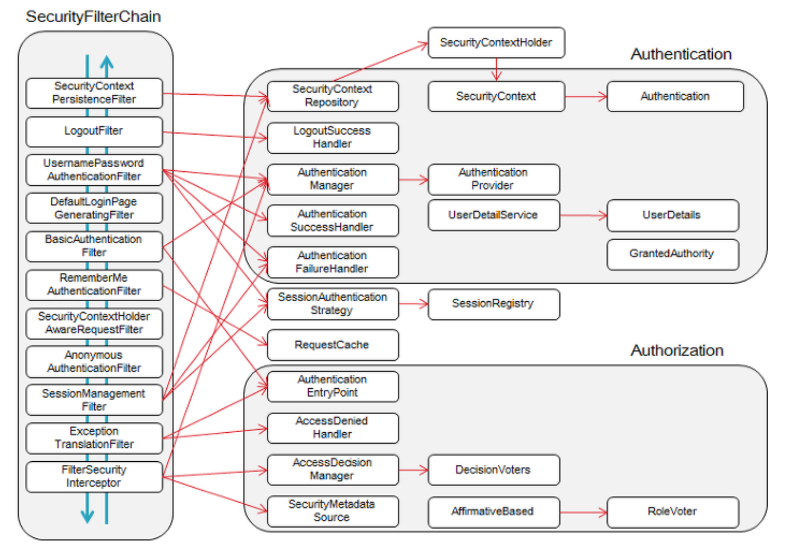

## 스프링 시큐리티의 구조

### 보안관련 3요소

- 접근 주체(Principal)
  - 보호된 대상에 접근하는 사용자
- 인증(Authenticate)
  - 현재 사용자가 누군지 확인하는 과정
  - 일반적으로 아이디/암호를 이용해서 인증을 처리
- 인가(Authorize)
  - 현재 사용자가 특정 대상을 사용할 권한이 있는지 검사

### 스프링 시큐리티와 보안 3요소의 매칭

- 접근 주체 -> `Authentication`
- 인증 -> `AuthenticationManager`
- 인가 -> `SecurityInterceptor`

### Authentication과 SecurityContext

- `Authentication`의 용도
  - 현재 접근 주체 정보를 담는 목적
  - 인증 요청할 때, 요청 정보를 담는 목적
- `SecurityContext`
  - `Authentication`을 보관
  - 스프링 시큐리티는 현재 사용자에 대한 `Authentication` 객체를 구할 때 `SecurityContext`로부터 구함

### SecurityContextHolder

- `SecurityContextHolder`에서 `SecurityContext`을 보관

  - 기본 : 쓰레드로컬에서 `SecurityContext`을 보관

- 전형적인 `SecurityContext` 설정 코드

  - ```java
    Authentication auth = someMethodForGettingAuth(req, res);
    try {
        SecurityContextHolder.getContext().setAuthentication(auth);
        chain.doFilter(req, res);//이후 코드에서 동일 SecurityContext 사용
    } finally {
        SecurityContextHolder.clearContext();
    }
    ```

  - 스프링 시큐리티가 유사한 필터를 이미 제공함

### Authentication의 주요 메서드

- `String getName()` : 사용자의 이름
- `Object getCredential()` : 증명 값 (비밀번호 등)
- `Object getPrincipal()` : 인증 주체 정보
- `boolean isAuthenticated()` : 인증되었는지 여부
- `Collection<GrantedAuthority> getAuthorities()` : 현재 사용자가 가진 권한(`GrantedAuthority`)

### AuthenticationManager : 인증을 처리함

```java
public interface AuthenticationManager {
    Authentication authenticate(Authentication auth) throws AuthenticationException;
}
```

- 오직 하나의 메서드(`authenticate()`)를 가지고 있다.
- 인증에 성공하면 인증 정보를 담고 있는 `Authentication`객체 리턴
  - 스프링 시큐리티는 리턴한 `Authentication`객체를 `SecurityContext`에 보관 및 인증 상태를 유지하기 위해 세션에 보관
  - 인증 실패시 `AuthenticationException`을 발생시킴
  - 결정할 수 없을 땐 null 반환

### ProviderManager

- `AuthenticationManager` 의 가장 일반적으로 사용되는 구현이다.
- 일련의 `AuthenticationProvider` 인스턴스들에 위임한다.
- `ProviderManager` 가 특정 `Authentication` 인스턴스 타입을 인식하지 못하면 `ProviderManager` 는 건너뛴다.

### AuthenticationProvider

```java
public interface AuthenticationProvider {
	Authentication authenticate(Authentication authentication)
			throws AuthenticationException;

	boolean supports(Class<?> authentication);
}
```

- `AuthenticationManager`과 비슷하다. 하지만
- 호출자가 주어진 `Authentication` 타입을 지원 하는지를 질의 할 수 있는 `supports()`가 있다


### ProviderManager를 사용하는 AuthenticationManager 계층구조


- ```java
  public class ProviderManager implements AuthenticationManager, MessageSourceAware, InitializingBean {
  	private List<AuthenticationProvider> providers = Collections.emptyList();
  	private AuthenticationManager parent;
  	
      // ... 다른 필드, 메서드들 생략
  
  }
  ```

  `AuthenticationProvider`를 리스트로 갖고 있고, 다른 `AuthenticationManager`를 부모로 갖고 있다.

- 때때로 애플리케이션이 보호된 리소스(예. `/api/**` 패턴과 일치하는 모든 웹 리소스)의 논리적인 그룹들이 있고, 각각의 그룹들은 고유한 `AuthenticationManager` 를 가지고 있을 수 있다. 각각의 그룹은 `ProviderManager` 이며, 부모와 공유한다. 그런 다음 부모는 일종의 "글로벌" 리소스로서, 모든 프로바이더에 대한 대체 역할을 한다.

### (Abstract)SecurityInterceptor : 인가를 처리함

- 웹의 경우 `FilterSecurityInterceptor` 구현 사용

- `AccessDecisionManager`에 권한 검사 위임

- ```java
  public class AccessDecisionManager {
      void decide(Authentication authentication,
                 Object object
                 Collection<ConfigAttribute> configAttributes) 
          throws AccessDeniedException, InsufficientAuthenticationException;
      boolean supports(ConfigAttribute attribute);
      boolean supports(Class<?> clazz);
  }
  ```

- 사용자가 자원의 보안 설정 기준으로, 접근 권한이 없을 경우 익셉션 발생


### SecurityFilterChain

- Security와 관련된 서블릿 필터는 연결된 여러 필터들로 구성돼 있음 -> 그래서 Chain이라는 표현을 씀
- 

이미지 출처 : https://atin.tistory.com/590

- `SecurityContextPersistenceFilter` - 요청(request)전에, `SecurityContextRepository`에서 받아온 정보를 `SecurityContextHolder`에 주입합니다.
- `LogoutFilter` - 주체(`Principal`)의 로그아웃을 진행합니다. 주체는 보통 유저를 말합니다.
- `UsernamePasswordAuthenticationFilter` - (로그인) 인증 과정을 진행합니다.
- `DefaultLoginPageGeneratingFilter` - 사용자가 별도의 로그인 페이지를 구현하지 않은 경우, 스프링에서 기본적으로 설정한 로그인 페이지를 처리합니다.
- `BasicAuthenticationFilter` - HTTP 요청의 (BASIC)인증 헤더를 처리하여 결과를 `SecurityContextHolder`에 저장합니다.
- `RememberMeAuthenticationFilter` - `SecurityContext`에 인증(`Authentication`) 객체가 있는지 확인하고 `RememberMeServices`를 구현한 객체의 요청이 있을 경우, Remember-Me(ex 사용자가 바로 로그인을 하기 위해서 저장 한 아이디와 패스워드)를 인증 토큰으로 컨텍스트에 주입합니다.
- `AnonymousAuthenticationFilter` - `SecurityContextHolder`에 인증(`Authentication`) 객체가 있는지 확인하고, 필요한 경우 `Authentication` 객체를 주입합니다.
- `SessionManagementFilter` - 요청이 시작된 이 후 인증된 사용자 인지 확인하고, 인증된 사용자일 경우`SessionAuthenticationStrategy`를 호출하여 세션 고정 보호 메커니즘을 활성화하거나 여러 동시 로그인을 확인하는 것과 같은 세션 관련 활동을 수행합니다.
- `ExceptionTranslationFilter` - 필터 체인 내에서 발생(Throw)되는 모든 예외(`AccessDeniedException`, `AuthenticationException`)를 처리합니다.
- `FilterSecurityInterceptor` - HTTP 리소스의 보안 처리를 수행합니다.


### Username and Password 인증 방식의 아키텍처


위 그림의 `AuthenticationFilter`의 역할은 `UsernamePasswordAuthenticationFilter`가 수행하고 **전체적인 프로세스**는 다음과 같다.

1. Client가 어플리케이션에 요청을 보내면, Servlet Filter에 의해서 Security Filter로 Security 작업이 위임되고 여러 Security Filter 중에서 `UsernamePasswordAuthenticationFilter`**(Username and Password Authentication 방식에서 사용하는 AuthenticationFilter)**에서 **인증**을 처리한다.
2. `AuthenticationFilter`**(UsernamePasswordAuthenticationFilter인데 지금부터 AuthenticationFilter라고 부름)**는 Servlet 요청 객체(HttpServletRequest)에서 username과 password를 추출해 `UsernameAuthenticationToken`**(이하 인증 객체)**을 생성한다.
   - `UsernameAuthenticationToken`는 `Authentication`을 상속받고 있다.
3. `AuthenticationFilter`는 `AuthenticationManager`에게 인증 객체를 전달한다.
   - `ProviderManager`가 `AuthenticationManager`인터페이스를 구현하고 있다. 즉, 실질적으론 `ProviderManager`가 인증 객체를 전달받는다.
4. `ProviderManager`는 인증을 위해 `AuthenticationProvider`에게 인증 객체를 전달한다.
   - 여러 Provider중에 적합한 Provider을 선정하여 그 Provider의 `authenticate()`메서드에 인증 객체를 전달한다.
5. `AuthenticationProvider`는 전달받은 인증 객체의 정보(일반적으로 사용자 아이디)를 `UserDetailsService`에 넘겨준다.
6. `UserDetailsService`는 전달 받은 사용자 정보를 통해 DB에서 알맞는 사용자를 찾고 이를 기반으로 `UserDetails`객체를 만든다.
7. 사용자 정보와 일치하는 `UserDetails`객체를 `AuthenticationProvider`에 전달한다.
8. `AuthenticationProvider`은 전달받은 `UserDetails`를 인증해 성공하면 `ProviderManager`에게 권한(Authorities)을 담은 검증된 인증 객체를 전달한다.
9. `ProviderManager`는 검증된 인증 객체를 `AuthenticationFilter`에게 전달한다. **(event 기반 으로 전달)**
10. `AuthenticationFilter`는 검증된 인증 객체를 `SecurityContextHolder`의 `SecurityContext`에 저장한다.


## Spring Security - Auth0 JWT Library


- request가 들어오면 필터를 거친다
  - 필터는 여러개다. 가장 앞에 있는건 UsernamePasswordAuthenticationFilter
  - 입맛에 맞는 필터들을 적용한다. 커스텀 필터를 만들수도 있다
- 필터를 거친 객체는 인증요청 객체로 변환된다.(리퀘스트의 body부분에 인증객체들이 JSON형태로 묻어있다.)
- 묻어 있는 인증 객체들을 DTO클래스로 빼고 DTO클래스를 객체(Authentication을 상속받음)로 만들어서 ProviderManager의 authenticate()로 전달한다.
  - ProviderManager는 여러개의 AuthenticationProvider를 제공할 수 있다
  - 이터레이션을 돌면서 이 Authentication 클래스에 맞는 Provider를 자동으로 검색해서 인증처리를 한다. 그 후 인증된 객체를 돌려준다
- 인증된 객체도 Authentication를 상속받는다.
  - 인증됐으니까 isAuthenticated()를 호출하면 true다. (인증요청 객체의 isAuthenticated()는 false)
- 인증 콘텍스트? 인증 콘텍스트 관리자?
  - 인증 콘텍스트를 만들면 그 인증 콘텍스트를 만든 것을 인증 콘텍스트 관리자에게 부여하는 것.
  - 인증 콘텍스트 관리자가 인증 콘텍스트 객체를 들고 있다가 필요한 순간에 그 객체를 뿌려준다.
- 모든 절차가 끝나고 나면 인증이 어떻게 이루어졌는지를 response를 통해서 user에게 프론트단으로 돌려준다

### AuthenticationManager: AuthenticationProvider 주머니

- Builder 패턴으로 구현
- 등록된 Authentication Provider들에 접근하는 유일한 객체
- 단순 인터페이스에 불과하다. 내장 구현체: ProviderManager
- AuthenticationManager를 구현해서 쓰지 말자. Pivotal 기술자보다 더 잘 만들 자신 없으면.
- 구현해서 쓰라고 넣어준 인터페이스가 아니다.

### WebSecurityConfigurerAdapter를 상속해서 설정해준다.

### AuthenticationProvider: 진짜 인증이 일어나는 곳

- 스프링 시큐리티의 알파와 오메가
- 인증 "전" 객체를 받아 인증 가능 여부를 체크한 후, 예외를 던지던지 인증 "후" 객체를 만들어 돌려준다.
- 구현하라고 넣어준 인터페이스다.
- 필요에 맞게 정교하게 구현하고 인증 관리자에 등록시키자.

### AuthenticationProvider를 상속해서 구현해준다.

- authenticate(), supports() 등을 오버라이드
  - authenticate() : 인증을 진행하고 인증 객체를 만들어줌
  - supports() : 이 클래스가 어떤 인증 객체를 지원할지 명시해줌. 여기서 등록된 인증 객체로 들어오는 요청은 다 이 필터에 걸림

### 인증 객체는 뭔가? Authentication 클래스의 모든 서브클래스.

- Authentication은 인터페이스.
  - **getAuthorities()**, getCredentials(), getDetails(), getPrincipal(), **isAuthenticated()**, setAuthenticated() 등이 있다.

### UsernamePasswordAuthenticationToken

- 가장 간단한 형태
- 두개의 생성자를 갖고 있음
  - `UsernamePasswordAuthenticationToken(java.lang.Object principal, java.lang.Object credentials)`
    - 이 생성자를 통해 만든 `UsernamePasswordAuthenticationToken`은 인증 전 객체임. Provider의 손을 타지 않은 객체. 
    - 그래서 `AbstractAuthenticationToken.isAuthenticated()`는 항상 `false`
  - `UsernamePasswordAuthenticationToken(java.lang.Object principal, java.lang.Object credentials, java.util.Collections<? extends GrantedAuthority> authorities)`
    -  manager나 provider의 인증 과정을 거쳐서 인증이 끝난 객체만 담아야 한다.
    - 권한정보(authorities)가 들어있으면 "이 사용자는 인증을 받았구나" 하고 간주하는 것.
  - principal은? 인증의 주체가 되는 오브젝트.
  - 이땐 principal이 username, credential이 password 


### 결국 우리가 구현해야 할 것

- 요청을 받아낼 (AbstractAuthenticationFilter을 상속하는)필터
  - 인증의 의미단위별로 구현해야 함.
  - ex) form로그인, 소셜로그인 두개를 만든다면 필터를 2개 만들어야한다 
  - attemptAuthentication(), successfulAuthentication(), unsuccessfulAuthentication() 오버라이드
    - attemptAuthentication() : Provider의 authenticate()메서드로 인증을 시도함.
    - successfulAuthentication() : 성공했다면 jwt토큰을 HttpResponse로 내려줘야함
    - unsuccessfulAuthentication() : 실패했다면 후속조치
- Manager에 등록시킬 Auth Provider
  - 인증로직 구현
- AJAX 방식이라면, 인증 정보를 담을 DTO
- 각 인증에 따른 추가 구현체. 기본적으로 성공/실패 핸들러
- 소셜 인증의 경우 각 소셜 공급자의 규격에 맞는 DTO와 HTTP req객체.(RestTemplate?)
- (선택사항) 인증 시도 / 인증 성공시에 각각 사용할 Authentication객체


### Implicit Grant Flow


### 유저 객체 설계

- 유저 인증을 위해 필요한 정보, 서비스 제공을 위한 정보를 필요한 만큼 저장한다.
- 비밀번호를 비롯한 민감 정보는 암호화하는 것이 원칙이다.(BCryptPasswordEncoder)
- 소셜 회원도 담을 수 있게 확장성있게 구현한다.
- @ElementCollection, Enum 등을 활용하자.


## FormLoginFilter + JWT Factory + JWT Authentication Provider / Filter로 AJAX로그인 구현하기!

- FormLoginFilter : 최초 로그인을 시도할때 로그인 요청을 걸러내는 필터
- JWT Factory : JWT를 만듦 + 검증
- JWT Authentication Provider : API에 접근하는 요청에 묻어있는 HTTP Authorization헤더의 값을 가져와서 권한을 갖고 있는지 확인
- JWT Authentication Filter : 한번 인증이 발생한 후에 HTTP헤더에 인증값이 묻어있는 경우에 인증값을 이용해 인증을 진행하는 필터. 해당 요청에 대한 필터링, Provider연결하여 사용자가 인증된 사용자인지 확인
- JWT에 대한 [좋은 글](https://blog.outsider.ne.kr/1160) (댓글을 꼭 읽어보자)


- FormLoginAuthenticationSuccessHandler
  - PostAuthorizationToken이 Provider에서 넘어오면 (Provider의 authenticate()의 리턴값이 PostAuthorizationToken임.) 넘어온 토큰을 가지고 successfulAuthentication()을 호출한다.

 (..작성중..)


## 참고

- https://www.slideshare.net/madvirus/ss-36809454 (최범균님의 스프링 시큐리티 구조 이해 슬라이드)
- https://atin.tistory.com/590
- https://siyoon210.tistory.com/32
- https://www.youtube.com/channel/UCQqSNFQ3TI7x0l06UUGldxQ/videos (유튜브 봄이네집 채널)
- https://github.com/heowc/top-spring-security-architecture-translation-kr (스프링 시큐리티 아키텍쳐 공식문서 번역)
- https://imbf.github.io/spring/2020/06/29/Spring-Security-with-JWT.html